# reStructuredText Syntax

This guide provides basic information about text formatting using the reStructuredText (reST) markup language.

It contains the syntax required to create and update documentation files in the Oro documentation. This is not an exhaustive description of reST, but it covers the constructs used throughout the Oro documentation. All examples are taken from existing Oro documentation.

For more information, refer to the Sphinx [reStructuredText Primer](https://www.sphinx-doc.org/en/master/usage/restructuredtext/basics.html) and the [Quick reStructuredText](https://docutils.sourceforge.io/docs/user/rst/quickref.html) guide by [docutils](https://docutils.sourceforge.io/).

The most complete information is available in the [reStructuredText specifications](https://docutils.sourceforge.io/docs/ref/rst/restructuredtext.html).

For documentation structure, topic organization, file naming conventions, and the contribution workflow, see [CONTRIBUTING.md](CONTRIBUTING.md).

For writing and formatting conventions, see [STYLE-GUIDE.md](STYLE-GUIDE.md).

For building the documentation and verifying your changes, see [BUILD.md](BUILD.md).


## File Structure

| File Type | Definition |
|---|---|
| **`index.rst`** | A mandatory file in each folder that serves as the documentation master file. It usually represents a welcome page and includes a table of contents (`toctree`). |
| **`topic-1.rst`** | Another RST file whose content must be included in the `toctree` of the `index.rst` file. Separate multiple words in the file name with a dash. |
| **`img_1.png`** | An image file that is named with underscores and located in the `img` folder of the relevant directory. |

Source files and image files use different word separators: `.rst` file names use dashes so that they form correct HTML links on the website, while image file names use underscores. See [File Naming Conventions](CONTRIBUTING.md#file-naming-conventions).

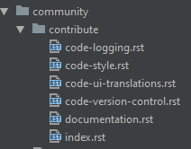


## Text Formatting

| Usage | RST syntax | Renders as |
|---|---|---|
| **Italic** | `*italic*` | *italic* |
| **Bold** | `**bold**` | **bold** |
| **Preformatted text for code** | <code>``preformatted text``</code> | `preformatted text` |
| **Preformatted text to display underscores** | <code>``some_text``</code> | `some_text` |
| **Escaped underscore** | `some\_text` | some_text |
| **Escaped backslash** | `documentation\\crm\\admin` | documentation\crm\admin |

To use formatting symbols in text without applying the formatting, escape them with a backslash (`\`).

```rst
\*not italic\*
```


## Headings

Break the text into sections by underlining each heading with a punctuation character. Be consistent with heading levels: do not use level 2 after level 4, or the reverse.

The underline must be at least as long as the heading text.

```rst
Title
=====

Header Level 1
--------------

Header Level 2
^^^^^^^^^^^^^^

Header Level 3
~~~~~~~~~~~~~~

Header Level 4
""""""""""""""
```

Preserve the same level of indentation for all lines of a paragraph.

Capitalize headings and start them consistently with the same part of speech. For the full rules, see [Capitalization](STYLE-GUIDE.md#capitalization) and [Page Organization](STYLE-GUIDE.md#page-organization).

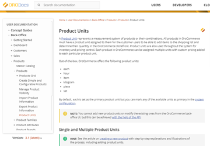


## Lists and Bullets

| Usage | RST syntax | Comments |
|---|---|---|
| **Bulleted lists** | `*  item 1`<br>`*  item 2` | Bullets can be `*`, `+`, or `-`. |
| **Enumerated lists** | `1. Item 1`<br>`2. Item 2`<br>`#. Item 3`<br>`#. Item 4` | Lists can be numbered automatically with `#`. |
| **Nested list structure** | See the example below. | Mind the structure — a nested list must align with the text it refers to. |

Start a bulleted list with `*`, `+`, or `-` followed by whitespace:

```rst
* Item A
* Item B

    - Item C
    - Item D

        + Item E
        + Item F
```

Numbered lists accept Arabic numerals (`1`, `2`, `3`), letters (`A`, `B`, `C`), Roman numerals (`I`, `II`, `III`), or `#` for automatic enumeration:

```rst
#. Item A
#. Item B

    #. Item C
    #. Item D
```

Mixed and nested structures:

```rst
#. Colors

   * Red
   * Green
   * Yellow

#. Fonts

   - *Italic*
   - **Bold**
```

Use a double dash (`--`) to render a single dash in text.


## Table of Contents (toctree)

Each index file must have a `toctree` directive that lists every RST file in its folder. If the folder has subfolders, the `toctree` refers to the `index.rst` file of each subfolder. Files that are not listed in a `toctree` are not generated when the documentation is built.

For the following folder structure:

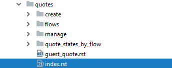

Use this `toctree`:

```rst
.. toctree::
   :maxdepth: 3
   :titlesonly:

   create/index
   guest_quote
   manage/index
   quote_states_by_flow/index
   flows/index
```

Renders as:

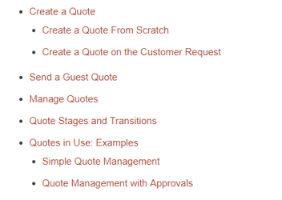

| Option or entry | Meaning |
|---|---|
| **`:maxdepth:`** | Indicates the depth of children headings. |
| **`:titlesonly:`** | Adds only the main title of each document. |
| **`:hidden:`** | Hides the `toctree`. It still parses the document hierarchy but does not insert links into your document. Use it to include files that do not need to be shown, such as references. |
| **`guest_quote`** | Refers to the document `guest_quote.rst` in the same folder. |
| **`create/index`** | Refers to `index.rst` in the `create` subfolder. Referring only to the index file of each folder is enough, because as master files they have their own `toctree`. |


## Local Table of Contents

A local table of contents is displayed automatically on the documentation website for all pages.

| RST syntax | Renders as |
|---|---|
| **`:oro_show_local_toc: false`** | No local table of contents. |
| **No attribute** | The local table of contents is displayed. |

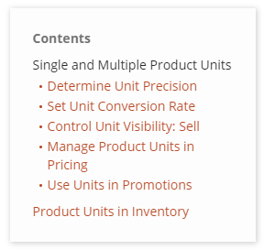

To hide it, add the attribute at the top of the `.rst` file. For guidance on when to hide it, see [Page Organization](STYLE-GUIDE.md#page-organization).


## Internal Links

RST supports references across documentation pages. To refer to any section, create an anchor (label) at the top of that section and refer to it explicitly.

Name the anchor after the section title, preceded by its file location, with a double dash between path levels:

```rst
.. _user-guide--sales--quotes:

Quotes
======

See the :ref:`Quotes <user-guide--sales--quotes>` section for more details.
```

If the section title is lengthy, shorten the path and the name. The anchor for "Configure Global Related Items Settings" would be:

```rst
.. _sys--commerce--catalog--related-items:
```

Anchors allow references to continue working if files are renamed.

To link to another section in the same file:

```rst
See `Section About the Elephants`_.
```

| Usage | RST syntax | Comments |
|---|---|---|
| **Link to a section in the same file** | <code>`Quotes`_</code> | Refers to a title within the same RST document. |
| **Link to any file with a label** | <code>See the :ref:`Quotes <user-guide--sales--quotes>` section for more details.</code> | Works even if files are renamed. |

Mind the punctuation characters when linking to a file, section, or website. Otherwise the documentation will not build.


## External Links

Oro documentation avoids the standard RST external link format (for example, ``` `GitHub <https://github.com/>`_ ```) because it does not allow links to open in a new tab.

Add external links as follows:

1. Put the word or phrase that serves as the link in vertical bars:

   ```rst
   |GDPR portal|
   ```

2. Define the link in the appropriate include file, depending on whether you are contributing to the user, developer, or cloud guides. Include files are located in the `include` folder at the documentation root.

   ```rst
   .. |GDPR portal| raw:: html

      <a href="https://www.eugdpr.org/" target="_blank">GDPR portal</a>
   ```

3. Add the required links file at the bottom of the file you are contributing to:

   ```rst
   .. include:: /include/include-links-cloud.rst
      :start-after: begin
   ```

   or:

   ```rst
   .. include:: /include/include-links-dev.rst
      :start-after: begin
   ```

   or:

   ```rst
   .. include:: /include/include-links-user.rst
      :start-after: begin
   ```

Use Ctrl+F to find the required documentation section in the include file.


## Code Blocks

Sphinx provides directives for including formatted code. `code-block` is the directive name, followed by the format of the inserted code (`html`, `php`, `yaml`, `bash`, `sql`, `xml`, `text`, and others).

| Option | Meaning |
|---|---|
| **`:linenos:`** | Inserts line numbers. |
| **`:caption:`** | Adds a caption above the block. |

Include the code itself after a blank line.

### PHP

```rst
.. code-block:: php
   :linenos:

    #MyBundle/Resources/views/layouts/first_theme/php/_content_widget.html.php
    <div <?php echo $view['layout']->block($block, 'block_attributes') ?>>
        <h1>Welcome back</h1>
        <?php echo $view['layout']->widget($block); ?>
    </div>
```

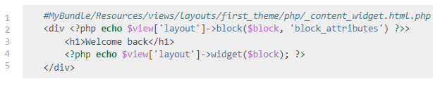

### Bash

```rst
.. code-block:: bash
   :linenos:

    cd /path/to/application
    sudo -u www-data bin/console lexik:maintenance:lock --env=prod
```

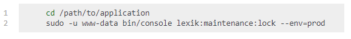

### HTML

```rst
.. code-block:: html
   :linenos:

    <select id="my-select">
        <option value="foo">Foo</option>
        <option value="bar">Bar</option>
    </select>
    <script type="text/javascript">
        require(['jquery', 'jquery.select2'], function ($) {
            $('#my-select').select2({
                placeholder: 'Select one ...',
                allowClear: true
            });
        });
    </script>
```

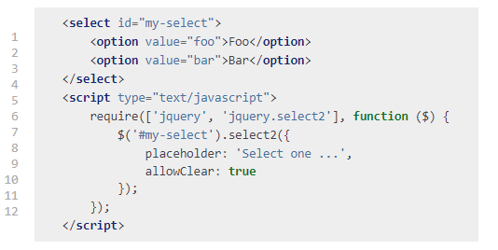

### YAML with a Caption

```rst
.. code-block:: yaml
   :caption: #MyBundle/Resources/views/layouts/first_theme/default.yml
   :linenos:

    layout:
        actions:
            - '@setBlockTheme':
                themes: 'MyBundle:layouts/first_theme/php'
            - '@addTree':
                items:
                    head:
                        blockType: head
```

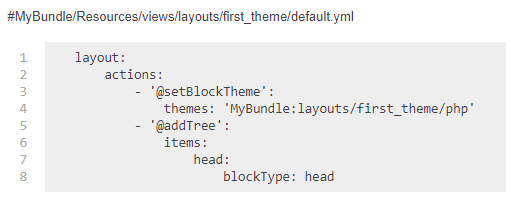


## Tables

### Simple Tables

```rst
+---------+---------+-----------+
| 1       | 2       | 3         |
+---------+---------+-----------+
```

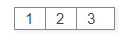

### Grid Tables with a Header

```rst
+------------+-----------+---------+
| Product    | Quantity  | Price   |
+============+===========+=========+
| Product A  | 1 piece   | $100.00 |
+------------+-----------+---------+
| Product A  | 10 pieces | $90.00  |
+------------+-----------+---------+
```

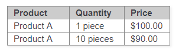

### CSV Tables

```rst
.. csv-table::
   :header: "**OroCRM Field**","**Outlook Field**"
   :widths: 20, 20

   "Subject","Subject"
   "Priority","Priority"
   "Due Date","Due Date"
```

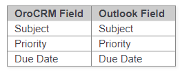


## Images

To include an image, use the `image` directive with the path to the image and the file name. Store all images in the designated `img` folder so that they reside in one place.

```rst
Select the website from which the order will be created.

.. image:: /user/img/sales/orders/orders_create_general.png
   :alt: The general section of the order details page
```

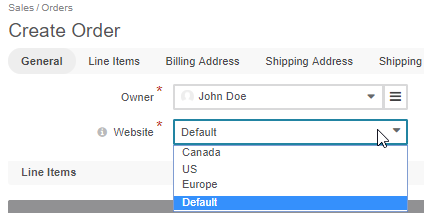

Always use `:alt:` to add a human-readable description to images.

To resize and align an image:

```rst
.. image:: /cloud/img/cloud/orocloud_environments.png
   :scale: 70
   :align: center
   :alt: OroCloud environments
```

| Option | Meaning |
|---|---|
| **`:alt:`** | A human-readable description of the image. Always required. |
| **`:scale:`** | Scales the original image by the given percentage. |
| **`:align:`** | Aligns the image, for example, `center`. |
| **`:width:`** | Sets the image width, for example, `:width: 50%`. |

For screenshot composition, annotation colors, and handling of sensitive data, see [Images and Screenshots](STYLE-GUIDE.md#images-and-screenshots).


## Include an External Document Fragment

To include a text fragment from another RST file, use the `include` directive.

First, create a label before and after the required section, such as `.. begin_section_1` and `.. finish_section_1`, to point the directive at the fragment. Only the content after the first occurrence of the specified text is included. The labels must be hidden, so comment them out with two dots (`..`).

If an included fragment contains a section structure, its titles must be coherent with and match those of the master document.

```rst
.. include:: /user/back-office/necessary_fragment.rst
   :start-after: begin_section_1
   :end-before: finish_section_1
```

| Option | Meaning |
|---|---|
| **`:start-after:`** | Finds the required text in the external file and includes the fragment after it. |
| **`:end-before:`** | Finds the required text in the external file and includes the fragment before it. |

Do not overuse includes. They can break links on the website and trigger 404 errors. Many documents already contain layers of includes, so local builds are likely to produce errors as well.


## Substitution References and Definitions

Use substitutions to replace repeated words, phrases, graphics, or buttons within the text.

```rst
To export the |exported_information| in a .csv format:

1. In the main menu, navigate to |menu_export|.

   The following screen opens.

   |image_export|

.. |exported_information| replace:: customer information
.. |menu_export| replace:: **Customers > Customers**
.. |image_export| image:: /user_guide/img/getting_started/export_import/export_1.png
```

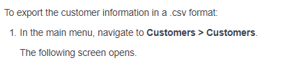

### Substitute an Icon

A separate RST file holds all the icons (buttons) used throughout the documentation. To reference a button, insert its substitution and add an include directive pointing at that file at the bottom of your page.

```rst
Choose the order that you need to delete, click the |IcMore| **More Options** menu
at the end of the row, and then click |IcDelete|.

.. include:: /include/include-images.rst
   :start-after: begin
```

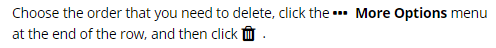


## Notices

To notify, warn, draw attention, or point out an error, use the related directive. RST supports `attention`, `caution`, `danger`, `error`, `hint`, `important`, `note`, `tip`, and `warning`.

```rst
.. note:: Keep in mind that to be able to add multiple product units to products,
   the Single Product Unit Mode must be disabled in the system configuration.
```

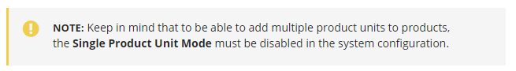

The same markup applies to every notice type:

| Directive | Syntax |
|---|---|
| **Attention** | `.. attention:: The attention message.` |
| **Caution** | `.. caution:: The caution message.` |
| **Danger** | `.. danger:: The danger message.` |
| **Error** | `.. error:: The error message.` |
| **Hint** | `.. hint:: The hint message.` |
| **Important** | `.. important:: The important message.` |
| **Note** | `.. note:: The note message.` |
| **Tip** | `.. tip:: The tip message.` |
| **Warning** | `.. warning:: The warning message.` |

For guidance on which notice type to use, see [Notices and Supporting Content](STYLE-GUIDE.md#notices-and-supporting-content).


## Troubleshooting Build Errors

This section covers the major warnings and errors that may prevent a build from running successfully. Most errors occur because of missing punctuation marks (`*`, `/`, `_`, `:`), indentation, or margins, so be precise when formatting text and inserting content, code blocks, images, and paths to related files.

When a warning appears, it specifies the file name and the line number. If you do not find the error on that line, check the rows nearby — the problem may be there.

| Error | Meaning | Solution |
|---|---|---|
| **`Command not found.`** | There is no such command. | You may have skipped a letter, indent, or punctuation mark. Check the command again or try running another one. |
| **`make.bat: command not found`** | There is no such command. | Make sure you are running the command from the `documentation` directory. Navigate to it with `cd documentation`. To go up one level, use `cd ../`. |
| **`Document isn't included in any toctree.`** | The document is not listed in the `toctree` of the `index.rst` file. | Add the file name to the `toctree` of the related `index.rst` file. Check that the file name is valid. Follow the spacing after the `.. toctree::` directive and before the file name. Do not include the `.rst` extension. |
| **`Error in "toctree" directive.`** | The `toctree` directive has a syntax error. | Check that the file name is valid. Three blank spaces should separate the file name from the left margin, with one blank line after the `.. toctree::` options. Do not include the `.rst` extension. |
| **`Title level inconsistent.`** | The error is in the title level. | Title levels must be consistent — level 2 follows level 1, level 5 follows level 4. If you use include directives, check that the titles of the included fragment are consistent with those of the master document. |
| **`Undefined label: X-X-X`** | The error is in the reference link. | Check that the label you refer to is valid and has not been deleted. Specify the link correctly, as in ``:ref:`<reference-link>` ``, taking all punctuation marks into account. See [Internal Links](#internal-links). |
| **`Explicit markup ends without a blank line; unexpected unindent.`** | There is no whitespace in an explicit markup block (includes, tables, comments, or other directives). | Check the punctuation and indentation of the markup block. Align the options (`:alt:`) with the `image` directive. |
| **`Inline emphasis start-string without end-string.`** | The text formatting is specified incorrectly. | You may have skipped an asterisk (`*`), a backquote, or another punctuation mark at the end of the formatted word. |
| **`Inline interpreted text or phrase reference start-string without end-string.`** | The formatted word or reference link is specified incorrectly. | You may have skipped a backquote, an underscore (`_`), a slash (`/`), or another punctuation mark at the end of the formatted word or reference link. |
| **`Error in "code-block" directive: invalid option block.`** | The option block has a syntax error. | Check that all `code-block` options are valid. Three blank spaces should separate the option from the left margin, with one blank line after the last option. |
| **`Malformed table.`** | The table structure is broken. | Check the table proportions. Ensure that the margins and line breaks match the parameters of the other rows in the table. |
| **`Error with CSV data in "csv-table" directive.`** | The `csv-table` has a syntax error. | Check all punctuation marks, margins, and indentation. See [CSV Tables](#csv-tables). |
| **`Image file not readable.`** | The error is in the image file path. | Check that you have uploaded the image file to your local directory, and that the path to the image folder and the image name are valid. |
| **`Problem with "start-after" option of "include" directive.`** | The reference label (anchor) specified in the `start-after` option has an error. | The `start-after` option must refer to an existing anchor. Check that the anchor is valid. |
| **`Substitution definition "x" empty or invalid.`** | There is no definition to replace the substitution directive. | Check that you have specified the content that replaces the substitution directive, and check the punctuation, as in `Navigate to \|menu\|.` and `.. \|menu\| replace:: **Sales > Leads**`. |
| **`Undefined substitution referenced: "IcX"`** | The error is in the icon, for example, `IcDelete`, `IcMore`, or `IcEdit`. | Check that you have included the path to the folder holding the list of all icons, as in `.. include:: /img/buttons/include_images.rst` with `:start-after: begin`. |
| **Unrelated errors on build** | The errors occur when building documentation locally. | If you have not modified any of the files reported as errors, clean the build records and rebuild the documentation. See [BUILD.md](BUILD.md). |
