# Oro Documentation Style Guide

This guide defines the writing and formatting conventions for Oro documentation published on the [Oro documentation portal](https://doc.oroinc.com/).

Use this guide when creating, updating, or reviewing documentation.

For repository structure, file naming conventions, and contribution workflow, see [CONTRIBUTING.md](CONTRIBUTING.md).

For reStructuredText syntax and markup examples, see [RST-SYNTAX.md](RST-SYNTAX.md).

For building the documentation and verifying your changes, see [BUILD.md](BUILD.md).

## About This Guide

Use this guide to create clear and consistent Oro documentation.

The guide applies to technical writers, developers, and other contributors who create or update documentation on the documentation portal.

Following the same grammar, terminology, structure, and formatting conventions helps ensure that:

- Contributors use consistent writing standards.
- Technical and non-technical readers can understand the documentation.
- Readers can quickly find and scan information.
- Search systems and large language models can correctly identify and interpret content.
- New content remains consistent with the rest of the documentation portal.

Follow this guide first. When it does not address a particular question, refer to the [Google Developer Documentation Style Guide](https://developers.google.com/style). For additional guidance on technical terminology, use the [Microsoft Writing Style Guide](https://learn.microsoft.com/en-us/style-guide/welcome/).

## Core Writing Principles

Use the following principles to create clear, consistent, and accessible Oro documentation.

| Principle | Description | Recommended | Not recommended |
|---|---|---|---|
| **Voice and Tone** | Use a clear, direct, and professional tone. Use promotional language only in [concept guides](https://doc.oroinc.com/user/concept-guides/) or SEO content. | This setting controls which payment methods are available at checkout. | This setting influences the payment options you can offer during checkout. |
| **Direct Statements** | State the main point immediately. Avoid vague introductions and unnecessary lead-in phrases. | This setting applies to all customers in the group. | It is important to note that this setting applies to all customers in the group. |
| **Plain Language** | Use short, familiar words. Avoid unnecessarily formal or complex expressions. | Use the filter to find the order. | Utilize the filtering functionality to locate the order. |
| **Active and Passive Voice** | Prefer the active voice when the actor (person or system) is important.  Use the passive voice when the actor is unknown, obvious, or less important than the action or result.  Do not use the passive voice to hide responsibility or make instructions unclear. | **Active:** OroCommerce validates the configuration before saving it.  **Passive** — the result is more important than the actor: The configuration is saved at the website level.  **Passive** — the actor is unknown: The customer record was updated on July 15, 2026.  **Passive** — permissions or restrictions: Access is denied when the user does not have the required permission. | Wordy passive: The validation of the configuration is performed by OroCommerce before the configuration is saved.  Hidden responsibility: The incorrect value was entered.  Passive instruction: The **Save** button should be clicked. |
| **Present and Future Tense** | Use the present tense for current product behavior, instructions, and immediate results.  Use the future tense when describing an event that occurs later, such as a scheduled process, an upcoming expiration, or the result of a future condition.  Do not switch between the present and future tense when the timing is the same. | Current behavior: OroCommerce validates the file before the import starts.  Immediate result: Click **Save**. The application updates the configuration.  Future condition: The token will expire 24 hours after it is generated.  Mixed timing: When the administrator approves the product, OroCommerce publishes it immediately. The product will appear in the storefront after the next search index update. | Unnecessary future tense: OroCommerce will validate the file before the import starts.  Unnecessary future result: Click **Save**. The application will update the configuration.  Incorrect present tense for a scheduled event: The scheduled job runs at midnight tomorrow. |
| **Imperative Mood** | Start each procedural step with a direct action verb. The implied subject is *you*. | Update the configuration and click **Save**.  Navigate to **System > Configuration > General Setup > Localization**. | You should now update the configuration and click the **Save** button. |
| **Second-Person Address** | Use *you* when the intended reader performs an action in the application. | You can configure the payment method for each website. | We can configure the payment method for each website. |
| **Role- and Permission-Specific Language** | Use a specific role when access, permissions, or responsibilities differ. Use singular *they* in subsequent sentences. | An administrator can create and manage a user role. They can also assign permissions to it. | |
| **References to Other Platform Users** | Use specific role names such as customer, customer user, vendor, or seller when describing another person's actions. Use singular *they* in subsequent sentences. | If a customer user forgets their password, they can request a reset link. | If a user forgets his password, he can request a reset link. |
| **Gender-Neutral Language** | Use gender-neutral role names and singular *they*.  Use singular *they* to refer to one person when their gender is unknown, irrelevant, or not specified. It replaces wordy constructions such as *he or she*, *his or her*, and *him or her*. | Each user must verify their email address. | Each user must verify his email address.  Each user must verify his or her email address.  Each user must verify his/her email address. |
| **Objective and Accurate Claims** | Avoid subjective words that may blame or discourage readers, such as *easy*, *simple*, *obvious*, and *just*. | The DELETE method removes the specified resource.  The approach provides the expected result but has several limitations. | DELETE is quite easy to understand. It is used to delete the specified resource.  The approach is simple and works perfectly well, although it has a few flaws. |
| **Verifiable Product Details** | Do not invent product behavior, UI labels, navigation paths, or configuration options. Follow existing documentation patterns when introducing new content. | | |
| **Acronyms** | Spell out an acronym at first use unless it is universally recognized by the intended audience. Use the acronym consistently afterward. | Configure single sign-on (SSO). The SSO configuration applies to all users. | Configure SSO. The single sign-on authentication mechanism applies to all users. |
| **Contractions** | Use complete forms instead of contractions. Preserve contractions only in quotations, code, product names, or interface text. | do not does not it is have not cannot | don't doesn't it's haven't can't |
| **Disability-Inclusive Language** | Use respectful, accurate language that focuses on the person or the required accessibility support. | person with a disability users without disabilities screen reader user; person who uses a screen reader | special-needs person normal users visually challenged user, blind user |
| **Inclusive Technical Terminology** | Avoid violent, oppressive, or exclusionary metaphors unless they are literal commands or third-party terms. | allowlist, blocklist unexpected, unusual, invalid, inconsistent gap, omission | whitelist, blacklist crazy, insane, dumb blind spot |
| **Success and Failure** | Describe the actual status instead of relying only on color. | successful, failed, permitted, blocked, active, inactive  Successful requests and failed requests. | green, red, good, bad  Green requests and red requests. |
| **Example and Placeholder Content** | Use neutral terms for non-production content. | sample data, test data, placeholder data | dummy data, dummy object |
| **Literal Non-Inclusive Terms** | Preserve a non-inclusive term when it is part of code, an API, a command, or a third-party interface. Format it as literal content and explain it neutrally where necessary. | Run the `kill` command to stop the process. | Kill the process. |

## Page Organization

Use meaningful titles, focused paragraphs, structured lists, and simple tables.

| Principle | Description | Recommended | Not recommended |
|---|---|---|---|
| **Titles and Headings** | Use meaningful headings and follow the established heading conventions. Do not number headings. Begin headings consistently with verbs or nouns.  Capitalize major words in descriptive titles and headings. Do not capitalize articles, short conjunctions, or prepositions of four letters or fewer unless they are the first or last word (*a*, *an*, *the*, *in*, *on*, *at*, *for*).  For heading markup, see [Headings](RST-SYNTAX.md#headings). | Create a Simple Product  Manage Sales in the Back-Office  Tax Rules Creation Prerequisites | 1.2.4 Product Configuration |
| **Paragraphs** | Use short paragraphs that focus on one main idea. Put the most important information first. | | |
| **Meta Titles and Meta Descriptions** | Add a meta title and meta description to major documentation articles to improve their visibility in search results. Place both attributes at the top of the `.rst` file. Write a unique, descriptive title and summarize the article's purpose in the description. | `:title: Activities Management in the OroCommerce Back-Office`  `.. meta::` `   :description: Learn how OroCommerce back-office users can manage tasks, calls, cases, calendar events, and contact requests.` | |
| **Documentation Menus** | Oro documentation has two navigation menus: the full documentation menu on the left and the page contents menu on the right.  You cannot hide the full documentation menu. Its depth is configured globally and applies throughout the documentation.  You can hide the page contents menu if it does not help readers navigate the content, for example, on short pages or pages without a meaningful heading structure. | To hide the page contents menu, add the following attribute at the top of the `.rst` file:  `:oro_show_local_toc: false` | |
| **Procedures** | Use numbered steps for actions completed in sequence. Begin each step with an imperative verb and keep one primary action per step. | 1. Navigate to **Products > Products**. 2. Click **Create Product**. 3. Select **Simple**. 4. Click **Continue**. | On the product page, click **Create Product**, select **Simple**, choose a product family, select a category, and click **Continue**. |
| **Lists** | Use bullets when the order of items does not matter. Use parallel grammatical structures and consistent punctuation. | **Example 1:** The following product types are available: • Simple • Configurable • Product kit  **Example 2:** Follow these steps: 1. Open the fridge. 2. Take out the milk. 3. Close the fridge. | The following product types are available (inconsistent list): • Simple. • Creating configurable products • You can also create a product kit. |

## Notices and Supporting Content

Use notices only when information must be separated visually from the main text. Choose the notice type according to the importance and risk.

For the markup of each block, see [Notices](RST-SYNTAX.md#notices).

| Type | Description | Recommended |
|---|---|---|
| **Note / Hint / Tip** | Use any of these blocks for important contextual or supplementary guidance that does not prevent task completion.  Use `note`, `hint`, and `tip` when several equally important blocks appear together and require visual separation. | `.. note:: You can configure user settings globally or per website.`  `.. hint:: Check out the Commerce Storefront guide for more details.`  `.. tip:: It is also possible to amend the order content until the order is submitted.` |
| **Important** | Use for information required for successful completion, feature availability, edition limitations, or patch-release requirements. | `.. important:: This feature is only available in the Enterprise edition.`  `.. important:: This feature is only available as of OroCommerce version 6.0.3.`  `.. important:: Schema changes are permanent and cannot be easily rolled back.` |
| **Caution / Warning** | Use either block to identify a risk, undesirable outcome, data loss, financial impact, security exposure, or another consequence. In Oro documentation, these blocks may be used interchangeably. | `.. caution:: Changing the website fallback may replace website-level values with organization-level settings.`  `.. warning:: Do not use test payment credentials in production. Test credentials may expose payment data or prevent payment processing.` |
| **Admonition** | Use when the block requires a custom title. Admonitions are commonly used for marketing, business guidance, or SEO content. | `.. admonition:: Business Tip`  `   Explore OroCommerce product management capabilities for complex B2B catalogs.` |
| **Patch Release Version and Enterprise Edition Availability** | Always indicate whether a feature is available starting from a specific patch release or only in the Enterprise edition. This information helps readers determine whether the feature is available in their installed version.  Place the availability information before the feature description when it applies to an entire feature or section. For a minor option, action, or setting, add the information in parentheses immediately after its name. | `.. note:: <feature name> is available as of OroCommerce Enterprise version 7.0.3.`  The **Do Not Render Title** option (available as of OroCommerce version 6.0.3).  **Share with Others/Unshare** (available for the Enterprise edition only). |
| **Global Version Notice** | Use a global notice to indicate whether readers are viewing documentation for an upcoming or previously released version. The notice applies to all documentation pages and is maintained in `_themes/sphinx_rtd_theme/alert.html`. | **Upcoming LTS version (`master`):** You are browsing upcoming documentation for version \<number\> of OroCommerce, scheduled for release in \<year\>.  **Current LTS version:** Do not display a global version notice.  **Previously released version:** You are browsing documentation for version \<number\> of OroCommerce, supported until \<year\>. |

## Links and Cross-References

Use descriptive links and stable anchor names so readers understand where a link leads and why it is relevant.

For link markup, see [Internal Links](RST-SYNTAX.md#internal-links) and [External Links](RST-SYNTAX.md#external-links).

| Principle | Description | Recommended | Not recommended |
|---|---|---|---|
| **Links and Cross-References** | Use descriptive link text that identifies the destination. Use the exact page or section title where possible.  Identify whether the destination is a page, section, guide, or external resource when this information adds clarity. | For password instructions, see Change Your Password.  For field details, see Display Settings.  See the Layout section for more information about the UI customization. | Click here for more information.  See above.  Read more. |
| **Anchor Links** | Create an anchor from the documentation path and the section or page name. Use lowercase letters and hyphens. Use double hyphens to separate major path levels. | `.. _user-guide--system--config--prices-create-price-list:` | |
| **Anchor Stability** | Keep existing anchors when changing a heading unless the anchor is incorrect or misleading. If you do change an anchor, update the references across all documentation. | | |

## Capitalization

Use title case for descriptive titles and headings. Use sentence case for headings that begin with a command.

Match the capitalization of UI labels exactly.

| Principle | Description | Recommended | Not recommended |
|---|---|---|---|
| **Title Case** | Capitalize major words in descriptive titles and headings. Do not capitalize articles, short conjunctions, or prepositions of four letters or fewer unless they are the first or last word (*a*, *an*, *the*, *in*, *on*, *at*, *for*). | Create and Manage Tasks in the Back-Office  Configuration for a Website | Create And Manage Tasks In The Back-Office  Configuration For A Website |
| **UI Labels** | Capitalize the following visible UI elements according to their interface labels: • Button names • Column headings • Command labels • Icon labels • Menu names and menu commands • Tab titles • Title bar text | Click **Save and Close**.  In the **Customer Group** column, select a group. | Click **Save And Close**.  In the customer group column, select a group. |
| **Proper Names** | Capitalize proper nouns, names, brands, companies, institutions, organizations, nationalities, holidays, events, streets, days, months, and abbreviations. | John Doe OroCommerce Wednesday January German OroHive URL CSV | john doe Orocommerce wednesday january german Orovibe Url Csv |
| **Terms and Concepts** | Do not capitalize general terms and concepts unless they are UI labels or part of an official name. | marketing list details page website configuration payment method | Marketing List View Page Website Configuration Payment Method |

## Punctuation

### List Punctuation

| Principle | Recommended | Not recommended |
|---|---|---|
| **Short Items** | The following interface elements are available: • Buttons • Icons • Lists | The following interface elements are available: • Buttons. • Icons. • Lists. |
| **Action Fragments** | You can use marketing lists to: • Manage marketing campaigns • Review mailing statistics • Manage subscribers • Share lists with other OroCommerce users | You can use marketing lists to: • Manage marketing campaigns; • Review mailing statistics; • Manage subscribers; • Share lists with other OroCommerce users. |
| **Complete Sentences** | You can do the following: • Map the marketing list to address books in Dotdigital and keep them synchronized. • Use your address books to create email campaigns in Dotdigital and import them to the Oro application. • Use Dotdigital campaign statistics and Oro application reporting tools to analyze the campaign efficiency. | You can do the following: • Map the marketing list to address books in Dotdigital and keep them synchronized • Use your address books to create email campaigns in Dotdigital and import them to the Oro application • Use Dotdigital campaign statistics and Oro application reporting tools to analyze the campaign efficiency |
| **Procedure Steps** | 1. Open the product. 2. Update the product information. 3. Click **Save and Close**. | 1. Open the product 2. Update the product information 3. Click **Save and Close** |
| **Option Descriptions** | Use `---` in RST to render an em dash:  **Owner** --- Select the organization that owns the website.  **Name** --- Enter the website name. | **Owner**: The website owner. |

### General Punctuation

| Punctuation | Description | Recommended | Not recommended |
|---|---|---|---|
| Colon (`:`) | Use a colon after an introduction to a list, example, or explanation. | The following interface elements are available: • Buttons • Icons | The following interface elements are available • Buttons • Icons |
| Comma (`,`) | Use a comma: • After an introductory *if* clause. Do not use a comma when the *if* clause follows the main clause. • Before *and* or *or* in a list of three or more items. • Before *and*, *but*, *or*, or another coordinating conjunction when it connects two complete sentences. • After *e.g.*, *for example*, or *for instance* when it introduces examples. Use *e.g.* only inside parentheses. | If the import is successful, the records appear on the product list.  The records appear on the product list if the import is successful.  Configure products, prices, and inventory.  Select an organization, website, or customer.  The import is complete, and the records are available on the product list.  The configuration is valid, but the integration is disabled.  Open the product and update its price.  Supported image formats include raster formats (e.g., PNG, JPEG, and GIF). | If the import is successful the records appear on the product list.  The records appear on the product list, if the import is successful.  Configure products, prices and inventory.  Select an organization, website or customer.  The import is complete and the records are available on the product list.  The configuration is valid but the integration is disabled.  Open the product, and update its price.  Supported image formats include raster formats (e.g. PNG, JPEG, and GIF). |
| Hyphen (`-`) | Use hyphens in compound modifiers and established product terms.  Do not hyphenate an adverb ending in *-ly* with the word that follows. | back-office menu website-level configuration system-wide permissions role-based access record-specific actions product-related settings customer-facing page third-party application pre-generated credentials built-in text editor step-by-step guidance multi-website management multi-warehouse feature single-page application server-rendered content a two-step procedure a 30-day period  an out-of-the-box feature **but** the feature is available out of the box  real-time inventory updates **but** inventory updates in real time  a read-only field **but** the field is read only  **Adverbs ending in -ly:** globally configured settings automatically generated identifier previously created website | |
| Em Dash (`---`) | Use an em dash to separate an option or field name from its description. In RST, enter three hyphens (`---`) to render an em dash. | **Owner** --- Select the organization that owns the website.  **Inbox** --- Contains newly delivered emails. | **Owner**: Select the organization that owns the website. |
| Parentheses (`()`) | Use parentheses for brief supporting information, abbreviations, or examples. Do not put essential instructions only in parentheses. | Import a comma-separated values (CSV) file.  Supported formats include image files (e.g., PNG and JPEG). | Enable the integration. (This step is required before the import.) |

## Navigation and UI References

| Principle | Description | Usage |
|---|---|---|
| **Interface Elements** | Use bold formatting when referring to UI elements. | Click **Save**.  Open the **Settings** tab.  Select **Create New User**. |
| **Navigation Instructions** | Provide the full path to the required location. Separate navigation levels with a `>` sign and one space on each side. Format the complete path in bold.  Use either of the following established sentence patterns. | **Example 1:** Navigate to **System > Configuration** in the main menu. Select **Commerce > Customer > Customer Users** in the menu to the left.  **Example 2:** Navigate to **System > Configuration > Commerce > Customer > Customer Users** in the main menu. |

### Corners, Sides, and Spatial References

Use concise spatial references only when the location helps identify the element.

| Preposition | Use for | Usage |
|---|---|---|
| **in** | Content contained within a field, list, dialog, window, section, panel, menu, directory, header, footer, UI, or interface area. | You can create orders in the back-office/in the storefront. Select **Enabled** in the list. In the dialog, enter the task subject. The notification appears in the interface. in the top-right/top-left corner |
| **on** | Pages, tabs, toolbars, menu bars, screens, task lists, and specific surfaces. | Enter your credentials on the storefront login page. On the **General** tab, select **Enabled**. Click **Edit** on the toolbar. The filter panel appears on the left. Updating the Widgets guide is on the to-do list. |
| **at** | A specific point, position, level, scope, process step, or stage. | Configure the setting at the website/entity level. The total appears at the bottom of the order page. At the final step, click **Submit**. The file is available at `/var/log/oro`. This feature is configured at the development stage. at checkout |
| **under** | An item located within a named menu, heading, category, or parent section. | |
| **next to** **to the right of** **to the left of** | An element immediately beside another element. | The filter panel appears to the left of the product list. Click the icon to the right of the product name. |

## Product Terms and Word Usage

| Term | Recommended | Not recommended |
|---|---|---|
| **back-office** | Use **back-office** when referring to the Oro administration interface.  Configure the settings in the back-office. | |
| **storefront** | Use **storefront** when referring to the customer-facing interface.  Customers can manage their orders in the storefront. | |
| **OroCommerce** | Configure the integration in OroCommerce.  Configure the integration in the OroCommerce back-office. | Configure the integration in the OroCommerce.  Configure the integration in OroCommerce back-office. |
| **Oro application** | The Oro application displays the product list. | Oro application displays the product list. |
| **its vs it's** | Use *its* as the possessive form of *it*.  Use *it's* only when it means *it is* or *it has*.  Quick test: replace *it's* with *it is*. If the sentence still makes sense, use *it's*. Otherwise, use *its*.  Correct: The application stores its configuration in the database. (Quick check: "The application stores it is configuration.")  In Oro documentation, use *its* for possession and write *it is* or *it has* in full. Avoid the contraction *it's*. | |
| **until** | The product remains unavailable until it is approved. | The product remains unavailable till it is approved. |
| **checkbox** | Select the **Enable Tags** checkbox. | Select the **Enable Tags** check box. |
| **drop-down** | Use the drop-down to select the required option. | Use the drop down to select the required option.  Use the dropdown to select the required option. |
| **out-of-the-box / out of the box** | Avoid *out-of-the-box* and *out of the box*. Prefer a term that accurately describes the feature: *default*, *built-in*, *preconfigured*, *included*, or *system-provided*. If you still use it, follow the usage rule below.  OroCommerce provides out-of-the-box reports. (Used as a modifier.)  Several reports are included out of the box. (Used as an adverb.) | |

## Images and Screenshots

| Element | Description | Recommended | Not recommended |
|---|---|---|---|
| **Alt Text** | Always provide meaningful alternative text for images. The alt text should describe the image content in a human-readable way. | `.. image:: ../img/entity_management/entity_create1.png` `   :alt: A new entity creation page` | |
| **Screen Size and Cropping** | Include the relevant navigation menu whenever possible so readers can locate the feature.  Crop the header, right-side widget bar, blank areas, and unrelated elements unless they provide useful context.  Keep the navigation that helps identify the feature location.  Remove blank or unrelated interface areas. | 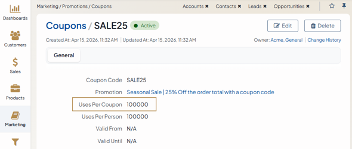 | 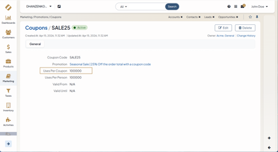 |
| **Colors** | Use `#B48C50` (gold) as the primary annotation color.  Use `#78143C` as an additional color when: • You need to distinguish a second interface element. • Gold is already used for another annotation. • The interface contains many gold elements, and a gold annotation would blend into the UI. | 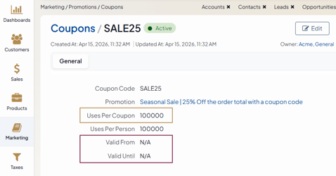 | |
| **Line Thickness** | Adjust the line thickness to the screenshot size: • Screens approximately 600 px wide: 2 px. • Screens 1030 px wide or wider: 4 px or more.  Make sure that lines remain visible without covering interface elements. | 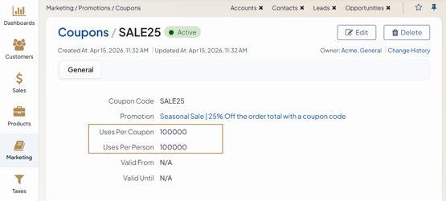 | 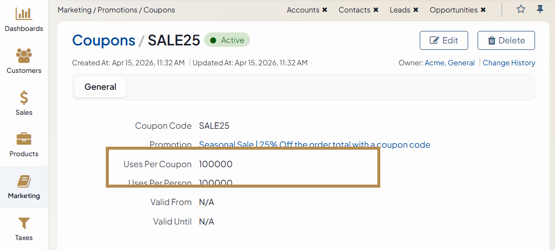 |
| **Selection Shape** | Use a square or rectangular selection frame without a shadow. | 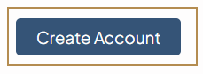 | |
| **Arrows** | Use thin, straight arrows. |  |  |
| **Element Selection** | Whenever possible, use the interface's native selected, focused, active, or expanded state to highlight an element. | 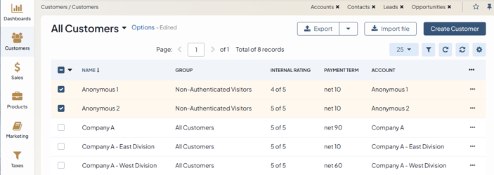 | |
| **Shadows** | Do not apply shadows to arrows, selection frames, step indicators, or other screenshot annotations. | | |
| **Annotation Text** | Use Open Sans for text added to screenshots.  Use a font size of 12 px or 14 px, depending on the screenshot dimensions and the amount of text.  Keep annotations short and use them only when the screenshot cannot convey the required information on its own. | | |
| **Step Indicators** | Use relatively small step indicators without shadows.  Keep the indicator close to the related interface element without covering it. | 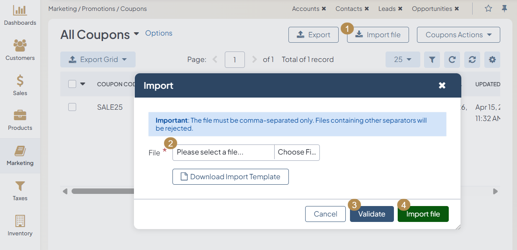 | |
| **Filters** | Hide filters when they are not relevant to the documented task and do not affect the displayed result.  Show filters when the data in the screenshot has been filtered or when the filter configuration is important to the instructions. | 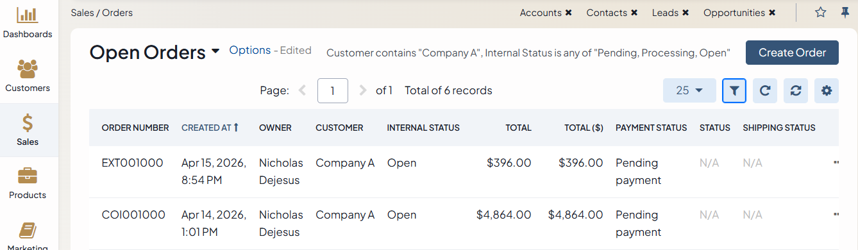  **Or**  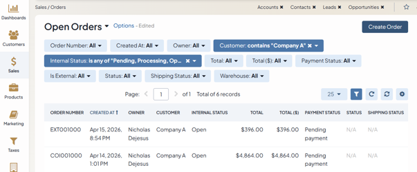 | |
| **Sensitive Data** | Blur all sensitive or identifying data, including instance names, local or private URLs, personal information, and personally identifiable information (PII).  Verify the entire screenshot before publishing it.  Do not expose real names, email addresses, account details, internal URLs, credentials, tokens, or other confidential information. | 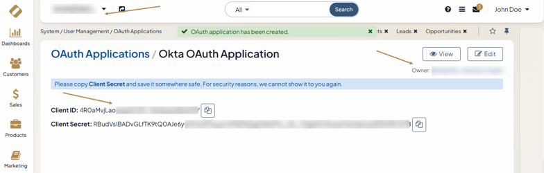 | |

## Testing Documentation

Before submitting documentation changes:

- Review the page for consistency with this style guide.
- Check terminology and capitalization.
- Verify UI references and navigation paths.
- Check links and references.
- Search for common style issues before submitting the pull request.
