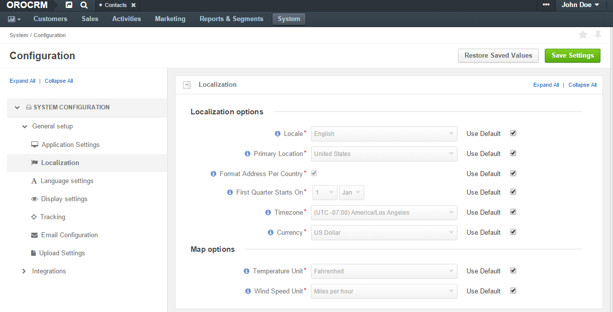

.. _admin-configuration-localization:

Localization Settings
=====================

To reach localization settings, navigate to **System>Configuration>System Configuration>General Setup>Localization**.

|

|

Localization options
--------------------

You can define a number of localization options to be applied to the OroCRM instance, as follows:

.. csv-table::
  :header: "Option", "Description", "Default"
  :widths: 10, 30, 10

  "**Locale**","Affects formatting of numbers, addresses, names, and dates.","English"
  "**Primary Location** and **Format Address Per Country**","Define the address formatting to be applied. If *Format Address Per Country* is enabled and the country-specific formatting is enabled for the instance, the address will be displayed in compliance with the rules specified for the country. For example, if the chosen country is Ukraine, the address will be displayed as follows:
  
  *ZIP code Ukraine City*
  *Street*
  *First and Last name*
  
  whereas, for the US it will be:
  
  *First and Last name*, *Street name*, *CITY NAME, STATE CODE, US, ZIP code*.  
  Otherwise, the *Primary Location* formatting will be applied.","United States" 
  "**Timezone**","Defines the timezone to be applied for all the time settings defined in the instance. If the time-zone is changed all the time settings (e.g. due dates of :ref:`tasks <doc-activities-tasks>`), time of reminders, etc. will be changed correspondingly.","UTC +02:00"
  "**First Quarter Starts On**","Defines the quarter start date.","January 1"

Map options
------------

You can define the **Temperature Unit** and **Wind Speed Unit** used for the map displayed by the address.

.. csv-table::
  :header: "Option", "Description", "Default"
  :widths: 10, 30, 10

  "**Temperature Unit**", "Select the temperature unit. This settings will be applied for weather on map.", "Farenheit"
  "**Windspeed Unit**", "Select the wind speed unit. This settings will be applied for weather on map.", "Miles per hour"

Localization Settings
---------------------

.. csv-table::
  :header: "Option", "Description"
  :widths: 10, 30

  "Enabled Localizations","Select the localizations enabled for the system from the dropdown menu."
  "Default localication", "The dropdown list displays default localizations available in the system."
 

.. important:: The :guilabel:`Reset` button in the upper right corner of the page will restore the latest saved values.