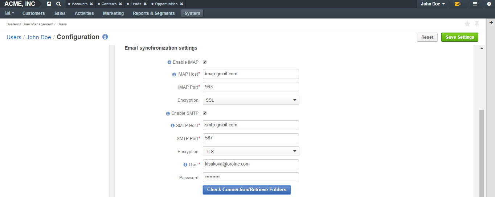
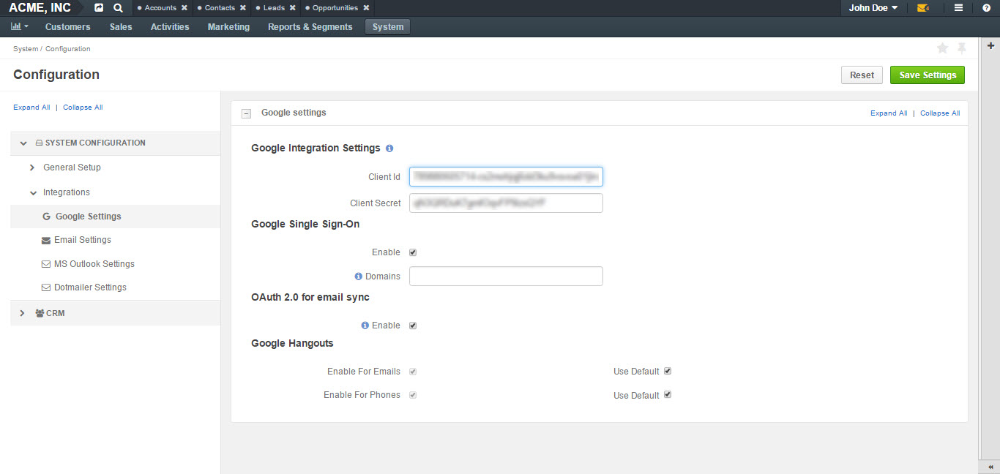

.. _user-guide-email-admin:

Email Configuration 
===================

.. contents:: :local:
    :depth: 4

The following guide will introduce you to the email settings and
provide instructions on how to configure personal and system mailboxes,
and integrate with Google, MS Exchange and Outlook.

.. note:: See a short demo on `how to create and manage emails <https://www.orocrm.com/media-library/create-manage-emails-orocrm>`_ and `how to synchronize your mailbox with OroCRM <https://www.orocrm.com/media-library/synchronize-mailbox-orocrm>`_, or keep reading the step-by-step guidance below.

   .. raw:: html

      <iframe width="560" height="315" src="https://www.youtube.com/embed/hTI0IWEsSF4" frameborder="0" allowfullscreen></iframe>

To reach **Email Configuration** page:

-  Navigate to **System** in the main menu, click **Configuration**.

.. image:: ../img/admin_emails/system_config.jpg

.. image:: ../img/admin_emails/email_config_1.jpg

-  In the left menu, select **System Configuration>General Setup>Email
   Configuration**.

On the **Email Configuration** page, you can define options applied to
all the emails generated within the instance.

The following settings are available:

+-------------------+------------------------------------------------------------------------------------------------------------------------------------------------------------------------------------------------------+
| **Field**         | **Description**                                                                                                                                                                                      |
+===================+======================================================================================================================================================================================================+
| **Autocomplete**  | Define how many characters need to be entered manually to enable auto-complete for emails.                                                                                                           |
+-------------------+------------------------------------------------------------------------------------------------------------------------------------------------------------------------------------------------------+
| **Signature**     | You can define a signature that will be added to all the email bodies created within the instance. The following fields are available:                                                               |
|                   | -  Signature Content: Specify the text and formatting of your signature (by default, the email signature body is empty).                                                                             |
|                   | -  Append Signature to Email Body: Defines whether a signature is added automatically or manually.                                                                                                   |
+-------------------+------------------------------------------------------------------------------------------------------------------------------------------------------------------------------------------------------+
| **Email Threads** | **Display Email Conversations As** and **Display Emails In Activities As** fields define how emails and replies will be displayed to the users, as threads or separately. Two options are available: |
|                   | threaded and non-threaded                                                                                                                                                                            |
+-------------------+------------------------------------------------------------------------------------------------------------------------------------------------------------------------------------------------------+

.. image:: ../img/configuration/threads_settings.png

.. image:: ../img/admin_emails/threaded_email_activities.jpg

.. image:: ../img/admin_emails/non_threaded_activities.jpg

.. csv-table::
  :header: "Field", "Description"
  :widths: 10, 30

  **Reply**,"This field defines which button will be displayed as the default one: **Reply** button is available by default with the **Forward ** and ** Reply** **all** options in its dropdown. The settings can be changed to have **Reply all** shown at the top. "
  
.. image:: ../img/admin_emails/reply.jpg

.. csv-table::
  :header: "Field", "Description"
  :widths: 10, 30

  "**Attachments**", "Attacmhent option has the following fields:

  - **Enable Attachment Sync**: You can enable loading attachments on email sync. 
  - **Maximum Sync Attachment Size (Mb)**: Set the maximum sync attachment size in Mb. Attachments that exceed the defined size will not be downloaded. You can remove size limitations by setting the size to 0.
  - **Remove Large Attachments**: Clicking this button will add a job to the queue to remove all attachments exceeding the defined size from the system. 
  - **Attachments Preview Limit**: This is a limit to show preview for attachments (a thumbnail for images and a big file icon for other files). Set the preview limit to 0 if you wish to see a list with file names only."
  "**HTML in templates**", "Here, you can enable or disable HTML purifier. Disabling HTML purifier allows to paste any HTML code into a template or an email body editor without tag stripping."
  "**Notification Rules**", "The section defines the rules that will be applied by default to a notification generated in the OroCRM. You can define the **Sender Email** and **Sender Name** to be used."
  "**Maintenance Notifications**", "
  - **Email template**: The template to be used by default for maintenance notifications. 
  - **Recipients**: Leave this field empty to send maintenance notification emails to all active users. To send notifications only to specific users, write in their email addresses separated by semicolon (;)."
  "**Campaign**","The section defines the rules that will be applied by default to emails generated as a part of marketing campaigns in OroCRM. You can define the Sender Email and Sender Name to be used."
  "**System Mailboxes**", "A system mailbox allows people who do not have access to the company mailbox addresses write to the company. To add a new system mailbox, click **Add Mailbox**. More information on System Mailboxes and their configuration can be found further below in this guide."

.. _my_email_configuration:

Standard personal mailbox configuration (IMAP/SMTP)
---------------------------------------------------

Accessing personal mailbox configurations
^^^^^^^^^^^^^^^^^^^^^^^^^^^^^^^^^^^^^^^^^

To configure a personal mailbox:

-  Navigate to **My User>My Configuration** in the top right corner.

-  Click :guilabel:`Email Configuration` in the **General Setup** tab on the
   left.

-  This will load an email configuration page.

.. image:: ../img/admin_emails/my_user_my_config.jpg

|

|

.. image:: ../img/admin_emails/personal_email_config.jpg

|

Configuring IMAP/SMPT 
^^^^^^^^^^^^^^^^^^^^^

IMAP and SMTP are protocols used for mail delivery.

-  **IMAP** (Internet Message Access Protocol) allows to retrieve email messages, while

-  **SMTP** (Simple Mail Transfer Protocol) allows to send them out.

To retrieve your mail from a mail client and sync data into OroCRM, as
well as synchronize emails sent from OroCRM into your mailbox (so you
can see them in other email clients):

-  Check :guilabel:`Enable IMAP and Enable SMTP.`

-  Fill in the following fields: **IMAP and SMTP Host, IMAP and SMTP
   Port, Encryption (SSL, TLS)**.

-  Click :guilabel:`Check Connection/Retrieve Folders.`

-  After successful connection, a list of folders will be loaded.

-  Check the folders that you wish to be synchronized (e.g. Inbox).

As an example, we have synchronized a Gmail mailbox with OroCRM, having previously turned on **access for less secure apps**. More details on how to synchronize your Gmail and turn on access for less secured apps can be found `here <https://support.google.com/mail/answer/7126229?hl=en&rd=2&visit_id=1-636180891016092253-2149088408#ts=1665018%2C1665144>`_  `and here <https://support.google.com/accounts/answer/6010255?hl=en>`_

|

|

-  Click :guilabel:`Save Settings` in the top right corner to save your configurations.

Google integration 
-------------------

The only integration available in the community edition by default is
integration with Google:

-  Navigate to **System** in the main menu and click :guilabel:`Configuration`.

-  In the left menu, click :guilabel:`Integrations>Google Settings`.

Here, you can define the details used for Google single sign-on which
allows a user with the same Google account email address and OroCRM
primary email address to log-in only once in the session.

|

|

See how to configure Google Sign-on integration in the :ref:`Google Integration guide <user-guide-google-single-sign-on>`.

MS Exchange integration
-----------------------

OroCRM Enterprise Edition supports integration with Microsoft Exchange
server. This means that emails from mailboxes on the MS Exchange server
can be automatically uploaded to OroCRM.

This functionality enables using a single system-wide setting to collect
letters of multiple users within organization.

|

.. image:: ../img/admin_emails/ms_exchange.png

|

The integration set-up is described in the
relevant :ref:`MS Exchange guide <admin-configuration-ms-exchange>`.

Microsoft Outlook Integration
-----------------------------

Integration with Microsoft Outlook is available for the OroCRM
Enterprise Edition only. 

|

.. image:: ../img/admin_emails/ms_outlook.jpg

|

The integration allows automatic
synchronization of all the contacts. Tasks and calendar events available
for the user can be synchronized with the specified Outlook account and
vice versa. The integration set-up is described in the relevant :ref:`Outlook Integration guide <user-guide-synch-outlook>`.

.. note:: Please note emails are not synced in the course of Outlook integration. For that, please, refer to `Standard personal mailbox configuration (IMAP/SMTP)`_ section.

Configuration of system mailboxes
---------------------------------

To create a system mailbox to process business information requests:

-  Navigate to **System** in the main menu, click :guilabel:`Configuration`.

-  Next, click :guilabel:`Email Configuration` on the left in the **General
   Setup** menu.

-  At the bottom of the page, you will see a section where you can
   create and configure a system mailbox.

-  Click :guilabel:`Add Mailbox` in the right bottom corner, as shown below:

.. include:: system_mailbox_settings.rst
   :start-after: begin
   :end-before: finish
