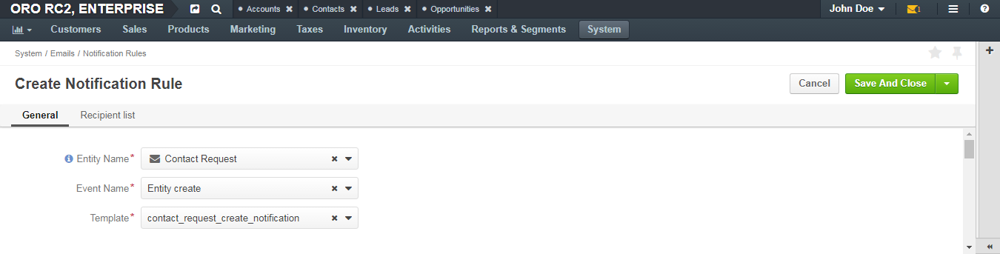

.. _system-notification-rules:

Manage Notification Rules (Automatic Email Notifications)
=========================================================

To help users or other concerned parties keep track of important changes or events, you can configure sending automatic email notifications.

Notification rules define when to send an email to a recipient. For example, you may want an administrator to receive notifications when a user sends them a request, notify users when a new activity is assigned to them, or inform a concerned party each time customer details are edited.

.. note:: See a short demo on `how to create notification rules <https://www.orocrm.com/media-library/create-notification-rules>`_, or keep reading the step-by-step guidance below.

.. contents::
   :local:
   :depth: 2

Create a Notification Rule
--------------------------

To create a notification rule:

1. In the main menu, navigate to **System > Emails > Notification Rules**.
2. On the notification rules list page, click the **Create Notification Rules** button in the upper-right corner of the page.
3. Define what triggers an email notification and the template used. See the :ref:`General <doc--notification-rules--general>` section of this guide.
4. Define email notification recipients. See the :ref:`Recipient List <doc--notification-rules--recipient-list>` section of this guide.
5. Click **Save & Close**.

.. _doc--notification-rules--detailed:

Detailed Notification Rule Information
^^^^^^^^^^^^^^^^^^^^^^^^^^^^^^^^^^^^^^

.. _doc--notification-rules--general:

General
~~~~~~~

When you create or edit a notification rule, specify the following information in the **General** section:

.. csv-table::
  :header: "**Name**","**Description**"
  :widths: 10, 30

  "**Entity Name**","Select an entity related to the notification rule that you create.

   .. important:: In the Oro applications, each automatic email notification is generated according to a certain notification template. Therefore, notification rules are bound to email templates, and you cannot create a notification rule for an entity that does not have related email templates. If you do not see the required entity on the list, please create a notification template for it first. For more information on templates, see :ref:`Email Templates <user-guide-email-template>`."
  "**Event Name**","Select the event that triggers sending of a notification email. You can select one of the following events:

  - *Entity create*—An entity record has been created.
  - *Entity remove*—An entity record has been removed.
  - *Entity update*—An entity record has been edited.
  - *Workflow transition*—Available only when the entity selected in **Entity Name** has related workflows. A workflow transition has been performed.

  "
  "**Transition**","Available only when *Workflow transition* is selected for **Event Name**. Select the workflow transition upon which a notification email is sent."
  "**Template**","Select the template for which the rule will be created."

.. image:: ../img/notification/notification_rule_general2.png

.. _doc--notification-rules--recipient-list:

Recipient List
~~~~~~~~~~~~~~

The **Recipient list** section defines who to send an email notification to.

An email notification can be sent to specific users and/or user groups and/or external email address:

- **Users**—Specify users to send notifications to.

           Start entering a name of the user, and when suggestions appear, click one to select it.

           Click the **x** icon to remove a user from recipients.

- **Groups**—Select check boxes in front of the user groups whose members are to receive the notifications.

- **Email**—Enter the required email address.

- **Owner**—Select this check box to send notifications to the owner of the record for which the event takes place.

  .. hint:: The **Owner** check box is available only when the entity selected for **Entity Name** has the :ref:`ownership type <user-guide-user-management-permissions-ownership-type>` set to *User*.

- **Additional Associations**—This is a list of entities with the email field, whose records can be linked to records of the entity selected for **Event Name**.

Select check boxes in front of the required associations to send notification emails to their addresses.

  Example:

  You have received a contact request. 

  * Each contact request is associated with 'Acme, Inc.' organization and 'Ltd. ABC' lead. 
  * The said organization has a business unit, 'Acme, Inc., West'.
  * The lead record 'Ltd. ABC' can be associated with the contact 'Elizabeth Hick' .

  In such case, if for **Additional Associations** you select *Organization > Business Units* and *Lead > Contact*, the notification emails will be sent to the 'Acme, Inc., West' email address and to the address of 'Elizabeth Hick'.

.. important:: At least one recipient must be specified.

.. image:: ../img/notification/notification_rule_recipient.png

View a Notification Rule
------------------------

1. In the main menu, navigate to **System > Emails > Notification Rules**.
2. On the notification rule list, click the required notification rule.
3. Review the notification rule details. For the description of the fields, see :ref:`Detailed Notification Rule Information <doc--notification-rules--detailed>`.

Edit a Notification Rule
------------------------

From the Notification Rules Grid
^^^^^^^^^^^^^^^^^^^^^^^^^^^^^^^^

To edit a notification rule when viewing a list of notification rules:

1. In the main menu, navigate to **System > Emails > Notification Rules**.
2. On the notification rule list, choose the required notification rule, click the |IcMore| **More Options** menu at the end of the corresponding row, and then click the |IcEdit| **Edit** icon.
3. Update the notification rule details as necessary. For the description of the fields, see :ref:`Detailed Notification Rule Information <doc--notification-rules--detailed>`.
4. Click **Save and Close** in the upper-right corner of the page.

From the Notification Rule View Page
^^^^^^^^^^^^^^^^^^^^^^^^^^^^^^^^^^^^

To edit a notification rule when viewing the notification rule details:

1. In the main menu, navigate to **System > Emails > Notification Rules**.
2. On the notification rule list, click the required notification rule.
3. On the notification rule view page, click the **Edit** button in the upper-right corner of the page.
4. Update the notification rule details as necessary. For the description of the fields, see :ref:`Detailed Notification Rule Information <doc--notification-rules--detailed>`.
5. Click **Save and Close** in the upper-right corner of the page.

Delete a Notification Rule
--------------------------

From the Notification Rules Grid
^^^^^^^^^^^^^^^^^^^^^^^^^^^^^^^^

To delete a notification rule from the notification rules grid:

1. In the main menu, navigate to **System > Emails > Notification Rules**.
2. On the notification rule list, choose the required notification rule, click the |IcMore| **More Options** menu at the end of the corresponding row, and then click the |IcDelete| **Delete** icon.
3. In the **Deletion Confirmation** dialog, click **Yes, Delete**.

From the Notification Rule View Page
^^^^^^^^^^^^^^^^^^^^^^^^^^^^^^^^^^^^

Alternatively, you can delete a notification rule from the notification rule view page by clicking the **Delete** button in the upper-right corner of the page.

Delete Multiple Notification Rules
----------------------------------

To delete a bulk of tasks:

1. In the main menu, navigate to **System > Emails > Notification Rules**.
2. On the notification rule list, select check boxes in front of the notification rules that you would like to delete.
3. Click the |IcMore| **More Options** menu at the end of the grid header row and then click |IcDelete| **Delete**.
4. In the **Deletion Confirmation** dialog, click **Yes, Delete**.

.. include:: ../../img/buttons/include_images.rst
   :start-after: begin
