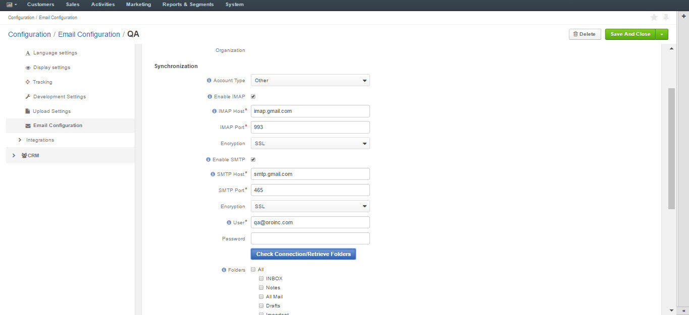
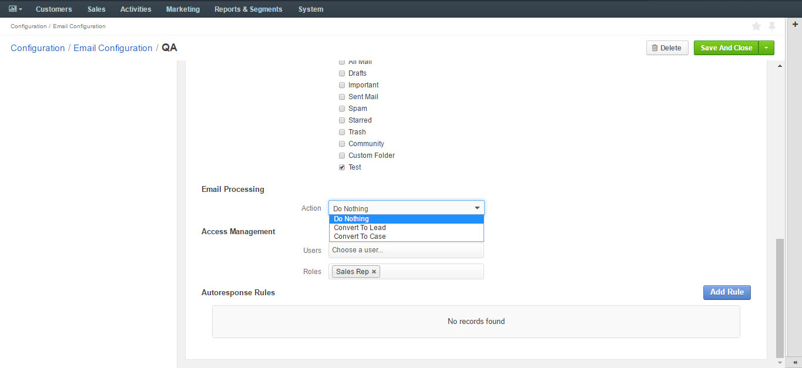
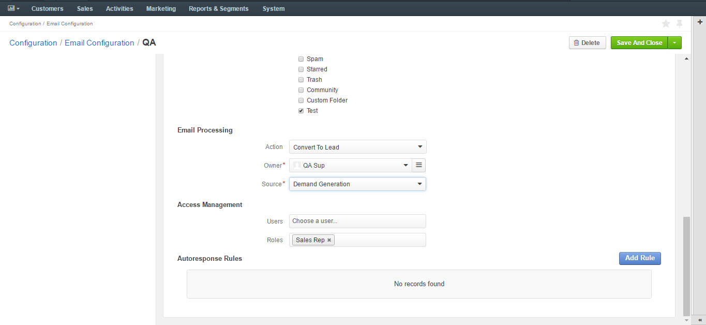
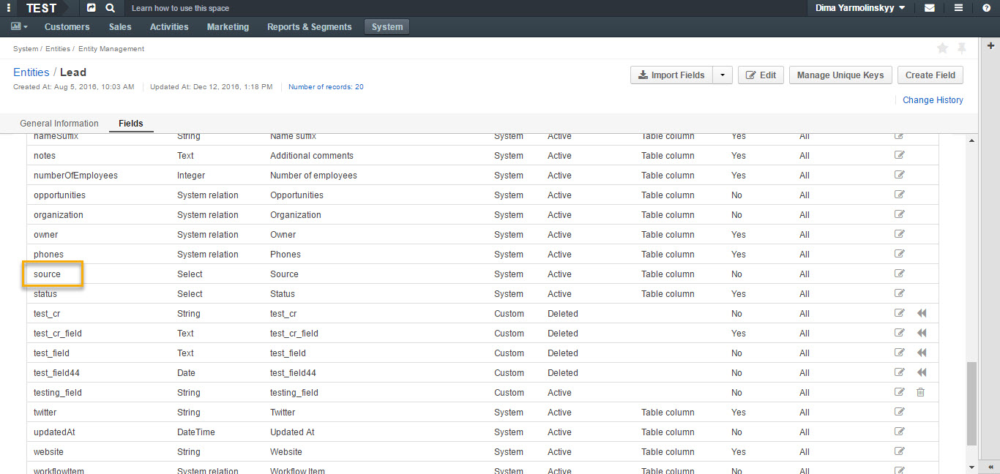

.. _admin-configuration-system-mailbox-settings:

System Mailbox Settings
=======================
.. contents:: :local:
    :depth: 2

See a short demo on `how to create and configure system mailboxes <https://oroinc.com/orocrm/media-library/create-configure-system-mailboxes>`_ in your Oro application, or continue reading the step-by-step guidance below.

.. raw:: html

      <iframe width="560" height="315" src="https://www.youtube.com/embed/2s3tWpyvdn8" frameborder="0" allowfullscreen></iframe>

Configuration of system mailboxes
---------------------------------

To create a system mailbox to process business information requests:

-  Navigate to **System** in the main menu, click :guilabel:`Configuration`.

-  Next, click :guilabel:`Email Configuration` on the left in the **General
   Setup** menu.

-  At the bottom of the page, you will see a section where you can
   create and configure a system mailbox.

-  Click :guilabel:`Add Mailbox` in the bottom right corner, as shown below:

.. begin

.. image:: ../img/admin_emails/add_mailbox.jpg

General
^^^^^^^

The **General section** defines the basic settings of the mailbox
created:

-  Define a name of your Mailbox in the **Mailbox Label** field.

-  Type in your email address.

.. image:: ../img/admin_emails/create_mailbox.jpg

Synchronization
^^^^^^^^^^^^^^^

In the **Synchronization** section, configure your IMAP/SMTP connection:

-  Select your **Account type**. If the value in the field is changed, a
   new mailbox will be registered and data from the previous mailbox
   will be lost.

-  Enable **IMAP** and **SMTP** and enter configuration details for
   connecting to IMAP and SMTP server for the mailbox. This includes
   **host, port,** and **encryption**.

-  Specify the **login username** and **password** for this mailbox.

-  Once the credentials and configuration fields are filled in, click
   the :guilabel:`Check Connection/Retrieve Folders` button. After successful
   connection, a list of available folders will be displayed.

-  Check the **Folders** to be synchronized.

Email Processing
^^^^^^^^^^^^^^^^

In the **Email Processing** section you can choose what actions will be
performed with all the emails received in the mailbox.

Out of the box three different actions are available.

This functionality can be expanded through customization to match your
business's unique requirements.

-  **Do nothing**. In this case no actions will be performed. Emails
   will be saved in the mailbox and can be accessed by those users with
   the permission to do so.

-  **Convert to Lead**. Letters will be saved in the mailbox and a new
   lead record will be created in OroCRM.

   .. note:: In order to have an option to Convert to Lead, you need to have a Sales channel activated. Otherwise, this option will not be available on the list of options.

-  **Convert to Case**. A new case record will be created in OroCRM
   based on the email received.

As an example, let us select the **Convert To Lead** option:

-  Once the action has been selected, define which user will own the
   records and choose the source of your leads in the **Source** field.

.. note:: Options in the Source field should be defined in advance. This can be done through the entity manager in **System>Entities>Entity Management>Lead>Source**.

.. image:: ../img/admin_emails/lead_source_field.jpg

Access Management
^^^^^^^^^^^^^^^^^

in the **Access management section**, define which OroCRM users will
have access to the system mailbox. You can select roles and/or specific
users. All the users with defined roles and all the specifically defined
users will have access to this mailbox.

.. image:: ../img/admin_emails/access_management.jpg

Autoresponse Rules
^^^^^^^^^^^^^^^^^^

In the **Autoresponse Rules** section you can generate one or several
auto-response rules. These rules will determine which template is sent
to the sender of the email.

-  Click :guilabel:`Add Rule` to add a new Autoresponse rule.

-  An Add Autoresponse Rule form will open.

.. image:: ../img/admin_emails/autoresponse.jpg

-  Define the following settings:

+-------------------------------------+---------------------------------------------------------------------------------------------------------------------+
| **Field**                           | **Description**                                                                                                     |
+=====================================+=====================================================================================================================+
| **Status (Active/Inactive)**        | Only rules with active statuses are applied.                                                                        |
+-------------------------------------+---------------------------------------------------------------------------------------------------------------------+
| **Name**                            | Select the name for the rule to be used within the system.                                                          |
+-------------------------------------+---------------------------------------------------------------------------------------------------------------------+
| **Conditions**                      | Define the rules according to which the rule will be applied:                                                       |
|                                     | 1. In the first selector, choose the field for which the condition is to be set: Body, From, Cc, Bcc.               |
|                                     | 2. In the second selector, choose the conditions (e.g. contains, does not contain, is equal to, starts with, etc.). |
|                                     | 3. In the field besides the selectors, define the values where required.                                            |
|                                     | Click the **+** or **+Add button** to add another condition for the rule.                                           |
|                                     | Click the **x** button to remove the condition.                                                                     |
|                                     | All conditions are summed up (AND operator).                                                                        |
+-------------------------------------+---------------------------------------------------------------------------------------------------------------------+
| **Response template**               | Choose an  :ref:`email template <user-guide-email-template>` for autoresponse.                                      |
+-------------------------------------+---------------------------------------------------------------------------------------------------------------------+
| **Type**                            | Choose if you want to use html or plain text for the email.                                                         |
+-------------------------------------+---------------------------------------------------------------------------------------------------------------------+
| **Translations**                    | If you have more than one language configured in the system, select the necessary translation.                      |
+-------------------------------------+---------------------------------------------------------------------------------------------------------------------+
| **Email Template**                  | Enter the subject and content of your email.                                                                        |
+-------------------------------------+---------------------------------------------------------------------------------------------------------------------+
| **Save Response As Email Template** | Checking the box automatically saves the current email as a template.                                               |
+-------------------------------------+---------------------------------------------------------------------------------------------------------------------+

-  Click :guilabel:`Add` to save the rule.
   
.. finish