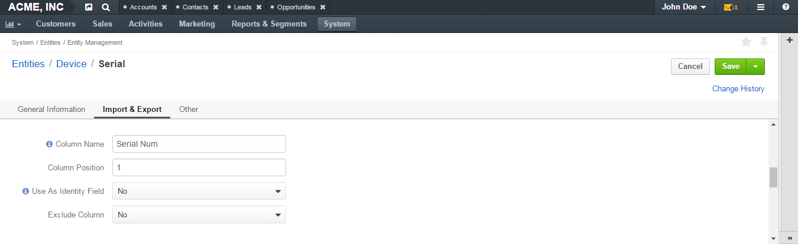
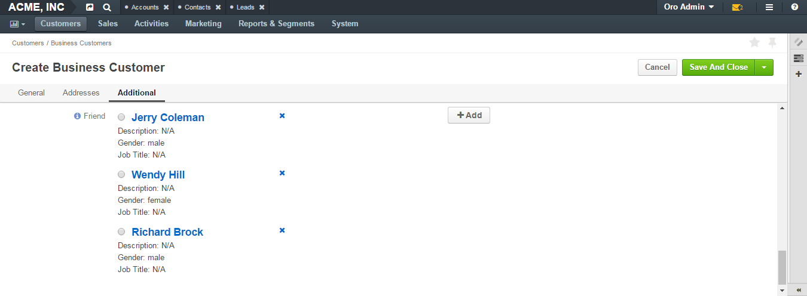
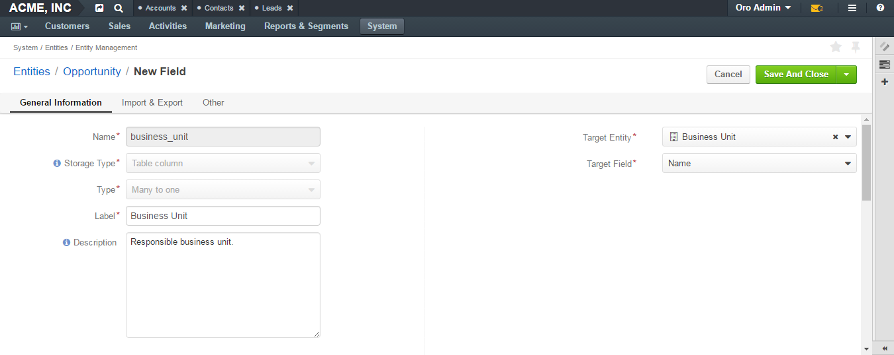

.. _doc-entity-field-properties:

Entity Field Properties
=======================

.. contents:: :local:
    :depth: 3

The creation of an entity field takes two steps. In step 1, you specify just the very basic properties: name, field type and field storage type. In step 2, you specify more advanced properties, some of which can be field-type-related.

Basic Entity Field Properties
-----------------------------

General Information Section
^^^^^^^^^^^^^^^^^^^^^^^^^^^

|

.. image:: ../img/entity_management/new_entity_field.png

|

.. csv-table::
  :header: "Field", "Description"
  :widths: 10, 30

  "**Field Name**","Mandatory. Type a name of the field that will be used to refer to it in the system. 
  
  This name must be unique within an entity. 
  It cannot be a `reserved SQL word <http://msdn.microsoft.com/en-us/library/ms189822.aspx>`_ , nor a
  `reserved PHP word <http://php.net/manual/en/reserved.keywords.php>`_."
  "**Storage Type**","Mandatory. Select how the field is stored in the system. There are two options:

  - **Serialized field**—Use this storage type for simple fields that keep information necessary for 
    a single entity. The field will appear in the system as soon as it has been added and no :ref:`schema update <schema update>` is required. 
  
    .. important:: 
      Serialized fields cannot be used for :ref:`grid filters <doc-grids-actions-filters>`, :ref:`report <user-guide-reports>` and :ref:`chart <user-guide--business-intelligence--reports--use-custom-reports>` generation, data audit, creation of :ref:`segments <user-guide-filters-segments>` and :ref:`relations <user-guide-entity-management-relation>`.
  
      Serialized fields cannot be used for files, multi-selects or option sets.
  
  - **Table column**—Store field values to a database table. If this option is selected, the field can be used without the limitations applicable to a serialized field. For this type of fields a :ref:`schema update <schema update>` is required.
  "
  "**Type**","Mandatory. Select a field type from the list.
  
  The following types are available:

  - Fields
  
    - BigInt  
    
    - Boolean
    
    - Currency
    
    - Date
    
    - DataTime
    
    - Decimal
      
    - File
    
    - Float
    
    - Image
    
    - Integer
    
    - Multi-Select
    
    - Percent
    
    - Select
    
    - SmallInt
    
    - String
    
    - Text
    
  - Relations—Relation is a field that enables you to tie record(s) of one entity to record(s) of another entity. For example each customer has an account, and each account can be assigned several contacts.
  
    - Many to many
    
    - Many to one
    
    - One to many
  
  For the help on selection the field that is right for your purposes, see the :ref:`Entity Field Types <entity-field-types>` guide.
  "
  

Advanced Entity Field Properties
--------------------------------

Properties that can be defined may vary subject to the chosen field type. 

The following sections provide descriptions of common properties (they are applicable to most of the types), and peculiarities of specific types.

Common Properties
^^^^^^^^^^^^^^^^^

General Information Section
"""""""""""""""""""""""""""

|

.. image:: ../img/entity_management/entity_field_general_information2.png

|

Fields **Name**, **Storage Type**, **Type** that you filled in when specifying information for basic entity field properties (see the `Basic Entity Field Properties <./entity-field-properties#basic-entity-field-properties>`__ section) are still present on the page but they are read-only now, i.e you cannot change their values.

There are two new fields in this section:

.. csv-table:: 
  :header: "Field","Description"
  :widths: 10,30

  "**Label**","Mandatory. Type a label that will be used for referring to the field on the interface. By default, the label is the same as **Name**."
  "**Description**","Type a short but meaningful description that will appear as a field tooltip on the interface."
  

.. _user-guide-entity-management-export-import-common:

Import and Export Section
"""""""""""""""""""""""""

|

|

.. csv-table:: 
  :header: "Field","Description"
  :widths: 10,30

  "**Column Name**","Type a name that will be used for identifying the field in the .csv file with entity records. If left empty, the **Label** value will be used for identifying the field when you export entity records."
  "**Column Position**","Type a number that corresponds to the position of this field in the .csv file that contains entity records."

  "**Exclude Column**", "- **No**—Select this value if you want this field to be available for export.

  - **Yes**—Select this value if you do not want this field to be available for export (this field will not be present in the .csv file obtained as a result of the export operation)."
  
  

.. _doc-entity-fields-properties-other:

Other
"""""

|

.. image:: ../img/entity_management/entity_field_other.png

|

.. csv-table:: 
  :header: "Option","Description"
  :widths: 10,30

  "**Available in Email Templates**","If this option is set to *Yes*, values of the field can be used for creating email patterns."
  "**Contact Information**","Possible values are:
    
    - Empty—The field will not be treated as a contact information.
    - **Email**—Values of the field will be treated by :ref:`marketing lists<user-guide-marketing-lists>`
      as email addresses.
    - **Phone**—Values of the field will be treated by marketing lists as phone numbers.

  "
  "**Show on Grid**","If set to *Yes*, the field will be displayed in a separate column of the respective grid."
  "**Show Grid Filter**","Not available for serialized fields. If set to *Yes*, a corresponding filter will be added to 
  :ref:`grid filters <doc-grids-actions-filters>` by default."
  "**Show on Form**","If set to *Yes*, the field value appears as editable on record edit pages."
  "**Show on View**","If set to *Yes*, the field is displayed on record view pages."
  "**Priority**","Defines an order of custom fields on entity record view, edit, and create pages, and on the respective 
  grid. 
  
  Custom fields are always displayed one after another, usually below the system fields. If no priority is defined or the 
  defined priority is 0, the fields will be displayed in the order in which they have been added to the system. The fields with a higher priority (a bigger value) will be displayed before the fields with a lower priority."
  "**Searchable**","If set to *Yes*, the entities can be found with OroCRM's 
  :ref:`search functionality <user-guide-getting-started-search>` by values of this field."
  "**The Search Result Title**","If set to *Yes*, the field value will be included into the search result title."
  "**Auditable**","Not available for serialized fields. If set to *Yes*, the system will log changes made to this field values when users edit entity records."
  "**Applicable Organizations**","Defines for what :term:`organizations <Organization>` the custom field will be added 
  to the :term:`entity <Entity>`.
  
  **All** is selected by default. Clear the **All** check box to choose specific organizations from the list."

.. caution:: 

      If the **Show on Form** value has been set to *No*, there will be no way to create/update the field values from 
      OroCRM. Thus, such configuration is reasonable only for data which is uploaded to the system during a synchronization. 

Type-Related Properties
-----------------------

Decimal
^^^^^^^

Decimal fields have two additional optional properties that can be defined in the **General** section:

+-----------+----------------------------------------------------------------------------------+
| Field     | Description                                                                      |
+===========+==================================================================================+
| Precision | Maximum number of digits. E.g. 15.252 has precision 5. And 1.12 has precision 3. |
+-----------+----------------------------------------------------------------------------------+
| Scale     | Maximum number of decimal places. E.g. 15,252 has scale 3. And 1.12 has scale 2. |
+-----------+----------------------------------------------------------------------------------+

String
^^^^^^

String fields have an additional optional property in the **General** section:

+--------+-----------------------------------------------------------------------+
| Field  | Description                                                           |
+========+=======================================================================+
| Length | The number of characters in the string. It is a number from 1 to 255. |
+--------+-----------------------------------------------------------------------+

Text
^^^^

.. important::
   Fields of the **Text** type are not displayed on a grid, so **Show on Grid** and **Show Grid Filter** properties cannot be defined for them. 

  

File
^^^^

File fields have an additional property in the **General** section:

+-----------+-----------------------------------------------------------------+
| Field     | Description                                                     |
+===========+=================================================================+
| File Size | Mandatory. The maximum file size allowed for an upload (in MB). |
+-----------+-----------------------------------------------------------------+

.. important::

  - Which file extensions will be allowed for upload is defined by the system settings. See `Upload settings <../app-look-feel/system-config#upload-settings>`__ section. 

  - Fields of the **File** type can be only of the **Column table** storage type.

  - These fields cannot be defined as identity fields for the :ref:`export / import <user-guide-entity-management-export-import-common>` operations.
  
  - Fields of the **File** type are not displayed on a grid, so **Show on Grid** and **Show Grid Filter** properties cannot be defined for them. 
  

.. warning::
  Auditing is not available for actions with the entity fields of the **File** type.

Image
^^^^^

Image fields have three additional properties in the **General** section:

+------------------+------------------------------------------------------+
| Field            | Description                                          |
+==================+======================================================+
| File Size        | The maximum file size allowed for an upload (in MB). |
+------------------+------------------------------------------------------+
| Thumbnail Width  | The image thumbnail width in pixels.                 |
+------------------+------------------------------------------------------+
| Thumbnail Height | The image thumbnail height in pixels.                |
+------------------+------------------------------------------------------+

.. important::
 
  - Which file extensions will be allowed for upload is defined by the system settings. See `Upload settings <../app-look-feel/system-config#upload-settings>`__ section. 

  - Fields of the **Image** type can be only of the **Column table** storage type.

  - These fields cannot be defined as identity fieldsfor the :ref:`export / import <user-guide-entity-management-export-import-common>` operations.
  
  - Fields of the **Image** type are not displayed on a grid, so **Show on Grid** and **Show Grid Filter** properties cannot be defined for them. 
  

.. warning::
  Auditing is not available for actions with the entity fields of the **File** type.

  
Select 
^^^^^^

Select fields have an additional property in the **General** section:

+---------+----------------------------------------------------------------------------------------------------------------------------------------------------+
| Field   | Description                                                                                                                                        |
+=========+====================================================================================================================================================+
| Options | Define values that will be included in the select list.                                                                                            |
|         |                                                                                                                                                    |
|         | To add an option, click the :guilabel:`+Add` button.                                                                                               |
|         |                                                                                                                                                    |
|         | To set the default option, select the check box next to the option. Click the **Do not set as Default** link to clear the **Default** check boxes. |
|         |                                                                                                                                                    |
|         | To move an option up or down on the list, drag the |IcPosition| **Move** icon next to the option.                                                  |
|         |                                                                                                                                                    |
|         | To delete an option, click the :guilabel:`x` icon next to the option. Please note that if you delete an option,                                    |
|         |                                                                                                                                                    |
|         | it will be removed from all the entity records in the system where it is currently present.                                                        |
+---------+----------------------------------------------------------------------------------------------------------------------------------------------------+

.. important::
  - The fields of the **Select** type can be only of the **Column table** storage type.

  - These fields cannot be defined as identity fields for the :ref:`export / import <user-guide-entity-management-export-import-common>` operations.
  
.. warning::
  When editing system select fields, note that some options could be defined as system and cannot be deleted.  

Multi-Select
^^^^^^^^^^^^

Multi-select fields have an additional property in the **General** section:

+---------+-----------------------------------------------------------------------------------------------------------------------------------------------------------------------------------------+
| Field   | Description                                                                                                                                                                             |
+=========+=========================================================================================================================================================================================+
| Options | Define values that will be included in the multi-select list.                                                                                                                           |
|         |                                                                                                                                                                                         |
|         | To add an option, click the :guilabel:`+Add` button.                                                                                                                                    |
|         |                                                                                                                                                                                         |
|         | To set the default option, select the check box next to the option. You can set several default options. Click the **Do not set as Default** link to clear the **Default** check boxes. |
|         |                                                                                                                                                                                         |
|         | To move an option up or down on the list, drag the |IcPosition| **Move** icon next to the option.                                                                                       |
|         |                                                                                                                                                                                         |
|         | To delete an option, click the :guilabel:`x` icon next to the option. Please note that if you delete an option,                                                                         |
|         |                                                                                                                                                                                         |
|         | it will be removed from all the entity records in the system where it is currently present.                                                                                             |
+---------+-----------------------------------------------------------------------------------------------------------------------------------------------------------------------------------------+

.. important::
  - Fields of the **Multi-Select** type can be only of the **Column table** storage type.

  - These fields cannot be defined as identity fields for the :ref:`export / import <user-guide-entity-management-export-import-common>` operations.
  
.. warning::
   When editing system select fields, note that some options could be defined as system and cannot be deleted.  

Many to many
^^^^^^^^^^^^

Many to many fields have additional properties in the **General** section:

+----------------------------+-------------------------------------------------------------------------------------------------------------------------------------------------------------------------------------------------------+
| Field                      | Description                                                                                                                                                                                           |
+============================+=======================================================================================================================================================================================================+
| Target Entity              | Mandatory. Select the entity which record(s) will be tied with records of the current entity.                                                                                                         |
+----------------------------+-------------------------------------------------------------------------------------------------------------------------------------------------------------------------------------------------------+
| Related Entity Data Fields | Mandatory. Select those fields of the entity selected in **Target Entity** which contain information that you want to see on the master entity record edit page.                                      |
|                            | These could be a couple of important details in edition to the title which give you the most important information about the related entity record.                                                   |
|                            | Hold the **Ctrl** key to choose several fields.                                                                                                                                                       |
+----------------------------+-------------------------------------------------------------------------------------------------------------------------------------------------------------------------------------------------------+
| Related Entity Info Title  | Mandatory. Select the fields of the entity selected in **Target Entity** by which the users can identify the related entity record.                                                                   |
|                            | These fields serve as a title to the related entity record on the master entity pages. Choose these fields carefully. It would be a good idea to select a related entity name or similar information. |
|                            | On the view page of the master entity record, these fields will appear as links to the corresponding related entity record.                                                                           |
|                            | On the edit page of the master entity record, you will see these fields as titles of the section that contains information selected in **Related Entity Data Fields** .                               |
|                            | Hold the **Ctrl** key to choose several fields.                                                                                                                                                       |
+----------------------------+-------------------------------------------------------------------------------------------------------------------------------------------------------------------------------------------------------+
| Related Entity Detailed    | Mandatory. Select those fields of the entity selected in **Target Entity** which contain additional information that you want to see on the master entity record edit page.                           |
|                            | The values of the fields selected will be available in the dialog box that appears when you click the title of the realted entity on the master page edit page.                                       |
|                            | Hold the **Ctrl** key to choose several fields.                                                                                                                                                       |
+----------------------------+-------------------------------------------------------------------------------------------------------------------------------------------------------------------------------------------------------+

                

.. important::
  - Many to many relation fields can be only of the **Column table** storage type.

  - Many to many relation fields cannot be defined as identity fields for the :ref:`export / import <user-guide-entity-management-export-import-common>` operations.

  - Many to many relation fields type are not displayed on a grid, so **Show on Grid** and **Show Grid Filter** properties cannot be defined for them. 

One to many
^^^^^^^^^^^^

One to many fields have additional properties in the **General** section:

+----------------------------+-------------------------------------------------------------------------------------------------------------------------------------------------------------------------------------------------------+
| Field                      | Description                                                                                                                                                                                           |
+============================+=======================================================================================================================================================================================================+
| Target Entity              | Mandatory. Select the entity which record(s) will be tied with records of the current entity.                                                                                                         |
+----------------------------+-------------------------------------------------------------------------------------------------------------------------------------------------------------------------------------------------------+
| Related Entity Data Fields | Mandatory. Select those fields of the entity selected in **Target Entity** which contain information that you want to see on the master entity record edit page.                                      |
|                            | These could be a couple of important details in edition to the title which give you the most important information about the related entity record.                                                   |
|                            | Hold the **Ctrl** key to choose several fields.                                                                                                                                                       |
+----------------------------+-------------------------------------------------------------------------------------------------------------------------------------------------------------------------------------------------------+
| Related Entity Info Title  | Mandatory. Select the fields of the entity selected in **Target Entity** by which the users can identify the related entity record.                                                                   |
|                            | These fields serve as a title to the related entity record on the master entity pages. Choose these fields carefully. It would be a good idea to select a related entity name or similar information. |
|                            | On the view page of the master entity record, these fields will appear as links to the corresponding related entity record.                                                                           |
|                            | On the edit page of the master entity record, you will see these fields as titles of the section that contains information selected in **Related Entity Data Fields** .                               |
|                            | Hold the **Ctrl** key to choose several fields.                                                                                                                                                       |
+----------------------------+-------------------------------------------------------------------------------------------------------------------------------------------------------------------------------------------------------+
| Related Entity Detailed    | Mandatory. Select those fields of the entity selected in **Target Entity** which contain additional information that you want to see on the master entity record edit page.                           |
|                            | The values of the fields selected will be available in the dialog box that appears when you click the title of the realted entity on the master page edit page.                                       |
|                            | Hold the **Ctrl** key to choose several fields.                                                                                                                                                       |
+----------------------------+-------------------------------------------------------------------------------------------------------------------------------------------------------------------------------------------------------+

.. important::
  - One to many relation fields can be only of the **Column table** storage type.

  - One to many relation fields cannot be defined as identity fields for the :ref:`export / import <user-guide-entity-management-export-import-common>` operations.

  - One to many relation fields type are not displayed on a grid, so **Show on Grid** and **Show Grid Filter** properties cannot be defined for them. 

Example
"""""""
Let us create a field **Friend** that relates to contacts that were recommended by a specific business customer. This is a 'one to many' relation, as one business customer may advise many friends.

Our **Friends** field has the following values:

- **Target Entity**—Select **Contact**.

- **Related Entity Data Fields**—Select **Description**, **Gender**, and **Job Title**.
 
- **Related Entity Info Title**—Select **First name** and **Last name**.

- **Related Entity Detailed**— Select all the fields available.

|

.. image:: ../img/entity_management/entity_field_example_newfield.png

|

Now we create a business customer:

The following grid appears once you have clicked the :guilabel:`+Add` button against the **Friend** field on the record edit or ceate page:

|
  
.. image:: ../img/entity_management/entity_field_example_bc1.png

|

It contains all the fields defined for the **Related Entity Data Fields**.

We have added three contacts. We have added three contacts. The title contains properties defined for the **Related Entity Info Title**. **Related Entity Data Fields** are displayed for each record below the link.

|
  

|
   
If you click the title of one of the opportunities, a dialog box with all the details specified in the **Related Entity Detailed** appears.

|

.. image:: ../img/entity_management/entity_field_example_bc3.png

|
   
The **Related Entity Info Title** properties are also used to represent the related contacts on the view page.

.. image:: ../img/entity_management/entity_field_example_bc4.png

Many to one
^^^^^^^^^^^

Many to one fields have additional properties in the **General** section:

+---------------+-------------------------------------------------------------------------------------------------------------------+
| Field         | Description                                                                                                       |
+===============+===================================================================================================================+
| Target Entity | Mandatory. Select the entity which record(s) will be tied to the records of the current entity.                   |
+---------------+-------------------------------------------------------------------------------------------------------------------+
| Target Field  | Mandatory. Select the field of the entity selected in **Target Entity** by which the entity records will be tied. |
+---------------+-------------------------------------------------------------------------------------------------------------------+

.. important::
  - Many to one relation fields can be only of the **Column table** storage type.

  - Many to one relation fields cannot be defined as identity fields for the :ref:`export / import <user-guide-entity-management-export-import-common>` operations.

  - Many to one relation fields type are not displayed on a grid, so **Show on Grid** and **Show Grid Filter** properties cannot be defined for them. 
  

Example
"""""""

Let us create a relation 'Business Unit' and specify:

- **Target Entity**—Select **Business Unit**.

- **Target Field**—Select **Name**.

Now, when creating/editing an opportunity record, you can choose a related business unit from the list. Business unit records in the list are represented by their **Name** values.  

|

|

.. image:: ../img/entity_management/entity_field_example2_2.png

|

Links
------

For the information about entity fields, see the `Entity Fields <./entity-fields>`__ guide. 

For the overview of the entities, see the `Entities <./entities>`__ guide. 

.. |IcPosition| image:: ../../img/buttons/IcPosition.png
   :align: middle
