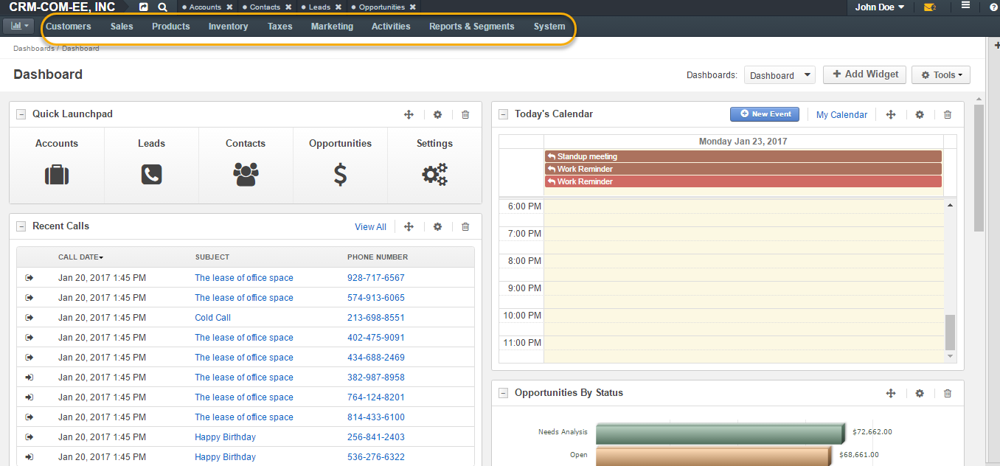

.. _user-guide-commerce-integration:

CRM and Commerce Integration
============================

.. contents:: :local:
    :depth: 3

Overview
--------

Integration between `OroCRM <https://www.orocrm.com>`_ and `OroCommerce <https://www.orocommerce.com>`_ provides seamless experience of two applications working as one.

It is possible to install OroCommerce over existing OroCRM instance, add OroCRM to existing OroCommerce instance or install both applications as a single package.

Look and Feel
-------------

Oro application share the baseline and combining capabilities of multiple applications and packages does not change the overall look and feel of the system. As the result of OroCommerce integration with OroCRM, the application menu is combined, displaying both OroCommerce and OroCRM menus.

|

|

Accounts 
--------

Commerce customers are treated the same way as CRM customers, Magento or Business. Their data and business transactions are displayed on the :ref:`Account <user-guide-accounts>` view page, and their activities are added to the Account's activity list.

Lifetime sales values metric will be calculated for Commerce customer based on orders placed.

The following illustrates an example of an Account for Commerce customer.

|

.. image:: ../img/commerce_integration/account.png

|

A Commerce Channel section is available at the Account view. It displays basic data for Commerce customers and some additional data, such as orders, quotes, or opportunities that can be related to a Commerce customer:

|

.. image:: ../img/commerce_integration/account_commerce_customer.png

|

When a customer is created or edited at backend, the Account can be specified directly.

When a new customer is self-registering at frontend, a new Account of the same name will be created automatically.

In case of installation of OroCRM over an existing Commerce instance, new Accounts are automatically created for all existing customers.

You can specify the strategy for Account creation in **System Configuration>Integrations>CRM and Commerce**. There are two options: 

- to create a single account for the entire customer hierarchy, or
- create a separate account for every customer regardless of their parent-child relations with other customers. 
  
These options can be changed any time with customers re-related to accounts accordingly.

|

.. image:: ../img/commerce_integration/config_commerce_integration.png

|

Opportunities 
--------------

Opportunities for Commerce customers are created the same way as for other CRM customers. You can read more on opportunities in the :ref:`corresponding guide <user-guide-system-channel-entities-opportunities>`.

|

.. image:: ../img/commerce_integration/create_opp.png

|

A Commerce customer can be added to the Account field when creating a new opportunity:

|

.. image:: ../img/commerce_integration/opp.png

|

Track and Forecast Commerce Sales
---------------------------------

CRM opportunities can be related to any customer type, including Commerce customers. This allows sales representatives to track their ongoing deals and forecast future revenues for all sales that will be conducted via the Commerce website by relating the opportunity to the respective Commerce customer record.