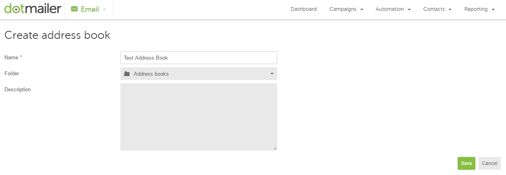
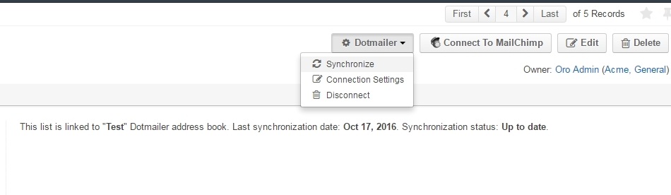
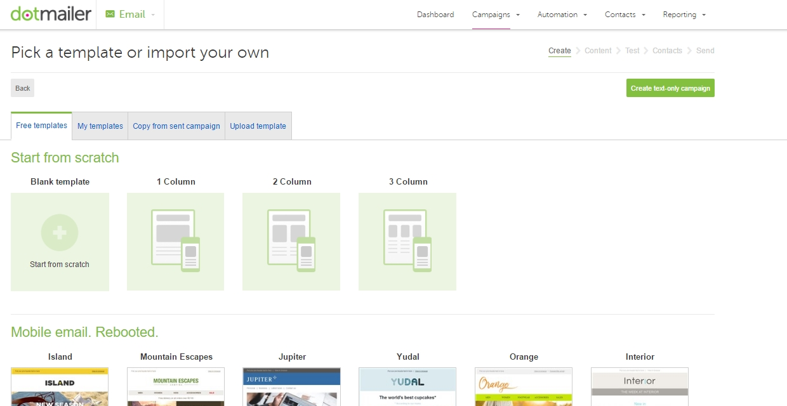
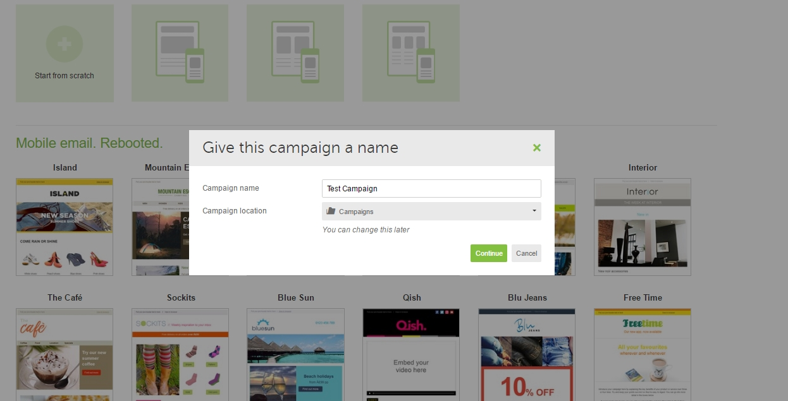

Sending Email Campaign via Dotmailer 
=====================================

Flow
-----

|

.. image:: ../img/dotmailer_email_campaign/oro_dotmailer_integration.jpg

|

Configure Dotmailer Integration
-------------------------------

To configure Dotmailer integration, ensure that you have Dotmailer extension installed in your instance of OroCRM. To download the extension, click `here <https://marketplace.orocrm.com/package/orocrm-dotmailer-integration/>`_

To configure integration with OroCRM on the Dotmailer side, you need to
create **an API managed user**. In order to do that:

-  Login to Dotmailer.

-  Navigate to your name in the upper right corner.

-  Click on **Users** in the dropdown menu.

-  Select **API Users** tab.

-  Click on the **New User** button.

|

.. image:: ../img/dotmailer_email_campaign/dotmailer_account_users.jpg

|

Your unique email address will be generated in the **Email Address**
field. You need this email address to configure OroCRM integration with
Dotmailer.

Next, create and confirm your **Password**. The **Description** field is
optional. Mark your user **Enabled** and click **Save** to proceed.

|

.. image:: ../img/dotmailer_email_campaign/dotmailer_api_users_new_user_details.jpg

|

Now log into OroCRM and navigate to **System>Integrations>Manage
Integrations**.

Click **Create Integration** in the top right corner.

|

.. image:: ../img/dotmailer_email_campaign/oro_create_dotmailer_integration.jpg

|

Next, complete the following fields:

.. csv-table::
  :header: "Field", "Description"
  :widths: 10, 30

  "**Type**","Select Dotmailer from the list of integrations available in the dropdown."
  "**Name**","Enter the integration name to refer to within the system."
  "**Username**","Enter the unique email address generated on the Dotmailer side."
  "**Password**","Enter the password you set for your API User on the Dotmailer side. Click **Check connection. Connection Successful** message indicates that connection to Dotmailer has been established."
  "**Default Owner**","The owner receives the data produced by the email campaign. It is suggested to select a marketing rep as the owner."

Once all the details of the integration have been specified, click
**Save and Close.** The integration has been successfully configured and
will now appear in the integration grid.

|

.. image:: ../img/dotmailer_email_campaign/oro_dotmailer_integration_grid.jpg

|

In order to sync the integration:

-  Navigate to **System>Integrations>Manage Integrations**.

-  Select the newly created integration.

-  Click **Schedule Sync** in the top right corner.

Prepare Data for the Campaign in OroCRM
---------------------------------------

Email campaigns are based on data in :ref:`marketing lists <user-guide-marketing-lists>`. 

In order to prepare a campaign in OroCRM, you need to create a marketing list first.
This list will create a segment on the Dotmailer side. Go to
**Marketing>Marketing Lists** and click **Create Marketing List.**

+-------------------+----------------------------------------------------------------------------------------------------------------------------------------------------------------------------------------------------------+
| **Field**         | **Description**                                                                                                                                                                                          |
+===================+==========================================================================================================================================================================================================+
| **Name\***        | Name used to refer to the marketing list in the system.                                                                                                                                                  |
+-------------------+----------------------------------------------------------------------------------------------------------------------------------------------------------------------------------------------------------+
| **Description**   | Optional field. Can be filled with text to help you and other users understand the purpose of the list in future.                                                                                        |
+-------------------+----------------------------------------------------------------------------------------------------------------------------------------------------------------------------------------------------------+
| **Entity\***      | Data to be synchronized into the Marketing list will depend on the Entity we select.                                                                                                                     |
+-------------------+----------------------------------------------------------------------------------------------------------------------------------------------------------------------------------------------------------+
| **Type\***        | Type refers to the type of Marketing List update. Dynamic Type means that all changes you make to your Marketing List will be automatic. On Demand type means that updates will be performed manually.   |
+-------------------+----------------------------------------------------------------------------------------------------------------------------------------------------------------------------------------------------------+
| **Owner\***       | Limits the list of users that can manage the marketing list to the users, whose roles allow managing marketing lists of the owner                                                                        |
+-------------------+----------------------------------------------------------------------------------------------------------------------------------------------------------------------------------------------------------+

You can add multiple columns to your marketing list (e.g. birthday,
gender) but at least one column must contain contact information. In our
case, it is vital to add an email column along with the first and last
name of the contact.

Click **Save and Close** when you are finished.

Sync OroCRM Marketing List Data with Dotmailer List
---------------------------------------------------

Now it is time to create a new **Address Book** on the Dotmailer side.
In your Dotmailer account, navigate to the top right corner and select **My
Contacts** from the dropdown. Clicking the **New Address Book** button
will redirect you to a page with the following fields to fill in:

+-------------------+--------------------------------------------------------------------+
| **Field**         | **Description**                                                    |
+===================+====================================================================+
| **Name\***        | Enter the name for your address to identify it within the system   |
+-------------------+--------------------------------------------------------------------+
| **Folder**        | By default, Address Books is the selected folder                   |
+-------------------+--------------------------------------------------------------------+
| **Description**   | Add description for the address book if necessary                  |
+-------------------+--------------------------------------------------------------------+

|

|

Click **Save** when you are done.

Now, we need to upload contacts from OroCRM into our newly created
address book in Dotmailer. In order for OroCRM to see this address book:

-  Go back to OroCRM.

-  Navigate to **System>Manage Integrations**.

-  Select your Dotmailer integration.

-  Click **Schedule Sync** in the top right corner.

You can map contacts from OroCRM marketing list to your Dotmailer
address book the following way:

-  Navigate to **Marketing>Marketing Lists** and select the list you would
   like to use.

-  Click **Connect to Dotmailer** in the top right corner\ **.**

-  Choose your **Integration**.

-  Select the address book that we have just created.

-  Press **Connect.**
   

|

.. image:: ../img/dotmailer_email_campaign/oro_connect_to_dotmailer.jpg

|

Once you have connected your marketing list, you will notice a
**Dotmailer button** appear at the top with the following actions in the
dropdown:

+---------------------------+-----------------------------------------------------------------------------+
|   **Field**               | **Description**                                                             |
+===========================+=============================================================================+
| **Synchronize**           | Start sync manually.                                                        |
+---------------------------+-----------------------------------------------------------------------------+
| **Connection Settings**   | Change connection or integration for the current marketing list in OroCRM.  |
+---------------------------+-----------------------------------------------------------------------------+
| **Disconnect**            | Disconnect the list from the segment.                                       |
+---------------------------+-----------------------------------------------------------------------------+

|

|

At this point, if you go back to Dotmailer, you will be able to see data
from OroCRM (subscribers’ first and last names and contact details)
synced into your Dotmailer address book. Other information that you may
have specified when creating a list on the OroCRM side, such as dates of
birth or custom details, will not be synced.

Create and Send Campaign on the Dotmailer Side
----------------------------------------------

We have configured integration between OroCRM and Dotmailer and created
a mailing list on the OroCRM side and an address book on the Dotmailer
side. It is time to create a new email campaign via Dotmailer:

-  Hover on **Campaigns** tab in your Dotmailer account and select **New Campaign.**

-  Pick a template for your email campaign.

-  Give your campaign a name and click **Continue.**
   
|

.. image:: ../img/dotmailer_email_campaign/dotmailer_select_new_campaign.jpg

|

|

|

|

|

On the next page, complete the following fields:

+-----------------------------------+---------------------------------------------------------------------------------------------------------------------------------------------------+
| **Field**                         | **Description**                                                                                                                                   |
+===================================+===================================================================================================================================================+
| **Subject Line**                  | Enter the subject for your email                                                                                                                  |
+-----------------------------------+---------------------------------------------------------------------------------------------------------------------------------------------------+
| **Friendly From Name**            | Enter the name of the sender                                                                                                                      |
+-----------------------------------+---------------------------------------------------------------------------------------------------------------------------------------------------+
| **Select From Address**           | Dotmailer assigns its own email address and domain so that in case of any complaints or issues, they would be separate from your current domain   |
+-----------------------------------+---------------------------------------------------------------------------------------------------------------------------------------------------+
| **Optional Forwarding Address**   | Email responses can be forwarded to your regular email address                                                                                    |
+-----------------------------------+---------------------------------------------------------------------------------------------------------------------------------------------------+
| **Campaign Tags**                 | Enter tags for your email campaign                                                                                                                |
+-----------------------------------+---------------------------------------------------------------------------------------------------------------------------------------------------+

Personalization is available for two fields: **Subject Line** and
**Friendly From Name**. It is possible to prefix the recipient’s name
with the data stored in OroCRM. You can do this by clicking on the icon
above the field (as shown in the screenshot) and selecting the
personalization option that suits you best from the dropdown menu.

|

.. image:: ../img/dotmailer_email_campaign/dotmailer_create_campaign-crop_highlights.jpg

|

Click **Save and Continue** when you are done.

You will be redirected to **Test and Proof Your Email** page. Here, it
is possible to choose contacts to send a text version of your email to
the selected email addresses. Click **Test Send** when you have chosen
your contacts. You should have a copy of the email delivered to the
specified email address.

|

.. image:: ../img/dotmailer_email_campaign/dotmailer_test_send.jpg

|

When you are finished, press **Continue** to get redirected to the next
page and select contacts for the campaign:

-  Select the address book we have created before.

-  Select when you would like to send your campaign (Immediately,
   Scheduled, Optimized).

-  Specify whether you wish to resend this campaign.

-  Add event triggered emails or autoresponders to the email (if
   necessary).

-  Click **Save and Continue.**

-  Confirm your selection by clicking **Continue.**

-  Review your campaign details and click **Send Immediately** at the
   bottom.

-  **Confirm** sending.

|

.. image:: ../img/dotmailer_email_campaign/dotmailer_create_campaign_2.jpg

|

.. image:: ../img/dotmailer_email_campaign/dotmailer_confirm_send.jpg

|

To check the statistics for your campaign on the Dotmailer side,
navigate to **Reporting>Campaign Reports** in the upper right corner.

Receive Campaign Statistics on the OroCRM Side
----------------------------------------------

Once you have sent out your email campaign in Dotmailer, information
about your email campaign should have been exported to OroCRM.

As soon as export has been completed, your email campaign should appear
in **Marketing>Email Campaigns.** By clicking on your recent campaign,
you will be able to see subscriber activity statistics, such as the
number of clicks, bounces, opens, etc. Numbers in each column for each
contact define the number of times an action has been performed, e.g. 2
opens, 1 click, 1 unsubscribe.

|

.. image:: ../img/dotmailer_email_campaign/oro_statistics_email_campaign_dotmailer.jpg

|

These statistics will help you understand the outcome of your campaign
and let you filter contacts for the next one.

For example, if you want to send your next email campaign to those contacts who have opened your previous emails, go to **Marketing>Marketing List>** and click **Create New Marketing List**. Fill in the mandatory fields, remembering to include at least one contact column below. 

In the Filters section:

•	Drag Field Condition to set conditions to the list.
•	Select **Contact>Marketing List>Marketing List (Email Campaign)/Email Campaign (Dotmailer Campaign)/Activities>Opens Number**.
•	Set field value to =1.
•	When you are done, make sure you click **Save and Close**. 

|

.. image:: ../img/dotmailer_email_campaign/oro_statistics_general_opens.jpg

|

This list will now appear in the marketing list page and will contain all contacts who have opened your previous emails. 

Similarly, you can apply any conditions of your choice.
