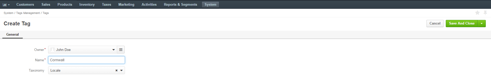
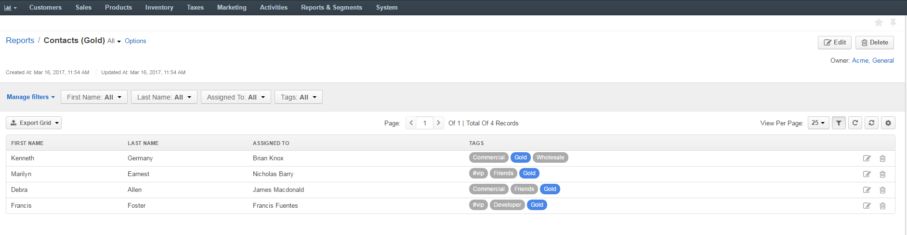

.. _admin-guide-tag-management:

Tag Management
==============

.. contents:: :local:
    :depth: 2

Overview 
--------

The following guide describes how you can configure tags and taxonomies in your Oro application. These are located under **System>Tags Management** in the main menu. 

|

.. image:: ../img/tags/tags_menu_1.png

|

Enable Tags
-----------

Prior to starting your work with tags and taxonomies, ensure that tagging is enabled for the required :ref:`entity <doc-entities>`.

To enable tags for entities:

1. Navigate to the main menu and click **System>Entities>Entity Management**.

   |

   .. image:: ../img/tags/entity_management_2.png

   |

2. Click |IcEdit| to open the edit form for the required entity.

   |

   .. image:: ../img/tags/accounts_edit_3.png

   |
   
3. In the **Other** section of the entity view page, select **Yes** in the **Enable Tags** field.
   
   |

   .. image:: ../img/tags/enable_tags_4.png

   |

4. Click :guilabel:`Save and Close` when you are done.

.. note:: Please note that if you wish to disable tags for an entity, this will irreversibly erase all its existing tags.

Taxonomies
----------

Taxonomy is a way to group things together. In your Oro application, you can group tags in taxonomies, and to every taxonomy you can assign a distinctive color to clearly identify different groups of tags that might serve different purposes.

To reach taxonomies, navigate to the main menu and click **System>Tag Management>Taxonomies**.

Create Taxonomy
^^^^^^^^^^^^^^^

Once you have reached the Taxonomies page, you can create a new taxonomy by clicking :guilabel:`Create Taxonomy` in the top right corner.

|

.. image:: ../img/tags/create_taxonomy_5.png

|

Next, define the following fields:

.. csv-table::
  :header: "Field", "Description"
  :widths: 10, 30

  "**Owner**","Limits the list of users who can manage the taxonomic unit."
  "**Name**","Specify the name for your taxonomic unit."
  "**Color**","Select the color for the taxonomic unit. Tags within this unit will have the same color assigned to them."

Click :guilabel:`Save and Close` when you are done.

|

.. image:: ../img/tags/create_taxonomy_form_6.png

|

Manage Taxonomies From the Grid
^^^^^^^^^^^^^^^^^^^^^^^^^^^^^^^

From within the taxonomies grid, you can: 

1. Get to the view of a taxonomic unit:|IcView|
2. Get to the edit form of a taxonomic unit: |IcEdit|
3. Delete a taxonomic unit from the system:|IcDelete|
4. Filter taxonomies: |IcFilter| 
5. Configure grid settings for taxonomies: |IcSettings|

|

.. image:: ../img/tags/manage_tags_grid_7.png

|

|

.. image:: ../img/tags/tags_grid_settings_8.png

|

Tags
----

To reach Tags, navigate to **System>Tags Management>Tags** in the main menu.

Create Tags
-----------

Tags can be created in a number of ways:

1. From the Tag page under **System>Tags Management>Tags**.
2. From the grid of an entity (ensure that tagging is enabled for the required entity).
3. From the view page of an entity.
   
From the Tag Page 
^^^^^^^^^^^^^^^^^

1. Click :guilabel:`Create Tag` to create a new tag.
   
   |

   .. image:: ../img/tags/create_tag_9.png

   |

2. Define the following fields:
     
  .. csv-table::
    :header: "Field", "Description"
    :widths: 10, 30

    "**Owner**", "Limits the list of users who can manage the tag."
    "**Name**", "Specify the name for your tag."
    "**Taxonomy**", "Select the taxonomy to which the tag will be assigned."

|

|
          

3. Click :guilabel:`Save and Close`.

From the Grid
^^^^^^^^^^^^^

1. Within the grid, select the required entity and click |IcIcEditInline| in the Tags column.

   |

   .. image:: ../img/tags/entity_grid_inline_tag_11.png

   |
   
2. Specify tags for the entity. You can enter multiple tags for one entity.
   
   |

   .. image:: ../img/tags/entity_grid_inline_tag_12.png

   |

3. Click |IcCheck| to save the tags for the entity.
   
   |

   .. image:: ../img/tags/entity_grid_inline_tag_13.png

   |   

   
From the Entity View Page
^^^^^^^^^^^^^^^^^^^^^^^^^ 

1. Open the view page of the required entity.
2. Click |IcIcEditInline| in Tags.
   
   |

   .. image:: ../img/tags/entity_view_page_14.png

   |

3. Specify tags for the entity. You can enter multiple tags for one entity.
   
   |

   .. image:: ../img/tags/entity_view_page_15.png

   |

4. Click |IcCheck| to save the tags for the entity.
  
   |

   .. image:: ../img/tags/entity_view_page_16.png

   |   
   
   |

   .. image:: ../img/tags/entity_view_page_17.png

   |
   

   
Manage Tags From the Grid
^^^^^^^^^^^^^^^^^^^^^^^^^

From within the tags grid, you can: 

1. Search records by a tag: |IcSearch|
2. Get to the edit form of the selected tag: |IcEdit|
3. Delete a tag from the system:|IcDelete|
4. Filter tags: |IcFilter| 
5. Configure grid settings for tags: |IcSettings|

|

.. image:: ../img/tags/tags_grid_manage_18.png

|

|

.. image:: ../img/tags/tags_grid_settings_19.png

|

View Tagged content
-------------------

Clicking on the selected tag will redirect you to a page where you can view all records that have been assigned your selected tag. This way you can search for any required tag within the system.

For instance, clicking **Gold** will redirect you to the page with a list of all records that have **Gold** as a tag. 

The number in brackets indicates the how many records within the group are assigned the selected tag.

|

.. image:: ../img/tags/tag_link_20.png

|

|

.. image:: ../img/tags/content_view_page_21.png

|

Tags in Reports
---------------

It is possible to filter your reports by tags. For instance, we can create a report that will show contacts tagged as **Gold**. To do that:

1. Within the report, drag the **Field Condition** to the field on the right.
2. Select **Contact>Tags**.
3. Enter  **is any of Gold**.
4. Click :guilabel:`Save and Close`.

|

.. image:: ../img/tags/report_create_gold_22.png

|

|

|

You can create any reports of your choice and filter them by tag in a similar manner.

.. include:: ../../img/buttons/include_images.rst
   :start-after: begin

