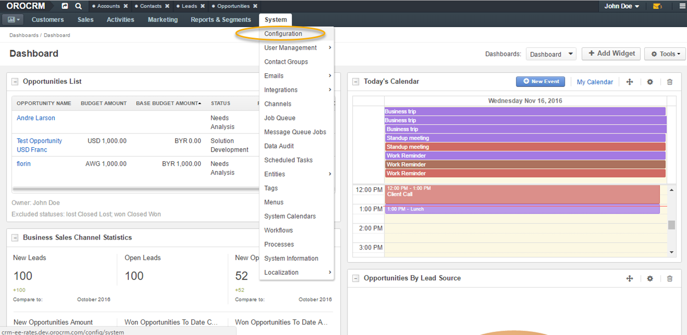

.. _admin-configuration-currency:

Currency Settings
================
.. contents:: :local:
    :depth: 2
    
.. begin

Configuration
-------------

Currency and rate configuration can be achieved at two levels, the **System level** and the **Organization level**. You can find more information on access levels `in Access Management guide <./access-management-roles>`__.

At the system level, an admin sets up system currencies and rates. The currencies that the admin sets will be the only currencies available at the organization level (for a sales manager, for instance).

Admin can add and delete currencies and change rates.

To configure currencies as an admin, navigate to **System>Configuration** in the main menu.

|

|

Next, open **System Configuration** dropdown list on your left, select **General Setup** and click :guilabel:`Currency`.

|

.. image:: ../img/multi_currency/system_config_currency_view_highlights.png

|

Currency Settings
^^^^^^^^^^^^^^^^^

The following sections will be available within the **Currency** tab:

+------------------------+------------------------------------------------------------------------------------------------------------------------------------------------------------------------------------------------------------------------------------+
| **Field**              | Description                                                                                                                                                                                                                        |
+========================+====================================================================================================================================================================================================================================+
| **Allowed currencies** | Allowed currencies dropdown menu contains a list of all available currencies. This setting controls how the currencies will be identified within the system, by a 3-letter ISO code (e.g. GBP) or by the currency symbol (e.g. £). |
|                        | Note: Not all currencies might have symbols. For such currencies, ISO codes are used instead.                                                                                                                                      |
+------------------------+------------------------------------------------------------------------------------------------------------------------------------------------------------------------------------------------------------------------------------+
| **Display format**     | Allows you to select the currency display format across the system, e.g. USD ISO code or $ currency symbol.                                                                                                                        |
+------------------------+------------------------------------------------------------------------------------------------------------------------------------------------------------------------------------------------------------------------------------+

|

.. image:: ../img/multi_currency/allowed_currencies_dropdown.png

|

|

.. image:: ../img//multi_currency/display_format.png

|

The grid contains several columns:

+---------------------+----------------------------------------------------------------------------------------------------------------------------------------------------------------------------------------------------+
| **Field**           | Description                                                                                                                                                                                        |
+=====================+====================================================================================================================================================================================================+
| **Base**            | Allows to select the base currency (i.e. the default currency used within the organization) by ticking one or the other currency. Only one base currency can be selected at a time.                |
+---------------------+----------------------------------------------------------------------------------------------------------------------------------------------------------------------------------------------------+
| **Current Name**    | Contains the full names of the added currencies.                                                                                                                                                   |
+---------------------+----------------------------------------------------------------------------------------------------------------------------------------------------------------------------------------------------+
| **Currency Code**   | Contains ISO codes of the added currencies.                                                                                                                                                        |
+---------------------+----------------------------------------------------------------------------------------------------------------------------------------------------------------------------------------------------+
| **Currency Symbol** | Contains the currency symbols. If no symbol is applicable to a currency, a currency ISO code is used instead.                                                                                      |
+---------------------+----------------------------------------------------------------------------------------------------------------------------------------------------------------------------------------------------+
| **Rate From**       | The rate of the selected currency to the base currency. It is used to calculate transaction amounts (e.g. opportunity budget) in base currency if they were entered in a different currency.       |
|                     | E.g. If a UK company wants to sign a deal with your US based company and the value of the deal is in GBP, you would need to see the value of the deal in US dollars.                               |
+---------------------+----------------------------------------------------------------------------------------------------------------------------------------------------------------------------------------------------+
| **Rate To**         | The conversion rate of the base currency to the selected currency. It is used to calculate new exchange rates when the base currency is changed.                                                   |
|                     | E.g. If you need to sign a contract with a client in GBP and the value of your contract is in US dollars, your UK client would like to see the cost in GBP.                                        |
+---------------------+----------------------------------------------------------------------------------------------------------------------------------------------------------------------------------------------------+
| **Sort**            | Change the order of the added currencies by dragging them up and down to the preferred position. Sorting currencies on the list affects their order in currency selector of multi-currency fields. |
+---------------------+----------------------------------------------------------------------------------------------------------------------------------------------------------------------------------------------------+
| **Actions**         | The cross sign allows to delete the selected currency.                                                                                                                                             |
+---------------------+----------------------------------------------------------------------------------------------------------------------------------------------------------------------------------------------------+

Only currencies enabled by the admin at the system level are available in the **Currency** section at the organization level. Therefore, a sales manager would be able to manage rates at the organization level for the currencies setup by the admin at the system level.

.. finish

You can find further information on multi-currency configuration in the :ref:`Multi-currency guide <user-guide-multi-currency>`.
