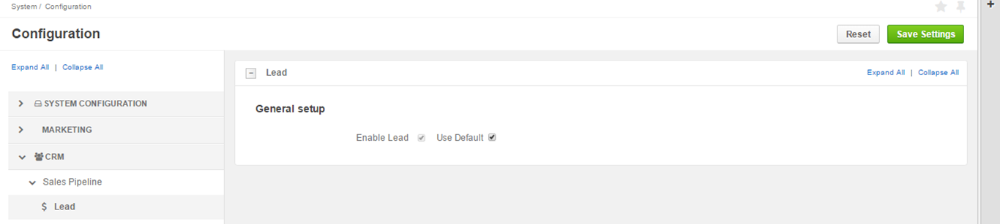

.. _admin-configuration-sales-pipeline-lead-settings:

Lead Settings
=============

In **System > Configuration > CRM>Sales Pipeline>Leads**, you can you can enable lead as a feature. When enabled, **Leads** will appear in the **Sales** section of the main menu.

.. image:: ../img/configuration/leads_menu.png

