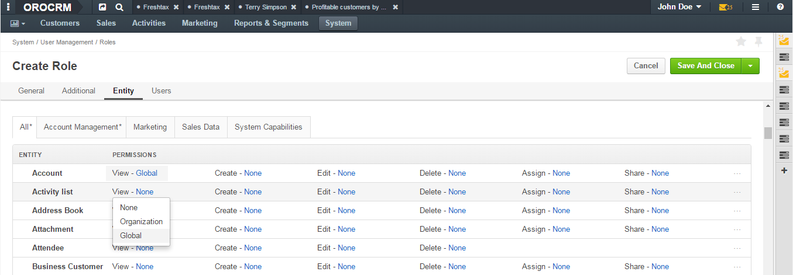
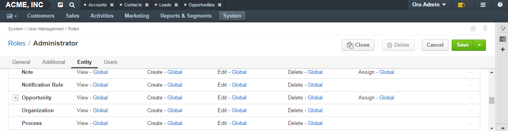

Actions with Roles
===================

.. contents:: :local:
    :depth: 3

Actions
--------

Create a Role
^^^^^^^^^^^^^^

1. In the main menu, navigate **System>User Management>Roles**.
    
2. Click the :guilabel:`Create Role` button in the upper-right corner of the page. The **Create Role** page opens.

3. Click **General**, and in the **Role** field, type the role name. Note that the name must be unique for the system.

.. image:: ../img/access_roles_management/role_create1.png

4. Click **Additional** and specify the following:

   - **Description**—Type the description of this role. Use the in-built text editor to format the provided description.
   
   - **Organization**—Select the organization for user's of which this role will be applicable. If you want this role to be applicable for all organizations defined in the system, do not specify any organization. In this case the field value becomes **System-wide.** (If there is only a single organization defined in the system or you do not have global access rights, there will be no option for selecting an organization.)
	
|

.. image:: ../img/access_roles_management/role_create2.png

|

5. Click **Entities**. In this section define which 'action on entity' permissions and which capabilities you want to include in the role. For more information about the 'action on entity' permissions and capabilities, see the `Roles Management <./access-management-roles>`__ guide.
 
   1. For each action on each entity specify the required access level. By default, for all entities access levels are set to **None**. Choose an entity which you want to assign different permissions for. In the entity row, click the action name and in the drop-down list, click the required access level. For more information about the access levels, see the `Access Levels <./access-management-access-levels>`__ guide.
   
   |
   
   .. image:: ../img/access_roles_management/role_create_entities_acl2.png

   |

   If you want to set the same access level for all actions on entity, you can complete it in one move: from the ellipsis menu at the right-hand end of the entity row, select the required access level.

   |

   .. image:: ../img/access_roles_management/roles_create_entities_acl1.png

   |

   If you want to set individual permissions for the entity fields, please see the `Include Permissions for an Entity Field in a Role  <./access-management-roles-actions#include-permissions-for-an-entity-field-in-a-role>`__ section for how to do this. 
   
   2. Under the list of entities, select the check boxes in front of the required capabilities.  
   
   |

   .. image:: ../img/access_roles_management/role_create_entities_acl2.png

   |
   
6. Click **Users**, and in the grid, select check boxes in front if the users to whom you want to assign this role.

|
   

|

7. lick the :guilabel:`Save` button in the upper-right corner. 

Clone a Role
^^^^^^^^^^^^^

You can create a role by cloning the existing one. For this, do as follows:

1. In the main menu, navigate **System>User Management>Roles**.

2. In the grid on the **All Roles** page, choose the required role, click the ellipsis menu at the right-hand end of the corresponding row and then click the |IcClone| **Clone** icon.  

|

.. image:: ../img/access_roles_management/role_clone0.png

|

3. The **Create Role** page opens. It has all of the settings as the original role and 'Copy of \<original_role_name\>'  as its name. If required, modify settings as described in steps 3–6 of the `Create a Role <./access-management-roles-actions#create-a-role>`__ section.   

|

.. image:: ../img/access_roles_management/role_clone1.png

|

4. Click the :guilabel:`Save` button in the upper-right corner.

Alternatively, you can clone a role from the role view page by clicking the :guilabel:`Clone` button in the upper-right corner of the page.

|

.. image:: ../img/access_roles_management/role_clone2.png

|

Review a Role
^^^^^^^^^^^^^^

1. Open the role view page:

    a. In the main menu, navigate **System>User Management>Roles**.
    
    b. In the grid on the **All Roles** page, click the required role. 
    
2. Review the role settings.

Edit a Role
^^^^^^^^^^^^

1. Open the role view page:

    a. In the main menu, navigate **System>User Management>Roles**.
    
    b. In the grid on the **All Roles** page, click the required role. 

2. On the role view page, click the :guilabel:`Edit` button in the upper-right corner.

3. Make the required changes according to the description provided steps 3–6 of the `Create a Role <./access-management-roles-actions#create-a-role>`__ section.   

4. Click the :guilabel:`Save` button in the upper-right corner.

Delete a Role
^^^^^^^^^^^^^^

1. In the main menu, navigate **System>User Management>Roles**.

2. In the grid on the **All Roles** page, choose the required role, click the ellipsis menu at the right-hand end of the corresponding row and then click the |IcDelete| **Delete** icon.  

|

.. image:: ../img/access_roles_management/role_delete0.png

|

3. In the **Deletion Confirmation** dialog box, click :guilabel:`Yes, Delete`.

Alternatively, you can delete a role from the role view page by clicking the :guilabel:`Delete` button in the upper-right corner of the page.

|

.. image:: ../img/access_roles_management/role_delete2.png

|

.. caution::
	If there is at least one user that has this role, the role cannot be deleted.

Include Permissions for an Entity Field in a Role
^^^^^^^^^^^^^^^^^^^^^^^^^^^^^^^^^^^^^^^^^^^^^^^^^^

.. note::
  For more information about the field level ACLs, see the `Roles on the Interface <./access-management-field-level-acl>`__ guide.

1. Open the role view page:

    a. In the main menu, navigate **System>User Management>Roles**.
    
    b. In the grid on the **All Roles** page, click the required role. 

2. On the role view page, click the :guilabel:`Edit` button in the upper-right corner.

3. Click **Entities**.

4. Find the required entity in the list. If assigning permissions for an entity field was enabled for the entity, you will see the plus sign near its name. 

|
   

|  

5. Click the plus sign. Besides the row with an entity name, you will see the list of fields included to this entity.  
   
6. Assign required permissions for actions on the entity fields.  

|

.. image:: ../img/access_roles_management/roles_permissions_fieldlevel2.png

|

7. Click the :guilabel:`Save` button in the upper-right corner.

Roles in the User Settings
^^^^^^^^^^^^^^^^^^^^^^^^^^^
For how to assign a role to a user, review and modify the range of roles assigned to the user, see the `User Access Settings <./access-management-user-asccess-settings>`__ guide.

Links
------

For general overview of roles, see the `Roles Management <./access-management-roles>`__ guide.

For how role is represented on the interface, see the `Roles on the Interface <./access-management-roles-inteface>`__ guide.

For examples on roles application, see the `Access Configuration Examples <./access-management-examples>`__ guide.

.. |IcRemove| image:: ../../img/buttons/IcRemove.png
	:align: middle

.. |IcClone| image:: ../../img/buttons/IcClone.png
	:align: middle

.. |IcDelete| image:: ../../img/buttons/IcDelete.png
	:align: middle
