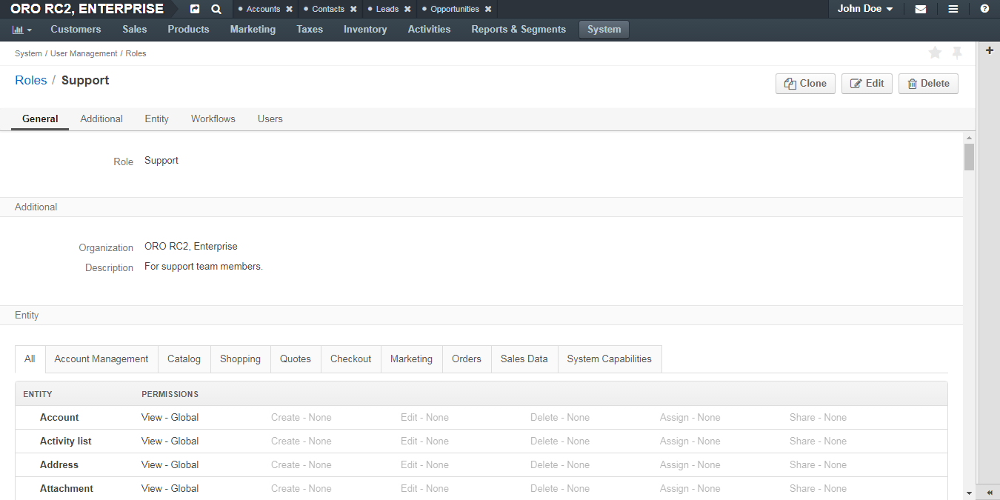
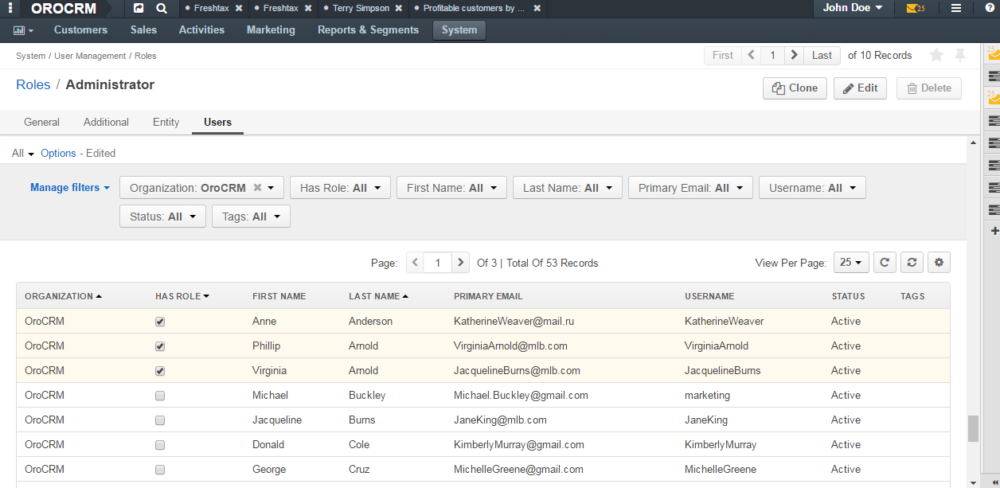

.. _user-guide-user-management-permissions-roles--interface:

Role on the Interface
=====================

.. contents:: :local:
    :depth: 3

    

The information about a role is divided into several sections.

General Section
^^^^^^^^^^^^^^^

+-------+----------------------------------------------------------------+
| Field | Description                                                    |
+=======+================================================================+
| Role  | The name of the role. This value must be unique in the system. |
+-------+----------------------------------------------------------------+

Additional Section
^^^^^^^^^^^^^^^^^^

+--------------+------------------------------------------------------------------------------------------------------+
| Field        | Description                                                                                          |
+==============+======================================================================================================+
| Description  | Short but meaningful description of the role.                                                        |
+--------------+------------------------------------------------------------------------------------------------------+
| Organization | Which organization this role is applicable within.                                                   |
|              | Value **System-Wide** means that this role is applicable to all organizations defined in the system. |
+--------------+------------------------------------------------------------------------------------------------------+

Entity Section
^^^^^^^^^^^^^^

This section contains information about the granted 'action on entity' permissions and permissions to access system functionalities.

For convenience, permissions are grouped in tabs by functions they control:

- **All**—All the permissions available on the other four tabs.

- **Account Management**—Access to the account management. 

- **Marketing**—Access to the data useful for marketing team.

- **Sales data**—Access to the data useful for sales team. 

- **System Capabilities**—Access to the system functionalities.
  

Each tab, except **System Capabilities**, is divided into two sections: 

- With the list of 'action on entity' permissions.

- With the list of capabilities.

The **System Capabilities** tab lists only capabilities that control access to the system functionalities. 

.. image:: ../img/access_roles_management/roles_overview2.png 

It is divided itself in the following sections:

- **Address**—A permission that defines whether a user can see drop-down country, address lists when they fill in address forms. 

- **Application**—Access to system parts of OroCRM application (job queue, system configuration, etc.) or additional extension of 'action on entity' permissions(whether a user can share grid views, change passwords of other users, etc.).
 
- **Calendar**—Access to management of system calendars, etc. 

- **Entity**—Permissions that define whether a user can import or export entity records, find them via the search functionality, etc.

For more information about the system capabilities, see the `Capabilities List <./admin-capabilities>`.

Workflows Section
^^^^^^^^^^^^^^^^^

This section contains information about the granted permissions to view workflows and progress records through them.

Click the **+** **Expand** icon in front of the workflow name to see permissions to perform individual transactions within the wokflow.

.. image:: ../img/access_roles_management/roles_workflowsection.png

Users Section
^^^^^^^^^^^^^

The list of users that have this role. 

Links
-----

For general overview of roles, see the :ref:`Roles Management <user-guide-user-management-permissions-roles>` guide.

For what actions you can perform with roles, see the :ref:`Actions with Roles <user-guide-user-management-permissions-roles--actions>` guide.

For examples on roles application, see the :ref:`Access Configuration Examples <user-guide-user-management-permissions-roles--examples>` guide.

.. |IcRemove| image:: ../../img/buttons/IcRemove.png
	:align: middle

.. |IcClone| image:: ../../img/buttons/IcClone.png
	:align: middle

.. |IcDelete| image:: ../../img/buttons/IcDelete.png
	:align: middle