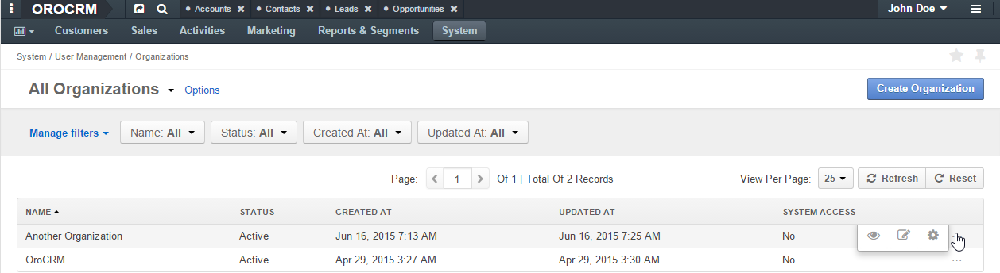

.. _user-management-organizations:

Organization Records Management
===============================

An ``organization`` represents a real enterprise, business, firm, company or another organization, to which the
:term:`users <User>` belong. 

.. _user-management-organization-create:

.. note:: See a short demo on `how to create organizations and business units <https://oroinc.com/orocrm/media-library/create-organizations-and-business-units>`_, or keep reading the step-by-step guidance below.

   .. raw:: html

      <iframe width="560" height="315" src="https://www.youtube.com/embed/_PpE536CQ9c" frameborder="0" allowfullscreen></iframe>

Create an Organization Record
-----------------------------

.. important::

    Creation of new organizations is only available in the Enterprise Edition. 

In order to create an organization record, complete as follows:

1. Go to **System>User Management>Organizations**.
2. Click the :guilabel:`Create Organization` button.
3. Define the general details and the list of users for the organization created, and specify if it is a 
   :ref:`system organization <user-ee-multi-org-system>`:

The following fields **must** be defined 

.. csv-table::
  :header: "**Name**","**Description**"
  :widths: 10, 30

  "**Status**","Current status of the organization.

  *Inactive* or *Active.*
  "
  "**Name**","The name used to refer to the organization on the interface. This is the only mandatory field."
 
You can also add a text description of the organization.
 
|
  
.. image:: ../img/user_management/organization_general.png

|
 
Users
^^^^^

  Select / clear the **HAS ORGANIZATION** check box, to assign / unassign a user to the organization.

.. note::

    Please note that the **HAS ORGANIZATION** check box defines if the user is assigned the organization role that you are
    editing / creating.

Additional
^^^^^^^^^^

In the **Additional** section, you can define if the organization is a
:ref:`system organization <user-ee-multi-org-system>`.

View and Manage an Organization Record
--------------------------------------

In the enterprise edition, all the organizations available are displayed in the **Organizations** grid (**System>User Management>Organizations**).

|

|

From the grid you can:

- Get to the :ref:`Edit page <user-guide-ui-components-create-pages>` of the organization:  click the |IcEdit| **Edit** icon.

- Get to the :ref:`View page <user-guide-ui-components-view-pages>` of the organization: click the |IcView| **View** icon.

- Get to the configuration settings of the organization: click the |IcConfig| :guilabel:`Configuration` button.

- To configure menus for the organization: click the :guilabel:`Edit Menu` button.

In the community edition, you can only edit the organization name and its description. To get to 
the edit page, in the main menu, navigate **System>User Management>Organizations**.

.. |IcConfig| image:: ../../img/buttons/IcConfig.png
   :align: middle

.. |IcEdit| image:: ../../img/buttons/IcEdit.png
   :align: middle

.. |IcView| image:: ../../img/buttons/IcView.png
   :align: middle
 