.. _user-management-users:

User Management—Users
======================

.. contents:: :local:
    :depth: 3

Overview
--------

A user is the lowest element of the administrative structure in your company.  Usually they are individuals employed by your company (or granted access under other conditions) who do all the work. However, it could also be a group of people or a third party system with a specific set of credentials (login and password) that can be used to access OroCRM. To facilitate the management of business process in your company and ensure that users can perform their job effectively and in the same time the sensitive data of your company is well protected, it is essential to correctly configure user records and set up access settings. 

Any amount of users can be created within one OroCRM system.

Create a User
^^^^^^^^^^^^^

1. In the main menu, navigate **System>User Management>Users**.

2. On the **All Users** page, click the **Create User** button in the upper-right corner of the page.

3. On the **Create User** page, click **General** and fill in the following fields:
 
    - **Owner**—Select a business unit from the list. Note that the business units and organization the user has access to are determined by the settings made in the **Access Settings** section.  

    - **Status**—Select a user status from the list. This field is mandatory. 

        - **Active**—The user can log in into the system and to do their work within it, be an owner of entity records upon creation. 

        - **Inactive**—The user cannot log into the system, be an owner of entity records upon creation. 
    
    - **Username**—Type a name that the user will use to log into the system. This field is mandatory. 

    - **Password**—Type a password that the user will use to log into the system. This field is mandatory. 

    - **Re-Enter Password**—Type the password one more time to confirm it. This field is mandatory. 

    - **Name Prefix**—Type a name prefix of the user. A name prefix is used in front of the user's name and provides additional information about the user. 

    - **First Name**—Type the first name of the user. You can use any number of characters of any alphabet in the name. This field is mandatory. A user's first name is displayed on the interface when the user logs in. 

    - **Middle Name**—Type the middle name of the user. 

    - **Last Name**—Type the last name of the user. You can use any number of characters of any alphabet in the name. Together with the user's first name, a user's last name is displayed on the interface when user logs in. 

    - **Name Suffix**— Type a name suffix of the user. A name suffix is used after the user's name and provides additional information about the user. 

    - **Birthday**—Click this field and select the user's date of birth using a pop-up calendar. Alternatively, you can type the date in the format defined by your current locale (for more information about locales, see the `Localization <./user-management-users#localization>`__ section).

    -  **Avatar**—Click :guilabel:`Choose File` to locate a user's photo or another picture associated with the user on your computer or other device. 
    
    - **Send An Email Invitation**—Select this check box to send an email invitation to the user upon record creation. The invitation is sent to the email address specified in the **Primary Email** field.
    
    - **Primary Email**—Type the user's main email address that will be used for communications. This field is mandatory. 
    
    - **Emails**—Click the :guilabel:`Add Another Email` button and type an additional email address in the field that appears. You can add as many email addresses as required. To delete an email address, click the x icon next to the email field you want to delete.
      
    - **Phone**—Type the user's phone number.
      
|

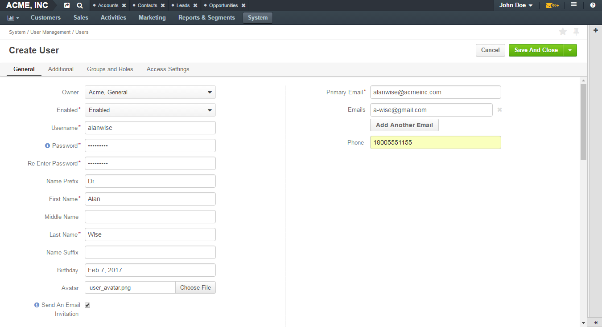

|   
    
4. Click **Additional** and provide more information about the user. In case any visible custom fields are added to the **User** entity, they appear in this section. 
 
5. Click **Access Settings**. This section must be filled in before the **Groups and Roles** section as the content available in the latter section depends on what is selected in **Access Settings**. 
 
6. (Only for Enterprise Edition) In the **Organizations** subsection, select the check boxes in front of the organization(s) you want the user to have access to.  
   
   .. caution::
   	    Note that the user will not be able to log in to the system if no organization is selected for them. 

7. Click the **Organization Business Units** field and type the business unit name or select it from the list. On the list, you can see business units of the organizations selected in the **Organizations** subsection. Business users selected here determine which business units the data owned by the user will belong to. Therefore, for successful configuration it is essential to correctly specify business units in this section. For more information on how to select business units dependently on the company structure, see the `Access to Organizations and Business Units Examples <./user-management-users#access-to-organizations-and-business-units-examples>`__ section.
   
   .. note::
        - You can select one or more business units. Then the data owned by the user will be considered as belonging to all these business units and users that have access to these business units and corresponding permissions will be able to access it. 
         
        - In case the user's role includes division level permissions, the user will be able to access data of each business unit specified in these sections, as well as the data of the whole chain of business units subordinated to those selected in this section. 

|

.. image:: ../img/user_management/user_create_accesssettings.png 

|   
 

8. Click **Groups and Roles**. In the **Groups** subsection, select check boxes in front of the groups you want the user to be part of. All groups available in the system are listed here. A group is a set of users for convenience consolidated by one or more parameters. Instead of specifying each user one by one, you can specify a user group in filters and notification rules. For more information about groups, see the `User Groups <./user-management-groups>`__ guide.

9. In the **Roles** subsection, select check boxes in front of the roles you want the user to have. Roles are predefined sets of permissions. When you assign a role to a user, you can be sure that the user will have access only to the information within the system that is necessary for them to do their work. For more information about roles, see the `Access and Roles Management <./user-management-groups>`__ guide.

   .. important::
   		At least one role must be selected. 

   .. caution::
   		If the role is not 'System-Wide' and a particular organization is specified for it, check that the same organization is selected for a user in the **Access Settings** sections. Otherwise, the role does not appear in the **Roles** section. 

|

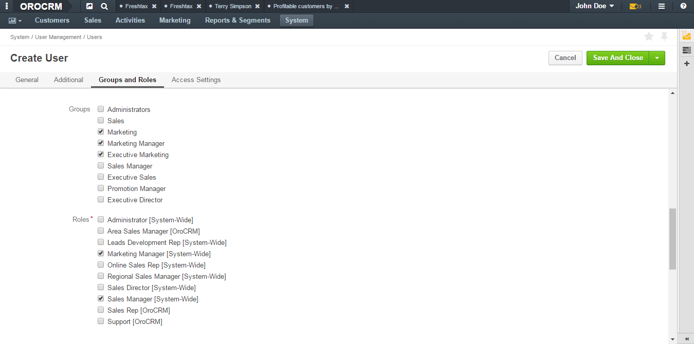

|   
 

10. Click :guilabel:`Save` in the upper-right corner of the page. Or, in case you need to create one more user, click the arrow next to the :guilabel:`Save` button and click :guilabel:`Save and New` in the menu. Then the current user will be saved and the blank **Create User** page will open.
   

Access to Organizations and Business Units Examples
"""""""""""""""""""""""""""""""""""""""""""""""""""

Example 1. 
~~~~~~~~~~

Give Todd access to two business units of the same organization.

|

.. image:: ../img/user_management/user_bu_2_org_1_sch.png 

|

Select each of the business units in **Access Settings**. Configuration on the interface:

|

.. image:: ../img/user_management/user_bu_2_org_1.png 

|

Example 2. 
~~~~~~~~~~

Give Todd access to two business units in different organizations. 

|

.. image:: ../img/user_management/user_bu_2_org_2_sch.png 

|

Just select each of the organizations and business units to which Todd must have access in **Access Settings**. Configuration on the interface:

|

.. image:: ../img/user_management/user_bu_2_org_2.png 

|

Example 3. 
~~~~~~~~~~

Give Todd access to the business unit with all chain of its subunits. 

|

.. image:: ../img/user_management/user_bu_2dl_org_1_sch.png 

|

There are two ways to give such access. 

One, if Todd's role includes *business unit level permissions*, is to give access to all the required business units individually. Configuration on the interface:

|

.. image:: ../img/user_management/user_bu_2dl_org_1.png 

|

Another approach can be used if Todd's role includes *division level* permissions. A division is exactly a business unit with the whole chain of its subunits. Therefore, in this case, you can select only the top business unit of the division (**ACME East** in out example) in **Access Settings** and Todd will automatically have access to all subunits of the selected business unit and their subunits, and so on. 

This can be useful if there is a chance that a new business unit may appear in the chain and Todd will require access to it too. There will be no need to reconfigure access settings for Todd. 

|

.. image:: ../img/user_management/user_bu_2dl_org_1_sch2.png

|

Example 4. 
~~~~~~~~~~

Give Todd access to the jointed and disjointed business units at different levels of the company structure. 

|

.. image:: ../img/user_management/user_bu_3dl_org_1_sch.png 

|

Just select an organization(s) and all the business units to which Todd must have access in **Access Settings**. Configuration on the interface:

|

.. image:: ../img/user_management/user_bu_3dl_org_1.png 

|

Create Users via LDAP
^^^^^^^^^^^^^^^^^^^^^

.. important:: 
	 This feature is available only for OroCRM Enterprise Edition.

If your company is utilizing LDAP (Lightweight Directory Access Protocol) server to guarantee that users can access corporate applications using the same credentials, you can significantly save time and effort on creating user records. OroCRM EE supports LDAP and thus allows you to import existing user information including role identifiers from the LDAP server into OroCRM.  

To enable import of LDAP records, you first need to set up integration with LDAP. After the integration has been established, user profiles will be imported to OroCRM and users will be able to use their usual credentials to log into OroCRM.

Using LDAP integration does not prevent you from creating user records in OroCRM manually. Manually created user records will not be imported back to your LDAP server.

System administrators will be able to tell if a user has been added via the LDAP integration: for such users the **LDAP Distinguished Names** field of their view pages will not be empty and will contain the corresponding value.

|

.. image:: ../img/user_management/user_ldap_distinguished_name.png 

|

For how to configure the LDAP integration, please see the `LDAP integration <../integrations/ldap-integration>`__ guide.

Review a User
^^^^^^^^^^^^^
1. In the main menu, navigate **System>User Management>Users**.

2. In the grid on the **All Users** page, click the required user.

3. Review the user settings. Please, see details in the `User Structure on the Interface <./user-management-users#user-structure-on-the-interface>`__ section. 

User Structure on the Interface
^^^^^^^^^^^^^^^^^^^^^^^^^^^^^^^

Top of the page
"""""""""""""""

On the upper-left of the page, you can see the user's avatar, their full name and status: whether the user is active (i.e. the user can log in, be a record's owner, etc.) or inactive. 

In the next row you can check when the user's record was created, updated. Also, there is information about the date and time when the user last logged in and how many times they logged into the OroCRM in general. 

On the upper-right of the page, you can check which business unit owns the user record. Click the owner name to open the corresponding business unit view page. If you are logged into the organization with global access, then in brackets you will see the name of organization that owns the user. 

|

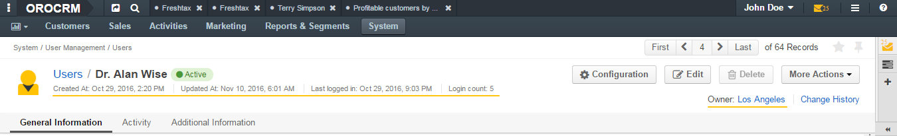

|

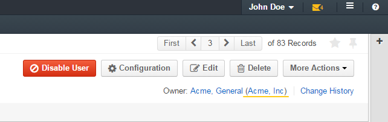

Other information about the user is divided into four sections. 

General Information Section
"""""""""""""""""""""""""""

This section contains information about the user filled in when creating the user. 

|

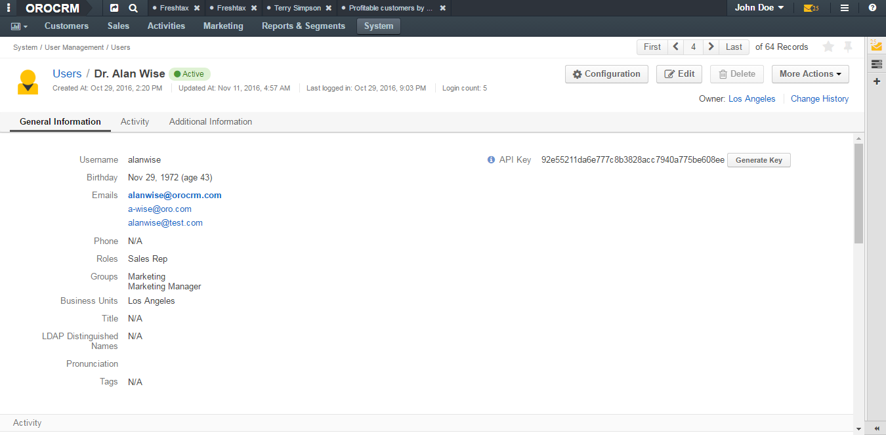

|

+-------------------------+--------------------------------------------------------------------------------------------------------------------------------------------------------------------------------------------------------------------------+
| Field                   | Description                                                                                                                                                                                                              |
+=========================+==========================================================================================================================================================================================================================+
| Username                | a name that the user will use to log into the system.                                                                                                                                                                    |
+-------------------------+--------------------------------------------------------------------------------------------------------------------------------------------------------------------------------------------------------------------------+
| Birthday                | A date of user's birth and their calculated age.                                                                                                                                                                         |
+-------------------------+--------------------------------------------------------------------------------------------------------------------------------------------------------------------------------------------------------------------------+
| Emails                  | A list of user's email addresses. The first one (formatted in bold) is the user's primary email address. Point to the email address and click the **Email** icon next to it to immediately compose an email to the user. |
|                         |                                                                                                                                                                                                                          |
|                         | image:: ../img/user_management/user_email_write.png                                                                                                                                                                      |
+-------------------------+--------------------------------------------------------------------------------------------------------------------------------------------------------------------------------------------------------------------------+
| Phone                   | A user's phone number. Point to the phone and click the **Phone** or **Hangouts** icon next to it to immediately start a call with the user.                                                                             |
|                         |                                                                                                                                                                                                                          |
|                         | image:: ../img/user_management/user_hangouts_call.png                                                                                                                                                                    |
+-------------------------+--------------------------------------------------------------------------------------------------------------------------------------------------------------------------------------------------------------------------+
| Roles                   | A list of roles assigned to the user.                                                                                                                                                                                    |
+-------------------------+--------------------------------------------------------------------------------------------------------------------------------------------------------------------------------------------------------------------------+
| Groups                  | A list of groups to which the user belongs.                                                                                                                                                                              |
+-------------------------+--------------------------------------------------------------------------------------------------------------------------------------------------------------------------------------------------------------------------+
| Business Units          | A list of business units the user has access to.                                                                                                                                                                         |
+-------------------------+--------------------------------------------------------------------------------------------------------------------------------------------------------------------------------------------------------------------------+
| Tags                    | A list of tags added to the user. Point to the the tags name (or **N/A** if no tags are defined) and click the **Edit** icon next to them to add a new tag.                                                              |
|                         |                                                                                                                                                                                                                          |
|                         | image:: ../img/user_management/user_tag_add.png                                                                                                                                                                          |
+-------------------------+--------------------------------------------------------------------------------------------------------------------------------------------------------------------------------------------------------------------------+
| LDAP Distinguished Name | A value of the **dn** LDAP field. This field is not empty for user only of their record has been imported from the LDAP server.                                                                                          |
+-------------------------+--------------------------------------------------------------------------------------------------------------------------------------------------------------------------------------------------------------------------+
| API key                 | An API key generated for the user. Click the :guilabel:`Generate Key` button to generate a new key.                                                                                                                      |
+-------------------------+--------------------------------------------------------------------------------------------------------------------------------------------------------------------------------------------------------------------------+

This section can also contain custom fields defined for the **User** entity (E.g. **Title** on the screenshot above). 

Activity section
""""""""""""""""
This section contains information about the user's activities: emails sent and received, calls, etc. By default, the **User** entity has only the **Email** and **Call** activities enabled. 

.. can select tasks in the filter but i don't see any tasks in this section even if tasks are enabled for an entity.
.. can't see events in this section. 

|

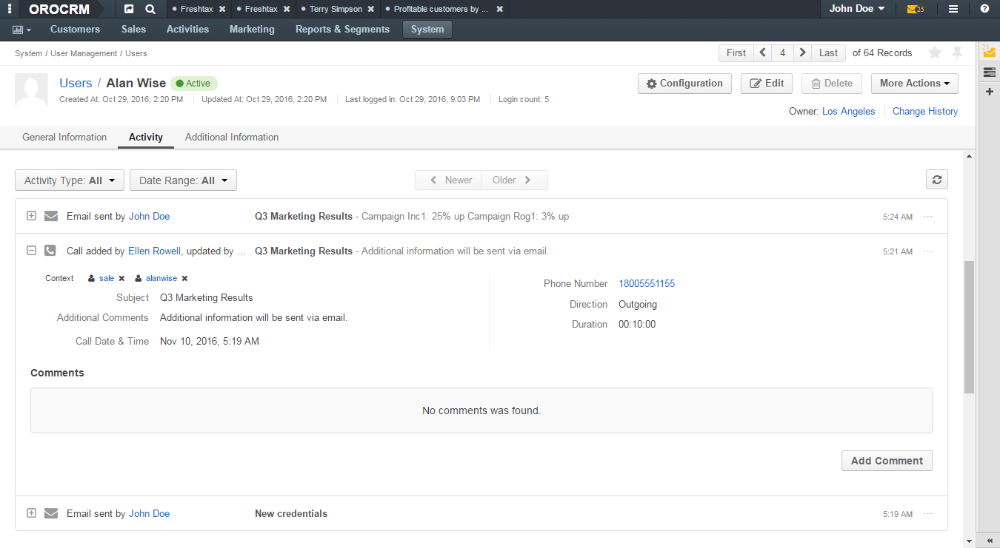

|

You can filter activities by type and by date range when they took or will take place and browse them from the newest to the oldest and vice verse.

You can see who started the activity, its type, name and description, when it was created and number of comments added under it. 

Click the activity to see detailed information about it. 

You can add a comment under a particular activity. To do this, click the activity to expand it and click the :guilabel:`Add Comment` button. In the **Add Comment** dialog box, type your message. Use the built-in text editor to format your comment. You can also attach a file to your comment. For this, click the **Upload** link in the dialog box and locate the required file. When the comment is ready, click :guilabel:`Add`. 

|

.. image:: ../img/user_management/user_review_activity_comment.png

|

To edit or delete a comment, click the ellipsis menu next to it and click the |IcEdit| **Edit** or |IcDelete| **Delete** icon correspondingly.

|

.. image:: ../img/user_management/user_review_activity_comment2.png

|

You can add and delete an activity context. To delete a context for an activity, click the **x** icon next to the required context. 

To add a context to the activity, click the  **Context** icon in the ellipsis menu at the right end of the activity row. In the **Add Context Entity** dialog box, choose the desired context and click it to select.  

|

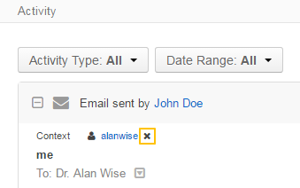

|

|

.. image:: ../img/user_management/user_review_activity_context_add.png

|

You can open an activity view page. To do this, click the |IcView| **View** icon in the ellipsis menu at the right end of the activity row. 

|

.. image:: ../img/user_management/user_review_activity_context_add.png

|

For an email activity, you can reply / reply all / forward the corresponding email. To do this, click the corresponding icon in the ellipsis menu at the right end of the activity row.

|

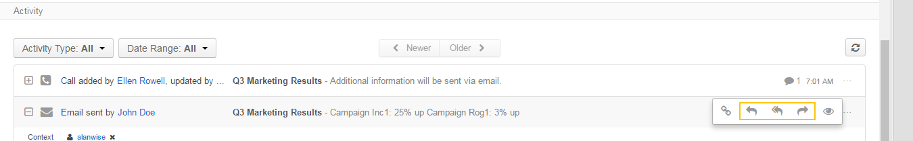

|

Alternatively, you can select the required action from the list in the activity expanded area.

|

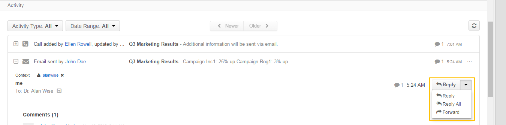

|

You can delete a phone activity. To do this, click the |IcDelete| **Delete** icon in the ellipsis menu at the right end of the activity row.

|

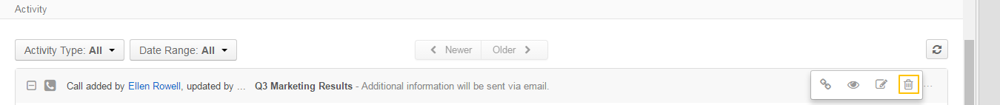

|

For a phone activity, you can call the user via Google Hangouts, if such functionality is enabled. To do this, point to the user's phone number and click the **Hangouts** icon next to it. For how to enable Google Hangouts functionality, see the `Voice and Video Calls via Hangouts <../integrations/hangouts>`__ guide.

|

.. image:: ../img/user_management/user_review_activity_phone_hangouts.png

|

For more information about activities, see the :ref:`OroCRM Activities Overview <user-guide-activities>` guide.

Additional Information Section
""""""""""""""""""""""""""""""
This section contains information about the user's tasks and opened cases.

|

.. image:: ../img/user_management/user_review_additional.png

|

Tasks Subsection
~~~~~~~~~~~~~~~~
This grid contains information about tasks assigned to the user. 

Tasks are activities that need to be accomplished by a user. Keeping track on tasks helps organize the work process and ensure that all the important work is done. 

You can filter tasks by a variety of parameters. To open the task view page, click this task in the grid.

Cases Subsection
~~~~~~~~~~~~~~~~
This grid contains information about cases assigned to the user. 

Cases are issues, problems or failures reported by customers or found internally. It's important to record, monitor and solve cases in time to ensure that small and big issues do not harm your the company business. 

You can filter cases by a variety of parameters. To open the case view page, click this case in the grid.

For more information about cases management, see the :ref:`Create Case <user-guide-activities-cases>` guide.

Edit a User
^^^^^^^^^^^

1. In the main menu, navigate **System>User Management>Users**.

2. In the grid on the **All Users** page, choose the user you want to delete, click the ellipsis menu at the right-hand end of the corresponding role and then click the |IcEdit| **Edit** icon.
   
3. Make the required changes according to the description provided steps 3–9 of the `Create a User`_ section.

4. Click the :guilabel:`Save` button in the upper-right corner of the page.

Generate an API Key for a User
^^^^^^^^^^^^^^^^^^^^^^^^^^^^^^

When the integration with a third-party software or other work requirements demand a user to have the API access to OroCRM, generate an API key for the user. This key will be used to grant a user access to API while protecting their password from being disclosed to the third party. 

1. In the main menu, navigate **System>User Management>Users**.

2. In the grid on the **All Users** page, click the required user.

3. On the user view page, click **General Information**.

4. Find the **API Key** field and click the :guilabel:`Generate Key` button next to it. A new API key appears. It will look similar to `bba1b83312a50836d78cbef4d2705125a6ce1d4d`. 

After the API key is generated, the user will be able to execute API requests via the sandbox, Curl command, any other REST client or use the API via the custom application.
   
.. important::
	Please note that an API key must be generated within the organization the data of which it will be used to access. Therefore, there can be a situation when a user record has been created under organization A and the user has access to and require an API key for organization B. In this case, you cannot generate an operational API key for the user. However, the user who has the corresponding permissions can log into the desired organization and generate an API key for themselves on the **My User** page.   

    Within one organization there can be only one API key at a time. 

Send Email to a User
^^^^^^^^^^^^^^^^^^^^
1. In the main menu, navigate **System>User Management>Users**.

2. In the grid on the **All Users** page, click the required user.

3. On the user view page, click :guilabel:`More Actions` in the upper-right corner of the page and click **Send Email** on the list. 

|

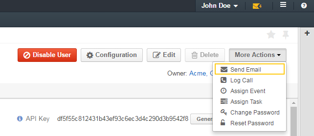

|

4. In the **Send Email** dialog box, specify the required data. For help on this, see the beginning of the :ref:`Send Email <doc-my-user-actions-email>` guide.
   
|

.. image:: ../img/user_management/user_sendmail.png 

|

5. Click :guilabel:`Send`. The email will appear in the **Activity** section of the user view page. 

Log a User's Call
^^^^^^^^^^^^^^^^^

1. In the main menu, navigate **System>User Management>Users**.

2. In the grid on the **All Users** page, click the required user.

3. On the user view page, click :guilabel:`More Actions` in the upper-right corner of the page and click **Log Call** on the list. 

|

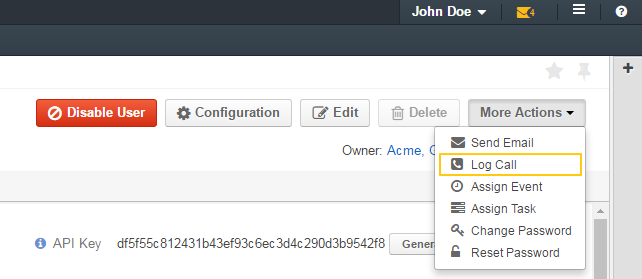

|

4. In the **Log Call** dialog box, specify the required data. For help on this, see the Log a Call Related to Another Entity Record section of the :ref:`Log Call <doc-activities-calls-actions-log>` guide.
   
|

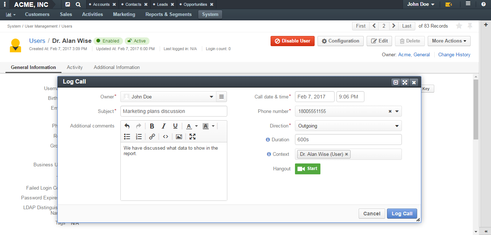

|

5. Click :guilabel:`Log Call`. The call will appear in the **Activity** section of the user view page. 

Assign an Event to a User
^^^^^^^^^^^^^^^^^^^^^^^^^

1. In the main menu, navigate **System>User Management>Users**.

2. In the grid on the **All Users** page, click the required user.

3. On the user view page, click :guilabel:`More Actions` in the upper-right corner of the page and click **Assign Event** on the list. 

|

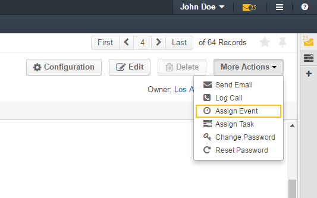

|

4. In the **Assign Event To** dialog box, specify the required data. For help on this, see the Add an Event for a Related Record section of the :ref:`Add and Assign Calendar Events <doc-activities-events-actions-add-detailed>` guide.
   
|

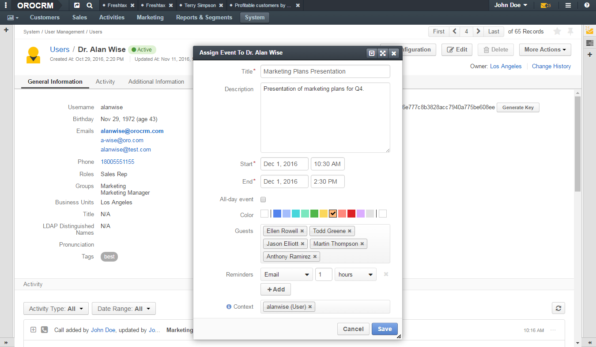

|

5. Click :guilabel:`Save`. The event will appear in the **Activities** section of the user view page.  

Assign a Task to a User
^^^^^^^^^^^^^^^^^^^^^^^

1. In the main menu, navigate **System>User Management>Users**.

2. In the grid on the **All Users** page, click the required user.

3. On the user view page, click :guilabel:`More Actions` in the upper-right corner of the page and click **Assign Task** on the list. 

|

|

4. In the **Assign Task To** dialog box, specify the required data. For help on this, see the :ref:`Add Task and Assign Task <doc-activities-tasks-actions-add>` guide.
   
|

.. image:: ../img/user_management/user_assigntask.png 

|

5. Click :guilabel:`Create Task`. The task will appear in the **Additional Information** section, **User Tasks** subsection of the user view page.  

Configure User's Interface, Email Settings and Integrations
^^^^^^^^^^^^^^^^^^^^^^^^^^^^^^^^^^^^^^^^^^^^^^^^^^^^^^^^^^^

.. important::
	Note that configuration you set up will be applicable only for the current organization. Therefore,  there can be a situation when a user record has been created under the current organization but the user only has access to a different organization. In this case, the user with the corresponding permissions can log into the organization they have access to and modify system configuration for themselves on the **My Configuration** page. 

1. In the main menu, navigate **System>User Management>Users**.

2. In the grid on the **All Users** page, click the required user.

3. On the user view page, click :guilabel:`Configuration` in the upper-right corner of the page. 

4. On the **Configuration** page, in the left side-menu, click **System Configuration**. If requried, make changes to the user system configuration. For information about the fields, see the `User System Configuration`_ section.
 
5. Click :guilabel:`Save Settings` in the upper-right corner of the page. 
 

User System Configuration
"""""""""""""""""""""""""
For each option, you can set up an organization value by selecting the **Use Organization** check box next to it. 

To revert changes to the default settings, click the :guilabel:`Reset` button in the upper-right corner of the page. 

General setup
~~~~~~~~~~~~~

Localization
............

|

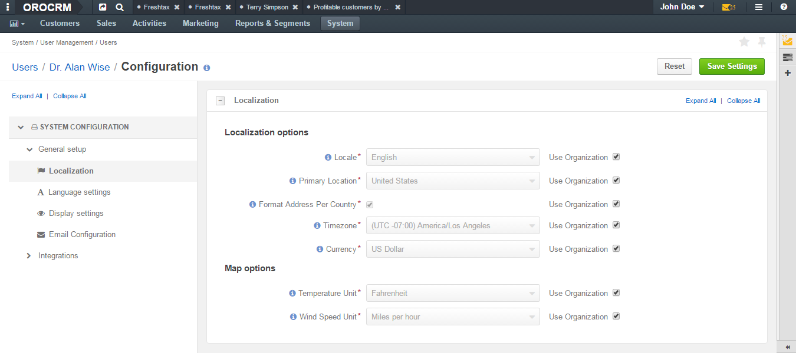

|

**Localization options**

+----------------------------+---------------------------------------------------------------------------------------------------------------------------------------------------------------------------------+
| Field                      | Description                                                                                                                                                                     |
+============================+=================================================================================================================================================================================+
| Locale                     | Select the default locale for the user. Numbers, addresses, names and dates will be formatted according to the selected locale.                                                 |
+----------------------------+---------------------------------------------------------------------------------------------------------------------------------------------------------------------------------+
| Primary Location           | Select the country which will be considered the user's primary location. The addresses the user sees on the interface will be formatted according to the rules of this country. |
+----------------------------+---------------------------------------------------------------------------------------------------------------------------------------------------------------------------------+
| Format Address Per Country | When this option is selected, addresses will be formatted according to the rules of their countries. Otherwise, the primary location formatting will be applied.                |
+----------------------------+---------------------------------------------------------------------------------------------------------------------------------------------------------------------------------+
| Timezone                   | Select the timezone for the user location. All dates and times will be displayed according to the specified timezone.                                                           |
+----------------------------+---------------------------------------------------------------------------------------------------------------------------------------------------------------------------------+
| Currency                   | Select the default currency for the user.                                                                                                                                       |
+----------------------------+---------------------------------------------------------------------------------------------------------------------------------------------------------------------------------+

**Map options**

+------------------+--------------------------------------------------------------------------------+
| Field            | Description                                                                    |
+==================+================================================================================+
| Temperature Unit | Select the temperature unit. This settings will be applied for weather on map. |
+------------------+--------------------------------------------------------------------------------+
| Wind Speed Unit  | Select the wind speed unit.                                                    |
+------------------+--------------------------------------------------------------------------------+

Language settings
.................

|

.. image:: ../img/user_management/user_configuration_language.png 

|

**Languages**

+------------------+----------------------------------------------------+
| Field            | Description                                        |
+==================+====================================================+
| Default Language | Select the the default language for the interface. |
+------------------+----------------------------------------------------+

Display settings
................

|

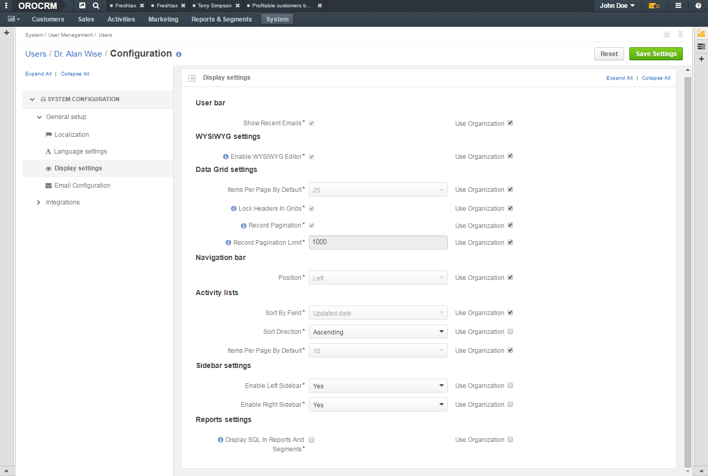

|

**User bar**

+--------------------+------------------------------------------------------------------------------------------------------------------------------------+
| Field              | Description                                                                                                                        |
+====================+====================================================================================================================================+
| Show Recent Emails | Select this check box to display the recent emails on the user bar (they will appear next to the user name).                       |
|                    |                                                                                                                                    |
|                    | .. image:: ../img/user_management/user_configuration_showemailsuserbar.png                                                         |
|                    |                                                                                                                                    |
+--------------------+------------------------------------------------------------------------------------------------------------------------------------+

**WYSIWYG settings**   

+-----------------------+-----------------------------------------------------------------------------------------------------------+
| Field                 | Description                                                                                               |
+=======================+===========================================================================================================+
| Enable WYSIWYG Editor | Select this check box to enable text formatting tools for emails, notes and comments.                     |
|                       |                                                                                                           |
|                       | .. image:: ../img/user_management/user_configuration_wysiwyg.png                                          |
|                       |                                                                                                           |
+-----------------------+-----------------------------------------------------------------------------------------------------------+

**Data Grid settings**

+---------------------------+----------------------------------------------------------------------------------------------------------------+
| Field                     | Description                                                                                                    |
+===========================+================================================================================================================+
| Items Per Page By Default | Select how many records will appear on one page of record grids.                                               |
+---------------------------+----------------------------------------------------------------------------------------------------------------+
| Lock Headers In Grids     | Select this check box to ensure that headers of a record grid will stay visible while you scroll.              |
+---------------------------+----------------------------------------------------------------------------------------------------------------+
| Record Pagination         | Select this check box to enable the user navigate to the previous or next grid record from a record view page. |
|                           |                                                                                                                |
|                           | .. image:: ../img/user_management/user_configuration_pagination.png                                            |
|                           |                                                                                                                |
+---------------------------+----------------------------------------------------------------------------------------------------------------+
| Record Pagination Limit   | Type the maximum number of records that the user can navigate from a record view page.                         |
+---------------------------+----------------------------------------------------------------------------------------------------------------+

**Navigation bar**

 +----------+-----------------------------------------------------------------------------------------------+
 | Field    | Description                                                                                   |
 +==========+===============================================================================================+
 | Position | Select whether the OroCRM main menu will be positioned at the top of the page or on its left. |
 +----------+-----------------------------------------------------------------------------------------------+

**Activity lists**

+---------------------------+-------------------------------------------------------------------------------------------------------------------------------------+
| Field                     | Description                                                                                                                         |
+===========================+=====================================================================================================================================+
| Sort By Field             | Select whether to sort activity records by the date when they were created or by the date when they were updated for the last time. |
+---------------------------+-------------------------------------------------------------------------------------------------------------------------------------+
| Sort Direction            | Select whether to sort records in the ascending or descending direction.                                                            |
+---------------------------+-------------------------------------------------------------------------------------------------------------------------------------+
| Items Per Page By Default | Select how many records will appear on one page of the activity grids.                                                              |
+---------------------------+-------------------------------------------------------------------------------------------------------------------------------------+

**Sidebar settings**

 +----------------------+-------------------------------------------------------------------------+
 | Field                | Description                                                             |
 +======================+=========================================================================+
 | Enable Right Sidebar | Select **Yes** to enable the user to see and utilize the right sidebar. |
 +----------------------+-------------------------------------------------------------------------+
 | Enable Right Sidebar | Select **Yes** to enable the user to see and utilize the right sidebar. |
 +----------------------+-------------------------------------------------------------------------+

Reports settings

 +-------------------------------------+------------------------------------------------------------------------------------------------------------------+
 | Field                               | Description                                                                                                      |
 +=====================================+==================================================================================================================+
 | Display SQL In Reports And Segments | Select this check box to enable the user to review the SQL request sent to the system for a report or a segment. |
 |                                     |                                                                                                                  |
 +-------------------------------------+------------------------------------------------------------------------------------------------------------------+

|

.. image:: ../img/user_management/user_configuration_showsql.png    

|

Email Configuration
...................

|

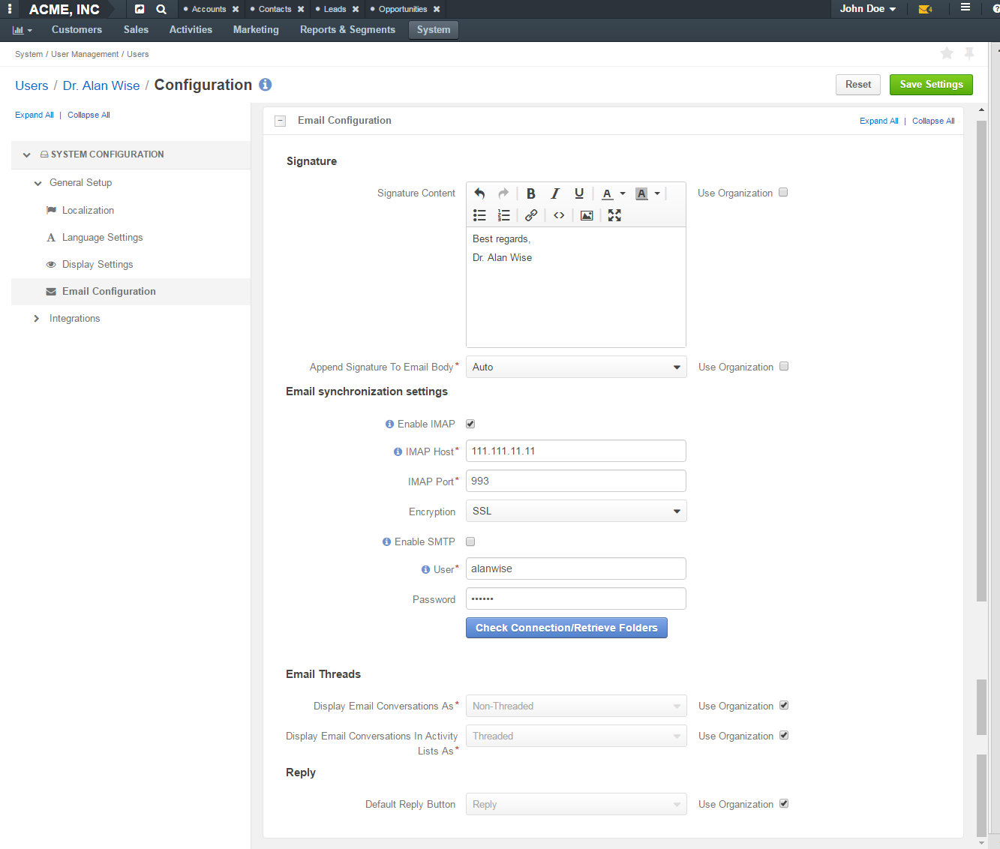

|

**Signature**

 +--------------------------------+--------------------------------------------------------------------------+
 | Field                          | Description                                                              |
 +================================+==========================================================================+
 | Signature Content              | Type the signature to be appended to the user's emails.                  |
 +--------------------------------+--------------------------------------------------------------------------+
 | Append Signature To Email Body | Select whether the signature must be appended automatically or manually. |
 +--------------------------------+--------------------------------------------------------------------------+

**Email synchronization settings**

 +-----------------------------------+------------------------------------------------------------------------------------------------------------------------------------------------------------------+
 | Field                             | Description                                                                                                                                                      |
 +===================================+==================================================================================================================================================================+
 | Enable IMAP                       | Select this check box to enable the IMAP synchronization of the user's remote mailbox with their OroCRM mailbox.                                                 |
 +-----------------------------------+------------------------------------------------------------------------------------------------------------------------------------------------------------------+
 | Enable SMTP                       | Select this check box to enable the SMTP synchronization of the user's remote mailbox with their OroCRM mailbox.                                                 |
 +-----------------------------------+------------------------------------------------------------------------------------------------------------------------------------------------------------------+
 | User                              | If the value is changed, new mailbox will be registered. All data from this mailbox will be lost                                                                 |
 +-----------------------------------+------------------------------------------------------------------------------------------------------------------------------------------------------------------+
 | Check Connection/Retrieve Folders | Click this button to check whether the specified synchronization settings are correct and to retrieve the current folder structure of the user's remote mailbox. |
 +-----------------------------------+------------------------------------------------------------------------------------------------------------------------------------------------------------------+

**Email Threads**

 +---------------------------------+----------------------------------------------------------------------------------------------------------------------------------------------------------------------------------------------------+
 | Field                           | Description                                                                                                                                                                                        |
 +=================================+====================================================================================================================================================================================================+
 | Display Emails In Activities As | Select whether to visually group original emails with replies to them in the **Activities** sections of the record view pages or show all emails separately.                                       |
 +---------------------------------+----------------------------------------------------------------------------------------------------------------------------------------------------------------------------------------------------+

**Reply**        

 +----------------------+----------------------------------------------------------------------------------------------------------------------------------------------------------------------------------------------------+
 | Field                | Description                                                                                                                                                                                        |
 +======================+====================================================================================================================================================================================================+
 | Default Reply Button | Select which button will be default for replying to emails: **Reply** or **Reply All**. Other button will continue be available in the **Reply** menu, it will just not be on the top of the list. |
 |                      |                                                                                                                                                                                                    |
 |                      | .. image:: ../img/user_management/reply_selector.png                                                                                                                                               |
 |                      |                                                                                                                                                                                                    |
 +----------------------+----------------------------------------------------------------------------------------------------------------------------------------------------------------------------------------------------+

Integrations
~~~~~~~~~~~~

MS Outlook settings
...................

.. note::
	This functionality is available only for OroCRM Enterprise Edition. For more information about the synchronization with Outlook, see the `Synchronization with Outlook </user-guide/outlook-sync>`__ guide.

|

.. image:: ../img/user_management/user_configuration_outlook.png    

|

**Integration settings**

+------------------------------------+----------------------------------------------------------------------------------------------------------------------------------------+
| Field                              | Description                                                                                                                            |
+====================================+========================================================================================================================================+
| Sync Direction                     | Select whether the data will be taken from OroCRM to Outlook, from Outlook to OroCRM or synchronization will occur in both directions. |
+------------------------------------+----------------------------------------------------------------------------------------------------------------------------------------+
| Conflict Resolution                | Select whether OroCRM or Outlook has priority if the same piece of data has been changed in both systems.                              |
+------------------------------------+----------------------------------------------------------------------------------------------------------------------------------------+
| CRM Sync Interval (In Seconds)     | Type how often changes on OroCRM side will be checked.                                                                                 |
+------------------------------------+----------------------------------------------------------------------------------------------------------------------------------------+
| Outlook Sync Interval (In Seconds) | Type how often changes on Outlook side will be checked.                                                                                |
+------------------------------------+----------------------------------------------------------------------------------------------------------------------------------------+

**Synchronization settings**

+-----------------+-----------------------------------------------------------+
| Field           | Description                                               |
+=================+===========================================================+
| Contacts        | Select this check box to synchronize the contacts.        |
+-----------------+-----------------------------------------------------------+
| Tasks           | Select this check box to synchronize the tasks.           |
+-----------------+-----------------------------------------------------------+
| Calendar Events | Select this check box to synchronize the calendar events. |
+-----------------+-----------------------------------------------------------+

Change the User's Password
^^^^^^^^^^^^^^^^^^^^^^^^^^

1. In the main menu, navigate **System>User Management>Users**.

2. In the grid on the **All Users** page, click the required user.

3. On the user view page, click :guilabel:`More Actions` in the upper-right corner of the page and click **Change Password** on the list. 

|

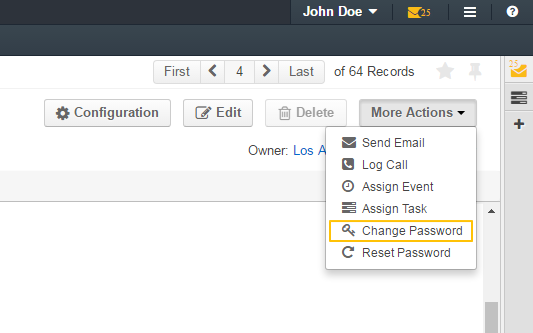

|

4. In the **Change Password** dialog box, type a new password for the user. Alternatively, you can click the **Suggest Password** link to generate a secure random password. To see / hide  the entered password, click the |IcShow| **Show** / |IcHide| **Hide** icon next to the **New password** field.
   
|

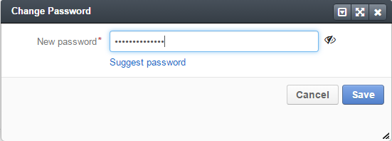

|

5. Click :guilabel:`Save`. The new password will be sent to the user's primary email address. 
   

Reset the User's Password
^^^^^^^^^^^^^^^^^^^^^^^^^

1. In the main menu, navigate **System>User Management>Users**.

2. In the grid on the **All Users** page, click the required user.

3. On the user view page, click :guilabel:`More Actions` in the upper-right corner of the page and click **Reset Password** on the list. 

|

.. image:: ../img/user_management/user_resetpassword0.png 

|

4. In the **Reset Password** dialog box, click :guilabel:`Reset`. The password reset link will be sent to the user's primary email address. 
   
|

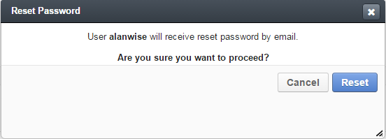

.. important:: 
	The user will not be able to log into the OroCRM before their password is changed. 

Export Users
^^^^^^^^^^^^
You can export all user records into the .csv file. The exported file will contain all user record fields marked to be exported in the **User** entity settings. For more information about how to configure which fields will be exported, see the :ref:`Entity Fields <doc-entity-fields>` guide.

.. note:: 
	All existing user records are exported at once. 

	Passwords are stored and exported in the hashed form. 

To export user records, do the following:

1. In the main menu, navigate **System>User Management>Users**.

2. On the **All Users** page, click the :guilabel:`Export` button in the upper-right corner of the page.

3. After the export job is finished, a green notification appears at the top of the page informing you about that. Click the **Download result file** link in the notification to download the .csv file with user records. 

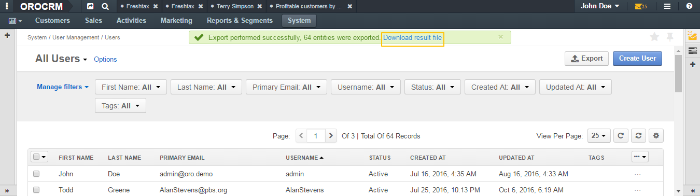

|

.. image:: ../img/user_management/users_export_csv.png 

|

Delete a User
^^^^^^^^^^^^^

.. important:: 
  You cannot delete a user who has records assigned to them. 

1. In the main menu, navigate **System>User Management>Users**.

2. In the grid on the **All Users** page, choose the user you want to delete, click the ellipsis menu at the right-hand end of the corresponding role and then click the |IcDelete| **Delete** icon.

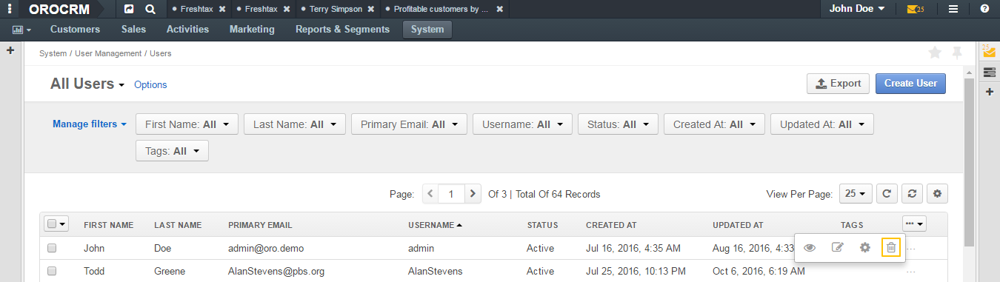

3. In the **Deletion Confirmation** dialog box, click :guilabel:`Yes, Delete`.

Alternatively, you can delete a user from the role view by clicking the :guilabel:`Delete` button in the upper-right corner of the user view page.

.. image:: ../img/user_management/user_delete2.png

Delete Multiple Users
^^^^^^^^^^^^^^^^^^^^^
You can delete multiple users at a time. 

.. important:: 
  You cannot delete users who have records assigned to them. 

1. In the main menu, navigate **System>User Management>Users**.

2. In the grid on the **All Users** page, select the check boxes in front of the users you want to delete.
 
3. Click the ellipsis menu at the right end of the grid header row and then click |IcDelete| **Delete**.

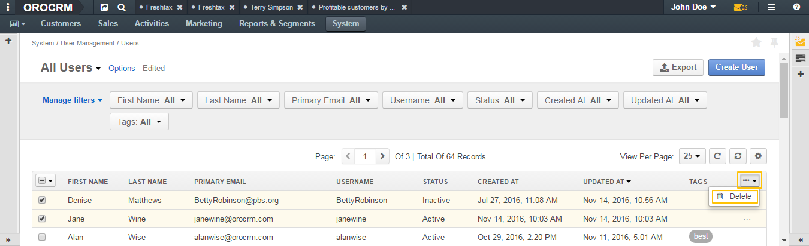

4. In the **Delete Confirmation** dialog box, click :guilabel:`Yes, Delete`. 

.. |IcRemove| image:: /img/buttons/IcRemove.png
	:align: middle

.. |IcClone| image:: /img/buttons/IcClone.png
	:align: middle

.. |IcDelete| image:: /img/buttons/IcDelete.png
	:align: middle

.. |IcEdit| image:: /img/buttons/IcEdit.png
	:align: middle

.. |IcView| image:: /img/buttons/IcView.png
	:align: middle

.. |IcShow| image:: /img/buttons/IcShow.png
	:align: middle

.. |IcHide| image:: /img/buttons/IcHide.png
	:align: middle

