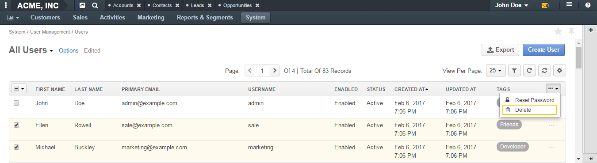

.. _doc-user-management-users-actions:

Actions with Users
====================

.. contents:: :local:
    :depth: 3

Actions
--------

.. _doc-user-management-users-actions-create:

Create a User
^^^^^^^^^^^^^

1. In the main menu, navigate **System>User Management>Users**.

2. On the **All Users** page, click the **Create User** button in the upper-right corner of the page.

3. On the **Create User** page, click **General** and fill in the following fields:
 
    - **Owner**—Select a business unit from the list. Note that the business units and organization the user has access to are determined by the settings made in the **Access Settings** section.  

    - **Enabled**—Select a user status from the list. This field is mandatory. 

        - **Enabled**—The user can log into the system and to do their work within it, be an owner of entity records upon creation. 

        - **Disabled**—The user cannot log into the system, be an owner of entity records upon creation. 
    
    - **Username**—Type a name that the user will use to log into the system. This field is mandatory. 

    - **Password**—Type a password that the user will use to log into the system. This field is mandatory. The required complication of the password depend on the system settings. If the password that you have entered does not satisfy set password policy, the notification and hint will appear under the password field.  For more information about password policy, please see :ref:`User Settings<admin-configuration-user-settings>`.

    - **Re-Enter Password**—Type the password one more time to confirm it. This field is mandatory. 

    - **Name Prefix**—Type a name prefix of the user. A name prefix is used in front of the user's name and provides additional information about the user. 

    - **First Name**—Type the first name of the user. You can use any number of characters of any alphabet in the name. This field is mandatory. A user's first name is displayed on the interface when the user logs in. 

    - **Middle Name**—Type the middle name of the user. 

    - **Last Name**—Type the last name of the user. You can use any number of characters of any alphabet in the name. Together with the user's first name, a user's last name is displayed on the interface when user logs in. 

    - **Name Suffix**— Type a name suffix of the user. A name suffix is used after the user's name and provides additional information about the user. 

    - **Birthday**—Click this field and select the user's date of birth using a pop-up calendar. Alternatively, you can type the date in the format defined by your current locale (for more information about locales, see the :ref:`Localization <doc-user-management-users-configuration-localization>` section).

    -  **Avatar**—Click :guilabel:`Choose File` to locate a user's photo or another picture associated with the user on your computer or other device. 
    
    - **Send An Email Invitation**—Select this check box to send an email invitation to the user upon record creation. The invitation is sent to the email address specified in the **Primary Email** field.
    
    - **Primary Email**—Type the user's main email address that will be used for communications. This field is mandatory. 
    
    - **Emails**—Click the :guilabel:`Add Another Email` button and type an additional email address in the field that appears. You can add as many email addresses as required. To delete an email address, click the x icon next to the email field you want to delete.
      
    - **Phone**—Type the user's phone number.
      
|

.. image:: ../img/user_management/user_create_general.png 

|   
    
4. Click **Additional** and provide more information about the user. In case any visible custom fields are added to the **User** entity, they appear in this section. 
 
5. Click **Access Settings**. This section must be filled in before the **Groups and Roles** section as the content available in the latter section depends on what is selected in **Access Settings**. 
 
6. (Only for Enterprise Edition) In the **Organizations** subsection, select the check boxes in front of the organization(s) you want the user to have access to.  
   
   .. caution::
        Note that the user will not be able to log in to the system if no organization is selected for them. 

7. Click the **Organization Business Units** field and type the business unit name or select it from the list. On the list, you can see business units of the organizations selected in the **Organizations** subsection. Business users selected here determine which business units the data owned by the user will belong to. Therefore, for successful configuration it is essential to correctly specify business units in this section. For more information on how to select business units dependently on the company structure, see the :ref:`Access to Organizations and Business Units Examples <doc-user-management-users-access-examples>` section.
   
   .. note::
        - You can select one or more business units. Then the data owned by the user will be considered as belonging to all these business units and users that have access to these business units and corresponding permissions will be able to access it. 
         
        - In case the user's role includes division level permissions, the user will be able to access data of each business unit specified in these sections, as well as the data of the whole chain of business units subordinated to those selected in this section. 

|

.. image:: ../img/user_management/user_create_accesssettings.png 

|   
 

8. Click **Groups and Roles**. In the **Groups** subsection, select check boxes in front of the groups you want the user to be part of. All groups available in the system are listed here. A group is a set of users for convenience consolidated by one or more parameters. Instead of specifying each user one by one, you can specify a user group in filters and notification rules. For more information about groups, see the :ref:`User Groups <user-management-groups>` guide.

9. In the **Roles** subsection, select check boxes in front of the roles you want the user to have. Roles are predefined sets of permissions. When you assign a role to a user, you can be sure that the user will have access only to the information within the system that is necessary for them to do their work. For more information about roles, see the :ref:`Access and Roles Management <user-guide-user-management-permissions>` guide.

   .. important::
      At least one role must be selected. 

   .. caution::
      If the role is not 'System-Wide' and a particular organization is specified for it, check that the same organization is selected for a user in the **Access Settings** sections. Otherwise, the role does not appear in the **Roles** section. 

|

.. image:: ../img/user_management/user_create_groupsandroles.png 

|   
 

10. Click :guilabel:`Save` in the upper-right corner of the page. Or, in case you need to create one more user, click the arrow next to the :guilabel:`Save` button and click :guilabel:`Save and New` in the menu. Then the current user will be saved and the blank **Create User** page will open.
   

.. _doc-user-management-users-actions-create-ldap:

Create Users via LDAP
^^^^^^^^^^^^^^^^^^^^^

.. important:: 
   This feature is available only for OroCRM Enterprise Edition.

If your company is utilizing LDAP (Lightweight Directory Access Protocol) server to guarantee that users can access corporate applications using the same credentials, you can significantly save time and effort on creating user records. OroCRM EE supports LDAP and thus allows you to import existing user information including role identifiers from the LDAP server into OroCRM.  

To enable import of LDAP records, you first need to set up integration with LDAP. After the integration has been established, user profiles will be imported to OroCRM and users will be able to use their usual credentials to log into OroCRM.

Using LDAP integration does not prevent you from creating user records in OroCRM manually. Manually created user records will not be imported back to your LDAP server.

System administrators will be able to tell if a user has been added via the LDAP integration: for such users the **LDAP Distinguished Names** field of their view pages will not be empty and will contain the corresponding value.

|

.. image:: ../img/user_management/user_ldap_distinguished_name.png 

|

For how to configure the LDAP integration, please see the `LDAP integration <../integrations/ldap-integration>`__ guide.

.. _doc-user-management-users-actions-review:

Review a User
^^^^^^^^^^^^^
1. In the main menu, navigate **System>User Management>Users**.

2. In the grid on the **All Users** page, click the required user.
   
   Alternatively, you can click the ellipsis menu at the right-hand end of the corresponding row and then click the |IcView| **View** icon.

   |

   .. image:: ../img/user_management/user_view_fromgrid.png

   | 

3. Review the user settings. Please, see details in the :ref:`User on the Interface <doc-user-management-users-view-page>` section. 

.. _doc-user-management-users-actions-enable:

Enable a User
^^^^^^^^^^^^^^^

1. In the main menu, navigate **System>User Management>Users**.

2. In the user grid, click the required user.
   
   Alternatively, you can click the ellipsis menu at the right-hand end of the corresponding row and then click the |IcView| **View** icon.

   |

   .. image:: ../img/user_management/user_view_fromgrid.png

   | 

3. On the user view page, click the **Enable User** button in the upper-right corner. The user status will change to **Enabled**.

|

.. image:: ../img/user_management/user_enable.png

| 

.. _doc-user-management-users-actions-disable:

Disable a User
^^^^^^^^^^^^^^^

1. In the main menu, navigate **System>User Management>Users**.

2. In the user grid, click the required user.
   
   Alternatively, you can click the ellipsis menu at the right-hand end of the corresponding row and then click the |IcView| **View** icon.

   |

   .. image:: ../img/user_management/user_view_fromgrid.png

   | 

3. On the user view page, click the **Disable User** button in the upper-right corner. The user status will change to *Disabled**.

|

.. image:: ../img/user_management/user_disable.png

| 

.. _doc-user-management-users-actions-activate:

Activate a User
^^^^^^^^^^^^^^^

When user exceed allowed number of failed login attempts, the system automatically locks them out. User authentication status changes to **Locked** and the new button, **Activate** appears on the user view page.

To activate a user, perform the following:

1. In the main menu, navigate **System>User Management>Users**.

2. In the user grid,, click the required user.
   
   Alternatively, you can click the ellipsis menu at the right-hand end of the corresponding row and then click the |IcView| **View** icon.

   |

   .. image:: ../img/user_management/user_view_fromgrid.png

   | 

3. On the user view page, click the **Activate** button in the upper-right corner. The user authentication status will change to **Active**.

|

.. image:: ../img/user_management/user_activate.png

| 

.. _doc-user-management-users-actions-edit:

Edit a User
^^^^^^^^^^^

1. In the main menu, navigate **System>User Management>Users**.

2. In the user grid, choose the user you want to delete, click the ellipsis menu at the right-hand end of the corresponding role and then click the |IcEdit| **Edit** icon. 
   
3. Make the required changes according to the description provided steps 3–9 of the :ref:`Create a User <doc-user-management-users-actions-create>` action description.   

4. Click the :guilabel:`Save` button in the upper-right corner of the page.

.. _doc-user-management-users-actions-api:

Generate an API Key for a User
^^^^^^^^^^^^^^^^^^^^^^^^^^^^^^

When the integration with a third-party software or other work requirements demand a user to have the API access to OroCRM, generate an API key for the user. This key will be used to grant a user access to API while protecting their password from being disclosed to the third party. 

1. In the main menu, navigate **System>User Management>Users**.

2. In the grid on the **All Users** page, click the required user.

3. On the user view page, click **General Information**.

4. Find the **API Key** field and click the :guilabel:`Generate Key` button next to it. A new API key appears. It will look similar to `bba1b83312a50836d78cbef4d2705125a6ce1d4d`. 

After the API key is generated, the user will be able to execute API requests via the sandbox, Curl command, any other REST client or use the API via the custom application.
   
.. important::
	Please note that an API key must be generated within the organization the data of which it will be used to access. 

  Therefore, there can be a situation when a user record has been created under organization A, and the user has access to and require an API key for organization B. In this case, you cannot generate an operational API key for the user. However, the user who has the corresponding permissions can log into the desired organization and generate an API key for themselves on the **My User** page.   
  

  Within one organization there can be only one API key at a time. 

.. _doc-user-management-users-actions-email:

Send an Email 
^^^^^^^^^^^^^^

By default, this way an email is meant to be sent to the user from whose view page you perform this action. However, you can modify addresses that appear in the **From** field as you like. 

1. In the main menu, navigate **System>User Management>Users**.

2. In the grid on the **All Users** page, click the required user.

3. On the user view page, perform one of the following:

    - Click :guilabel:`More Actions` in the upper-right corner of the page and click **Send Email** on the list. 

      |

      .. image:: ../img/user_management/user_sendemail0.png 

      |

    - In the **General Information** section, find the **Emails** field, and point to the required email. Click the **Send Email** icon that appears next to it.   

      |

      .. image:: ../img/user_management/user_email_icon.png

      |

4. In the **Send Email** dialog box, specify the required data. For help on this, see :ref:`Compose A New Email <doc-activities-emails-actions-compose>`.
   
|

.. image:: ../img/user_management/user_sendmail.png 

|

5. Click :guilabel:`Send`. The email will appear in the **Activity** section of the user view page. 

.. _doc-user-management-users-actions-call:

Log or Make a Call
^^^^^^^^^^^^^^^^^^^

By logging or making a call from a user's view page, you specify that this user is a call party or a call relates to this user in some other way. 

1. In the main menu, navigate **System>User Management>Users**.

2. In the grid on the **All Users** page, click the required user.

3. On the user view page, perform one of the following:

   - Click :guilabel:`More Actions` in the upper-right corner of the page and click **Log Call** on the list. 

     |

     .. image:: ../img/user_management/user_logcall0.png 

     |

   - In the **General Information** section, find the **Phone** field, and point to a specified phone number. The **Hangouts Call** and **Log Call** icons appear next to it. 
   
     Click the **Hangouts Call** icon to immediately call to the specified phone number.

     Click the **Log Call** icon to specify call details.

     |

     .. image:: ../img/user_management/user_hangouts_call.png

     |

   - In the **General Infromation** section, find the **Emails** field, and point to the required email. Click the **Hangouts Call** icon that appears next to it.   

     |

     .. image:: ../img/user_management/user_hangouts_call2.png

     |

4. If you used **Log Call** action button or icon, in the **Log Call** dialog box, specify the required data.
   
|

.. image:: ../img/user_management/user_logcall.png 

|

5. Click :guilabel:`Log Call` to log a call, or click the **Start** button  next to **Hangouts** label to start a hangout call.  The call will appear in the **Activity** section of the user view page. 

.. important::
   If you do not see icons and buttons that allow making Hangouts calls, make sure that the Hangouts functionality is enabled for the organization. See :ref:`Google Integration Settings <admin-configuration-integrations-google>` for more information. 

For more information about calls, see the `Calls <../../user-guide/activities/activities-log-call>`__ guide.

.. _doc-user-management-users-actions-event:

Assign an Event to a User
^^^^^^^^^^^^^^^^^^^^^^^^^

1. In the main menu, navigate **System>User Management>Users**.

2. In the grid on the **All Users** page, click the required user.

3. On the user view page, click :guilabel:`More Actions` in the upper-right corner of the page and click **Assign Event** on the list. 

|

.. image:: ../img/user_management/user_assignevent0.png 

|

4. In the **Assign Event To** dialog box, specify the required data. For help on this, see the `Add an Event for a Related Record <../../user-guide/activities/activities-add-assign-calendar-events#add-an-event-for-a-related-record>`__ section of the `Add and Assign Calendar Events <../../user-guide/activities/activities-add-assign-calendar-events>`__ guide.
   
|

.. image:: ../img/user_management/user_assignevent.png 

|

5. Click :guilabel:`Save`. The event will appear in the **Activities** section of the user view page.  

.. _doc-user-management-users-actions-task:

Assign a Task to a User
^^^^^^^^^^^^^^^^^^^^^^^

1. In the main menu, navigate **System>User Management>Users**.

2. In the grid on the **All Users** page, click the required user.

3. On the user view page, click :guilabel:`More Actions` in the upper-right corner of the page and click **Assign Task** on the list. 

|

.. image:: ../img/user_management/user_assigntask0.png 

|

4. In the **Assign Task To** dialog box, specify the required data. For help on this, see the `Add a Task for Another Record <../../user-guide/activities/activities-add-assign-tasks#add-a-task-for-another-record>`__ section of the `Add Task and Assign Task <../../user-guide/activities/activities-add-assign-tasks>`__ guide.
   
|

.. image:: ../img/user_management/user_assigntask.png 

|

5. Click :guilabel:`Create Task`. The task will appear in the **Additional Information** section, **Tasks** subsection of the user view page.

.. _doc-user-management-users-actions-configure:

Configure User's Interface, Email Settings and Integrations
^^^^^^^^^^^^^^^^^^^^^^^^^^^^^^^^^^^^^^^^^^^^^^^^^^^^^^^^^^^

.. important::
	Note that configuration you set up will be applicable only for the current organization. Therefore, there can be a situation when a user record has been created under the current organization but the user only has access to a different organization. In this case, the user with the corresponding permissions can log into the organization they have access to and modify system configuration for themselves on the **My Configuration** page. 

1. In the main menu, navigate **System>User Management>Users**.

2. In the grid on the **All Users** page, click the required user.

3. On the user view page, click :guilabel:`Configuration` in the upper-right corner of the page. 

4. On the **Configuration** page, in the left side-menu, click **System Configuration**. If required, make changes to the user system configuration. For information about the fields, see the :ref:`User System Configuration <doc-user-management-users-configuration>` description.
 
5. Click :guilabel:`Save Settings` in the upper-right corner of the page. 
 

.. _doc-user-management-users-actions-change-password:

Change the User's Password
^^^^^^^^^^^^^^^^^^^^^^^^^^

1. In the main menu, navigate **System>User Management>Users**.

2. In the grid on the **All Users** page, click the required user.

3. On the user view page, click :guilabel:`More Actions` in the upper-right corner of the page and click **Change Password** on the list. 

|

.. image:: ../img/user_management/user_changepassword0.png 

|

4. In the **Change Password** dialog box, type a new password for the user. Alternatively, you can click the **Suggest Password** link to generate a secure random password. To see / hide  the entered password, click the |IcShow| **Show** / |IcHide| **Hide** icon next to the **New password** field.
   
|

.. image:: ../img/user_management/user_changepassword.png 

|

5. Click :guilabel:`Save`. The new password will be sent to the user's primary email address. 
   

.. _doc-user-management-users-actions-reset-password:

Reset the User's Password
^^^^^^^^^^^^^^^^^^^^^^^^^

1. In the main menu, navigate **System>User Management>Users**.

2. In the grid on the **All Users** page, click the required user.

3. On the user view page, click :guilabel:`More Actions` in the upper-right corner of the page and click **Reset Password** on the list. 

|

.. image:: ../img/user_management/user_resetpassword0.png 

|

4. In the **Reset Password** dialog box, click :guilabel:`Reset`. The password reset link will be sent to the user's primary email address. 
   
|

.. image:: ../img/user_management/user_resetpassword.png 

.. important:: 
	The user will not be able to log into the OroCRM before their password is changed. Note that user authentication status changes to **Password reset**:

  |

  .. image:: ../img/user_management/user_resetpassword.png 

  |

  It will return back to **Active** when the user completes password change procedure. 

.. _doc-user-management-users-actions-reset-password-multiple:

Reset Passwords for Multiple Users
^^^^^^^^^^^^^^^^^^^^^^^^^^^^^^^^^^^

When you suspect a security breach, you can reset passwords for multiple users at a time. 

1. In the main menu, navigate **System>User Management>Users**.

2. In the grid on the **Users** page, select the check boxes in front of the users whose passwords you want to reset.
 
3. Click the ellipsis menu at the right end of the grid header row and then click |IcPassReset| **Reset Password**.

.. image:: ../img/user_management/user_massresetpassword.png

4. In the **Reset Password** dialog box, click :guilabel:`Reset`. The password reset links will be sent to the users' primary email addresses. 
   
.. important:: 
  The users will not be able to log into the OroCRM before their passwords are changed. Note that user authentication statuses change to **Password reset**:

  |

  .. image:: ../img/user_management/user_resetpassword2.png

  |

  They will return back to **Active** when the users complete password change procedure.    

.. _doc-user-management-users-actions-export:

Export Users
^^^^^^^^^^^^
You can export all user records into the .csv file. The exported file will contain all user record fields marked to be exported in the **User** entity settings. For more information about how to configure which fields will be exported, see the `Entity Fields <../admin-guide/entities/entity-fields>`__ guide. 

.. note:: 
	All existing user records are exported at once. 

	Passwords are stored and exported in the hashed form. 

To export user records, do the following:

1. In the main menu, navigate **System>User Management>Users**.

2. On the **All Users** page, click the :guilabel:`Export` button in the upper-right corner of the page.

3. After the export job is finished, you will receive a notification on your primary email address. 

|

.. image:: ../img/user_management/users_export.png 

|

|

.. image:: ../img/user_management/users_export_csv.png 

|

.. _doc-user-management-users-actions-delete:

Delete a User
^^^^^^^^^^^^^

.. important:: 
  You cannot delete a user who has records assigned to them. 

1. In the main menu, navigate **System>User Management>Users**.

2. In the grid on the **All Users** page, choose the user you want to delete, click the ellipsis menu at the right-hand end of the corresponding row and then click the |IcDelete| **Delete** icon.

.. image:: ../img/user_management/user_delete_fromgrid.png

3. In the **Deletion Confirmation** dialog box, click :guilabel:`Yes, Delete`.

Alternatively, you can delete a user from the role view by clicking the :guilabel:`Delete` button in the upper-right corner of the user view page.

.. image:: ../img/user_management/user_delete2.png

.. _doc-user-management-users-actions-delete-multiple:

Delete Multiple Users
^^^^^^^^^^^^^^^^^^^^^
You can delete multiple users at a time. 

.. important:: 
  You cannot delete users who have records assigned to them. 

1. In the main menu, navigate **System>User Management>Users**.

2. In the grid on the **Users** page, select the check boxes in front of the users you want to delete.
 
3. Click the ellipsis menu at the right end of the grid header row and then click |IcDelete| **Delete**.

4. In the **Delete Confirmation** dialog box, click :guilabel:`Yes, Delete`. 

See Also
----------

    :ref:`Users Overview <user-management-users>`

    :ref:`User View Page <doc-user-management-users-view-page>`

    :ref:`User System Configuration <doc-user-management-users-configuration>`

    :ref:`Access to Organizations and Business Units Examples <doc-user-management-users-access-examples>`

.. |IcRemove| image:: ../../img/buttons/IcRemove.png
  :align: middle

.. |IcClone| image:: ../../img/buttons/IcClone.png
  :align: middle

.. |IcDelete| image:: ../../img/buttons/IcDelete.png
  :align: middle

.. |IcEdit| image:: ../../img/buttons/IcEdit.png
  :align: middle

.. |IcView| image:: ../../img/buttons/IcView.png
  :align: middle

.. |IcShow| image:: ../../img/buttons/IcShow.png
  :align: middle

.. |IcHide| image:: ../../img/buttons/IcHide.png
  :align: middle

.. |IcPassReset| image:: ../../img/buttons/IcPassReset.png
  :align: middle

.. |IcConfig| image:: ../../img/buttons/IcConfig.png
  :align: middle  

.. |IcDisable| image:: ../../img/buttons/IcDisable.png
  :align: middle    
