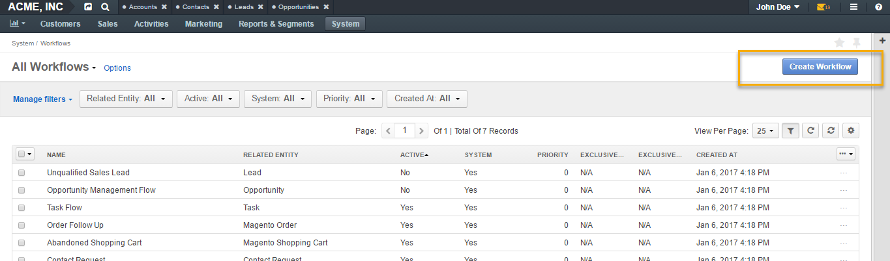
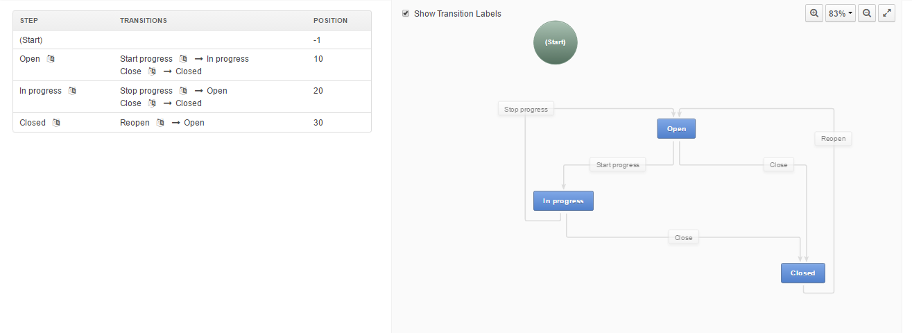
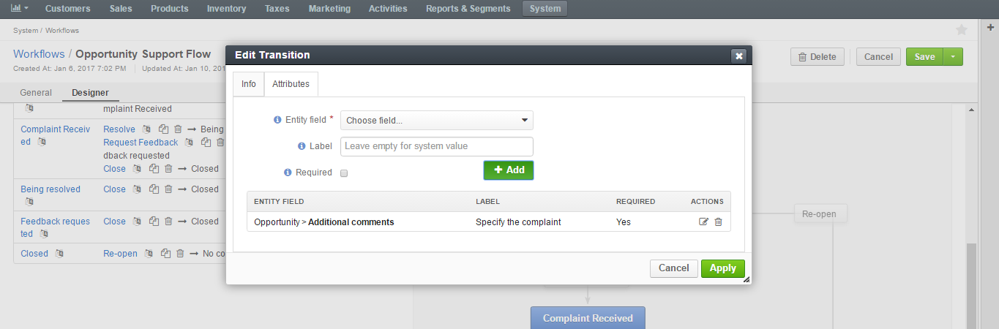
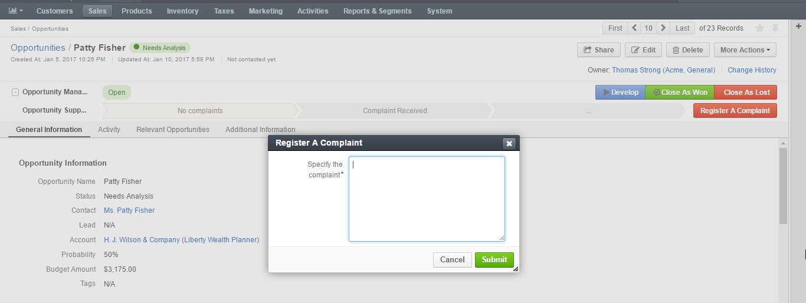
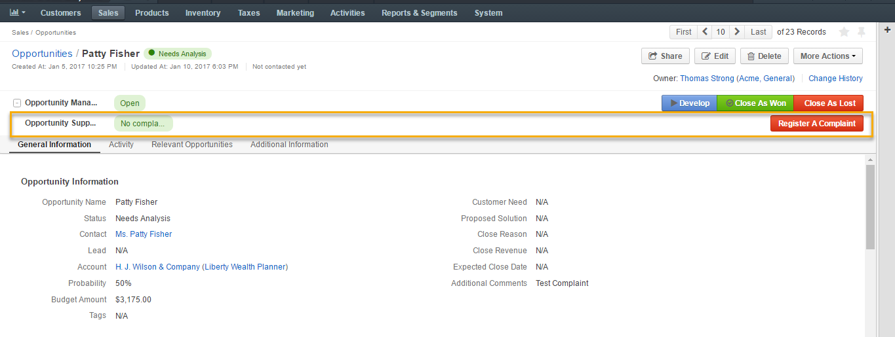
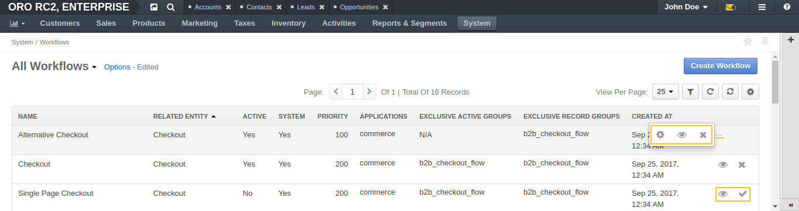

.. _user-guide-workflow-management:

Workflow Management
===================

.. contents:: :local:
    :depth: 4

Overview
---------

A workflow is a sequence of steps or rules applied to a process from its initiation to completion. 
In OroCRM, workflows organize and direct users’ work, making them follow particular steps in a pre-defined order, or preventing them from performing actions that either contradict or conflict with the logical steps of a process.

Workflow Types
--------------

In OroCRM, there are two types of workflows: **system** and **custom**. 
System workflows are pre-implemented in the system and their management from the UI is limited.
Custom workflows can be created and edited depending on your desired configurations. 

Workflow Components
-------------------

Each process or action applied to a record is called a **Workflow Transition**. On the interface, transitions take a form of a button. There are two types of transitions:

-	Transitions that take a user from one state to another and connect to each step in the workflow.
-	Self-transitions that do not change steps in the workflow. 

**Workflow Step** is the state of a record before and after a transition.

Every workflow has a **Start** transition that launches the workflow.  

A transition can be defined as soon as there is at least one step besides **Start**. However, it is often simpler to define all workflow steps and then all the transitions between them.  

|

.. image:: ../img/workflows/1_transitions_steps.png

|

**Attributes** are characteristics of the record. For example, a ZIP code and a street name are attributes of an address. In the course of each transition, you can change some attributes of the processed record. 

If enabled (see the section below), the **Workflow Widget** displays the process steps defined in workflow configuration on the record view page. Multiple workflow widgets can be displayed for one record at the same time.

|

.. image:: ../img/workflows/2_wf_steps_new.png

|

Workflow Creation
-----------------

General
^^^^^^^
To create a workflow for an entity:

-	Navigate to **System>Workflows**.
-	Click :guilabel:`Create Workflow` in the top right corner.

|

|

- On the **Create Workflow** page, specify the details ofyour workflow in the **General** section.

|

.. image:: ../img/workflows/4_create_wfpng.png

|

.. csv-table::
  :header: "Field", "Description"
  :widths: 10, 30

  "**Name**", "The name of the workflow."
  "**Related Entity**", "A related entity is the entity for which the workflow is created. When the workflow is active, it can be launched and executed on the records of its related entity."
  "**Default Step**", "Specifying the default steps launches the workflow in a particular step by default. For instance, when you activate Opportunity Management Flow, a newly created opportunity will appear as **open**, if **Open** was specified as the default step.
  If no step is selected, all newly created records will have no workflow associated with them, and it must be launched with one of the starting transitions."
  "**Display Steps Ordered**", "Display Steps Ordered box is not checked by default.

  -	**If checked**, all workflow steps are displayed in the workflow widget.
  -	**If not checked**, only the steps that have actually been performed are displayed."

Designer
^^^^^^^^

Once the details in the General section have been specified, you can add steps and transitions in the Designer section.

The Designer section consists of a **table and an interactive chart** representations of a workflow, as illustrated below:

|

|

**Within the table**, you can perform the following actions for a **transition**:

-	**Update** (clicking on the transition name opens an Edit Transition form).
-	**Clone** (clicking |IcClone| opens a Clone Transition form).
-	**Delete** (launches a Delete Confirmation popup).

**For a step**, you can:

- **Add a transition to a step** (clicking **+** opens an Add New Transition form)
- **Update** (clicking |IcEdit| opens an Edit Step form).
-	**Clone** (clicking |IcClone| opens a Clone Step form).
- **Delete** (launches a Delete Confirmation popup).

|

.. image:: ../img/workflows/designer_table.gif

|

**Within the chart**, you can:

- **Add transition** (opens an Add Transition form).
- **Add step** (opens an Add Step form).
- **Rearrange the chart** for clearer workflow view.
- **Autosort** (automatically shapes your chart).

|

.. image:: ../img/workflows/auto_sort.gif

|

- **Zoom in/out** (zooms the chart in/out).
- **Show Transition Labels** (checking the box displays transition labels in the chart).
- **Drag transitions from one step to another** (drag an arrow from one of four corners of the step box).

|

.. image:: ../img/workflows/drag_transition.gif

|

- **Undo/Redo changes** (reverts or restores changes made to the chart).
- **Edit/Clone/Delete** a step/transition by clicking on the arrow on the step/transition button.

.. note:: All actions available for transitions and steps in the table are available in the chart as well.

|

.. image:: ../img/workflows/6_manage_chart.png

|

As an example, we are going to create an **Opportunity Support Flow** to show how a workflow is configured and visualized. 

Add a Step
~~~~~~~~~~
To add a step to a workflow, click :guilabel:`Add Step` in the top right corner of the chart. 

|

.. image:: ../img/workflows/7_add_step.png

|

In the Add Step form, complete the following fields:

.. csv-table::
  :header: "Field", "Description"
  :widths: 10, 30

  "**Name**", "The name of the step that will be displayed on the entity record."
  "**Position**", "A number that determines the position of the step in the workflow. The higher the number, the further the step is from the start."
  "**Final**", "This option marks the step as the logical *end* or the *outcome* of the workflow. This is a purely logical property required for distinguishing steps for the funnel charts or creating reports with the workflow data. Marking the step final has no effect on the flow itself."

For the sample Opportunity Support flow, we will start off by creating two steps: **No Complaints** and **Complaint Received**.

|

.. image:: ../img/workflows/8_add_step_form.png

|

|

.. image:: ../img/workflows/9_add_step_form_2.png

|

Click :guilabel:`Apply` to save the step.

Next, we are going to apply a transition for these steps.

Add a Transition
~~~~~~~~~~~~~~~~

To add a step to a workflow, click :guilabel:`Add Transition` in the top right corner of the chart. 

|

.. image:: ../img/workflows/10_add_transition.png

|

.. csv-table::
  :header: "Field", "Description"
  :widths: 10, 30

  "**Name**", "The name of the transition that will be displayed on its button."
  "**From Step**", "The workflow step, for which the transition button should appear on the entity page."
  "**To Step**", "The step to which the workflow will progress after the transition is performed."
  "**View Form**", "Transition attributes can appear in one of two available forms: in the *popup window*, which is a default transition behavior suitable for most cases, or on the *separate page*, which should be used with care and only for attribute-heavy transitions."
  "**Warning Message**", "If you want to show a warning popup message to the user before a transition is executed, put the text of the warning into this field."
  "**Button Icon**", "An icon that will appear on the transition button before the transition name."
  "**Button Style**", "This control specifies the visual style of the transition button."
  "**Button Preview**", "This is the live preview of the transition button as it will appear on the entity page."

|

.. image:: ../img/workflows/10_add_transition.png

|

.. important:: Self-transitions do not change steps in workflows (e.g. it can be a transition that launches an Edit form of a record within the same step).

Define the following fields in the **Attributes** section of the **Add New Transition form**:

.. csv-table::
  :header: "Field", "Description"
  :widths: 10, 30

  "**Entity Field**","This is the field of the workflow entity or its related entities that will appear on the view form of the transition. Use these if you want a user to add or edit some entity data in the transition."
  "**Label**", "Use the field if you want to change the way it is displayed in the UI. The system label value of the entity is used by default."
  "**Required**","Check the :guilabel:`Required` box if definition of the attribute should be mandatory for the transition."
  "**+Add**", "Click :guilabel:`+Add` to add a new attribute."

Click :guilabel:`Apply` to save the attribute(s) in the system.

The following is an example of an attribute added for the **Register a Complaint** transition in the sample **Opportunity Support Flow**. The entity selected for the attribute is Additional Comments. Its label has been changed to **Specify the Complaint**.

|

.. image:: ../img/workflows/12_specify_complaint.png

|

|

|

In the same manner, specify steps, transitions and attributes required for your custom workflow.

The sample Opportunity Support Flow has been configured the following way: 

|

.. image:: ../img/workflows/14_sample_flow_saved.png

|

UI Limitations for Workflow Creation
------------------------------------

OroCRM workflows can be created from both the server-side and the UI. However, there is a number of functions that can be defined for a workflow only from the server-side logics in the course of integration. More information on workflow implementation can be found `on this GitHub page <https://github.com/orocrm/platform/blob/master/src/Oro/Bundle/WorkflowBundle/Resources/doc/reference/workflow/index.md>`__   `and here <../../book/workflow>`__

Workflow Visualization
----------------------

Once the workflow has been configured and saved, you can see how it is visualized for the records:

- Transition buttons will be displayed in the top right corner of the entity record page.
- All the steps will be located at the top on the entity record page within the workflow widget.

The sample Opportunity Support Flow has been saved and activated.

As you can see from the screenshots below, the opportunity is currently in the No Complaints step. Clicking :guilabel:`Register a Complaint` will prompt an attribute we have configured for this transition:

|

.. image:: ../img/workflows/15_osf_ui_1.png

|

|

|

Submitting a complaint will launch an opportunity page with **Resolve, Request Feedback and Close** transition buttons activated. 

|

.. image:: ../img/workflows/17_osf_ui_3.png

|

Clicking each of these buttons will pass the user on to the next step specified in the workflow:

|

.. image:: ../img/workflows/18_osf_ui_4.png

|

**Completed steps** are green, **the step in progress** is white, **the step to follow** is grey. The completed workflow cycle will have all steps highlighted in green:

|

.. image:: ../img/workflows/19_osf_ui.png

|

As an illustration, we have unchecked the :guilabel:`Display Steps Ordered` box in the edit mode for the same workflow. Here is what the steps look like in this case:

|

|

The workflow widget now displays only the current step that the opportunity is in.

|

.. image:: ../img/workflows/21_osf_ui_5.png

|

|

.. image:: ../img/workflows/22_osf_ui_5.png

|

The current step of a workflow is displayed in the **Step** column within the entity grid, as in the example below:

|

.. image:: ../img/workflows/23_open_opps_steps.png

|

Multiple Active Workflows
-------------------------

It is possible to have multiple active workflows for the same record. If you have more than one active workflow, you can separately activate each of them. In the following example, two workflows are available for one record:

|

.. image:: ../img/workflows/24_multiple_wfs.jpg

|

Workflows are expandable and can be collapsed, if necessary, by clicking **+** on the left of the Workflow, as illustrated below:

|

.. image:: ../img/workflows/25_collapse_flow.jpg

|

|

.. image:: ../img/workflows/26_collapse_flow_2.jpg

|

Workflow Management
-------------------
System Workflows
^^^^^^^^^^^^^^^^

Since System workflows are pre-implemented in the system, their management from the UI is limited. From the grid, you can perform the following actions for system workflows:

- **Clone**:|IcClone| (copy the workflow to be able to customize it).
- **View**: |IcView| (Go to the view page of the workflow).
- **Activate/Deactivate**: |IcActivate| / |IcDeactivate| (activate/deactivate the workflow).

|

|

Custom Workflows
^^^^^^^^^^^^^^^^

Cloned system workflows and workflows created in the UI from scratch are custom workflows.
You can perform the following actions for them:

- **Clone**: |IcClone| (copy the workflow to be able to customize it).
- **View**: |IcView| (Go to the view page of the workflow).
- **Activate/Deactivate**:|IcActivate| / |IcDeactivate| (activate/deactivate the workflow).
- **Edit**: |IcEdit| (open the edit form of the workflow).
- **Delete**: |IcDelete| (delete the workflow from the system).

|

.. image:: ../img/workflows/28_manage_wf_1.png

|

Workflow Activation
^^^^^^^^^^^^^^^^^^^

You can activate a workflow by clicking on the corresponding button on the view page of the workflow:

|

.. image:: ../img/workflows/29_activate_wf.png

|

Optionally, you can select certain workflows to be deactivated. If you do not, leave the field empty and click :guilabel:`Activate`.

|

.. image:: ../img/workflows/30_activate_wf_2.png

|

Similarly, click :guilabel:`Deactivate` if you wish to deactivate the selected workflow:

|

.. image:: ../img/workflows/31_deactivate_wf.png

|

|

.. image:: ../img/workflows/32_deactivate_wf_2.png

|

Activating workflows does not happen automatically for all entities. Once the flow has been activated in **System>Workflows**, you need to start it manually for the required entities:

|

.. image:: ../img/workflows/33_start_wf_manually.png

|

It is possible to activate/deactivate workflows from the grid. See the previous section of this guide on Workflow Management to learn more about workflow grids.

User Permissions for Individual Workflows
-----------------------------------------

Multiple workflows functionality requires an ability to manage user permissions to run individual workflows. You can configure the following workflow permissions in **System>User Management>Roles**:

- Visibility of the entire workflow and its steps/current step
- Ability to run workflow transactions
- Ability to run every individual transaction.

|

.. image:: ../img/workflows/34_roles_wfs.png

|

Workflow Translations
---------------------

All workflow labels can be translated into other languages, providing better localizations for users from different countries. Click on the corresponding icon to get redirected to the translation grid.

|

.. image:: ../img/workflows/35_translations.png

|

You can find more information on translations in the Manage Translation guide.

.. |IcDelete| image:: /img/buttons/IcDelete.png
   :align: middle

.. |IcEdit| image:: /img/buttons/IcEdit.png
   :align: middle

.. |IcView| image:: /img/buttons/IcView.png
   :align: middle

.. |IcActivate| image:: /img/buttons/IcActivate.png
   :align: middle   
   
.. |IcDeactivate| image:: /img/buttons/IcDeactivate.png
   :align: middle   
   
.. |IcClone| image:: /img/buttons/IcClone.png
   :align: middle   
