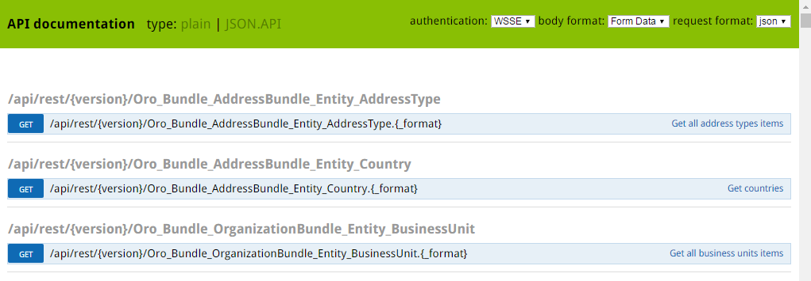
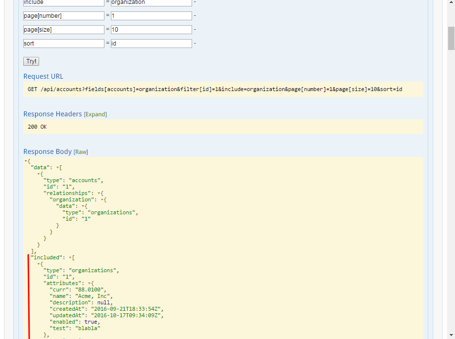

Web Services API
================

.. contents:: :local:
    :depth: 6

Overview
--------

An application programming interface (API) is a software interface which is designed to be used by other software.
Whilst an ordinary software program is used by a (human) computer user, an API is a software program used by
another software program.

The Representational State Transfer (REST) architectural style is an abstraction of the architectural elements
within a distributed hypermedia system. REST ignores the details of component implementation and protocol syntax in
order to focus on the roles of the components, the constraints on their interaction with other components, and their
interpretation of significant data elements. It encompasses the fundamental constraints on components, connectors,
and data that define the basis of the Web architecture, and thus the essence of its behavior as a network-based
application.

**JSON API** is a `specification <http://jsonapi.org/format/>`__  for how a client should request those resources to
be fetched or modified, and how a server should respond to them. It is designed to minimize both the number of requests
and the amount of data transmitted between the clients and the servers. This efficiency is achieved without compromising
on readability, flexibility or discoverability.

Therefore, here and below the term *API* will refer to the REST JSON API that gives programmatic access
to read and write data. Request and response body should use JSON format.

Quick Start
-----------

Create an API Key
^^^^^^^^^^^^^^^^^

To start using the API, you must take a few preliminary steps:

    1. Ensure that the application is installed correctly.

    2. Generate an API key for a user:

        - If you want to generate an API key for yourself, navigate to the profile page of your user:

            - either click the :guilabel:`My User` link in the **User Menu** in the top right corner of the current page, or

            - follow the direct link, e.g. ``http://<hostname_of_your_oro_application>/user/profile/view``.

        - If you want to generate an API key for another user:

            - open their view page,

            - open the :guilabel:`Users` grid (:guilabel:`System` --> :guilabel:`User Management` --> :guilabel:`Users`),

            - find the user who needs an API key,

            - click the corresponding grid row or the |icView| :guilabel:`View` icon from the ellipsis menu at the right-hand end of the row.

    3.  Click the :guilabel:`Generate Key` button. You will see the generated key near the button, it will look like: 'dd1c18d06773cc377c9df6166c54c6e5fefa50fa'.

.. image:: ./img/api/api_generateapikey_myuser.png

For more details about how to generate an API Key and authentication header, please see the

`How to use WSSE authentication <../cookbook/how-to-use-wsse-authentication>`__ section of `The Oro Cookbook <../cookbook>`__ guide and the :ref:`View Your User Page, and Set up Your Profile <user-guide-intro-log-in-edit-profile>` section of the `User Guide <../user-guide>`__.

.. important::

    Please note that an API key will be generated in the scope of the current organization and will allow you to access data
    in the scope of that particular organization only. For more information about the organization entity purposes, see the `Company Structure and Organization <../user-guide/intro-company-structure-org-selector>`__ guide.
    To understand the permissions and security model, see the `Security <./security>`__ guide.

After the API key is generated, you will be able to execute API requests via the sandbox, Curl command, any other REST client or use the API via your own application.

API Sandbox
^^^^^^^^^^^

The API sandbox page allows you to perform API requests directly from the Oro application instance.

How to use the sandbox
""""""""""""""""""""""

The sandbox page is available at: ``http://<hostname_of_your_oro_application>/api/doc``.

|

|

This page represents a list of plain API resources. Plain API resources are old API implementations
based on `FOSRestBundle <http://symfony.com/doc/current/bundles/FOSRestBundle/index.html>`__.

To switch to the JSON API sandbox, go to the ``http://<hostname_of_your_oro_application>/api/doc/rest_json_api`` page, or click the :guilabel:`JSON.API`
link in the upper left-hand corner of the sandbox page.

|

.. image:: ./img/api/api_jsonlink.png

|

On the JSON.API sandbox page you will see the list of available resources.

|

.. image:: ./img/api/api_json_generalview.png

|

To review available methods for the resource, click the resource row or the :guilabel:`List Operations` link at the right-hand end of the row. You will see the list of available methods grouped in blocks by the resource URI.

|

.. image:: ./img/api/api_json_listmethods.png

|

There is a documentation on how a method can be used with different resource URIs and there is a sandbox which contains a form that can be used to perform API requests.
To review the documentation and access the sandbox, click the method row for a specific resource URI. You will see the corresponding tabs in the expanded area.

|

.. image:: ./img/api/api_json_methodsb.png

|

To expand information about all methods available for the resource, click the :guilabel:`Expand Operations` link at the right-hand end of resource row.

To switch between the collapsed list of available resources and the expanded state, click the :guilabel:`Show / hide` link at the right-hand end of the row.

Examples
^^^^^^^^

Retrieve a single record
""""""""""""""""""""""""

To retrieve a single record for a particular resource record with JSON API, perform the GET method with the id parameter specified:

    1.  Click the API resource row on the ``http://<hostname_of_your_oro_application>/api/doc/rest_json_api`` page to expand the methods block.

    2.  Find the :guilabel:`/api/your_resource/{id}` block.

    3.  Click the :guilabel:`GET` method row.

    4.  Click the :guilabel:`Sandbox` tab. You will see the request form.

    5.  If you want to retrieve a single record, specify the record id for the :guilabel:`id` field in the :guilabel:`Requirements` section.

    6.  Click the :guilabel:`Try!` button to send the request to the server.

As soon as the response from the server is received, the :guilabel:`Request URL`, :guilabel:`Response Headers`, :guilabel:`Response Body`
and :guilabel:`Curl Command Line` sections will appear at the bottom of the :guilabel:`Sandbox` tab.

The :guilabel:`Request URL` block contains the request URL sent to the server.

The :guilabel:`Response Headers` block contains the status code of the server's response. If the request is successful,
it contains the '200 OK' string.
To see the list of headers which the server sent in the response, click the :guilabel:`Expand` link next to the section header .

If the request is successful, you should see the output data of the request in the :guilabel:`Response Body` section. In the given
case, entity data will be in JSON format. More information about this format can
be found on the `JSON API <http://jsonapi.org/format/>`__ site.

The :guilabel:`Curl Command Line` section contains an example of the CLI command to perform the request
with `Curl <https://curl.haxx.se/>`__.
This command may help emulate the real request to the API.

.. important::

    When performing Curl requests, please make sure your **X-WSSE** header is up to date for each request.

Edit a record
"""""""""""""

To edit a record for a particular resource record with JSON API, perform the PATCH method with the id parameter specified:

    1.  Click the API resource row on the ``http://<hostname_of_your_oro_application>/api/doc/rest_json_api`` page to expand the method block.

    2.  Find the :guilabel:`/api/your_resource/{id}` block.

    3.  Click the :guilabel:`PATCH` method row.

    4.  Click the :guilabel:`Sandbox` tab. You will see the request form.

    5.  If you want to edit a single record, in the :guilabel:`Requirements` section, in the :guilabel:`id` field, specify the record id.

    6.  In the :guilabel:`Content` section, specify how the resource how a resource currently residing on the server should be modified to produce a new version.

        For example, if you want to change the **firstName** field to 'John' value for a User entity with id 1, the request content will look the following way:

        .. code-block:: json

            {
              "data": {
                "type": "users",
                "id": "1",
                "attributes": {
                  "firstName": "John",
                }
              }
            }

    7.  Click the :guilabel:`Try!` button to send the request to the server.

Provided you have the edit permission to the record, you will see the updated data in the
:guilabel:`Response Body` section after the response from the server is received.

|

API in Detail
-------------

Schema
^^^^^^

All API access is over HTTP or HTTPS (depending on a server configuration) and is accessed from the ``http(s)://<hostname_of_your_oro_application>/api/<resource_name>``
All data is sent and received as JSON.

A typical request can be performed via curl or via the JSON sandbox.

Curl Example
""""""""""""

.. code-block:: http

    GET /api/users/1 HTTP/1.1

    curl -X "GET" -H "Content-Type: application/vnd.api+json"
         -H "Authorization: WSSE profile='UsernameToken'"
         -H "X-WSSE: UsernameToken Username='admin',
             PasswordDigest='D5AjIiPf7edQX2EX8hLwtB3XhQY=',
             Created='2016-09-19T20:00:00+03:00',
             Nonce='N2hlMDc3TGcrVU53bGprNlQ0YXliLy9PSEFNPQ=='"
    http://localhost.com/api/users/1

Please note that to simplify representation of request examples in the document, a short format will be used, e.g.:

.. code-block:: http

    GET /api/users/1 HTTP/1.1
    Host: localhost.com
    Content-Type: application/vnd.api+json
    Authorization: WSSE profile='UsernameToken'
    X-WSSE: UsernameToken Username='...', PasswordDigest='...', Created='...', Nonce='...'

**Typical response header**

.. code-block:: http

    HTTP/1.1 200 OK
    Server: Apache/2.4.18 (Unix) PHP/5.5.38
    Date: Mon, 19 Sep 2016 17:52:34 GMT
    Content-Type: application/vnd.api+json
    Connection: keep-alive
    Status: 200 OK
    Content-Length: 5279
    Cache-Control: max-age=0, no-store

**Typical response body**

.. code-block:: json

    { "data": {
        "type": "users",
        "id": "1",
        "attributes": {
            "title": null,
            "email": "admin@local.com",
            "firstName": "John",
            "enabled": true,
            "lastLogin": "2016-09-19T11:01:31Z",
        },
        "relationships": {
            "owner": { "data": { "type": "businessunits", "id": "1"} },
            "businessUnits": { "data": [ { "type": "businessunits", "id": "1" } ] },
        }
    }}

Blank fields are included as *null* instead of being omitted.

Attributes or sub resources that are restricted are included as *null* as well.

All timestamps are returned in ISO 8601 format: *YYYY-MM-DDTHH:MM:SSZ*.

Authentication
^^^^^^^^^^^^^^

A RESTful API should be stateless. This means that request authentication should not depend on cookies or sessions.
Instead, each request should come with some authentication credentials.

For authentication purposes, the **WSSE** mechanism is used—a family of open security specifications for web services,
specifically SOAP web services. The basic premise of WSSE is that a request header is checked for encrypted credentials,
verified using a timestamp and nonce, and authenticated for the requested user using a password digest.

It’s based on the `EscapeWSSEAuthenticationBundle <https://github.com/escapestudios/EscapeWSSEAuthenticationBundle>`__
that covers most cases from the
`WSSE specification <http://docs.oasis-open.org/wss/2004/01/oasis-200401-wss-soap-message-security-1.0.pdf>`__ (PDF).

Here's an example of a request header with the WSSE authentication. Please pay attention to the **Authentication** and **X-WSSE** parameters:

.. code-block:: http

    GET /api/users HTTP/1.1
    Host: localhost.com
    Connection: keep-alive
    User-Agent: Mozilla/5.0 ...
    Connection: keep-alive
    Accept: */*

    Content-Type: application/vnd.api+json
    Authorization: WSSE profile="UsernameToken"
    X-WSSE: UsernameToken Username="admin",
            PasswordDigest="Cae37DaU9JT1pwoaG5i7bXbDBo0=",
            Created="2016-09-20T10:00:00+03:00",
            Nonce="elRZL0lVOTl2T3lXeVBmUHRCL2ZrUnJoWUNZPQ=="

For more details about WSSE authentication and particularly for how to generate an API Key and authentication header, please see the
`How to use WSSE authentication <../cookbook/how-to-use-wsse-authentication>`__ section of `The Oro Cookbook <../cookbook>`__ guide.

HTTP Methods Available in Oro API
^^^^^^^^^^^^^^^^^^^^^^^^^^^^^^^^^

The primary or most commonly-used HTTP methods are POST, GET, PUT, PATCH, and DELETE. These correspond to create, read, update, and delete (or CRUD) operations, respectively. There are a number of other methods, too, but they are utilized less frequently.

Below is a table summarizing HTTP methods available in Oro API and their return values in combination with the resource URIs:

+-------------+----------------+----------------------------------------+----------------------------------------------+
| HTTP Method | CRUD operation | Entire Collection (e.g. /users)        |         Specific Item (e.g. /users/{id})     |
+=============+================+========================================+==============================================+
| GET         | Read           | 200 (OK), list of entities.            | 200 (OK), single entity.                     |
|             |                | Use pagination, sorting and filtering  |                                              |
|             |                | to navigate big lists.                 | 404 (Not Found), if ID not found or invalid. |
|             |                |                                        |                                              |
+-------------+----------------+----------------------------------------+----------------------------------------------+
| POST        | Create         | 201 (Created), Response contains       | **not applicable**                           |
|             |                | response similar to **GET** /user/{id} |                                              |
|             |                | containing new ID.                     |                                              |
+-------------+----------------+----------------------------------------+----------------------------------------------+
| PATCH       | Update         | **not applicable**                     | 200 (OK) or 204 (No Content).                |
|             |                |                                        |                                              |
|             |                |                                        | 404 (Not Found), if ID not found or invalid. |
+-------------+----------------+----------------------------------------+----------------------------------------------+
| DELETE      | Delete         | 200(OK) or 403(Forbidden) or           | 200 (OK).                                    |
|             |                | 400(Bad Request) if no filter          |                                              |
|             |                | is specified.                          | 404 (Not Found), if ID not found or invalid. |
+-------------+----------------+----------------------------------------+----------------------------------------------+
| PUT         | Update/Replace | **not implemented**                    | **not implemented**                          |
+-------------+----------------+----------------------------------------+----------------------------------------------+

Also, the HTTP methods can be classified by the *idempotent* and *safe* properties.

The *safe* methods are the HTTP methods that do not modify resources. For instance, using GET or HEAD on a resource URL,
should NEVER change the resource.

An *idempotent* HTTP method is an HTTP method that can be called many times without different outcomes. It would not
matter if the method is called only once, or ten times over. The result should be the same.
For more details, please see `RFC 7231: Common Method Properties <https://tools.ietf.org/html/rfc7231#section-4.2>`__.

Below is a table summarizing HTTP methods by its idempotency and safety:

+-------------+------------+------+
| HTTP Method | Idempotent | Safe |
+=============+============+======+
| OPTIONS     | yes        | yes  |
+-------------+------------+------+
| GET         | yes        | yes  |
+-------------+------------+------+
| HEAD        | yes        | yes  |
+-------------+------------+------+
| PUT         | yes        | no   |
+-------------+------------+------+
| POST        | no         | no   |
+-------------+------------+------+
| DELETE      | yes        | no   |
+-------------+------------+------+
| PATCH       | no         | no   |
+-------------+------------+------+

GET
"""

The HTTP GET method is used to *read* (or retrieve) a representation of a resource. In case of success (or non-error), GET returns a representation in JSON and an HTTP response status code of 200 (OK). In an error case, it most often returns a 404 (NOT FOUND) or 400 (BAD REQUEST).

.. note::
    According to the design of the HTTP specification, GET requests are used only to read data and not change it.
    So, they are considered safe. That is, they can be called without risk of data modification or corruption—calling it once has the same effect as calling it 10 times.

POST
""""

The POST method is most often utilized to *create* new resources. In particular, it is used to create subordinate
resources. That is, subordinate to some other (e.g. parent) resource. In other words, when creating a new resource,
POST to the parent and the service takes care of associating the new resource with the parent, assigning an
ID (new resource URI), etc.

On successful creation, HTTP response code 201 is returned.

.. caution::

    POST is not a safe operation. Making two identical POST requests will most likely result in two resources containing
    the same information but with different identifiers.

.. note::
    It is possible to create both primary and related API resources via a single API request. For details see the `Create and Update       Related Resources Together with a Primary API Resource <./data-api#create-and-update-related-resources-together-with-a-primary-api-     resource>`__ section.

PATCH
"""""

PATCH is used to *modify* resources. The PATCH request only needs to contain the changes to the resource,
not the complete resource.

In other words, the body should contain a set of instructions describing how a resource currently residing on the
server should be modified to produce a new version.

.. caution::

    PATCH is not a safe operation. Collisions from multiple PATCH requests may be dangerous because some patch formats
    need to operate from a known base point, otherwise they will corrupt the resource. Clients using this kind of patch
    application should use a conditional request (e.g. GET a resource, ensure it was not modified and apply PATCH) such
    that the request will fail, if the resource has been updated since the client last accessed the resource.

.. note::
    `Create and Update Related Resources Together with a Primary API Resource <./data-api#create-and-update-related-resources-together-     with-a-primary-api-resource>`__ section.

DELETE
""""""

DELETE is quite easy to understand. It is used to *delete* a resource identified by filters or ID.

On successful deletion, the HTTP response status code 204 (No Content) returns with no response body.

.. important::

    If you DELETE a resource, it is removed. Repeatedly calling DELETE on that resource will often return a 404 (NOT FOUND)
    since it was already removed and, therefore, is no longer findable.

HTTP Header Specifics
^^^^^^^^^^^^^^^^^^^^^

As mentioned in the `Authentication <./data-api#authentication>`__ section, to successfully perform an API request, it is important to provide the correct **Content-Type**
and **Authentication** parameters, e.g.:

.. code-block:: http

    GET /api/users HTTP/1.1
    Content-Type: application/vnd.api+json
    Authorization: WSSE profile="UsernameToken"
    X-WSSE: UsernameToken Username="...",PasswordDigest="...", Created="...", Nonce="..."

Also, by providing additional requests header parameters, it is possible to retrieve additional information, such as the total
number of records per certain resource for GET and DELETE methods or a total number of affected records
for the DELETE methods. The **X-Include** request header can be used for such purposes.

The following table describes all existing keys for the X-Include header.

+-------------+-----------------+---------------------------+-----------------------------------------+
| HTTP Method | X-Include key   | Response Header           | Description                             |
+=============+=================+===========================+=========================================+
| GET         | totalCount      | X-Include-Total-Count     | Returns the total number of entities.   |
+-------------+-----------------+---------------------------+-----------------------------------------+
| DELETE      | totalCount      | X-Include-Total-Count     | Returns the total number of entities.   |
+-------------+-----------------+---------------------------+-----------------------------------------+
| DELETE      | deletedCount    | X-Include-Deleted-Count   | Returns the number of deleted entities. |
+-------------+-----------------+---------------------------+-----------------------------------------+

Header Examples
"""""""""""""""
Example 1. Total number of existing records
~~~~~~~~~~~~~~~~~~~~~~~~~~~~~~~~~~~~~~~~~~~

Retrieve the total count of resource records.

**Request header**

.. code-block:: http

    GET /api/users HTTP/1.1

    Content-Type: application/vnd.api+json
    Accept: application/vnd.api+json
    Authorization: ...
    ...
    X-Include: totalCount

**Response**

.. code-block:: http

    HTTP/1.1 200 OK
    Date: Fri, 23 Sep 2016 12:27:05 GMT
    Server: Apache/2.4.18 (Unix) PHP/5.5.38

    X-Include-Total-Count: 49

    Content-Length: 585
    Keep-Alive: timeout=5, max=100
    Connection: Keep-Alive
    Content-Type: application/vnd.api+json

Example 2. Total number of deleted records
~~~~~~~~~~~~~~~~~~~~~~~~~~~~~~~~~~~~~~~~~~
Retrieve the total number of deleted records of the resource

**Request header**

.. code-block:: http

    DELETE /api/users HTTP/1.1

    Content-Type: application/vnd.api+json
    Accept: application/vnd.api+json
    Authorization: ....
    ....
    X-Include: deletedCount

Example 3. Conditions for deletion operation
~~~~~~~~~~~~~~~~~~~~~~~~~~~~~~~~~~~~~~~~~~~~
Request query string contains a filter that specifies conditions for deletion operation. Filters are described in more detail in the `Filters <data-api#filters>`__ section.

**Request header**

.. code-block:: http

    DELETE /api/users?filter[id]=21,22 HTTP/1.1

    Content-Type: application/vnd.api+json
    Accept: application/vnd.api+json
    Authorization: ....

**Response**

.. code-block:: http

    HTTP/1.1 204 No Content
    Date: Fri, 23 Sep 2016 12:38:47 GMT
    Server: Apache/2.4.18 (Unix) PHP/5.5.38

    X-Include-Deleted-Count: 2

    Content-Length: 0
    Keep-Alive: timeout=5, max=100
    Connection: Keep-Alive
    Content-Type: text/html

Response Status Codes and Errors
^^^^^^^^^^^^^^^^^^^^^^^^^^^^^^^^
Response status codes
"""""""""""""""""""""

In case of a successful request, a response status code will be one of the following:

    -   **200 OK**—In the response to a successful GET, PATCH or DELETE.

    -   **201 Created**—In the response to a POST that results in a creation. When this status received, the request body contains the description of the newly created entity in JSON format (similar to regular GET request).

    -   **204 No Content**—In the response to a successful request that won't be returning a body (like a DELETE request)

Example. Successful request
~~~~~~~~~~~~~~~~~~~~~~~~~~~

**Request**

   .. code-block:: http

       GET /api/users/1 HTTP/1.1

**Response**

   .. code-block:: http

       HTTP/1.1 200 OK

       Request URL: http://localhost.com/api/users/1
       Request Method: GET
       Status Code: 200 OK
       Remote Address: 127.0.0.1:80

In case of an error, a response status code indicates the type of an error that has occurred. The most common of such codes are the following:

    -   **400 Bad Request**—The request is malformed, such as if the body of the request contains misformatted JSON.

    -   **401 Unauthorized**—No or invalid authentication details are provided. This code can be used to trigger an authentication pop-up if the API is used from a browser.

    -   **403 Forbidden**—Authentication succeeded but authenticated user does not have access to the resource.

    -   **404 Not Found**—A non-existent resource is requested.

    -   **500 Internal Server Error**—The server encountered an unexpected condition which prevented it from fulfilling the request.

Example. Request resulted in error
~~~~~~~~~~~~~~~~~~~~~~~~~~~~~~~~~~

**Request**

   .. code-block:: http

       GET /api/users/999 HTTP/1.1

**Response**

   .. code-block:: http

       HTTP/1.1 404 Not Found

       Request URL: http://localhost.com/api/users/1
       Request Method: GET
       Status Code: 404 Not Found
       Remote Address: 127.0.0.1:80

Error Messages
""""""""""""""

Similar to an HTML error page that shows a useful error message to a visitor, the API displays an error message in
a consumable format. Representation of an error looks the same as the representation of any resource, only
with its own set of fields.

.. code-block:: json

    {
      "errors": [
        {
          "status": "404",
          "title": "not found http exception",
          "detail": "An entity with the requested identifier does not exist."
        }
      ]
    }

Resource Fields
^^^^^^^^^^^^^^^

Most common resource fields
"""""""""""""""""""""""""""

+--------------+--------------+-----------------------------------------------------------------------------------------------------+
| Name         | Type         | Description                                                                                         |
+==============+==============+=====================================================================================================+
| id           | integer      | The unique identifier of a resource. In most cases, it is represented by an integer value, but      |
|              |              | depending on the resource data model, it can be represented by a string or contain multiple columns |
+--------------+--------------+-----------------------------------------------------------------------------------------------------+
| createdAt    | datetime     | The date and time of resource record creation.                                                      |
+--------------+--------------+-----------------------------------------------------------------------------------------------------+
| updatedAt    | datetime     | The date and time of the last update of the resource record.                                        |
+--------------+--------------+-----------------------------------------------------------------------------------------------------+
| owner        | user         | Defines the range of users that are responsible for a record and can manage it.                     |
|              | or           | Ownership also determines access permissions.                                                       |
|              | businessunit | For more details, see :ref:`Access / Role Management <user-guide-user-management-permissions>`.     |
|              | or           |                                                                                                     |
|              | organization |                                                                                                     |
+--------------+--------------+-----------------------------------------------------------------------------------------------------+
| organization | organization | An organization record represents a real enterprise, business, firm, company or another             |
|              |              | organization to which the users belong. Available only in Enterprise Edition instances.             |
|              |              | For more details about the **organization** field purposes, see                                     |
|              |              | `Company Structure and Organization <../user-guide/intro-company-structure-org-selector>`__         |
+--------------+--------------+-----------------------------------------------------------------------------------------------------+

Typical Communication Activities Fields
"""""""""""""""""""""""""""""""""""""""

The term 'communication activity' describes an activity that involves communications and can have a direction, that is, be incoming or outgoing.
For example, 'Call' and 'Email' are communication activities. When a client calls or sends an email to their
manager, it is an incoming communication activity. When a manager calls a client or sends an email, it is an outgoing communication activity.
The data based on communication activities may be used to build useful forecast reports.

The table below describes fields available for the resources that support such communication activities
as 'Call,' 'Email,' etc.

+----------------------+----------+----------------------------------------------------------------------------------------+
| Name                 | Type     | Description                                                                            |
+======================+==========+========================================================================================+
| lastContactedDate    | datetime | The date and time of the last communication activity for the resource record.          |
+----------------------+----------+----------------------------------------------------------------------------------------+
| lastContactedDateIn  | datetime | The date and time of the last incoming communication activity for the resource record. |
+----------------------+----------+----------------------------------------------------------------------------------------+
| lastContactedDateOut | datetime | The date and time of the last outgoing communication activity for the resource record. |
+----------------------+----------+----------------------------------------------------------------------------------------+
| timesContacted       | integer  | Date and time of the last contact attempt (email sent, call logged,                    |
|                      |          | or other contact activity). Marketing emails are not counted.                          |
+----------------------+----------+----------------------------------------------------------------------------------------+
| timesContactedIn     | integer  | Date and time of the last incoming contact attempt (email received,                    |
|                      |          | incoming call logged, or other contact activity). Marketing emails are not counted.    |
+----------------------+----------+----------------------------------------------------------------------------------------+
| timesContactedOut    | integer  | Date and time of the last outgoing contact attempt (email sent, outgoing call logged,  |
|                      |          | or other contact activity). Marketing emails are not counted.                          |
+----------------------+----------+----------------------------------------------------------------------------------------+

Filters
^^^^^^^

You can perform the GET and DELETE methods on a subset of resource records. A subset of records can be received by applying filters to some of the resource's fields.

Available filters are listed in the :guilabel:`Documentation` tab of the method's expanded area, in the :guilabel:`Filters` section.

To filter, perform a GET request and put your filters parameters in the query string.

|

Example 1. Filter in the query string
"""""""""""""""""""""""""""""""""""""

Retrieve all users of organization '1'.

**Request**

.. code-block:: http

    GET /api/users?filter[organization]=1 HTTP/1.1

Similar to a field, a filter declares a data type and only takes specific values in input.

Below are examples of requests and errors.

Example 2. Wrong input type
"""""""""""""""""""""""""""

A string value is passed as an input to a filter which can contain only integer values.

.. code-block:: http

    GET /api/users?filter[id]=aaa HTTP/1.1

    { "errors": [{
      "status": "400",
      "title": "unexpected value exception",
      "detail": "Expected integer value. Given \"aaa\".",
      "source": {
        "parameter": "filter[id]"
      }
    }] }

Example 3. Unknown filter
"""""""""""""""""""""""""

Unknown, mistyped or unsupported filter.

.. code-block:: http

    GET /api/users?filter[unknown]=aaa HTTP/1.1

    { "errors": [{
      "status": "400",
      "title": "filter constraint",
      "detail": "Filter \"filter[unknown]\" is not supported.",
      "source": {
        "parameter": "filter[unknown]"
      }
    }] }

The API allows you to use several types of filters. Filter types are briefly described in the table below.

+---------+------------------------------+-----------------------------------------------------------------------------+
| Filter  | Usage Example                | Description                                                                 |
+=========+==============================+=============================================================================+
| fields  | fields[owner]=id,name        | Used for limiting the response data only to specified fields.               |
|         |                              | Depends on the **include** filter if the filter is applied to a relation.   |
+---------+------------------------------+-----------------------------------------------------------------------------+
| filter  | filter[id]=1                 | Used for filtering the response data by specific values of a specific       |
|         | or                           | field. Can accept additional operators like ``<``, ``>``, etc.              |
|         | filter[id]=5,7               |                                                                             |
|         | or                           | May accept several values. In such case, they will be perceived as          |
|         | filter[id]>8&filter[name]=a  | connected using a logical ``OR`` operator,                                  |
|         |                              | e.g. id == 5 OR id == 7                                                     |
|         |                              |                                                                             |
|         |                              | And in case of several filters in request, all of them will be perceived as |
|         |                              | connected using a logical ``AND`` operator,                                 |
|         |                              | e.g. id > 8 AND name == 'a'                                                 |
+---------+------------------------------+-----------------------------------------------------------------------------+
| include | include=[owner,organization] | Used for inclusion into response the related resources data.                |
+---------+------------------------------+-----------------------------------------------------------------------------+
| page    | page[size]=10&page[number]=1 | Used for pagination purposes.                                               |
+---------+------------------------------+-----------------------------------------------------------------------------+
| sort    | sort=id                      | Used for data sorting. By default the ASC sorting applies.                  |
|         | or                           |                                                                             |
|         | sort=id,-name                | To perform DESC sorting specify ``-`` before field name.                    |
+---------+------------------------------+-----------------------------------------------------------------------------+
| meta    | meta=property1,property2     | Used for requesting additional meta properties for API resources.           |
+---------+------------------------------+-----------------------------------------------------------------------------+

Fields Filter (**fields**)
""""""""""""""""""""""""""

All objects are composed of fields. They all have a unique identifier in the given class of objects (ID), plus some
other fields defined in the Data API Reference. Some fields are publicly readable, some other are not and need the user
to have extended permissions to use them.

To request particular fields, use the **fields** filter and specify the fields you need in the response as its values.

.. important::

    We recommend you to always use the fields filter and retrieve only the fields you will use in your application.

Example. Retrieve only required fields
~~~~~~~~~~~~~~~~~~~~~~~~~~~~~~~~~~~~~~

    Select the **username** and the **email** fields of the **users** resource.

    **Request**

    .. code-block:: http

        GET api/users?fields[users]=username,email HTTP/1.1

        Content-Type: application/vnd.api+json
        Accept: application/vnd.api+json
        ...

    **Response**

    .. code-block:: json

        {
          "data": [
            {
              "type": "users",
              "id": "1",
              "attributes": {
                "username": "admin",
                "email": "admin@local.com"
              }
            },
            {
              "type": "users",
              "id": "2",
              "attributes": {
                "username": "sale",
                "email": "sale@example.com"
              }
            }
          ]
        }

Data Filter (**filter**)
""""""""""""""""""""""""

Depending on the type of the filter, certain operators are allowed. For example, for integer filter type it
is allowed to use six operators: **=**, **!=**, **<**, **<=**, **>**, **>=**, for string filter type - only two: **=**, **!**.

+----------+-----------------------+-------------+---------------------------------------+
| Operator | Description           | URL Encoded | Request Example                       |
+==========+=======================+=============+=======================================+
| **=**    | Equality              | %3D         | GET /api/users?filter[id]=1 HTTP/1.1  |
+----------+-----------------------+-------------+---------------------------------------+
| **!=**   | Inequality            | %21%3D      | GET /api/users?filter[id]!=2 HTTP/1.1 |
+----------+-----------------------+-------------+---------------------------------------+
| **<**    | Less than             | %3C         | GET /api/users?filter[id]<3 HTTP/1.1  |
+----------+-----------------------+-------------+---------------------------------------+
| **<=**   | Less than or equal    | %3C%3D      | GET /api/users?filter[id]<=4 HTTP/1.1 |
+----------+-----------------------+-------------+---------------------------------------+
| **>**    | Greater than          | %3E         | GET /api/users?filter[id]>5 HTTP/1.1  |
+----------+-----------------------+-------------+---------------------------------------+
| **>=**   | Greater than or equal | %3E%3D      | GET /api/users?filter[id]>=6 HTTP/1.1 |
+----------+-----------------------+-------------+---------------------------------------+

Example. Use operators to filter data
~~~~~~~~~~~~~~~~~~~~~~~~~~~~~~~~~~~~~

**Request**

.. code-block:: http

    GET /api/users?filter[id]>5$page[number]=1&page[size]=2&fields[users]=username,email HTTP/1.1

    Content-Type: application/vnd.api+json
    Accept: application/vnd.api+json
    ...

**Response**

.. code-block:: json

    {
      "data": [
        {
          "type": "users",
          "id": "6",
          "attributes": {
            "username": "jimmy.henderson_c4261",
            "email": "jimmy.henderson_c428e@example.com"
          }
        },
        {
          "type": "users",
          "id": "7",
          "attributes": {
            "username": "gene.cardenas_c760d",
            "email": "gene.cardenas_c7620@yahoo.com"
          }
        }
      ]
    }

Inclusion Filter (**include**)
""""""""""""""""""""""""""""""

As mentioned above, the **include** filter allows you to extend the response data with the related resources information.
It is usually used to reduce the number of requests to the server or, in other words, to retrieve all necessary data
in a single request.

All included resources will be represented in **included** section at the end of the response body.

.. important::

    Please note, in case of using **fields** filter for the main resource (e.g. users), it must contain
    the field(s) used in the **include** filter.

Example. Include a related resources information
~~~~~~~~~~~~~~~~~~~~~~~~~~~~~~~~~~~~~~~~~~~~~~~~

Include the **roles** relation with the **fields** filter.

**Request**

.. code-block:: http

    GET api/users?fields[users]=username,email,roles&include=roles&page[number]=1&page[size]=1 HTTP/1.1

    Content-Type: application/vnd.api+json
    Accept: application/vnd.api+json
    ...

**Response**

.. code-block:: json

    {
      "data": [
        {
          "type": "users",
          "id": "1",
          "attributes": {
            "username": "admin",
            "email": "admin@local.com"
          },
          "relationships": {
            "roles": {
              "data": [
                {
                  "type": "userroles",
                  "id": "3"
                }
              ]
            }
          }
        }
      ],
      "included": [
        {
          "type": "userroles",
          "id": "3",
          "attributes": {
            "extend_description": null,
            "role": "ROLE_ADMINISTRATOR",
            "label": "Administrator"
          },
          "relationships": {
            "organization": {
              "data": null
            }
          }
        }
      ]
    }

Also, it is possible to limit fields that will be retrieved from the relation. For such purposes, the **fields** filter
should be used.

Example. Retrieve only required fields of the related resource
~~~~~~~~~~~~~~~~~~~~~~~~~~~~~~~~~~~~~~~~~~~~~~~~~~~~~~~~~~~~~~

**Request**

.. code-block:: http

    GET api/users?fields[userroles]=label&fields[users]=username,email,roles&include=roles&page[number]=1&page[size]=1 HTTP/1.1

    Content-Type: application/vnd.api+json
    Accept: application/vnd.api+json
    ...

**Response**

.. code-block:: json

    {
      "data": [
        {
          "type": "users",
          "id": "1",
          "attributes": {
            "username": "admin",
            "email": "admin@local.com"
          },
          "relationships": {
            "roles": {
              "data": [
                {
                  "type": "userroles",
                  "id": "3"
                }
              ]
            }
          }
        }
      ],
      "included": [
        {
          "type": "userroles",
          "id": "3",
          "attributes": {
            "label": "Administrator"
          }
        }
      ]
    }

Pagination Filter (**page**)
""""""""""""""""""""""""""""

By default, the page size is limited to 10 records and the page number is 1. However, it is possible to ask the server to
change the page size or page number to get the records that will fit your needs. Pagination
parameters should be passed as the parameters of the query string.

+----------------+---------+---------------+---------------------------------------------------------------------+
| Parameter name | Type    | Default value | Description                                                         |
+================+=========+===============+=====================================================================+
| page[size]     | integer | 10            | Set a positive integer number.                                      |
|                |         |               | To disable the pagination, set it as -1. In this case               |
|                |         |               | **page[number]** will not be taken into account and can be omitted. |
+----------------+---------+---------------+---------------------------------------------------------------------+
| page[number]   | integer | 1             | The number of the page.                                             |
+----------------+---------+---------------+---------------------------------------------------------------------+

Example. Retrieve a particular page of the paged response
~~~~~~~~~~~~~~~~~~~~~~~~~~~~~~~~~~~~~~~~~~~~~~~~~~~~~~~~~

Get the 2nd page of the retrieved records for the **users** resource with 20 records per page.

**Request**

.. code-block:: http

    GET /api/users?page[number]=2&page[size]=20 HTTP/1.1

    Content-Type: application/vnd.api+json
    Accept: application/vnd.api+json
    ...

Sorting Filter (**sort**)
"""""""""""""""""""""""""

When the response to your call is a list of objects, you can also sort this list by using the sort filter with any of the
available values listed in the API reference.

Example. Sort by a field value
~~~~~~~~~~~~~~~~~~~~~~~~~~~~~~

Sort by **username** in descending order.

**Request**

.. code-block:: http

    GET /api/users?filter[id]>5$page[number]=1&page[size]=2&fields[users]=username,email&sort=-username HTTP/1.1

    Content-Type: application/vnd.api+json
    Accept: application/vnd.api+json
    ...

**Response**

.. code-block:: json

    {
      "data": [
        {
          "type": "users",
          "id": "24",
          "attributes": {
            "username": "william.morrison_247fe",
            "email": "william.morrison_2482c@msn.com"
          }
        },
        {
          "type": "users",
          "id": "31",
          "attributes": {
            "username": "victor.nixon_54050",
            "email": "victor.nixon_5406f@gmail.com"
          }
        }
      ]
    }

Meta Property Filter (**meta**)
"""""""""""""""""""""""""""""""

The **meta** filter allows you to request additional meta properties for the resource. Meta properties will be generated for every item and will be returned in the item's meta object in the response data.

The following table contains a list of supported meta properties that may be requested using *?meta=meta_property_name* filter:

+---------------+----------------------------------------+
| Name          | Description                            |
+===============+========================================+
| title         | A text representation of the resource. |
+---------------+----------------------------------------+

Example. Retrieve a text representation of the resource
~~~~~~~~~~~~~~~~~~~~~~~~~~~~~~~~~~~~~~~~~~~~~~~~~~~~~~~

    **Request**

    .. code-block:: http

        GET api/users?meta=title HTTP/1.1

        Content-Type: application/vnd.api+json
        Accept: application/vnd.api+json
        ...

    **Response**

    .. code-block:: json

        {
          "data": [
            {
              "type": "users",
              "id": "1",
              "meta": {
                "title": "John Doe",
              },
              "attributes": {
                "username": "john.doe",
              }
            },
            {
              "type": "users",
              "id": "2",
              "meta": {
                "title": "Ellen Rowell",
              },
              "attributes": {
                "username": "ellen.rowell"
              }
            }
          ]
        }

Create and Update Related Resources Together with a Primary API Resource
^^^^^^^^^^^^^^^^^^^^^^^^^^^^^^^^^^^^^^^^^^^^^^^^^^^^^^^^^^^^^^^^^^^^^^^^

Sometimes it is required to create or update related resources while creating or updating the primary API resource. Especially often such a need arises when you create a complex API resource object via a single API request. Unfortunately, the JSON API specification does not describe how to do this. The solution proposed by the Oro Platform is to use the **included** section of a JSON request body. Please take a look at the following example:

**Request**

.. code-block:: http

    POST /api/accounts HTTP/1.1
    Content-Type: application/vnd.api+json

**Request Body**

.. code-block:: json

    {"data": {
        "type": "accounts",
        "id": "1",
        "attributes": {
          "name": "Cloth World"
        },
        "relationships": {
          "organization": {
            "data": {"type": "organizations", "id": "1"}
          },
          "owner": {
            "data": {"type": "users", "id": "1"}
          },
          "contacts": {
            "data": [
              {"type": "contacts", "id": "8da4d8e7-6b25-4c5c-8075-b510f7bbb84f"},
              {"type": "contacts", "id": "707dda0d-35f5-47b9-b2ce-a3e92b9fdee7"}
            ]
          },
          "defaultContact": {
            "data": {"type": "contacts", "id": "707dda0d-35f5-47b9-b2ce-a3e92b9fdee7"}
          }
        }
      },
      "included": [
        {
          "type": "contacts",
          "id": "8da4d8e7-6b25-4c5c-8075-b510f7bbb84f",
          "attributes": {
            "firstName": "John",
            "lastName": "Doe"
          },
          "relationships": {
            "organization": {
              "data": {"type": "organizations", "id": "1"}
            },
            "owner": {
              "data": {"type": "users", "id": "1"}
            },
            "source": {
              "data": {"type": "contactsources", "id": "tv"}
            }
          }
        },
        {
          "type": "contacts",
          "id": "707dda0d-35f5-47b9-b2ce-a3e92b9fdee7",
          "attributes": {
            "firstName": "Nancy",
            "lastName": "Jones"
          },
          "relationships": {
            "organization": {
              "data": {"type": "organizations", "id": "1"}
            },
            "owner": {
              "data": {"type": "users", "id": "1"}
            }
          }
        }
      ]
    }

**Response**

.. code-block:: json

    {"data": {
        "type": "accounts",
        "id": "52",
        "attributes": {
          "name": "Cloth World"
        },
        "relationships": {
          "organization": {
            "data": {"type": "organizations", "id": "1"}
          },
          "owner": {
            "data": {"type": "users", "id": "1"}
          },
          "contacts": {
            "data": [
              {"type": "contacts", "id": "79"},
              {"type": "contacts", "id": "80"}
            ]
          },
          "defaultContact": {
            "data": {"type": "contacts", "id": "80"}
          }
        }
      },
      "included": [
        {
          "type": "contacts",
          "id": "79",
          "meta": {
            "includeId": "8da4d8e7-6b25-4c5c-8075-b510f7bbb84f"
          },
          "attributes": {
            "firstName": "John",
            "lastName": "Doe"
          },
          "relationships": {
            "organization": {
              "data": {"type": "organizations", "id": "1"}
            },
            "owner": {
              "data": {"type": "users", "id": "1"}
            },
            "source": {
              "data": {"type": "contactsources", "id": "tv"}
            },
            "accounts": {
              "data": [
                {"type": "accounts", "id": "52"}
              ]
            }
          }
        },
        {
          "type": "contacts",
          "id": "80",
          "meta": {
            "includeId": "707dda0d-35f5-47b9-b2ce-a3e92b9fdee7"
          },
          "attributes": {
            "firstName": "Nancy",
            "lastName": "Jones"
          },
          "relationships": {
            "organization": {
              "data": {"type": "organizations", "id": "1"}
            },
            "owner": {
              "data": {"type": "users", "id": "1"}
            },
            "accounts": {
              "data": [
                {"type": "accounts", "id": "52"}
              ]
            }
          }
        }
      ]
    }

This request does the following:

- Creates account 'Cloth World'.

- Creates two contacts, 'John Doe' and 'Nancy Jones'.

- Assigns these contacts to the account 'Cloth World'.

- Makes 'Nancy Jones' the default contact for 'Cloth World'.

Please pay attention to the identifiers of the contacts. For 'John Doe' it is '8da4d8e7-6b25-4c5c-8075-b510f7bbb84f'. For 'Nancy Jones' it is '707dda0d-35f5-47b9-b2ce-a3e92b9fdee7'. These identifiers are used to specify relations between resources in scope of the request. In this example, GUIDs are used but it is possible to use any algorithm to generate such identifiers. The only requirement is that they must be unique in scope of the request. For example, the following identifiers are valid as well: 'john_doe' and 'nancy_jones'.

Also, it is possible to update several related resources via a single API request. The related resources to be updated should be marked with **update** meta property. For instance, take a look at the following request:

**Request**

.. code-block:: http

    PATCH /api/accounts/52 HTTP/1.1
    Content-Type: application/vnd.api+json

**Request Body**

.. code-block:: json

    {"data": {
        "type": "accounts",
        "id": "52",
        "attributes": {
          "name": "Cloth World Market"
        },
        "relationships": {
          "defaultContact": {
            "data": {"type": "contacts", "id": "79"}
          }
        }
      },
      "included": [
        {
          "meta": {
              "update": true
          },
          "type": "contacts",
          "id": "79",
          "attributes": {
            "primaryEmail": "john_doe@example.com"
          }
        }
      ]
    }

**Response**

.. code-block:: json

    {"data": {
        "type": "accounts",
        "id": "52",
        "attributes": {
          "name": "Cloth World Market"
        },
        "relationships": {
          "defaultContact": {
            "data": {"type": "contacts", "id": "79"}
          }
        }
      },
      "included": [
        {
          "type": "contacts",
          "id": "79",
          "meta": {
            "includeId": "79"
          },
          "attributes": {
            "primaryEmail": "john_doe@example.com"
          }
        }
      ]
    }

This request does the following:

- Changes the account name to 'Cloth World Market'.

- Sets the primary email for the contact with identifier '79' and makes it the default contact.

Data API Client Requirements
^^^^^^^^^^^^^^^^^^^^^^^^^^^^

The only requirement for the client that will send API requests to the server is that it **must** have the **Content-Type** header that looks like: ``Content-Type: application/vnd.api+json``.
**Content-Type** must not contain any media type parameters.

Example. A valid **Content-Type**
"""""""""""""""""""""""""""""""""

.. code-block:: http

    GET /api/users HTTP/1.1
    Content-Type: application/vnd.api+json

At the same time, it **must** ignore any media type parameters received in the **Content-Type** header of the response.

Example. Ignore media type in response
""""""""""""""""""""""""""""""""""""""
**Request**

.. code-block:: http

    GET /api/users HTTP/1.1
    Host: localhost.com
    Content-Type: application/vnd.api+json

**Response**

.. code-block:: json

    {"data": [
      {
        "type": "accounts",
        "id": "1",
        "attributes": {
          "name": "Life Plan Counseling",
        },
        "relationships": {
        }
      }
    ]}

Requests with the invalid **Content-Type** value in the header will be perceived as a plain request, so the response data
will a plain format rather than JSON API.

Example. Invalid **Content-Type**
"""""""""""""""""""""""""""""""""
**Request**

.. code-block:: http

    GET /api/users HTTP/1.1
    Host: localhost.com
    Content-Type: application/json

**Response**

.. code-block:: json

    [
      {
        "id": 1,
        "name": "Life Plan Counseling",
        "contacts": [
          1
        ]
      },
    ]

For more information about the API client requirements, see the `JSON Specification <http://jsonapi.org/format/#content-negotiation-clients>`__.

.. |IcView| image:: ./img/buttons/IcView.png
   :align: middle
   
