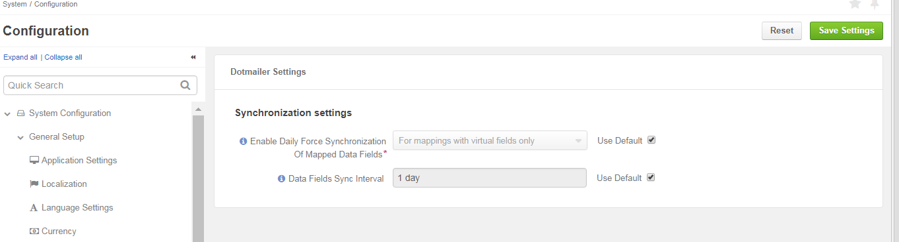

.. _admin-configuration-dotmailer-integration-settings:

dotmailer Synchronization Settings
==================================

To configure dotmailer synchronization settings, navigate to **System > Configuration** and then  **System Configuration > Integrations > dotmailer Settings**.

.. csv-table::
  :header: "**Setting**","**Description**" 
  :widths: 10, 30

  "**Data Fields Sync Interval**", "This interval is used to update data fields from dotmailer. By default, the number is set to 1 day."

To enable data synchronization, configure dotmailer integration on the Oro application side (see :ref:`dotmailer Integration <user-guide-dotmailer-configuration--dotmailer-side>`) and on the dotmailer side (see :ref:`dotmailer Configuration <user-guide-dotmailer-configuration--oro-side>`).

Related Articles
----------------

- :ref:`dotmailer Integration Overview <user-guide-dotmailer-overview>`
- :ref:`dotmailer Configuration <user-guide-dotmailer-configuration>`
- :ref:`Manage dotmailer Data Fields and Mappings <user-guide-dotmailer-data-fields>`
- :ref:`dotmailer Single Sign-on <user-guide-dotmailer-single-sign-on>`
- :ref:`Sending Email Campaign via dotmailer <user-guide-dotmailer-campaign>`