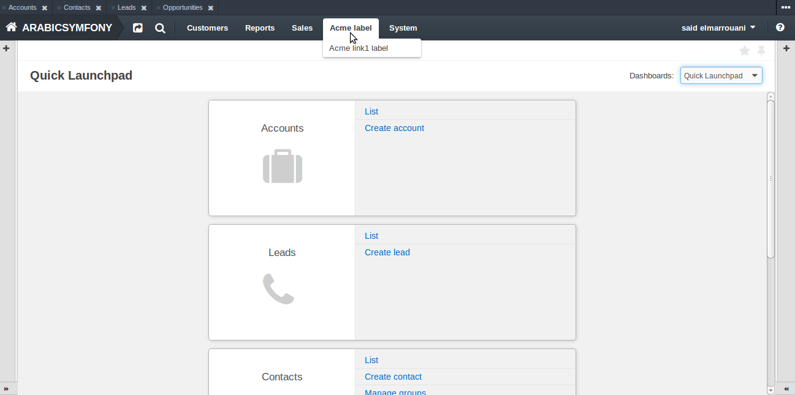

How to create and customize application menu
============================================

*Used application: OroCRM RC2*

* `Add your custom items section to default oro menu`_
* `Create your route with annotation`_
* `Create and fill navigation.yml`_
* `Override existing section`_
* `References`_

In oro you can create your totally personalized menu , or using a simple technique for add override section in default menu .
now in this tutorial we using the second option "add override section in default menu".

Add your custom items section to default oro menu
--------------------------------------------------

We propose you have already  created a bundle with namespace "Acme\\Bundle\\NewBundle" in the /src directory with annotation configuration format .
i prefer that bundle has been created automaticly.
New bundle can be generated using `Symfony command generate:bundle`_:

.. _Symfony command generate:bundle: http://symfony.com/doc/2.3/bundles/SensioGeneratorBundle/commands/generate_bundle.html

Create your route with annotation
---------------------------------
Now go to your default controller or any other and create your action with annotation route:
/src/Acme/Bundle/NewBundle/Controller/DefaultController.php 

.. code-block:: php

    <?php
    
    namespace Acme\Bundle\NewBundle\Controller;

    use Symfony\Bundle\FrameworkBundle\Controller\Controller;
    use Sensio\Bundle\FrameworkExtraBundle\Configuration\Route;
    use Sensio\Bundle\FrameworkExtraBundle\Configuration\Template;

    class DefaultController extends Controller
    {
        /**
         * @Route("/hello", name="acme_link1")
         * @Template()
         */
        public function indexAction()
        {
            return array('name' => "hello link1");
        }
    }
    

Open your view file result in the path  /src/Acme/Bundle/NewBundle/Resources/views/Defaults/index.html.twig change or add the flowing content:

.. code-block:: html+jinja

    
    
    {{ name }}!
    

Create and fill navigation.yml
-------------------------------
We need to create the navigation.yml file in /src/Acme/Bundle/NewBundle/Resources/config/navigation.yml with the flowing content :

.. code-block:: yaml

    oro_menu_config:
        items:
            acme_tab:
                label: Acme label
                uri:   '#'
                extras:
                    position: 300
            acme_tab_link1:
                label: Acme link1 label
                route: acme_link1
                extras:
                    routes: ['/^acme_link1/']
                    description: My description
        tree:
            application_menu:
                children:
                    acme_tab:
                        children:
                            acme_tab_link1: ~

    oro_titles:
        acme_tab_link1_view:  My link1 page title

Then clear cache:
root@ubuntu:orocrm# php app/console cache:clear

**Note:** you can use  php app/console cache:clear with parameters --env=prod or --env=dev.

Here item and child related to default oro menu :

And here the page result after click:

Override existing section 
-------------------------
Example you want add a link with name "Acme link1 label" in sales section. we need to create the navigation.yml file in /src/Acme/Bundle/NewBundle/Resources/config/navigation.yml with the flowing content:

.. code-block:: yaml

    oro_menu_config:
        items:
            sales_tab:
                label: Sales
                uri:   '#'
                extras:
                    position: 100
            acme_tab_link1:
                label: Acme link1 label
                route: acme_link1
                extras:
                    routes: ['/^acme_link1/']
                    description: My description
        tree:
            application_menu:
                children:
                    sales_tab:
                        merge_strategy: append
                        children:
                            acme_tab_link1: ~

    oro_titles:
        acme_tab_link1_view: oro dev

Now clear cache 

**Note:** observe merge_strategy: append you can use replace or move.

Here you can find the new item Acme link1 label in  Sales section:

References
----------

* `Symfony Best Practices for Structuring Bundles`_
* `OroPlatform NavigationBundle README.md`_

.. _Symfony Best Practices for Structuring Bundles: http://symfony.com/doc/2.3/cookbook/bundles/best_practices.html
.. _OroPlatform NavigationBundle README.md: https://github.com/orocrm/platform/blob/master/src/Oro/Bundle/NavigationBundle/README.md

