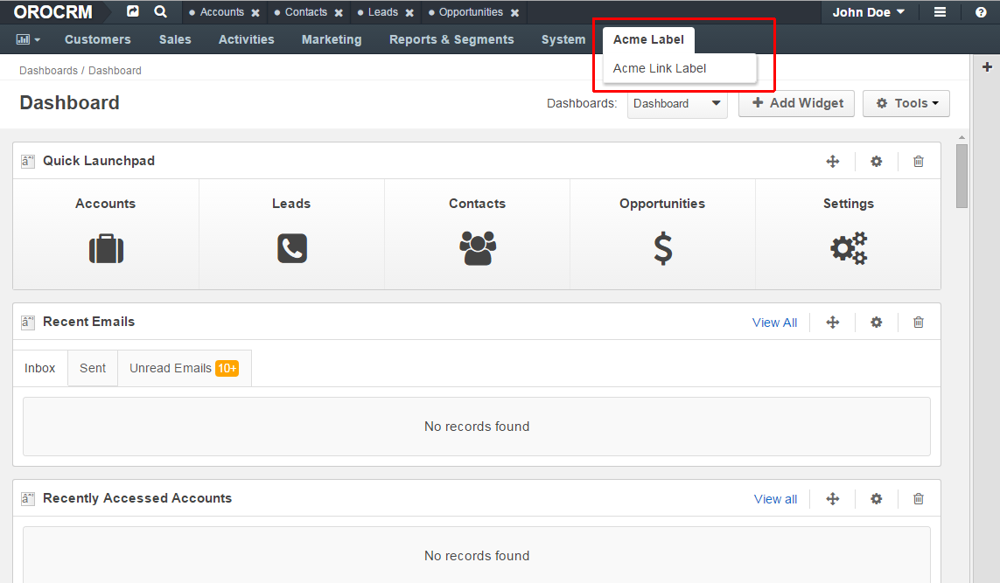
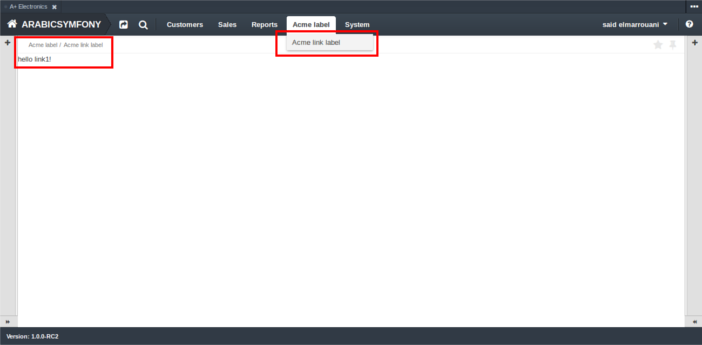
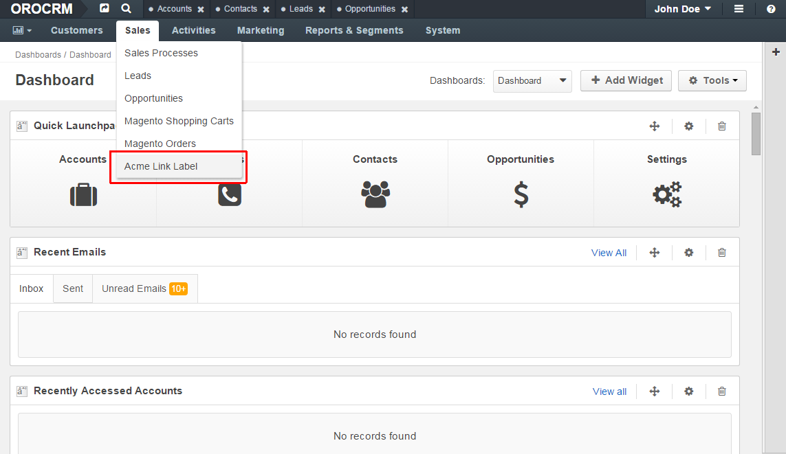

.. _doc-create-and-customize-app-menu:

.. index::
    single: Customization; Create an Application Menu
    single: Customization; Extend an Application Menu
    single: Menu; Create an Application Menu
    single: Menu; Extend an Application Menu

How to create and customize application menu
============================================

*Used application: OroCRM 1.7*

In OroPlatform you can create your fully personalized menu or use a simple technique to add or override a section in the default menu.
This tutorial describes how to override a section in the default menu.

Let's assume that you already have a bundle with the namespace ``Acme\Bundle\NewBundle`` in the ``/src`` directory
with annotation configuration format `generated or created manually`_.

.. _generated or created manually: ./how_to_create_new_bundle.rst

Create your route with annotation
---------------------------------

First, you have to go to your default controller, create your action and specify the ``@Route`` and ``@Template`` annotations:

.. code-block:: php
    :linenos:

    // src/Acme/Bundle/NewBundle/Controller/DefaultController.php
    namespace Acme\Bundle\NewBundle\Controller;

    use Symfony\Bundle\FrameworkBundle\Controller\Controller;
    use Sensio\Bundle\FrameworkExtraBundle\Configuration\Route;
    use Sensio\Bundle\FrameworkExtraBundle\Configuration\Template;

    class DefaultController extends Controller
    {
        /**
         * @Route("/hello", name="acme_link")
         * @Template()
         */
        public function indexAction()
        {
            return array('name' => "John Doe");
        }
    }

.. seealso::

    You can read more about both the ``@Route`` and the ``@Template`` annotation in the `SensioFrameworkExtraBundle documentation`_.

Next, you should create a template for your action with the following content:

.. code-block:: html+jinja
    :linenos:

    {# src/Acme/Bundle/NewBundle/Resources/views/Default/index.html.twig #}
    
    
         <h1>Hello, {{ name }}!</h1>
    

And finally, you should register your bundle routes. To do that you have to create a ``routing.yml`` file
with the following content:

.. code-block:: yaml
    :linenos:

    # src/Acme/Bundle/NewBundle/Resources/config/oro/routing.yml
    acme_new_bundle:
        resource:     "@AcmeNewBundle/Controller"
        type:         annotation
        prefix:       /acme

.. _create-and-fill-navigation-yml:

Create navigation configuration
-------------------------------

Now we need to create a ``navigation.yml`` file with the following content:

.. code-block:: yaml
    :linenos:

    # src/Acme/Bundle/NewBundle/Resources/config/oro/navigation.yml
    navigation:
        menu_config:
            items:
                acme_tab:
                    label: Acme label
                    uri:   '#'
                    extras:
                        position: 300
                acme_tab_link:
                    label: Acme link label
                    route: acme_link
            tree:
                application_menu:
                    children:
                        acme_tab:
                            children:
                                acme_tab_link: ~

        titles:
            acme_link: My link page title

Then you have to reload navigation data and clear cache:

.. code-block:: bash

    user@host:/var/www/vhosts/platform-application$ php app/console oro:navigation:init
    Load "Title Templates" from annotations and config files to db
    Completed

    user@host:/var/www/vhosts/platform-application$ php app/console cache:clear
    Clearing the cache for the dev environment with debug true

.. note::

    You can use ``php app/console cache:clear`` command with parameters ``--env=prod`` or ``--env=dev``.

Here you can see your new menu items in the default OroPlatform menu:

And here is the page you'll see after a click on the menu item:

Override existing section
-------------------------

To override some section in the main menu you have to create the ``navigation.yml`` file with the following content
(it will add an "Acme link label" link to the sales section):

.. code-block:: yaml
    :linenos:

    # src/Acme/Bundle/NewBundle/Resources/config/oro/navigation.yml
    menu_config:
        items:
            acme_tab_link:
                label: Acme link label
                route: acme_link
        tree:
            application_menu:
                children:
                    sales_tab:
                        merge_strategy: append
                        children:
                            acme_tab_link: ~

    titles:
        acme_link: My link page title

And reload navigation data and clear cache:

.. code-block:: bash

    user@host:/var/www/vhosts/platform-application$ php app/console oro:navigation:init
    Load "Title Templates" from annotations and config files to db
    Completed

    user@host:/var/www/vhosts/platform-application$ php app/console cache:clear
    Clearing the cache for the dev environment with debug true

Here you can see the new menu item "Acme link label" in the Sales section:

References
----------

* `Symfony Best Practices for Structuring Bundles`_
* `OroPlatform NavigationBundle README.md`_

.. _Symfony Best Practices for Structuring Bundles: http://symfony.com/doc/2.3/cookbook/bundles/best_practices.html
.. _OroPlatform NavigationBundle README.md: https://github.com/orocrm/platform/blob/master/src/Oro/Bundle/NavigationBundle/README.md
.. _`SensioFrameworkExtraBundle documentation`: http://symfony.com/doc/current/bundles/SensioFrameworkExtraBundle/index.html
