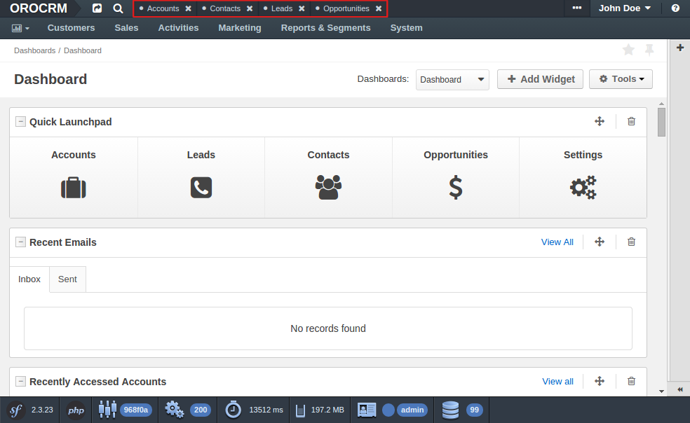

How to Create a global JavaScript Component
===========================================

A global component or global view is an instance that exists beyond the content area and is not
re-created in the course of navigation between different pages. A good example of a global
component is the Pin Bar:

.. seealso::

    You can find more information about the global component and the global view and learn about
    the App Module from the :doc:`"Frontend Architecture chapter" </book/frontend_architecture>`
    and from the `Page Component documentation`_.

.. TODO needs to be replaced with a reference to the frontend architecture chapter

Creating the Page Component Module
----------------------------------

First of all, you need to define the Page Component module in your bundle which has to extend the
``BaseComponent`` class from the OroUIBundle. If the Page Component module is named
``MyComponent``, its code has to be placed in a file named ``my-component.js`` that lives in the
``Resources/public/js/app/components`` directory of your bundle:

.. code-block:: javascript

    // src/Acme/DemoBundle/Resources/public/js/app/components/my-component.js
    define(function (require) {
        'use strict';

        var MyComponent,
            BaseComponent = require('oroui/js/app/components/base/component');

        MyComponent = BaseComponent.extend({
            initialize: function (options) {
                console.log('MyComponent is initialized', options);
            }
        });

        return MyComponent;
    });

You can implement all the desired functionality inside the component.

The component performs the role of a controller. It is responsible for the following things:

 * create necessary views, collections, models and even sub-components
 * handle environment events
 * dispose obsolete internal instances

Creating an App Module
----------------------

To boot your component together with the application, you need to create an App Module:

.. code-block:: javascript

    // src/Acme/DemoBundle/Resources/public/js/app/modules/my-module.js
    require([
        'oroui/js/app/controllers/base/controller'
    ], function (BaseController) {
        'use strict';

        BaseController.loadBeforeAction([
            'acmedemo/js/app/components/my-component'
        ], function (MyComponent) {
            /* add composition to reuse between controller actions */
            BaseController.addToReuse('myComponent', MyComponent, {
                /* define options for your component here, like: */
                keepServerConnection: true
            });
        });
    });

The example above advises the controller to load your Page Component before the first action and
will re-use its composition between actions. The following three arguments define the composition:

 - the name of the composition
 - the constructor
 - options of the constructor

.. seealso::

    You can find more information about compositions in the `Chaplin.Composer documentation`_.

Declaring the App Module
------------------------

The final step is to register your App Module in the RequireJS config:

.. code-block:: yaml

    # src/Acme/DemoBundle/Resources/config/requirejs.yml
    config:
        paths:
            'acmedemo/js/app/modules/my-module': 'bundles/acmedemo/js/app/modules/my-module.js'
        appmodules:
            - acmedemo/js/app/modules/my-module

First, the ``my-module`` module name is added to the ``config.paths`` section to let the building
script know about its location. This way, the building script can trace the dependency and add it
to the build-file (``oro.min.js``). Once the source file was added to the configuration,
``my-module`` is added to the list of module that are invoked at the application start using the
``appmodules`` key.

.. note::

    To see your component in action, you need to do a few more things:

    - Clear the Symfony application cache to update the cache and the included RequireJS config:

      .. code-block:: bash

        $ php app/console cache:clear

    - Reinstall your assets if you don't deploy them via symlinks:

      .. code-block:: bash

          $ php app/console assets:install

    - In production mode, you also have to rebuild the JavaScript code:

      .. code-block:: bash

          $ php app/console oro:requirejs:build

.. _`Page Component documentation`: https://github.com/orocrm/platform/blob/master/src/Oro/Bundle/UIBundle/Resources/doc/reference/page-component.md
.. _`Chaplin.Composer documentation`: http://docs.chaplinjs.org/chaplin.composer.html
