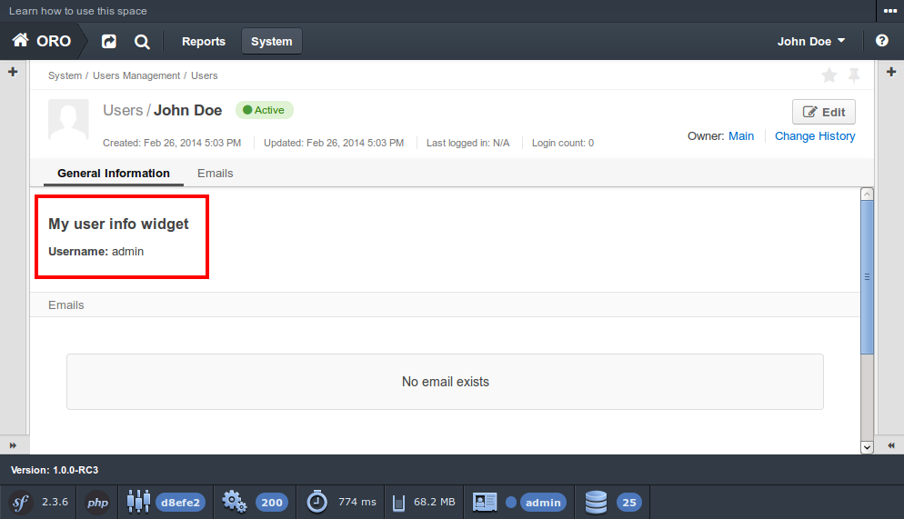

How to extend existing bundle
=============================

*Used application: OroPlatform RC3*

* `Bundle Extension`_
* `Features and Recommendations`_
* `References`_

Bundle Extension
----------------

Oro Platform application uses `default Symfony functionality to extend bundle`_ (in terms of Symfony it calls
inheritance). To do that you have to override method getParent in your bundle class.
Let's assume that we are using demo bundle from `How to create new bundle`_
article and we want to extend OroUserBundle - in this case file AcmeNewBundle.php should look like this:

.. _default Symfony functionality to extend bundle: http://symfony.com/doc/2.3/cookbook/bundles/inheritance.html
.. _How to create new bundle: ./how_to_create_new_bundle.rst

.. code-block:: php

    <?php
    // src/Acme/Bundle/NewBundle/AcmeNewBundle.php
    namespace Acme\Bundle\NewBundle;

    use Symfony\Component\HttpKernel\Bundle\Bundle;

    class AcmeNewBundle extends Bundle
    {
        public function getParent()
        {
            return 'OroUserBundle';
        }
    }

Now let's check that our extension works - to do that let's create custom template for User information widget.
So, we need to create file /src/Acme/Bundle/NewBundle/Resources/views/User/widget/info.html.twig
(this file structure duplicates file structure of extendable bundle) with our custom content:

::

    

        

            

                <h4>My user info widget</h4>
                <b>Username:</b> {{ entity.username }}
            

        

    

And now we can go to the user view page (f.e. http://bap.tutorial/app_dev.php/#url=/app_dev.php/user/view/1) and find
that user info widget has changed:

That's all - now our demo bundle extends OroUserBundle and can override its parts.

Features and Recommendations
----------------------------

Oro Platform provides several ways to extend bundle resources, and each of it should be used in specific cases.
Extension is the most simple and useful way to do that for basic bundle resources and can we used widely all over
the system. Other ways to extend specific resources (f.e. configuration files) will be described in further
articles.

Here is the basic parts that can be extended and the way to do that:

* **controller** - using bundle extension (inheritance);
* **templates** - using bundle extension (inheritance);
* **bundles** - using file /Resources/config/oro/bundles.yml;
* **routing** - using file /Resources/config/oro/routing.yml;
* **twig themes** - using file /Resources/config/oro/twig.yml;
* **localization** - using files /Resources/config/oro/locale_data.yml, /Resources/config/oro/name_format.yml,
  /Resources/config/oro/address_format.yml, /Resources/config/oro/currency_data.yml.

References
----------

* `How to use Bundle Inheritance to Override parts of a Bundle`_

.. _How to use Bundle Inheritance to Override parts of a Bundle: http://symfony.com/doc/2.3/cookbook/bundles/inheritance.html

