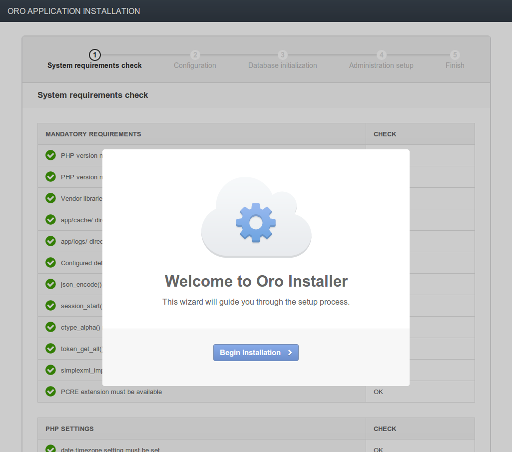
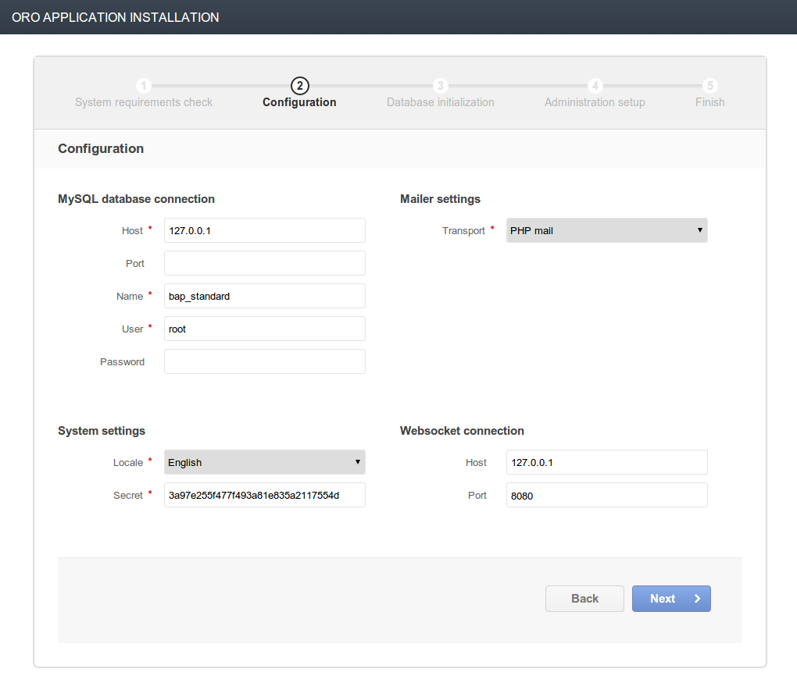
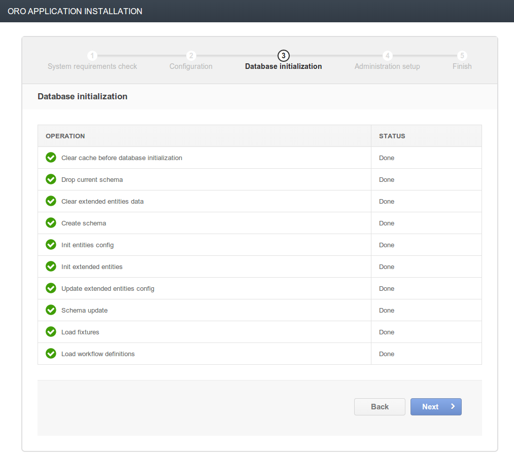
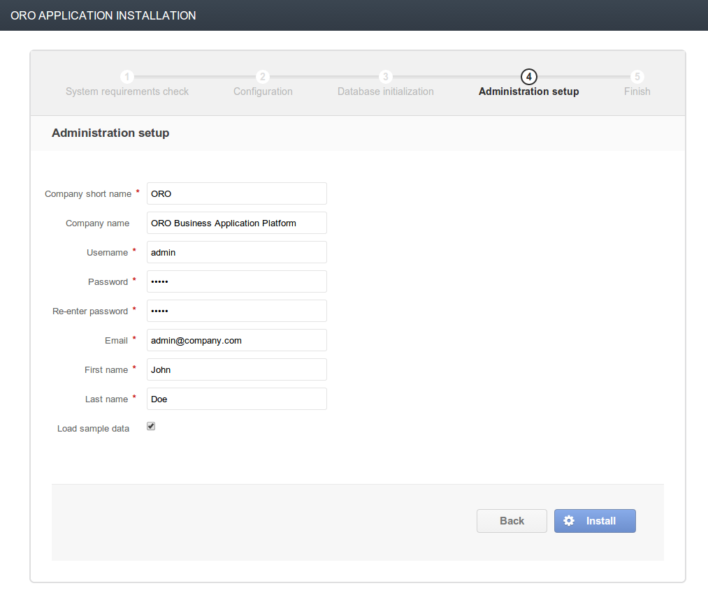
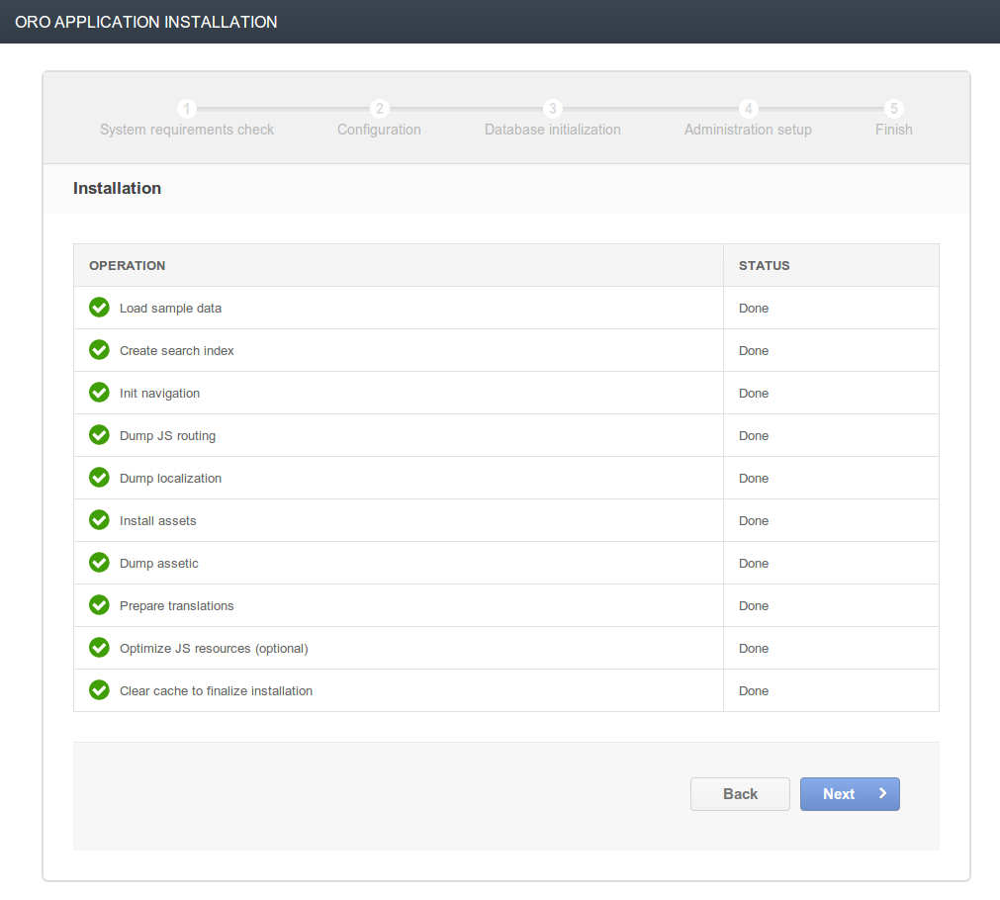
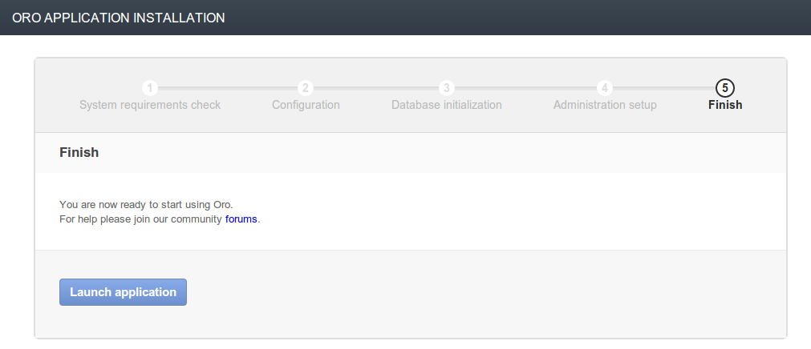

How to install OroPlatform
==========================

*Used application: OroPlatform RC1*

* `Download source code`_
* `Update vendors libraries`_
* `Set up database`_
* `Set up virtual host`_
* `Installation from browser`_
* `Installation from console`_
* `References`_

Download source code
--------------------

To install OroPlatform you first you need to download application source.

1. You can download the archive from our official site and extract it.
   For Linux it will look like this:

::

    cd /var/www/vhosts
    wget -c http://www.orocrm.com/downloads/platform-application.tar.gz
    tar -xzvf platform-application.tar.gz

For Windows you should download archive source code and extract it to appropriate folder.

2. You can clone the git repository from Github public repository:

::

    cd /var/www/vhosts
    git clone https://github.com/orocrm/platform-application

In this case we are cloning it to platform-application directory.

After downloading you should have a directory "platform-application" that contains application source code that contains the following:

::

    user@host:/var/www/vhosts/platform-application$ ls -l
    drwxrwxr-x 7 user user 4096 Янв  9 16:46 app
    -rw-rw-r-- 1 user user 4326 Янв  9 16:46 CHANGELOG.md
    -rw-rw-r-- 1 user user 1487 Янв  9 16:46 composer.json
    -rw-rw-r-- 1 user user 1103 Янв  9 16:46 LICENSE
    -rw-rw-r-- 1 user user 2331 Янв  9 16:46 README.md
    drwxrwxr-x 2 user user 4096 Янв  9 16:46 src
    -rw-rw-r-- 1 user user  207 Янв  9 16:46 UPGRADE.md
    drwxrwxr-x 3 user user 4096 Янв  9 16:46 web

Update vendors libraries
------------------------

Now you need to update the vendors libraries source code. OroPlatform is based on Symfony2 framework and uses
Composer_  to work with external libraries - if you don't have Composer installed you should `download and install it`_.
After that you can update vendor libraries:

.. _Composer: http://getcomposer.org/
.. _download and install it: http://getcomposer.org/download/

::

    cd /var/www/vhosts/platform-application
    php composer.phar install

After downloading all the libraries source code you have to enter the default system parameters:

::

    Some parameters are missing. Please provide them.
    database_host (127.0.0.1):
    database_port (null):
    database_name (bap_standard):
    database_user (root):
    database_password (null):
    mailer_transport (mail):
    mailer_host (127.0.0.1):
    mailer_port (null):
    mailer_encryption (null):
    mailer_user (null):
    mailer_password (null):
    websocket_host (127.0.0.1):
    websocket_port (8080):
    session_handler (session.handler.native_file):
    locale (en):
    secret (ThisTokenIsNotSoSecretChangeIt):
    installed (null):

If you already have the vendor libraries source code, you should update it by running the following:

::

    cd /var/www/vhosts/platform-application
    php composer.phar update

Then in the "vendor" directory you should see something like this:

::

    user@host:/var/www/vhosts/platform-application/vendor$ ls -l
    drwxrwxr-x  3 user user 4096 Янв  9 17:05 a2lix
    drwxrwxr-x  3 user user 4096 Янв  9 17:05 ass
    -rw-rw-r--  1 user user  183 Янв 13 15:39 autoload.php
    drwxrwxr-x  3 user user 4096 Янв  9 17:05 besimple
    drwxrwxr-x  2 user user 4096 Янв 13 15:36 bin
    drwxrwxr-x  3 user user 4096 Янв  9 17:05 cboden
    drwxrwxr-x  3 user user 4096 Янв  9 17:06 composer
    drwxrwxr-x  3 user user 4096 Янв  9 17:05 dflydev
    drwxrwxr-x 13 user user 4096 Янв  9 17:06 doctrine
    drwxrwxr-x  3 user user 4096 Янв  9 17:04 escapestudios
    drwxrwxr-x  3 user user 4096 Янв  9 17:05 evenement
    drwxrwxr-x  5 user user 4096 Янв  9 17:05 friendsofsymfony
    drwxrwxr-x  3 user user 4096 Янв  9 17:05 gedmo
    drwxrwxr-x  3 user user 4096 Янв  9 17:05 genemu
    drwxrwxr-x  6 user user 4096 Янв  9 17:05 guzzle
    drwxrwxr-x  3 user user 4096 Янв  9 17:05 imagine
    drwxrwxr-x  3 user user 4096 Янв  9 17:05 incenteev
    drwxrwxr-x  3 user user 4096 Янв  9 17:05 jdare
    drwxrwxr-x  3 user user 4096 Янв  9 17:06 jdorn
    drwxrwxr-x 10 user user 4096 Янв  9 17:05 jms
    drwxrwxr-x  3 user user 4096 Янв  9 17:04 justinrainbow
    drwxrwxr-x  6 user user 4096 Янв  9 17:05 knplabs
    drwxrwxr-x  3 user user 4096 Янв  9 17:05 kriswallsmith
    drwxrwxr-x  3 user user 4096 Янв  9 17:05 leafo
    drwxrwxr-x  3 user user 4096 Янв  9 17:05 lexik
    drwxrwxr-x  3 user user 4096 Янв  9 17:05 liip
    drwxrwxr-x  3 user user 4096 Янв  9 17:05 monolog
    drwxrwxr-x  3 user user 4096 Янв  9 17:05 mtdowling
    drwxrwxr-x  3 user user 4096 Янв  9 17:05 nelmio
    drwxrwxr-x  3 user user 4096 Янв  9 17:06 oro
    drwxrwxr-x  3 user user 4096 Янв  9 17:05 phpcollection
    drwxrwxr-x  3 user user 4096 Янв  9 17:05 phpoption
    drwxrwxr-x  3 user user 4096 Янв  9 17:04 psr
    drwxrwxr-x  5 user user 4096 Янв  9 17:05 react
    drwxrwxr-x  3 user user 4096 Янв  9 17:04 seld
    drwxrwxr-x  5 user user 4096 Янв  9 17:05 sensio
    drwxrwxr-x  3 user user 4096 Янв  9 17:05 stof
    drwxrwxr-x  3 user user 4096 Янв  9 17:05 swiftmailer
    drwxrwxr-x  3 user user 4096 Янв  9 17:05 sylius
    drwxrwxr-x  7 user user 4096 Янв  9 17:05 symfony
    drwxrwxr-x  4 user user 4096 Янв  9 17:06 twig
    drwxrwxr-x  4 user user 4096 Янв  9 17:05 willdurand
    drwxrwxr-x  6 user user 4096 Янв  9 17:05 zendframework

Set up database
---------------

Now you need to create a new database for the OroPlatform application.
You can do that using CLI or any UI manager you like. By default application will use DB connection credentials
that you have specified during installation after downloading of vendor libraries.
These parameters are stored in app/config/parameters.yml and can be changed.

Let's create a new database using mysql CLI:

::

    user@host:/var/www/vhosts/platform-application$ mysql -u root -p
    Enter password:
    Welcome to the MySQL monitor.  Commands end with ; or \g.

    mysql> create database bap_standard;
    Query OK, 1 row affected (0.00 sec)

    mysql> use bap_standard;
    Database changed
    mysql> show tables;
    Empty set (0.00 sec)

    mysql> exit
    Bye

Set up virtual host
-------------------

Now you need to set up a virtual host for the application. Basic host configuration for Apache2 can look like this:

::

    <VirtualHost *:80>
            DocumentRoot "/var/www/vhosts/platform-application/web"
            ServerAdmin webmaster@localhost
            ServerName bap.tutorial
            ServerAlias www.bap.tutorial
            DirectoryIndex index.php index.html index.htm index.shtml app.php
            <Directory "/var/www/vhosts/platform-application/web">
            Options FollowSymLinks
                    Options all
                    AllowOverride All
            </Directory>
        ErrorLog /var/log/apache2/bap-tutorial-error.log
        CustomLog /var/log/apache2/bap-tutorial-access.log combined
    </VirtualHost>

And you have to add your new virtual host domain to your DNS or /etc/hosts:

::

    127.0.0.1       bap.tutorial

Don't forget to enable your virtual host and reload or restart your web server to enable new configuration.

Installation from browser
-------------------------

Finally, you can go to your browser and start working from there. In the case that you run into some issues
you can find full installation log in /app/logs/oro_install.log.

Entering of configured virtual host name http://bap.tutorial/ to browser should show you this:

Click "Begin installation" and you will be directed to Step 1 - you have to ensure that all requirements
are matched (you can use `Symfony2 installation manual`_ as a guide).

.. _Symfony2 installation manual: http://symfony.com/doc/2.3/book/installation.html

Then click "Next" and go to Step 2 - here you have to specify system credentials: DB connection, mailer settings,
system settings and web-socket connection. This step uses values that you entered before as a default values.

Click "Next" and you will go to the third step that performs database initialization -
here you can see list of operations that were processed.

Step 4 allows you to specify administration credentials - company name (full and short),
administrator login, password, email and full name.
Optionally you can load sample data that contains basic examples of all entities.

You will then see the platform installation process table that shows the actions being performed and all process steps.

And, finally, on the 5th step you will see a message that all operation performed successfully and
you can click the button "Launch application" to start working with the platform.

Installation from console
-------------------------

Another alternative to install platform is to use the console command oro:install. You can see this command options below.

::

    user@host:/var/www/vhosts/platform-application$ php app/console oro:install --help
    Usage:
     oro:install [--company-short-name[="..."]] [--company-name[="..."]] [--user-name[="..."]] [--user-email[="..."]] [--user-firstname[="..."]] [--user-lastname[="..."]] [--user-password[="..."]] [--force] [--sample-data[="..."]]

    Options:
     --company-short-name  Company short name
     --company-name        Company name
     --user-name           User name
     --user-email          User email
     --user-firstname      User first name
     --user-lastname       User last name
     --user-password       User password
     --force               Force installation
     --sample-data         Determines whether sample data need to be loaded or not

Installation can be performed in the several ways:

1. Application can be installed in the interactive console mode: you can run

::

    php app/console oro:install

and you'll have to enter all parameters in the interactive console.

2. You can specify all required parameters as a command parameters so you don't have to enter any additional data
during installation - in this case you have to run

::

    php app/console oro:install --company-short-name=Oro --company-name=Oro --user-name=admin --user-email=admin@example.com --user-firstname=John --user-lastname=Doe --user-password=admin --sample-data=y

Additional option that you can use is a "–force" - this option allows you to install or reinstall application
no matter what happened before - the only thing you have to remember is that all data in the database will be lost.

References
----------

* `Download and Install Composer`_
* `Installing and Configuring Symfony`_

.. _Download and Install Composer: https://getcomposer.org/download/
.. _Installing and Configuring Symfony: http://symfony.com/doc/2.3/book/installation.html
