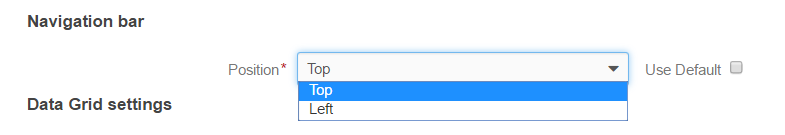
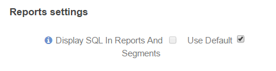

.. _admin-configuration-display-settings:

Display settings
================

In **System>Configuration>System Configuration>General Setup>Display Settings**, you can define a number of display-related options to be applied to the OroCRM instance:

|

.. image:: ../img/configuration/display.gif

|

User Bar
--------

Enable or disable showing recent emails. The functionality is enabled by default.

|

.. image:: ../img/configuration/user_bar.png

|

Navigation bar
--------------

Define the **Navigation bar** position. Choose a value from the drop-down menu: top or left. The default value is "Top".

|

|

Data Grid Settings
------------------

Data Grid settings define different options used to display all the :ref:`entity records grids <user-guide-ui-components-grids>` in the UI.

|

.. image:: ../img/configuration/data_grid_settings.png

|

The following options are available:
 
.. csv-table::
  :header: "Option", "Description", "Default"
  :widths: 10, 30, 10

  "**Items Per Page By Default**","Defines the number of items displayed on one page of the grid by default (every time you open the grid). You can change the number each time.","25"
  "**Lock Headers In Grids**","Defines whether grid headers will be locked on a page during scrolling.","Enabled"
  "**Record Pagination**","If enabled, you can navigate to previous or next grid record from  a :ref:`View page <user-guide-ui-components-view-pages>`","Enabled"
  "**Record Pagination Limit**","Defines a maximum number of records available for the *Record Pagination*. (If there are more records, the pagination will be disabled for the grid to avoid performance deterioration) ","1000"

Activity lists
--------------

The activity list setting defines different options to be applied to display :ref:`activities <user-guide-activities>` in the UI.

|

.. image:: ../img/configuration/activity_lists.png

|

The following options are available:

.. csv-table::
  :header: "Option", "Description", "Default"
  :widths: 10, 30, 10

  "**Sort By Field** and **Sort Direction**","Defines the field and direction used to sort activities in the grid by default (every time you open a page with the grid). You can changed the sorting of the grid each time.","By default the activities updated last will be shown at the top."
  "**Items Per Page By Default**","Defines the number of activities displayed on one page of the grid by default (every time you open the grid). You can changed the number each time.","10"

WYSIWYG settings
----------------

Define whether text formatting tools must be available for emails, notes and comments.

The value is enabled by default.

.. note::

    The formatting tools can also be enabled for other text fields in the course of integration.

|

.. image:: ../img/configuration/wysiwyg_settings.png

|

Sidebar settings
----------------

With the Sidebar settings you can enable or disable the left and/or right sidebar to keep your Sticky notes and Task lists. 
By default only the right sidebar is enabled.

|

.. image:: ../img/configuration/sidebar_settings.png

|

Tag Settings
------------

Tag settings specify the taxonomy colors available in the system.

|

.. image:: ../img/configuration/tag_settings.png

|

Calendar Settings
-----------------

|

.. image:: ../img/configuration/calendar_settings.png

|

Calendar settings specify the colors available to manage calendars in the UI:

.. csv-table::
  :header: "Option", "Description"
  :widths: 10, 30
  
  "**Calendar Colors***","A set of colors available for different users' calendars."
  "**Event Colors***","A set of colors available for different events in the user's calendar."

Reports Settings
----------------

|

|

If this function is enabled, users can see the SQL request sent to the system for a report.

|

.. image:: ../img/configuration/sql_show.png

|

This way, users can check if a report has been developed correctly.

.. hint::

    This link will only be available if the :ref:`View SQL query of a report/segment <admin-capabilities-view-sql>` 
    capability has been enabled for the role.

    
