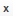

.. _user-guide-email-template:
.. _user-guide-email-templates-create:

Create Email Templates
======================

.. contents:: :local:
   :depth: 1

With OroCRM you can easily sent numerous personalized emails using one template. For example, you can make a single template that welcomes {username}, assign it to an :ref:`email campaign <user-guide-email-campaigns>` and each of your subscribers will get a mail send specifically to them. 

Create a New Email Template
---------------------------

1. Navigate to **System > Emails > Templates**.
2. Click **Create Template**.
   
   |email_template_create|

3. Define the general settings of the template.

   The following fields are mandatory and must be defined:
  
   * **Template Name** --- Name used to refer to the template in the system.
   * **Type** --- Use html or plain text.
   * **Owner** --- Limits the list of users that can manage the template, subject to the :ref:`access and permission settings <user-guide-user-management-permissions>`.
 
   Optional field **Entity Name** is used to define an :term:`entity <Entity>`, variables whereof can be used in the template. If no entity name is defined, only system variables are available.

   .. important:: If you want to use the template for :ref:`autoresponses <admin-configuration-system-mailboxes-autoresponse>`, the **Entity Name** field value should be **Email**.

4. Define the email template. Click on the necessary variable to add it to the text box.

   .. image:: ../img/marketing/email_template_ex.png
      :alt: A sample of an email template

   .. note:: In the example below, the template contains a link to the website page composed with a piece of :ref:`tracking code <user-guide-how-to-track>`. Every time a user follows the link, visit event will be tracked for the campaign.

5. Click **Preview** to check your template.

   .. image:: ../img/marketing/email_template_preview.png
      :alt: Preview of an email template

6. Click **Save** if you are satisfied with the preview.

.. _user-guide-email-templates-actions:

.. note:: You can delete |IcDelete|, edit |IcEdit|, and clone |IcClone| email templates on the page of all templates.

          .. image:: ../img/marketing/email_template_actions.png
             :alt: View a list of templates with three options available: edit, clone, delete

.. hint:: If you want to track the user-activity related to the emails sent within the email campaign, add a piece of :ref:`tracking website <user-guide-marketing-tracking>` code to the email template.

Available Template Variables and Functions
------------------------------------------

For the security reasons, the only available variables are currently the ones listed on the Email Templates edit page in the management console. However, there are a few exceptions. These are several Twig functions enabled in email templates that can be used to obtain some specific data in email templates.

The full list of these functions is the following:

.. contents:: :local:
    :depth: 2

Functions
^^^^^^^^^

date
~~~~

.. code-block:: php
    :linenos:

        date()

**Description:** Converts an argument into a date to allow date comparison.

**Example:** See https://twig.symfony.com/doc/2.x/functions/date.html

oro_config_value
~~~~~~~~~~~~~~~~

.. code-block:: php
    :linenos:

        oro_config_value(string $configSettingName)

**Description:** Returns the Oro config setting value.

**Returns:** string

**Example:** See https://oroinc.com/orocrm/doc/current/dev-guide/getting-started-book/configuration#in-templates

calendar_date_range
~~~~~~~~~~~~~~~~~~~

.. code-block:: php
    :linenos:

        calendar_date_range(
            \DateTime $startDate = null,
        \DateTime $endDate = null,
        $skipTime = false,
        $dateType = null, \\IntlDateFormatter constant or it's string name
        $timeType = null, \\IntlDateFormatter constant or it's string name
        $locale = null,
        $timeZone = null
    )

**Description:** Returns a string that represents a range between $startDate and $endDate, formatted according the given parameters.

**Returns:** string

    * $endDate is not specified
        * Thu Oct 17, 2013 - when $skipTime = true
        * Thu Oct 17, 2013 5:30pm - when $skipTime = false
    * $startDate equals to $endDate
        * Thu Oct 17, 2013 - when $skipTime = true
        * Thu Oct 17, 2013 5:30pm - when $skipTime = false
    * $startDate and $endDate are the same day
        * Thu Oct 17, 2013 - when $skipTime = true
        * Thu Oct 17, 2013 5:00pm – 5:30pm - when $skipTime = false
    * $startDate and $endDate are different days
        * Thu Oct 17, 2013 5:00pm – Thu Oct 18, 2013 5:00pm - when $skipTime = false
        * Thu Oct 17, 2013 – Thu Oct 18, 2013 - when $skipTime = true

**Example:**

.. code-block:: php
    :linenos:

        calendar_date_range(entity.start, entity.end, entity.allDay, 'F j, Y', 1)

calendar_date_range_organization
~~~~~~~~~~~~~~~~~~~~~~~~~~~~~~~~

.. code-block:: php
    :linenos:

        calendar_date_range_organization(
            \DateTime $startDate = null,
        \DateTime $endDate = null,
        $skipTime = false,
        $dateType = null, \\IntlDateFormatter constant or it's string name
        $timeType = null, \\IntlDateFormatter constant or it's string name
        $locale = null,
        $timeZone = null,
        OrganizationInterface $organization = null
    )

**Description:** The same as 'calendar_date_range' but for a specific organization.

**Returns:** string

get_event_recurrence_pattern
~~~~~~~~~~~~~~~~~~~~~~~~~~~~

.. code-block:: php
    :linenos:

        get_event_recurrence_pattern(Entity\CalendarEvent $event)

**Description:** This method is aimed at showing text description of a recurring event in email invitations.

**Returns:** string

**Example:**

.. code-block:: php
    :linenos:

        
            <tr>
                <td style="width: 65pt; padding: 0 5pt 0 9pt; line-height: 1.3em; font-family: Arial, Helvetica, sans-serif; font-size: 10pt; vertical-align: top"><strong>Repeats:</strong></td>
                <td style="padding: 0 9pt 0 0; line-height: 1.3em; font-family: Arial, Helvetica, sans-serif; font-size: 10pt; vertical-align: top">{{ get_event_recurrence_pattern(entity) }}</td>
            </tr>
        

website_path
~~~~~~~~~~~~

.. code-block:: php
    :linenos:

        website_path(string $route, array $routeParams, Website|null $website = null)

**Description:** Returns the absolute path for a specific route and parameters.

**Returns:** string

**Example:**

.. code-block:: php
    :linenos:

        
Please follow this link to confirm your email address: <a href="{{ website_path('oro_customer_frontend_customer_user_confirmation', {'username': entity.username, 'token': token}, entity.website) }}">Confirm</a>

website_secure_path
~~~~~~~~~~~~~~~~~~~

.. code-block:: php
    :linenos:

        website_secure_path()

**Description:** The same as 'website_path' but returns Secure (HTTPS) URL.

url
~~~

.. code-block:: php
    :linenos:

            url()

**Description:** Returns the absolute URL (with scheme and host) for the given route.

**Example:** See http://symfony.com/doc/3.4/reference/twig_reference.html#url

path
~~~~

.. code-block:: php
    :linenos:

            path()

**Description:** Returns the relative URL (without the scheme and host) for the given route.

**Example:** See http://symfony.com/doc/3.4/reference/twig_reference.html#path

get_payment_methods (OroCommerce Only)
~~~~~~~~~~~~~~~~~~~~~~~~~~~~~~~~~~~~~~

.. code-block:: php
    :linenos:

        get_payment_methods(Order $entity)

**Description:** Return the allowed payment methods for orders.

**Returns:** array of strings (array of the payment methods names)

**Example:**

.. code-block:: php
    :linenos:

        % set payment_methods = get_payment_methods(entity) %}

        
            <h4>Payment Method:</h4>
            {{ payment_methods[0] }}
        
            <h4>Payment Methods:</h4>
            {{ payment_methods|join(', ') }}
        

rfp_products (OroCommerce Only)
~~~~~~~~~~~~~~~~~~~~~~~~~~~~~~~

.. code-block:: php
    :linenos:

        rfp_products(Oro\Bundle\RFPBundle\Entity\Request $entity)

**Description:** Returns a list of products requested by a buyer in this request for quote.

**Returns:**

.. code-block:: php
    :linenos:

        array: [
            345 => [ \\Product ID
            'name' => 'Yarn', \\ string, Product name
            'sku' => 'YRN345erer', \\ string, Product SKU
            'comment' => 'Most interesting product for us', \\ string, Comment in RFP for this product
            'items' => [ \\array, Requested product items
                38473 => [ \\Product Item ID
                    'quantity' => 49.86, \\ float, Product Item quantity
                    'price' => $price, \\ \Oro\Bundle\CurrencyBundle\Entity\Price object, Product Item price
                    'unit' => 'ft', \\ string, Product Item unit
                ],
                139473 => [ \\Product Item ID
                    'quantity' => 21.98, \\ float, Product Item quantity
                    'price' => $price, \\ \Oro\Bundle\CurrencyBundle\Entity\Price object, Product Item price
                    'unit' => 'item', \\ string, Product Item unit
                ],
                ...
            ],
        ],
        ...
    ]

**Example:**

.. code-block:: php
    :linenos:

        
        
            <table style="border: 1px solid black;margin-top: 10px">
                <thead>
                    <tr>
                        <th><strong>SKU</strong></th>
                        <th><strong>Product</strong></th>
                        <th><strong>Quantity</strong></th>
                        <th><strong>Target Price</strong></th>
                        <th><strong>Comment</strong></th>
                    </tr>
                </thead>
                
                    
                    <tbody>
                        
                            <tr>
                                
                                    <td rowspan="{{ numItems }}">{{ product.sku }}</td>
                                    <td rowspan="{{ numItems }}">{{ product.name }}</td>
                                

                                <td>{{ item.quantity }} {{ item.unit }}</td>
                                <td>{{ item.price ? item.price|oro_format_price : '' }}</td>

                                
                                    <td rowspan="{{ numItems }}">{{ product.comment }}</td>
                                
                            </tr>
                        
                    </tbody>
                
            </table>
        

order_line_items (OroCommerce only)
~~~~~~~~~~~~~~~~~~~~~~~~~~~~~~~~~~~

.. code-block:: php
    :linenos:

        order_line_items(\Oro\Bundle\OrderBundle\Entity\Order $entity)

**Description:** Returns order line items.

**Returns:**

.. code-block:: php
    :linenos:

        array: [
            'lineItems' => [
                [
                    'product_name' => 'Boat', \\ string, Product name
                'product_sku' => 'BO1BIG', \\ string, Product SKU
                'quantity' => 1.00, \\ float, Product quantity
                'unit' => 'item', \\ string, Product unit
                'price' => $price, \\ \Oro\Bundle\CurrencyBundle\Entity\Price object, Product price
                'subtotal' => $price, \\\Oro\Bundle\CurrencyBundle\Entity\Price object, Line Item subtotal
            ],
            ...
        ],
        'subtotals' => [
            [
                'label' => 'Shipping', \\ string, Subtotal name
                'totalPrice' => $price, \\\Oro\Bundle\CurrencyBundle\Entity\Price object, Subtotal Price
            ],
            ...
        ],
    ]

**Example:**

.. code-block:: php
    :linenos:

        
        
            <tr>
                <td>{{ item.product_name }} SKU #: {{ item.product_sku }}</td>
                <td>{{ item.quantity|oro_format_short_product_unit_value(item.unit) }}</td>
                <td>{{ item.price|oro_format_price }}</td>
                <td>{{ item.subtotal|oro_format_price }}</td>
            </tr>
        

.. note:: If none of these Twig functions cover your cases, you can **create a custom Twig function** that returns the desired data that you can use in email templates.
    Please, see `OroEmailBundle documentation <https://github.com/oroinc/platform/blob/master/src/Oro/Bundle/EmailBundle/Resources/doc/email_templates.md>`_  for details.

Filters
^^^^^^^

On top of functions, you can use filters in email templates. The full set of these filters is the following:

* `default <https://twig.symfony.com/doc/2.x/filters/default.html>`_
* `date <https://twig.symfony.com/doc/2.x/filters/date.html>`_
* `escape <https://twig.symfony.com/doc/2.x/filters/escape.html>`_
* `format <https://twig.symfony.com/doc/2.x/filters/format.html>`_
* `length <https://twig.symfony.com/doc/2.x/filters/length.html>`_
* `lower <https://twig.symfony.com/doc/2.x/filters/lower.html>`_
* `nl2br <https://twig.symfony.com/doc/2.x/filters/nl2br.html>`_
* `number_format <https://twig.symfony.com/doc/2.x/filters/number_format.html>`_
* `title <https://twig.symfony.com/doc/2.x/filters/title.html>`_
* `trim <https://twig.symfony.com/doc/2.x/filters/trim.html>`_
* `upper <https://twig.symfony.com/doc/2.x/filters/upper.html>`_
* `oro_html_sanitize <https://github.com/oroinc/platform/blob/master/src/Oro/Bundle/UIBundle/Resources/doc/reference/twig-filters.md#oro_html_sanitize>`_
* `oro_html_strip_tags  <https://github.com/oroinc/platform/blob/master/src/Oro/Bundle/UIBundle/Resources/doc/reference/twig-filters.md#oro_html_strip_tags>`_
* `oro_format <https://github.com/oroinc/platform/blob/master/src/Oro/Bundle/UIBundle/Twig/FormatExtension.php#L76>`_
* `oro_format_address <https://github.com/oroinc/platform/blob/master/src/Oro/Bundle/LocaleBundle/Resources/doc/reference/address-formatting.md#oro_format_address>`_
* `oro_format_date <https://github.com/oroinc/platform/blob/master/src/Oro/Bundle/LocaleBundle/Twig/DateTimeExtension.php#L122>`_
* `oro_format_time <https://github.com/oroinc/platform/blob/master/src/Oro/Bundle/LocaleBundle/Twig/DateTimeExtension.php#L174>`_
* `oro_format_datetime <https://github.com/oroinc/platform/blob/master/src/Oro/Bundle/LocaleBundle/Twig/DateTimeExtension.php#L92>`_
* oro_format_datetime_organization
* `oro_format_name <https://github.com/oroinc/platform/blob/master/src/Oro/Bundle/LocaleBundle/Resources/doc/reference/name-formatting.md#oro_format_name>`_
* `oro_format_price <https://github.com/oroinc/platform/blob/master/src/Oro/Bundle/CurrencyBundle/Twig/CurrencyExtension.php#L111>`_
* `oro_format_short_product_unit_value <https://github.com/oroinc/orocommerce/blob/master/src/Oro/Bundle/ProductBundle/Resources/doc/product-unit-value-formatting.md#oro_format_short_product_unit_value>`_
* `join <https://twig.symfony.com/doc/2.x/filters/join.html>`_

Tags
^^^^

The full set of allowed tags to use in email templates is the following:

* app
* `for <https://twig.symfony.com/doc/2.x/tags/for.html>`_
* `if <https://twig.symfony.com/doc/2.x/tags/if.html>`_
* `spaceless <https://twig.symfony.com/doc/2.x/tags/spaceless.html>`_
* `set <https://twig.symfony.com/doc/2.x/tags/set.html>`_

Select Email Template Languages
-------------------------------

If :ref:`several languages have been enabled <sys--config--sysconfig--general-setup--language-settings>` for the email templates, move from tab to tab to define the template in different languages. Templates in other languages will be used to notify users about events in their preferred language. 

.. image:: ../img/marketing/email_template_language.png
   :alt: Navigating from one language tab to another

  

.. |BGotoPage| image:: ../../img/buttons/BGotoPage.png
   :align: middle

   
.. |email_template_create| image:: ../img/marketing/email_template_create.png

.. include:: /img/buttons/include_images.rst
   :start-after: begin
