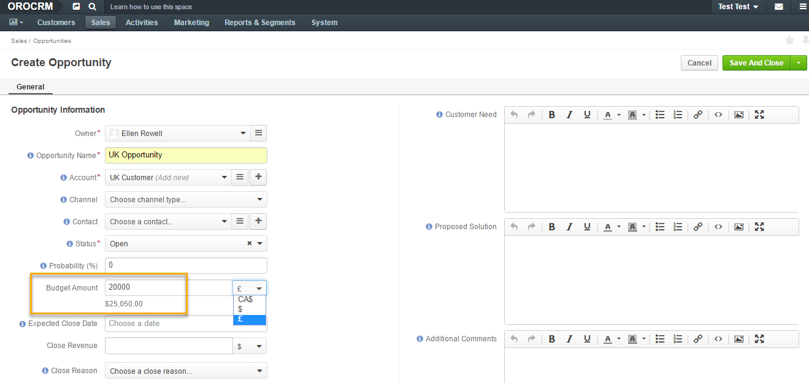
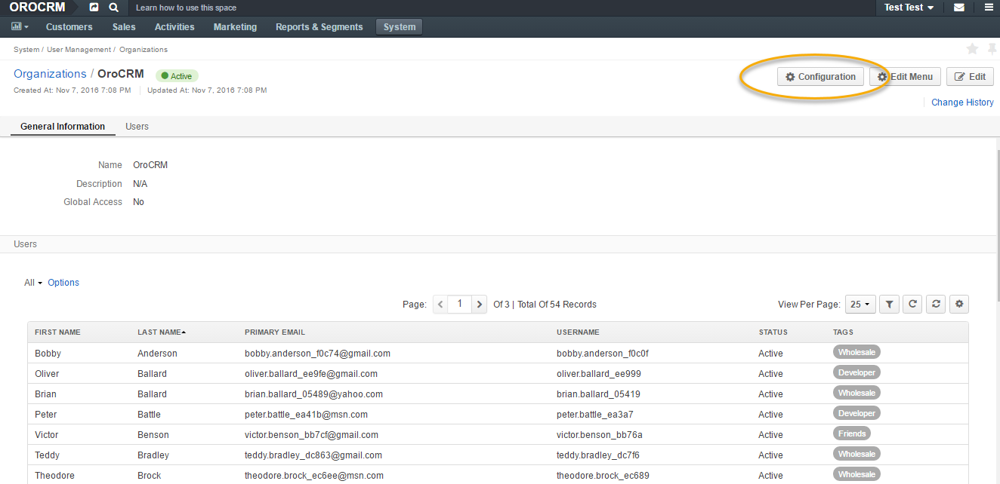
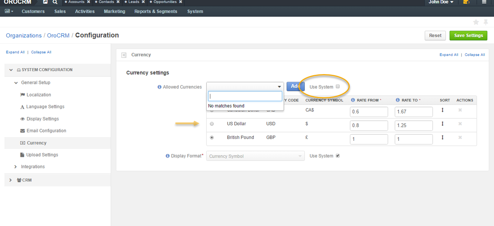
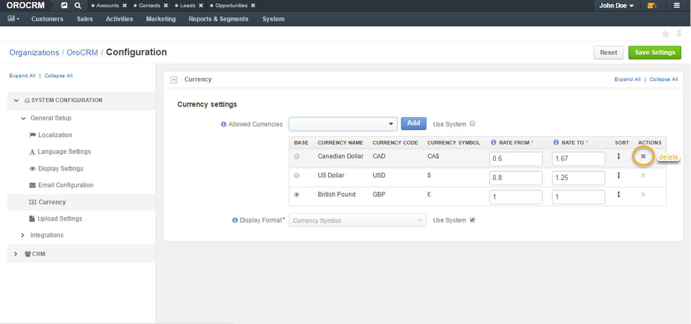
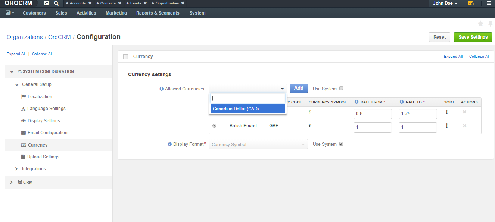

.. _user-guide-multi-currency:

Multi-Currency 
==============

.. contents:: :local:
    :depth: 4

Overview
--------

Multiple currency functionality for OroCRM Enterprise edition is a
useful tool for companies that do business internationally and negotiate
deals in various currencies.

Currency configuration allows to:

- Create and manage the list of currencies that will be available for selection in multi-currency fields (e.g. opportunity budget).
- Designate one currency as base.

Think of a US-based business that is shipping certain goods to the UK. Its base currency is US dollars, which means that this is the currency that its business’s
turnover is usually in. The contract between the US and the UK companies,
however, is to be signed in British pounds for the total value of
£20 000. When creating a new opportunity for the mentioned contract, a sales manager of the US company
would need to add the **Budget Amount** in pounds rather than dollars.

With OroCRM Enterprise multi-currency feature, the system can make the
necessary recalculations of this budget amount into the base currency
for you. This means that if you enter the amount of £20 000 into the
Budget Amount field, this value will be converted into your base
currency and constitute $25 050, as illustrated in the screenshot
below. This conversion is calculated according to the currency rate, determined beforehand.

With this example in mind, let us have a look at how you can configure
your currencies and rates.

.. note:: So far, opportunity is the only OroCRM entity to have received multi-currency functionality out of the box.

.. include:: /admin_guide/landing_system_configuration/general_setup_sysconfig/global_currency.rst
   :start-after: begin_global_currency_settings
   :end-before: finish_global_currency_settings

.. include:: /admin_guide/config_levels/org/general_setup_sysconfig/organization_currency.rst
   :start-after: begin_org_currency
   :end-before: finish_org_currency

.. note:: Currently, to allow a sales manager to manage rates, the admin needs to give them access to manage organization records when configuring user roles. This, however, is subject to change. Therefore, the following guide on accessing Currency at organization level is temporary and will be actualized shortly.

For the sales manager to be able to manage currencies, they would need to:

-  Navigate to **System>User Management>Organizations**.

.. image:: ../img/multi_currency/temp_system_user_management_organizations.png

-  Click on their organization in the grid.
  
.. image:: ../img/multi_currency/organization.png

-  Click **Configuration** in the top right corner.

-  Open **Currency** tab from the menu on the left.

As you can see in the screenshot below, **Use System** is ticked which
means that at this point system currencies and rates are activated.

For the sales manager to be able to change the rates, they would need to
unlock the grid by unticking **Use System**.

.. image:: ../img/multi_currency/use_system.png

Managing Currencies
-------------------

Changing Currency Rate
^^^^^^^^^^^^^^^^^^^^^^

To change the currency rate manually, the sales manager needs to enter
the numbers in the corresponding field of the Rate From/To columns.

For example, if the rate of US dollar to British pound is 0.8016, a
sales manager would enter 0.8016 in the Rate From field. The system will
automatically calculate the Rate To value for US dollars which will
constitute 1.2525.

.. image:: ../img/multi_currency/rate_recalculation.png

The base currency rate is always 1 to 1 and cannot be changed.

Adding and Deleting Currency
^^^^^^^^^^^^^^^^^^^^^^^^^^^^

A sales manager cannot add the currency that is not set at the system
level.

For example, if at the system level the admin has set up 3 currencies –
US dollars, Canadian dollars and British pounds, then at the organization
level the sales manager will be able to see no more than these 3
currencies. In other words, it is possible to remove unnecessary currencies but not add new ones (which are not set at the system level). 

If you delete a currency at organization level, it would appear in the
**Allowed Currencies** field, so it would be possible to add it back if
necessary.

.. note:: You cannot delete the currency that is already in use. In later releases, if you wish to delete the currency that is used by an entity, you would have an option of converting it into a different currency.

To add the deleted currency back, select it from the Allowed Currencies dropdown menu and click :guilabel:`Add`.

Changing Base Currency
^^^^^^^^^^^^^^^^^^^^^^

The base currency can be changed. This will lead to reconversion of all multi-currency data to the new base currency, and all values will be re-converted according to the current rates. 

.. note:: Historical rates for closed deals will not be preserved.

In the example below, the base currency is British pounds but the budget
of the deal is in US dollars. In the following screenshot, you can see
how this is displayed for opportunities:

.. image:: ../img/multi_currency/example_base_and_us_budget.png

You can change the base currency in system configuration by selecting the currency in the
**Base** column of the grid, as shown in the screenshot below. In the screenshot, the base currency is switched from British pounds into Canadian dollars. Changing the base currency in the grid
automatically recalculates the rates of other currencies to the new base
currency.

.. important:: When you close a deal (determined by opportunity status), the exchange rate for it becomes locked and will no longer take rate changes into account.

.. image:: ../img/multi_currency/Rate_recalculation.gif

Changing the base currency results in currency change for entities:

.. image:: ../img/multi_currency/base_currency_selected.png

.. image:: ../img/multi_currency/example_budget_changed.png

.. note:: Dashboard widgets with monetary values (e.g. Forecast) and monetary metrics work in the base currency irrespective of the currency that the deals were made in.

.. image:: ../img/multi_currency/widgets_base_currency.png

Visualization
^^^^^^^^^^^^^

When the rates are configured, you can use them to record multi-currency sales and utilize exchange rates.

-	Currencies are switched with a dropdown control next to the amount entry field in all multi-currency fields, such an Opportunity budget or Close Revenue.
-	When you change the amount currency, the converted value in base currency appears below the control. 
-	Both Opportunity budget and Close Revenue can be entered in non-base currencies and these currencies might not match. This can be useful if you discuss budgets with overseas clients in their currency, but the actual deal is specified in your currency.

.. image:: ../img/multi_currency/mc_visualization.gif

.. include:: /img/buttons/include_images.rst
   :start-after: begin