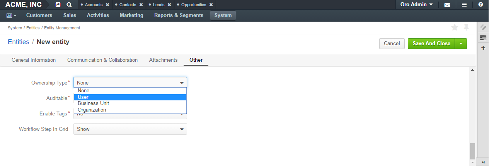

.. _user-guide-user-management-permissions-ownership-type:

Ownership Type
==============

.. contents:: :local:
    :depth: 3

Overview
---------

When you create an entity record, you may define its ``owner``. The type of the owner depends on the entity a record of which you create. For accounts, for example, you can define a user as an owner. For business units it must be another business unit. 

|

.. image:: ../img/access_roles_management/entity-instance_access.png 

|

'Owner' is an important concept as it may influence a user's access rights. For example, 'Lex Shop' account belongs to John who has access to the 'West' office of the 'Acme' company. The company employees have access only to the accounts of the office they work at. If Acme decides to transfer John to another office and restricts him access to the 'West' office, employees of the 'West' office will not be able to access 'Lex Shop' any more.  

*Can a particular entity be managed by a user or a business unit or a organization? Or maybe this is a global entity?*
You answer these questions by specifying the ``ownership type`` for an entity. 
For example, an ownership type of the **Account** entity is **User**. So, a customer's account can be 'owned' by a particular user. The user can access, manage this account and is responsible for it. 
A business unit represents a team of users. Decisions about a business unit's fate are taken at the level of the business unit that incorporates the said one or directly at the level of the organization. So, it takes at least another business unit to 'own' the business unit. And the **Business Unit** entity ownership type is **Business Unit**.

|

.. image:: ../img/access_roles_management/entity_access.png 

|

The following table describes who or what can own entity records depending on the entity ownership type:

+----------------+--------------------------------------------------------------------+
| Ownership type | Possible owners                                                    |
+================+====================================================================+
| User           | Users                                                              |
+----------------+--------------------------------------------------------------------+
| Business Unit  | Business units                                                     |
+----------------+--------------------------------------------------------------------+
| Organization   | Organizations                                                      |
+----------------+--------------------------------------------------------------------+
| None           | No owner (it can be also said that the owner is the system itself) |
+----------------+--------------------------------------------------------------------+

.. _user-guide-user-management-permissions-ownership-type--access-levels:

Ownership Type and Access Levels
^^^^^^^^^^^^^^^^^^^^^^^^^^^^^^^^

An entity's ownership type limits the range of access levels you can set for actions on this entity. 

The following table shows what access levels can be assigned depending on the entity's ownership type:

+----------------+---------------------------------------------------------------+
| Ownership type | Possible access levels for an entity with this ownership type |
+================+===============================================================+
| User           | None, User, Business Unit, Division, Organization, Global     |
+----------------+---------------------------------------------------------------+
| Business Unit  | None, Business Unit, Division, Organization, Global           |
+----------------+---------------------------------------------------------------+
| Organization   | None, Organization, Global                                    |
+----------------+---------------------------------------------------------------+
| None           | None, Global                                                  |
+----------------+---------------------------------------------------------------+

.. caution::
	As you can see, ownership types in general have the same names as access levels. However, do not be confused: they are very different things. 
	This becomes especially straightforward when you compare the **None** ownership type and the **None** access level:

  The **None** ownership type gives the widest access to entity records. It says 'This record does not belong to any particular organization or business unit or user. Therefore, either each existing user can access it, or no one at all.'
    
  The **None** access level completely restricts access to entity records. It says 'No one can perform this action on the entity.' 

Actions
-------

Configure an Ownership Type for an Entity
^^^^^^^^^^^^^^^^^^^^^^^^^^^^^^^^^^^^^^^^^

.. important::
	You can define an entity ownership type only during the entity creation. As soon as the entity is saved for the first type, its ownership type cannot be changed. 
	Consequently, you cannot change the predefined ownership types of the system entities (such as **Account**, **Business Unit,** etc.). 

1. Start creating a new entity. To do this, follow the instructions provided in the
   `Create Entities <../entities/entities#create-entities>`__ section of the `Entities <../entities>`__ guide. Specify all information as required for the **General Information**, **Communication & Collaboration**, **Attachments** sections.

2. Click **Other**.

3. From the **Ownership Type** list, select the desired ownership type. 

 
|

   
|

4. Click the :guilabel:`Save` button in the upper-right corner.

Review the Ownership Type for an Entity
^^^^^^^^^^^^^^^^^^^^^^^^^^^^^^^^^^^^^^^

1. Open the entity view page:

    a. In the main menu, navigate **System>Entities>Entity Management**.
    
    b. In the grid on the **All Entities** page, click the required entity.

2. On the entity view page, click **General Information** and review the **Ownership Type** fields.

.. image:: ../img/access_roles_management/entity_ownershiptype_review.png 

Links
-----
For more information about the access settings configuration, see the :ref:`Access Management <user-guide--user-management--permissions--user-access-settings>` guide.

For more information about the entity configuration, see the `Entity Management <../entities>`__ guide.

For more information about the user configuration, see the :ref:`User Management <user-management-users>` guide.