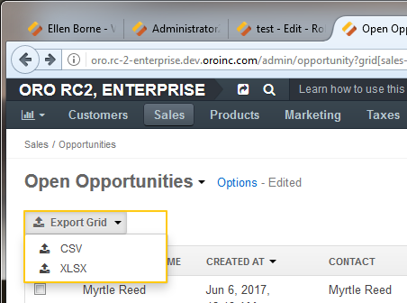
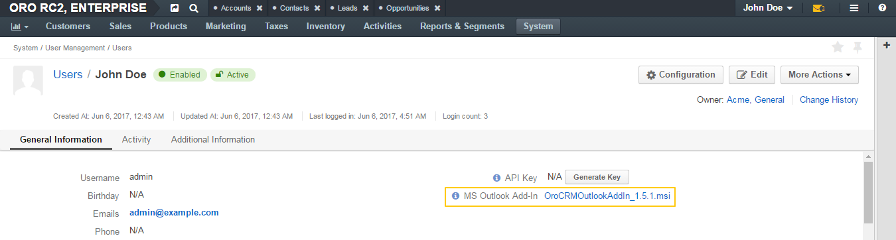
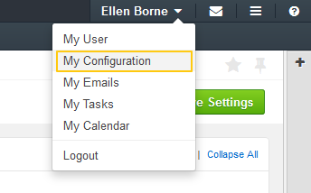

.. _admin-capabilities:

Capabilities List
=================

The capabilities are an important part of the Oro application security settings. For detailed information, see the
:ref:`Access and Permissions <user-guide-user-management-permissions>` guide.

A user's access to different functionalities depends on which capabilities are included in the user's role. For example, you
can limit a user's ability to assign tags or create new users.

This guide describes the set of capabilities that can be included into a user role and their related
functionalities.

.. contents:: :local:
   :depth: 2

.. _admin-capabilities-acc:

Account Management
------------------

.. _admin-capabilities-data-audit:    
    
Access Data Audit
^^^^^^^^^^^^^^^^^

This capability enables a user to review the full history of changes made to any record of an auditable entity (see step 6 of the
:ref:`Create an Entity <doc-entity-actions-create>` instruction), as well as an out-of-the-box report of all such 
actions. 

The report can be found by navigating to **System>Data Audit** in the main menu, and described in more details in the
:ref:`Data Audit <user-guide-data-audit>` guide.

The link to a specific record's history of changes is available in the top right corner of the record’s
:ref:`view page <user-guide-ui-components-view-pages>`.

.. image:: ../../user_guide/img/data_management/view/view_history.png

Data audit is usually used by system administrators but may also be used by managers in order to see how details
of different records were changed, as well as by whom.

.. _admin-capabilities-system-info:

Access System Information
^^^^^^^^^^^^^^^^^^^^^^^^^

This capability enables a user to view the system information page (by default, it can be found by navigating to **System>System Information** in the main menu). This page contains the list of Oro packages and third-party packages that are installed, and is usually only used by system administrators and
integrators.

Marketing
---------

.. _admin-capabilities-campaign-emails:

Send Campaign Emails
^^^^^^^^^^^^^^^^^^^^

With OroCRM's :ref:`email campaigns <user-guide-email-campaigns>`, a user can send personalized template-based emails
to multiple users. This capability enables a user to launch a campaign manually. That is, to start
:ref:`sending emails <user-guide-email-campaigns-send>` specified by the campaign which is not scheduled to send emails at a specific time (campaigns that has *Manual* selected for **Schedule**)).

.. image:: ../img/roles/email_campaign.png

.. note:: This capability does not affect the user's ability to define and edit campaign settings and create templates.

Those usually authorized to send email campaigns include marketing associates and other employees who engage in direct
communications with potential customers, existing clients, other system users, etc.

Sales Data
----------

Manage Abandoned Cart Campaigns
^^^^^^^^^^^^^^^^^^^^^^^^^^^^^^^

This capability enables a user to utilize the **Abandoned Cart Campaign** functionality. A user can generate automatic emails to customers in a Magento store.

For instance, users can send messages to customers who have not completed their purchase in order to convince them to complete the checkout and place an order.

You can find more details about this functionality in the :ref:`Magento Abandoned Cart Campaigns <user-guide-acc>` guide.

This functionality is useful for marketing representatives and any other employees who are working with email campaigns directed at customers of Magento-based store.

.. important::

    To use this functionality, you also need to :ref:`set up the Abandoned Cart extension <user-guide-acc>`.

Application
-----------

.. _admin-capabilities-jobs:

Access Job Queue
^^^^^^^^^^^^^^^^

.. TODO: check 2 capabilities with this name (BAP-10652)

This capability enables a user to review jobs that have been started in the system, as well as view their
current status and their performance log (by default, this information can be found by navigating to **System>Jobs** in the main menu).

The information about the jobs is important for system administrators.

.. _admin-capabilities-system-config:

Access System Configuration
^^^^^^^^^^^^^^^^^^^^^^^^^^^

This capability enables a user to access the system configuration page (by default, it can be found by navigating to **System>Configuration** in the main menu) where they can localize the system, change the display and tracking settings, and otherwise modify the system configuration.

.. _admin-capabilities-export-grid:

Export Grid View
^^^^^^^^^^^^^^^^

This capability enables a user to :ref:`export the grid views <doc-grids-actions-export>` that they have configured.

This is particularly useful for data analysts.

.. _admin-capabilities-outlook:

Outlook Integration
^^^^^^^^^^^^^^^^^^^

.. important:: For Enterprise Edition users only.

This capability enables a user to download the latest version of the OroCRM add-in for Outlook (see the **MS Outlook Add-In** field description of the :ref:`General <doc-my-user-view-page-general>` section of the **My User** page.

If :ref:`OroCRM is synchronized with Outlook <user-guide-synch-outlook>`, this add-in enables a user to synchronize
contacts, tasks, and calendar events between OroCRM and the user's Outlook account. The user can also associate emails to accounts,
contacts, opportunities, and cases, as well as create leads, opportunities, and cases in OroCRM that are based on emails
from the Outlook sidebar.

This is a general capability that can improve the user experience for all Enterprise users who are using both OroCRM and Outlook.

Update User Profile
^^^^^^^^^^^^^^^^^^^

This capability enables a user to update their own profile regardless of which permission for the **Edit** action on the **User** entity the user's role includes.

That is, when the **Update User Profile** capability is included in the user's role, even if the role has *None* selected for the **Edit** action on the **User** entity, the user will be able to update their profile.

This is convenient for all users.

.. _admin-capabilities-tags:

Assign/Unassign Tags
^^^^^^^^^^^^^^^^^^^^

A user can  assign/unassign :ref:`tags <user-guide-tags>` which are
non-hierarchical keywords or phrases assigned to records. They provide additional information about records and
are visible to all the system users.

Tags can be successfully utilized by all users.

Manage Menus
^^^^^^^^^^^^

This capability enables a user to access menus configuration.

Users can modify menus at three different levels:

- :ref:`Personal <doc-my-user-menus>` (To made changes at this level, a user opens their profile, and selects :guilabel:`Edit Menus` from the :guilabel:`More Actions` dropdown.
- :ref:`Organization <doc-config-menus>` (To made changes at this level, a user navigates to **System>User Management>Organization**, clicks the required organization, and on its view page, clicks :guilabel:`Edit Menu`).
- :ref:`System <doc-config-menus>` (To made changes at this level, a user navigates to **System>Menus**)

.. important::
   The ability to configure menus is controlled by the two capabilities: **Manage Menus** and **Access system configuration**.

   - To enable a user to personalise menus for themselves and configure menus for each organization individually, include the **Manage Menus** capability into the user role.

   - To enable a user to configure menus the whole enterprise (all organizations that exist in the Oro application) at once, in addition to the **Manage Menus** capability, include also the **Access system configuration** capability into the user role.

.. warning::
   For Enterprise Edition only:

   If your enterprise includes several organizations, changes made at **System>Menus** will affect all the organizations.

   To made changes only for a specific organization, make changes at the organization level.

.. Select the Assignee of the Integration
.. ^^^^^^^^^^^^^^^^^^^^^^^^^^^^^^^^^^^^^^

.. TODO BAP-14860

.. _admin-capabilities-view-sql:

View SQL Query of a Report/Segment
^^^^^^^^^^^^^^^^^^^^^^^^^^^^^^^^^^

This capability enables a user to review the SQL request that is sent to the system for a report/segment.

Usually, this capability is only granted to system administrators so they can check if a report has been developed correctly.
The **Show SQL Query** link will appear below the report.

.. image:: ../img/configuration/sql_show.png

.. hint:: This capability must be also enabled in the report settings. For this, in the main menu, navigate to **System Configuration>Display Settings>Report settings**, and select the **Display SQL In Reports And Segments** check box.

Access Personal Configuration
^^^^^^^^^^^^^^^^^^^^^^^^^^^^^

This capability enables a user to access the :ref:`personal configuration page <doc-my-user-configuration>` where they can localize the application, change the display settings, and otherwise modify how the application will appear to themselves. Changes made by a user on the personal configuration page do not affect other users.

.. _admin-capabilities-mailchimp:

Connect to MailChimp
^^^^^^^^^^^^^^^^^^^^

.. note:: Use this capability only when the system is integrated with MailChimp.

Such integration enbles a user to utilize MailChimp as an email campaign engine, as described in the
:ref:`Integration with MailChimp <user-guide-mc-integration>` guide. A user can synchronize lists of contacts in OroCRM
and MailChimp, use them to create email campaigns in MailChimp, import them to OroCRM, and use the MailChimp campaign
statistics to analyze the efficiency of the campaign.

The ability to integrate with MailChimp is especially useful for marketing associates and other managers responsible for email campaigns.

.. _admin-capabilities-passwords:

Manage Passwords
^^^^^^^^^^^^^^^^

This capability enables a user to change passwords of other users. Usually, this is only done
by system administrators. See :ref:`User Management <user-management-users>` for more information.

.. hint::

    This capability does not influence a user's ability to edit their own password from the **My User** page (see step 5 of the :ref:`Edit Your Profile <doc-my-user-actions-edit>` action description.

.. image:: ../img/roles/manage_passwords.png

.. _admin-capabilities-share-grid:

Share Data View
^^^^^^^^^^^^^^^^

This capability enables a user to :ref:`share and unshare the grid views <doc-grids-actions-grid-views-share>` that they have configured.

.. image:: ../img/roles/grid_share.png

.. image:: ../img/roles/grid_unshare.png

This is particularly useful for team-leads and heads of departments who want to modify and share grids with their subordinates.

Calendar
--------

Assign Calendar Events
^^^^^^^^^^^^^^^^^^^^^^

If this capability is enabled, a user can assign calendar events to another user's calendar.

For more information, see the :ref:`Manage Calendar Events <doc-activities-events-actions>` section of the :ref:`Calendar Events <doc-activities-events>` guide.

.. _admin-capabilities-org-calendar-events:

Manage Organization Calendars (and Their Events)
^^^^^^^^^^^^^^^^^^^^^^^^^^^^^^^^^^^^^^^^^^^^^^^^

If this capability is enabled, users can create, edit, and delete organization-wide calendars (i.e. system calendars with *Organization* selected for **Scope**) as well as events in these calendars.

For more information, see the :ref:`System Calendars <user-guide-calendars>` guide.

.. hint::

     Even if this capability is disabled, users can still view organization-wide calendars, add
     them to their own calendar views, and copy related events to their own calendars.

Organization calendars and their events are usually managed by organization-level managers and HRs.

.. _admin-capabilities-sys-calendar-events:

Manage System Calendars (and Their Events)
^^^^^^^^^^^^^^^^^^^^^^^^^^^^^^^^^^^^^^^^^^

If this capability is enabled, users can create, edit, and delete system-wide calendars (i.e. system calendars with *System* selected for **Scope**) as well as events in these calendars.

For more information, see the :ref:`System Calendars <user-guide-calendars>` guide.
**Calendars Overview** guide.

.. hint::

     Even if this capability is disabled, users can still view organization-wide calendars, add them to their
     own calendar views, and copy related events to their own calendars.

System-wide calendars are usually managed by system administrators, company managers and HRs.

Entity
------

.. _admin-capabilities-config-entities:

Access Entity Management
^^^^^^^^^^^^^^^^^^^^^^^^

This capability enables a user to access entity management (by default, it can be found by navigating to **System>Entities>Entity Management** in the main menu).

Many entities in OroCRM can be configured from the interface, as described in the
:ref:`Entities <doc-entities>` guide. A user can change the attachments settings,
define whether the entity should be displayed on a grid and/or a record view page, whether it will be
exported to a .csv file, and define other settings. For some of them, it is also possible to add new fields, as
described in the :ref:`Entity Fields  <doc-entity-fields>` guide.

They are usually performed by the system administrators.

.. _admin-capabilities-merge:

Merge Entities
^^^^^^^^^^^^^^

This capability enables users to :ref:`merge <doc-grids-actions-records-merge>` several records of the same entity.

By default, it is recommended to enable this capability. It is usually used by sales representatives.

.. _admin-capabilities-search:

Search
^^^^^^

This capability enables users to use the :ref:`search <user-guide-getting-started-search>` functionality to quickly find specific records.

This is a general capability that can improve the overall experience of all users.

The setting does not influence the user's ability to :ref:`search by tag <user-guide-getting-started-search-tag>`.

.. _admin-capabilities-export-entities:    

Export Entity Records
^^^^^^^^^^^^^^^^^^^^^

This capability enables users to export entity records as described in the :ref:`Import and Export Data <user-guide-export>` guide.

The :guilabel:`Export` button appears in the upper-right corner of the grid page.

.. image:: ../img/roles/export_data.png

Export is a general productivity tool that is usually enabled for most users.

.. _admin-capabilities-import-entities:

Import Entity Records
^^^^^^^^^^^^^^^^^^^^^

This capability enables users to import records from a file to OroCRM as described in the :ref:`Import and Export Data <user-guide-import>` guide.

The :guilabel:`Import File` button appears in the upper-right corner of the grid page.

.. image:: ../img/roles/import_data.png

This is necessary for users who need to import large sets of data into the system. For example, these may include sales
representatives or employees responsible for lead development.

