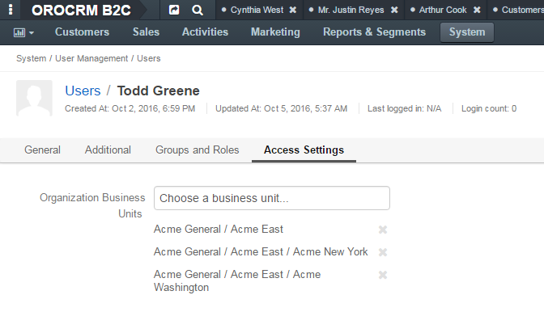
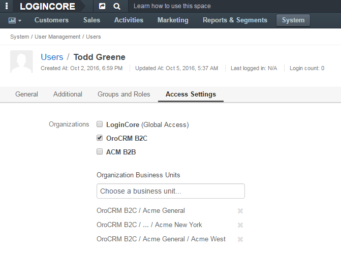

.. _doc-user-management-users-access-examples:

Access to Organizations and Business Units Examples
====================================================

.. contents:: :local:
    :depth: 3

Examples
---------

Example 1. 
~~~~~~~~~~

Give Todd access to two business units of the same organization.

|

.. image:: ../img/user_management/user_bu_2_org_1_sch.png 

|

Select each of the business units in **Access Settings**. Configuration on the interface:

|

.. image:: ../img/user_management/user_bu_2_org_1.png 

|

Example 2. 
~~~~~~~~~~

Give Todd access to two business units in different organizations. 

|

.. image:: ../img/user_management/user_bu_2_org_2_sch.png 

|

Just select each of the organizations and business units to which Todd must have access in **Access Settings**. Configuration on the interface:

|

.. image:: ../img/user_management/user_bu_2_org_2.png 

|

Example 3. 
~~~~~~~~~~

Give Todd access to the business unit with all chain of its subunits. 

|

.. image:: ../img/user_management/user_bu_2dl_org_1_sch.png 

|

There are two ways to give such access. 

One, if Todd's role includes *business unit level permissions*, is to give access to all the required business units individually. Configuration on the interface:

|

|

Another approach can be used if Todd's role includes *division level* permissions. A division is exactly a business unit with the whole chain of its subunits. Therefore, in this case, you can select only the top business unit of the division (**ACME East** in out example) in **Access Settings** and Todd will automatically have access to all subunits of the selected business unit and their subunits, and so on. 

This can be useful if there is a chance that a new business unit may appear in the chain and Todd will require access to it too. There will be no need to reconfigure access settings for Todd. 

|

.. image:: ../img/user_management/user_bu_2dl_org_1_sch2.png

|

Example 4. 
~~~~~~~~~~

Give Todd access to the jointed and disjointed business units at different levels of the company structure. 

|

.. image:: ../img/user_management/user_bu_3dl_org_1_sch.png 

|

Just select an organization(s) and all the business units to which Todd must have access in **Access Settings**. Configuration on the interface:

|

|

See Also
----------

    :ref:`Users Overview <user-management-users>`

    :ref:`User View Page <doc-user-management-users-view-page>`

    :ref:`Actions with Users <doc-user-management-users-actions>`

    :ref:`User System Configuration <doc-user-management-users-configuration>`

.. |IcRemove| image:: ../../img/buttons/IcRemove.png
	:align: middle

.. |IcClone| image:: ../../img/buttons/IcClone.png
	:align: middle

.. |IcDelete| image:: ../../img/buttons/IcDelete.png
	:align: middle

.. |IcEdit| image:: ../../img/buttons/IcEdit.png
	:align: middle

.. |IcView| image:: ../../img/buttons/IcView.png
	:align: middle

.. |IcShow| image:: ../../img/buttons/IcShow.png
	:align: middle

.. |IcHide| image:: ../../img/buttons/IcHide.png
	:align: middle

.. |IcPassReset| image:: ../../img/buttons/IcPassReset.png
  :align: middle

.. |IcConfig| image:: ../../img/buttons/IcConfig.png
  :align: middle  

.. |IcDisable| image:: ../../img/buttons/IcDisable.png
  :align: middle    
