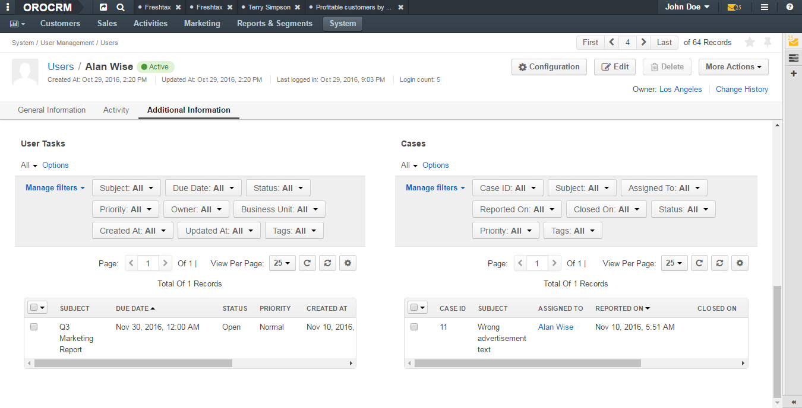

.. _doc-user-management-users-view-page:

User View Page
================

.. contents:: :local:
    :depth: 3

Description
-------------

Top of the page
"""""""""""""""

On the upper-left of the page, you can see the user's avatar, their full name and statuses. 

The first status shows whether the user is enabled (i.e. the user is granted rights to use the system) or disabled. 

The second status is called ``authentication status`` and defines the actuality of the user's password. The authentication status can be one of the following:

- **Active**—The user can use their password to log into the system.
- **Password reset**—The password reset link has been sent to the user, but the user is still is in the process of the password change. This status appears not only when password is being manually reset. The user will receive this authentication status when their password has expired—in this case the system automatically starts the password reset procedure. 
- **Locked**—(EE only) The user has exceeded allowed number of failed login attempts. 

In the next row you can check when the user's record was created, updated. Also, there is information about the date and time when the user last logged in and how many times they logged into the OroCRM in general. 

|

.. image:: ../img/user_management/user_review_pagetop.png 

|

In the upper-right part of the page there is the following set of action buttons: 

:guilabel:`Activate`—(EE only) This button appears when user has the **Locked** authentication status (i.e. the user has exceeded the allowed number of failed login attempts). Click this button to activate the user. See the :ref:`Activate a User <doc-user-management-users-actions-activate>` action description. 

:guilabel:`Disable User` / :guilabel:`Enable User`— Which of these two buttons appears depends on the current user status, whether the user is enabled or disabled. Click :guilabel:`Disable User` if the user must not be able to use this system any more. Click :guilabel:`Enable User` to grant a user the right to use the system, See the :ref:`Disable a User <doc-user-management-users-actions-disable>` and :ref:`Enable a User <doc-user-management-users-actions-enable>` action descriptions.

:guilabel:`Configuration`—Click this button to configure how the interface will look for a user, user's email settings, and integrations. See the :ref:`Configure User's Interface, Email Settings and Integrations <doc-user-management-users-actions-configure>` action description.

:guilabel:`Edit`—Click this button to edit the user. See the :ref:`Edit a User <doc-user-management-users-actions-edit>` action description.

:guilabel:`Delete`—Click this button delete a user.  See the :ref:`Delete a User <doc-user-management-users-actions-delete>` action description.

**More Actions** drop-down: 

  :guilabel:`Send Email`—Click this action button to import fields into the entity. See the :ref:`Send an Email <doc-user-management-users-actions-email>` action description.

  :guilabel:`Log Call`—Click this action button to log or make a call. See the :ref:`Log or Make a Call <doc-user-management-users-actions-call>` action description.

  :guilabel:`Assign Event`—Click this action button to assign an event to a user. See the :ref:`Assign an Event <doc-user-management-users-actions-event>` action description.

  :guilabel:`Assign Task`—Click this action button to assign a task to a user. See the :ref:`Assign a Task <doc-user-management-users-actions-task>` action description.

  :guilabel:`Change Password`—Click this action button to change a user's password. See the :ref:`Change a User's Password <doc-user-management-users-actions-change-password>` action description.

  :guilabel:`Reset Password`—Click this action button to reset a user's password. See the :ref:`Reset a User's Password <doc-user-management-users-actions-reset-password>` action description. 

.. note::
    Described action buttons are default for users. However, depending on the settings applied to the **User** entity, additional action buttons may appear in the **More Actions** drop-down, such as **Add Task**, **Add Event**, **Add Attachment**. For more information about them, see the :ref:`Activities <user-guide-activities>` guide.

In the next row you, you can check which business unit owns the user record. Click the owner name to open the corresponding business unit view page. If you are logged into the organization with global access (i.e. technical organization that aggregates data from all organizations created in the system), then in brackets you will see the name of organization that owns the user. 

|

.. image:: ../img/user_management/user_review_owner.png

|

Click the **Change History** link to see who, how and when modified the entity.

Other information about the user is divided into four sections. 

General Information Section
"""""""""""""""""""""""""""

This section contains information about the user filled in when creating the user. 

|

.. image:: ../img/user_management/user_review_general.png

|

+-------------------------+--------------------------------------------------------------------------------------------------------------------------------------------------------------------------------------------------------------------------+
| Field                   | Description                                                                                                                                                                                                              |
+=========================+==========================================================================================================================================================================================================================+
| Username                | A name that the user will use to log into the system.                                                                                                                                                                    |
+-------------------------+--------------------------------------------------------------------------------------------------------------------------------------------------------------------------------------------------------------------------+
| Birthday                | A date of user's birth and their calculated age.                                                                                                                                                                         |
+-------------------------+--------------------------------------------------------------------------------------------------------------------------------------------------------------------------------------------------------------------------+
| Emails                  | A list of user's email addresses. The first one (formatted in bold) is the user's primary email address.                                                                                                                 |
|                         |                                                                                                                                                                                                                          |
|                         | Point to the email address and click the **Email** icon next to it to immediately compose an email. Click the **Hangouts** icon to start making a call.                                                                  |
|                         |                                                                                                                                                                                                                          |
|                         | .. image:: ../img/user_management/user_email_write.png                                                                                                                                                                   |
+-------------------------+--------------------------------------------------------------------------------------------------------------------------------------------------------------------------------------------------------------------------+
| Phone                   | A user's phone number. Point to the phone number and click the **Phone** or **Hangouts** icon that appear next to it to immediately start logging or making a call.                                                      |
|                         |                                                                                                                                                                                                                          |
|                         | .. image:: ../img/user_management/user_hangouts_call.png                                                                                                                                                                 |
+-------------------------+--------------------------------------------------------------------------------------------------------------------------------------------------------------------------------------------------------------------------+
| Roles                   | A list of roles assigned to the user.                                                                                                                                                                                    |
+-------------------------+--------------------------------------------------------------------------------------------------------------------------------------------------------------------------------------------------------------------------+
| Groups                  | A list of groups to which the user belongs.                                                                                                                                                                              |
+-------------------------+--------------------------------------------------------------------------------------------------------------------------------------------------------------------------------------------------------------------------+
| Business Units          | A list of business units the user has access to.                                                                                                                                                                         |
+-------------------------+--------------------------------------------------------------------------------------------------------------------------------------------------------------------------------------------------------------------------+
| Failed Login Count      | If the corresponding security policy is enabled for the organization, this field contains a number of failed login attempts that the user performed up to date. If such policy is disabled, **N/A** is displayed.        |
|                         |                                                                                                                                                                                                                          |
|                         | See :ref:`User Settings <admin-configuration-user-settings>` for more information about the security policy.                                                                                                             |
+-------------------------+--------------------------------------------------------------------------------------------------------------------------------------------------------------------------------------------------------------------------+
| Password Expires At     | If the corresponding security policy is enabled for the organization, this field contains a date and time when the user's password expires. If such policy is disabled, **N/A** is displayed.                            |
|                         |                                                                                                                                                                                                                          |
|                         | See :ref:`User Settings <admin-configuration-user-settings>` for more information about the security policy.                                                                                                             |
+-------------------------+--------------------------------------------------------------------------------------------------------------------------------------------------------------------------------------------------------------------------+
| LDAP Distinguished Name | A value of the **dn** LDAP field. This field is not empty for user only of their record has been imported from the LDAP server.                                                                                          |
+-------------------------+--------------------------------------------------------------------------------------------------------------------------------------------------------------------------------------------------------------------------+
| Tags                    | A list of tags added to the user. Point to the the tags name (or **N/A** if no tags are defined) and click the **Edit** icon next to them to add a new tag.                                                              |
|                         |                                                                                                                                                                                                                          |
|                         | .. image:: ../img/user_management/user_tags_add.png                                                                                                                                                                      |
+-------------------------+--------------------------------------------------------------------------------------------------------------------------------------------------------------------------------------------------------------------------+
| API key                 | An API key generated for the user. Click the :guilabel:`Generate Key` button to generate a new key.                                                                                                                      |
+-------------------------+--------------------------------------------------------------------------------------------------------------------------------------------------------------------------------------------------------------------------+

This section can also contain custom fields defined for the **User** entity (e.g. **Title** on the screenshot above). 

.. important::
   If you do not see icons and buttons that allow making Hangouts calls, make sure that the Hangouts functionality is enabled for the organization. See :ref:`Google Integration Settings <admin-configuration-integrations-google>` for more information. 

Activity Section
""""""""""""""""
This section contains information about the user's activities: emails sent and received, calls, etc. By default, the **User** entity has only the **Email** and **Call** activities enabled. 

|

.. image:: ../img/user_management/user_review_activity.png

|

You can filter activities by type and by date range when they took or will take place and browse them from the newest to the oldest and vice verse.

You can see who started the activity, its type, name and description, when it was created and number of comments added under it. 

Click the activity to see detailed information about it. 

You can add a comment under a particular activity. To do this, click the activity to expand it and click the :guilabel:`Add Comment` button. In the **Add Comment** dialog box, type your message. Use the built-in text editor to format your comment. You can also attach a file to your comment. For this, click the **Upload** link in the dialog box and locate the required file. When the comment is ready, click :guilabel:`Add`. 

|

.. image:: ../img/user_management/user_review_activity_comment.png

|

To edit or delete a comment, click the ellipsis menu next to it and click the |IcEdit| **Edit** or |IcDelete| **Delete** icon correspondingly.

|

.. image:: ../img/user_management/user_review_activity_comment2.png

|

You can add and delete an activity context. To delete a context for an activity, click the **x** icon next to the required context. 

To add a context to the activity, click the  **Context** icon in the ellipsis menu at the right end of the activity row. In the **Add Context Entity** dialog box, choose the desired context and click it to select.  

|

.. image:: ../img/user_management/user_review_activity_context_delete.png

|

|

.. image:: ../img/user_management/user_review_activity_context_add.png

|

You can open an activity view page. To do this, click the |IcView| **View** icon in the ellipsis menu at the right end of the activity row. 

|

.. image:: ../img/user_management/user_review_activity_context_add.png

|

For an email activity, you can reply / reply all / forward the corresponding email. To do this, click the corresponding icon in the ellipsis menu at the right end of the activity row.

|

.. image:: ../img/user_management/user_review_activity_reply.png

|

Alternatively, you can select the required action from the list in the activity expanded area.

|

.. image:: ../img/user_management/user_review_activity_reply2.png

|

You can delete a phone activity. To do this, click the |IcDelete| **Delete** icon in the ellipsis menu at the right end of the activity row.

|

.. image:: ../img/user_management/user_review_activity_delete.png

|

For a phone activity, you can call the user via Google Hangouts, if such functionality is enabled. To do this, point to the user's phone number and click the **Hangouts** icon next to it. For how to enable Google Hangouts functionality, see the `Voice and Video Calls via Hangouts <../integrations/hangouts>`__ guide.

|

.. image:: ../img/user_management/user_review_activity_phone_hangouts.png

|

For more information about activities, see the `Activities <../../user-guide/activities/activities-overview>`__ guide.

Additional Information Section
""""""""""""""""""""""""""""""

This section contains information about the user's tasks and opened cases.

|

|

Tasks Subsection
~~~~~~~~~~~~~~~~
This grid contains information about tasks assigned to the user. 

Tasks are activities that need to be accomplished by a user. Keeping track on tasks helps organize the work process and ensure that all the important work is done. 

You can filter tasks by a variety of parameters. To open the task view page, click this task in the grid.

For more information about tasks management, see the `Add Task and Assign Task <../../user-guide/activities/activities-add-assign-tasks>`__ guide.

Cases Subsection
~~~~~~~~~~~~~~~~
This grid contains information about cases assigned to the user. 

Cases are issues, problems or failures reported by customers or found internally. It's important to record, monitor and solve cases in time to ensure that small and big issues do not harm your the company business. 

You can filter cases by a variety of parameters. To open the case view page, click this case in the grid.

For more information about cases management, see the `Create Case <../../user-guide/activities/activities-create-case>`__ guide.

See Also
----------

    :ref:`Users Overview <user-management-users>`

    :ref:`Actions with Users <doc-user-management-users-actions>`

    :ref:`User System Configuration <doc-user-management-users-configuration>`

    :ref:`Access to Organizations and Business Units Examples <doc-user-management-users-access-examples>`

.. |IcRemove| image:: ../../img/buttons/IcRemove.png
	:align: middle

.. |IcClone| image:: ../../img/buttons/IcClone.png
	:align: middle

.. |IcDelete| image:: ../../img/buttons/IcDelete.png
	:align: middle

.. |IcEdit| image:: ../../img/buttons/IcEdit.png
	:align: middle

.. |IcView| image:: ../../img/buttons/IcView.png
	:align: middle

.. |IcShow| image:: ../../img/buttons/IcShow.png
	:align: middle

.. |IcHide| image:: ../../img/buttons/IcHide.png
	:align: middle

.. |IcPassReset| image:: ../../img/buttons/IcPassReset.png
  :align: middle

.. |IcConfig| image:: ../../img/buttons/IcConfig.png
  :align: middle  

.. |IcDisable| image:: ../../img/buttons/IcDisable.png
  :align: middle    
