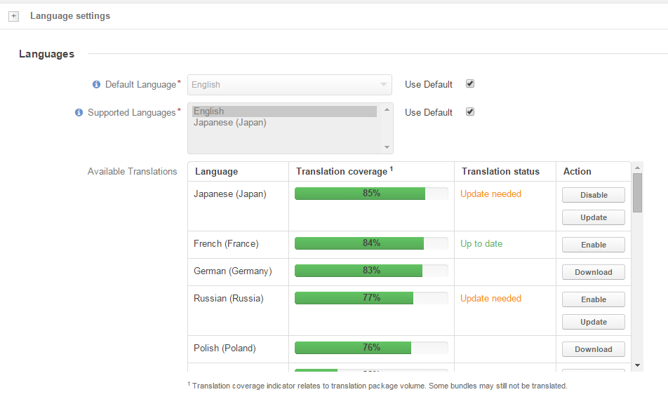

How to Translate the Oro Project
==================================

Oro products support many internationalization functions including multiple languages and translations.
All translatable strings are defined in each bundle translation domain files and are available via the translation
management service `CrowdIn`_. This service allows to easily collaborate on the translation process and to enable
more supported languages.

To take part in the localization, you need to:

1. :ref:`Join <translations-join-the-team>` the translation team.

2. :ref:`Propose <translations-propose-translations>` your translations.

3. Wait and :ref:`see your translations added <translations-added>` to the system and
   :ref:`apply <translations-language-settings>` it or :ref:`contact <translations-contact>` the Oro team.

.. _translations-join-the-team:

Join the Translation Team
-------------------------

1. Sign up and create your profile at the Crowdin (or sign in, if you already have the profile):

   1. Click the `Crowdin <https://crowdin.com/join>`_ link at the 'Community --> Localization' page.

   2. Follow the link in the confirmation Email to activate you account.

2. Click `OroCRM <http://translate.orocrm.com>`_ link to offer translations for OroCRM or
   `Oro Platform <http://translate.platform.orocrm.com>`_ to offer translations for OroPlatform.

   The project page will appear.

3. Choose the language to which you want to translate.

4. A ‘“You must join the translators team to be able to participate in this project.”’ note will
   appear above the language list. Click the :guilabel:`Join` button.

5. The Request form will appear. Define why you want to join the translation team and click the
   :guilabel:`Join` button.

   1. Your request will be reviewed by the Oro team. Upon approval, you will get another Email from
      Crowdin.

   2. Click the :guilabel:`Get Involved` button in the letter you received.

.. _translations-propose-translations:

Propose Your Translations
-------------------------

1. Log in at https://crowdin.com/

2. Hover the mouse over the "Translation" column of the necessary project and click :guilabel:`Go to Translations`.

3. Choose the language of your translation team.

4. Choose the Oro bundle and file for which you want to translate.

5. Translate as described in the Crowdin tutorial at
   https://support.crowdin.com/for-translators/onlineworkbench/translation-tutorial/

.. _translations-added:

What Happens Next?
------------------

1. After you have proposed the translation, it will be queued for
   `proofreading <https://support.crowdin.com/for-translators/onlineworkbench/proofreading>`_
   and can also be `voted <https://support.crowdin.com/for-translators/onlineworkbench/voting>`_ by other translators.

2. If the translation was approved:

 - it will be marked with a green check

 - it will be moved to the end of the list on the translation page

3. Approved translations are merged once a day. Once the translation was approved, it will become available from the
   *System --> Configuration --> Language Settings* page.

  .. _translations-language-settings:

Apply the Translation
---------------------

1. Go to the the *System --> Configuration --> Language Settings* page.

2. Check the Available Translations grid:

- If the :guilabel:`Download` button is available and the "Translation status" column is empty, the
  translation has not been loaded by you. Click the :guilabel:`Download` button.

- If the translation has been loaded and its status is Up to date, you can Enable it (:guilabel:`Enable`).

- If the translation has been loaded and enabled, you can Disable it (:guilabel:`Disable`).

- Once new translations have been merged, the status will change to "Update needed". Click the :guilabel:`Update` button.
  New translations will be added and the status will be changed back to "Up to date"

- The settings will be applied, once you have clicked the :guilabel:`Save Settings` button in the top right-hand corner
  of the page. Enabled languages will appear in the "Supported Languages" field and in the "Default Language" drop-down.

.. _translations-contact:

How and When to Contact Oro about Translations
----------------------------------------------

In order to contact the Oro team about a translation issue, please use the
`contact <https://crowdin.com/mail/compose/oro>`_ link in the "Owner" section (left-hand side of the project page).

Please don't hesitate to contact us from Crowdin if:

- your translation has been marked as approved for over one day and has not appeared at the site

- your translation is still in "not approved" status (there is a green dot near it in the list) for too long

- you want to become a proofreader for a certain language

- you have any other question and issue with translations that are not covered in this guide and the Crowdin tutorial.
