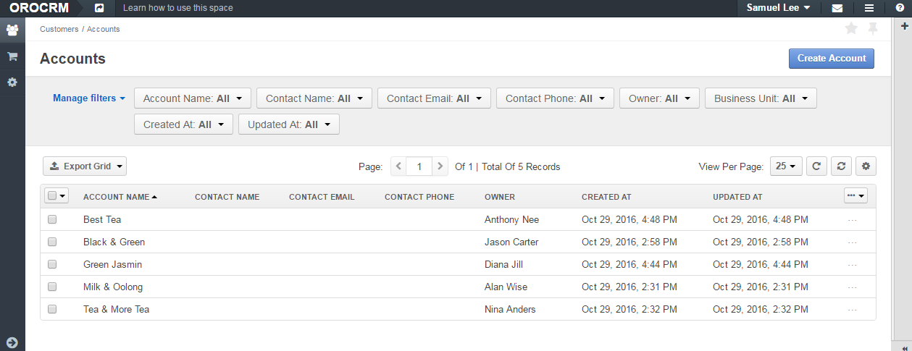

Access Configuration Examples
=============================

.. contents:: :local:
    :depth: 3

Sales Structure
---------------

Let's imagine that there are two main regional divisions in the company: one in the USA, the other in the EU.

Each of these divisions has smaller subdivisions. 
In USA it is the 'Los Angeles' division, 'Dallas' division, 'New York' division. 
In EU it is the 'Western Europe' division and the 'Eastern Europe' division. 

Sales in this company are a structured the following way:

The Sales Director controls both regions. Each of the regions has its own Regional Sales Manager (RSM). Each of the subdivisions has an Area Sales Manager (ASM) who has a team of Sales Representatives as subordinates.

The picture bellow helps visualize it: 

|

.. image:: ./img/access_roles_management/sales_structure.png

|

Goal
^^^^

We want to configure roles and other access settings in such a way that the sales representatives could access only the data they own. ASMs must be able to access data of the their whole subdivision. RSMs—data of all areas in their region. Sales Director must be able to view all the company data. 

Configuration
"^^^^^^^^^^^^

Let's assume that we have already created all the required Business Units: 'Main Office' (represents the unit that has access to the whole organization), 'USA,' 'EU,' 'Los Angeles,' 'Dallas,' 'New York,' 'Western Europe,' 'Eastern Europe.' 'Main Office' does not have a parent business unit. Business Units 'USA' and 'EU' have 'Main Office' as a parent business unit. 'Los Angeles,' 'Dallas,' 'New York' have the 'USA' business unit as a parent one. 'Western Europe,' 'Eastern Europe' have 'EU' as a parent business unit. 

|

.. image:: ./img/access_roles_management/sales_bu_usa.png

|

.. image:: ./img/access_roles_management/sales_bu_la.png

|

First, we create roles. We need 4 roles: 'Sales Rep,' 'Area Sales Manager,' 'Region Sales Manager,' 'Sales Director.' 
 
Into the 'Sales Rep' role we will include permissions that will have the **User** access level.

|

.. image:: ./img/access_roles_management/sales_role_rep.png

|

Into the 'Area Sales Manager' role we will include permissions that will have the  **Business Unit** access level. 

|

.. image:: ./img/access_roles_management/sales_role_asm.png

|

Into 'Regional Sales Manager'—permissions with the **Division** access level.   

|

.. image:: ./img/access_roles_management/sales_role_rsm.png

|

And into the 'Sales Director' role—permissions with the **Organization** access level .

|

.. image:: ./img/access_roles_management/sales_role_dir.png

|

Second, we configure users: assign roles, define which business units the users will have access to. 

|
   
**Sales Director**

Our sales director will have the following settings: 

   - **Owner**—The sales director has access to the whole organization. So we set 'Main Office' as the owner. 
    
   |

   .. image:: ./img/access_roles_management/sales_user_sd_owner.png

   |

   - **Roles**—We select the 'Sales Director' role.
    
   |

   .. image:: ./img/access_roles_management/sales_user_sd_roles.png

   |

   - **Organization**—We select 'OroCRM'. 
    

   |

   .. image:: ./img/access_roles_management/sales_user_sd_organization.png

   |

    As the sales director will have permissions with the **Global** access level, there is no need to specify what particular business units they she must have access to. 

   |

**Regional Sales Manager**
RSMs will have the following settings: 

   - **Owner**—Either 'USA' or 'EU.'  

   
   - **Roles**—'Regional Sales Manager.'
   
   - **Organization**—'OroCRM.'
   
   - **Organization Business Units**—Either 'USA' or 'EU.'  Regional Sales Managers will have permissions with the **Division** access level. A division is a business unit with all the chain of its sub business units and their sub business units an so on. So we need to specify only the top business unit in this chain. 
   
|

**Area Sales Manager**
ASMs will have the following settings: 

   - **Owner**—One of the business units of a lower level: 'Los Angeles,''Dallas,' 'New York,' 'Western Europe,' 'Eastern Europe.' 
   
   - **Roles**—'Area Sales Manager.'
   
   - **Organization**—'OroCRM.'
   
   - **Organization Business Units**—One of the business units of a lower level: 'Los Angeles,''Dallas,' 'New York,' 'Western Europe,' 'Eastern Europe.' 
    
|  

**Sales Representatives**
Finally, sales representatives will have the following settings: 

   - **Owner**—One of the business units of a lower level: 'Los Angeles,''Dallas,' 'New York,' 'Western Europe,' 'Eastern Europe.' 
   
   - **Roles**—'Sales Rep.'
   
   - **Organization**—'OroCRM.'
   
   - **Organization Business Units**—One of the business units of a lower level: 'Los Angeles,''Dallas,' 'New York,' 'Western Europe,' 'Eastern Europe.' 
    
|

Now we can check that when Alan Wise, sales representative in Los Angeles, creates an account, for example, he can assign only himself as an owner of this account (account belongs to him). He will also be able to see only his accounts (unless his managers share any accounts with him).

|

.. image:: ./img/access_roles_management/sales_acc_alan.png

|

Nina Anders, who is an ASM, can manage accounts created by sales representatives of her business unit and by herself:

|

.. image:: ./img/access_roles_management/sales_acc_nina.png

|

A USA Regional Sales Manager, Samuel Lee, can see and manage accounts of the Nina's (Los Angeles ASM) business unit and of Anthony's (Dallas ASM) business units as both of them are subunits of the business unit USA.

|

|

 And, finally, a sales director has access to all accounts of the company.   

 
Multiple Organizations
-----------------------

There are two businesses that our company runs. One of them is tea sales. The other one—clothes sales. For each business we have created an individual organization in OroCRM ('Tea Sweet' and 'Best Style'). 
John, Jane and Jill are marketing team members. John works in 'Tea Sweet,'' Jane and Jill—in 'Best Style.'' However, being a wide-range specialist, Jill shares her attention between both businesses and thus is given access to both organizations. 
John, Jane and Jill are assigned the 'Marketing' role that includes organization level permissions. 

Each of marketers creates two campaigns in OroCRM: 

|

.. image:: ./img/access_roles_management/multi.png

|

Let's see which data each team member can see. We know that John and Jane can log in only to the organization they work in, and Jill can log into both: 

|

.. image:: ./img/access_roles_management/multi_login.png

|

But what happens when the need ceases for Jill's work at 'Sweet Tea' and an administrator rejects her access to this organization? Now Jill cannot log in into 'Sweet Tea' and cannot see or modify the campaign she has created. She remains the campaign's owner though as other users with access to 'Sweet Tea' can see:

|

.. image:: ./img/access_roles_management/multi_jillcannotlogin.png

|

.. caution::
      This mean that you must be very careful when granting or rejecting users access to organizations. Imagine that John has only user-level permissions for working with campaigns. Then there will be no one in Sweet Tea (except maybe a system administrator) who can manage Jill's account. Such situations are better to be avoided, thus try to make sure that there will be no unattended data when you change access rights. 

User Has Access to Multiple Business Units
-------------------------------------------

The 'Sweet Tea' company has the Lead Development team which is divided into two geographically distributed units: 'Los Angeles' and 'New York.' Alex, Aaron and Anna are Lead Development Representatives. Alex has access to the 'Los Angeles' business unit, Anna—to the 'New York' unit. Aaron is an experienced employee and was asked by his management to help team members of both business units. Thus, he is granted access to both 'Los Angeles' and 'New York.'   

Each of the team members creates a lead record in OroCRM:

|

.. image:: ./img/access_roles_management/leads_structure.png

|

Let's see which data each team member can see: 

|

.. image:: ./img/access_roles_management/leads_visibility.png

|

Links
------

For general overview of roles, see the `Roles Management <./access-management-roles>`__ guide.
For how role is represented on the interface, see the `Roles on the Interface <./access-management-roles-inteface>`__ guide.
For what actions you can perform with roles, see the `Actions with Roles <./access-management-roles-actions>`__ guide.

.. |IcRemove| image:: ./img/buttons/IcRemove.png
   :align: middle

.. |IcClone| image:: ./img/buttons/IcClone.png
   :align: middle

.. |IcDelete| image:: ./img/buttons/IcDelete.png
   :align: middle