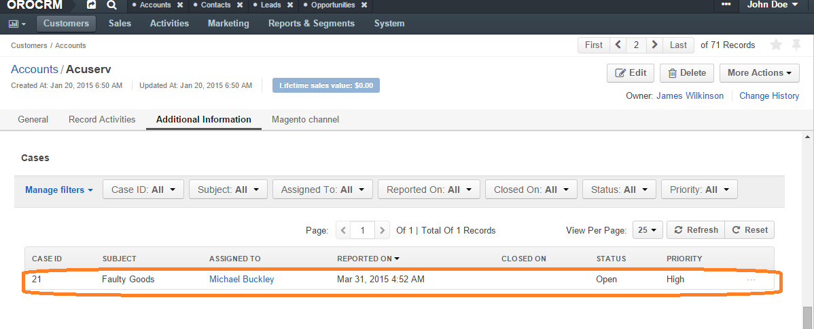

:orphan:

.. _user-guide-activities-cases-edit:

View and Manage Cases
=====================

.. note:: The ability to view and edit cases depends on specific roles and permissions defined in the system.

- All the cases can be viewed from the Cases grid.

- All the cases assigned to a specific user (cases, for which the "Assigned to" field is not empty) are displayed in and
  can be reached from the "Cases" grid in the "Additional Information" section on the View page of the user record.

.. image:: ../img/activities/case_view_user.png

- All the cases assigned to a specific contact (cases, for which the  "Related Contact" field is not empty) are
  displayed in and can be reached from the "Cases" grid in the "Additional Information" section on the View page of the
  contact record.

.. image:: ../img/activities/case_view_contact.png

- All the cases assigned to a specific account (cases, for which the "Related Account" field is not empty) are displayed
  and can be reached from the "Cases" grid in the "Additional Information" section on the View page of the account record.

- From any of the grids above, you can manage the cases using the action icons:

  - Delete the case: |IcDelete|

  - Get to the :ref:`Edit form <user-guide-ui-components-create-pages>` of the case: |IcEdit|

  - Get to the :ref:`View page <user-guide-ui-components-view-pages>` of the case:  |IcView|

.. note::  The tasks can also be mapped to the Zendesk account as described in the :ref:`Integration with Zendesk <user-guide-zendesk-integration>` guide.

.. |IcDelete| image:: ../../img/buttons/IcDelete.png
   :align: middle

.. |IcEdit| image:: ../../img/buttons/IcEdit.png
   :align: middle

.. |IcView| image:: ../../img/buttons/IcView.png
   :align: middle
