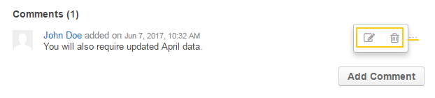
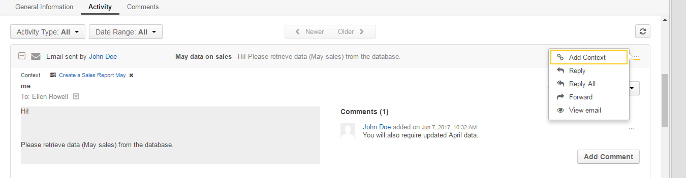
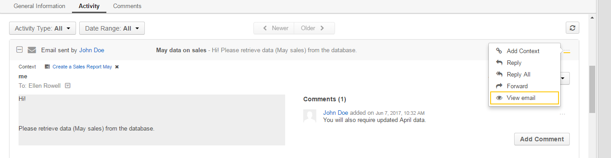
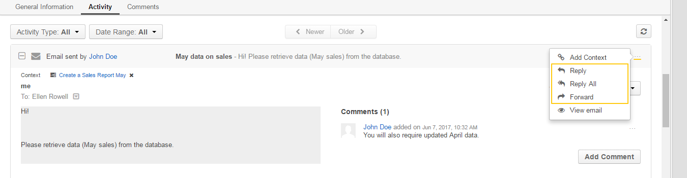

.. _doc-activities-tasks-view-page:

Task View Page
==============

|

.. image:: ../../img/activities/tasks/activities_tasks_viewpage.png

|

.. contents:: :local:
   :depth: 3

.. _doc-activities-tasks-view-page-top:

Page Top
^^^^^^^^

On the upper-left of the page, you can see the task subject (it serves as a name of the task). Next to it you can see the task status—whether it is open, in progress, or closed (for status descriptions, see the :ref:`Task Statuses <doc-activities-tasks-statuses>` section).

The next row contains a list of contexts associated with this task. To delete a task context, click the **x** icon next to it. See the :ref:`Remove a Context from a Task <doc-activities-tasks-actions-contextdel>` action description.

The following set of action buttons is available in the upper-right part of the page:

- **Share**—(Enterprise Edition only) Click this button to share / unshare a task with other users. See the :ref:`Share a Task <doc-activities-tasks-actions-share>` and :ref:`Unshare a Task <doc-activities-tasks-actions-unshare>` action descriptions.
- **Add Context**—Click this button to add a context to a task. See the :ref:`Add a Context to a Task <doc-activities-tasks-actions-contextadd>` action description.
- **Edit**—Click this button to edit a task. See the :ref:`Edit a Task <doc-activities-tasks-actions-edit>` action description.
- **Delete**—Click this button to delete a task. See the :ref:`Delete a Task <doc-activities-tasks-actions-delete>` action description.
- **Send Email**—Click this button to send an email related to this task. See the :ref:`Send an Email <doc-activities-tasks-actions-email>` action description.

In the next row you can check which user this task is assigned to. Click the assignee name to open the corresponding user view page. Enclosed in parentheses, there is the name of organization that the assignee belongs too.
Click the **Change History** link to see who, how, and when modified the task.

Task Statuses
^^^^^^^^^^^^^

.. include:: activities_tasks_statuses.rst
   :start-after: begin_task_statuses
   :end-before: finish_task_statuses

.. _doc-activities-tasks-view-page-task-flow:

Task Flow
^^^^^^^^^

|

.. image:: ../../img/activities/tasks/activities_tasks_taskflow.png

|

When the **Task Flow** workflow is enabled in the Oro application, this section contains transition buttons that help direct you through phases of work on the task.

Available options depend on the current status of the task. The following table describes which options are available for each of the statuses and how the corresponding transitions chane the task status.

+----------------+------------------------------------------------------------------------------------------------------------------------------------------------------------------------------------------------------+-------------+
| Current Status | Available Options                                                                                                                                                                                    | New Status  |
+================+======================================================================================================================================================================================================+=============+
| Open           | Click **Start Progress** to start working on this task.                                                                                                                                              | In Progress |
|                +------------------------------------------------------------------------------------------------------------------------------------------------------------------------------------------------------+-------------+
|                | Click **Close** to close the task.                                                                                                                                                                   | Closed      |
+----------------+------------------------------------------------------------------------------------------------------------------------------------------------------------------------------------------------------+-------------+
| In Progress    | Click **Stop Progress** to denote that you have stopped working on this task, but the task is not yet completed. (E.g., the description of what neds to be done for this task is to be readjusted.)  | Open        |
|                +------------------------------------------------------------------------------------------------------------------------------------------------------------------------------------------------------+-------------+
|                | Click **Close** to close the task.                                                                                                                                                                   | Closed      |
+----------------+------------------------------------------------------------------------------------------------------------------------------------------------------------------------------------------------------+-------------+
| Closed         | Click **Reopen** to actualize the task again.                                                                                                                                                        | Open        |
+----------------+------------------------------------------------------------------------------------------------------------------------------------------------------------------------------------------------------+-------------+

For status descriptions, see the :ref:`Task Statuses <doc-activities-tasks-statuses>` section.

For information on workflows, see the :ref:`Following a Workflow <user-guide-workflow-management-basics>` guide.

.. _doc-activities-tasks-view-page-general:

General Information
^^^^^^^^^^^^^^^^^^^

This section contains the main information about a task.

+------------------+---------------------------------------------------------------------------------------------------------------------------------------------------------------------------------------+
| Field            | Description                                                                                                                                                                           |
+==================+=======================================================================================================================================================================================+
| Subject          | Short, one-phrase description of what the task is about.                                                                                                                              |
+------------------+---------------------------------------------------------------------------------------------------------------------------------------------------------------------------------------+
| Description      | Detailed statement of what work is to be done in relation to the task.                                                                                                                |
+------------------+---------------------------------------------------------------------------------------------------------------------------------------------------------------------------------------+
| Due Date         | The day and time when the task must be completed.                                                                                                                                     |
+------------------+---------------------------------------------------------------------------------------------------------------------------------------------------------------------------------------+
| Priority         | Nominates an order in which the task should be managed. Can be *High*, *Normal*, or *Low*. Higher-priority tasks should be managed first.                                             |
+------------------+---------------------------------------------------------------------------------------------------------------------------------------------------------------------------------------+
| Assigned To      | The user who is responsible for doing the work related to the task.                                                                                                                   |
+------------------+---------------------------------------------------------------------------------------------------------------------------------------------------------------------------------------+
| Tags             | A list of :ref:`tags <user-guide-tags>` added to the task. Point to the the tags name (or **N/A** if no tags are defined) and click the **Edit** icon next to them to add a new tag.  |
|                  |                                                                                                                                                                                       |
|                  | .. image:: ../../img/activities/tasks/tags_add.png                                                                                                                                    |
+------------------+---------------------------------------------------------------------------------------------------------------------------------------------------------------------------------------+

.. _doc-activities-tasks-view-page-activities:

Activities
^^^^^^^^^^

This section contains information about the activities related to the task. By default, the **Task** entity has only the **Email** activity enabled.

|

.. image:: ../../img/activities/tasks/task_review_activity.png

|

You can filter activities by type and by date range when they took or will take place and browse them from the newest to the oldest and vice verse.

You can see who started the activity, its type, name and description, when it was created and number of comments added under it.

Click the activity to see detailed information about it.

You can add a comment under a particular activity. To do this, click the activity to expand it and click the **Add Comment** button. In the **Add Comment** dialog, type your message. Use the built-in text editor to format your comment. You can also attach a file to your comment. For this, click the **Upload** link in the dialog and locate the required file. When the comment is ready, click **Add**.

|

.. image:: ../../img/activities/tasks/task_review_activity_comment.png

|

To edit or delete a comment, click the ellipsis menu next to it and click the |IcEdit| **Edit** or |IcDelete| **Delete** icon correspondingly.

|

|

You can add and delete an activity context.

To delete a context for an activity, click the **x** icon next to the required context.

|

.. image:: ../../img/activities/tasks/task_review_activity_context_delete.png

|

To add a context to the activity, click the **Context** icon in the ellipsis menu at the end of the activity row. In the **Add Context Entity** dialog, choose the desired context and click it to select.

|

|

You can open an activity view page. To do this, click the |IcView| **View email** in the ellipsis menu at the end of the activity row.

|

|

For an email activity, you can reply / reply all / forward the corresponding email. To do this, click the corresponding icon in the ellipsis menu at the end of the activity row.

|

|

Alternatively, you can select the required action from the list in the activity expanded area.

|

.. image:: ../../img/activities/tasks/task_review_activity_reply2.png

|

For more information about activities, see the :ref:`Activities <user-guide-productivity-tools>` guide.

.. _doc-activities-tasks-view-page-comments:

Comments
^^^^^^^^

|

.. image:: ../../img/activities/tasks/task_review_comments.png

|

In this section you can find comments made by users on a task.

Click the **Comment** button to add your comment. For more information, see the :ref:`Comment a Task <doc-activities-tasks-actions-comment>` action description.

See Also
========

:ref:`Tasks Overview <doc-activities-tasks>`

:ref:`Manage Tasks <doc-activities-tasks-actions>`

:ref:`Tasks Grid <doc-activities-tasks-grid>`

:ref:`My Tasks <doc-my-oro-tasks>`

:ref:`My Calendar Page <doc-my-oro-calendar>`

:ref:`Tasks List Sidebar Widget <doc-widgets-sidebar-task-list>`

:ref:`Today's Calendar Widget <doc-widgets-today-calendar>`

:ref:`Task Flow Workflow <doc--workflows--task-flow>`

.. include:: ../../../img/buttons/include_images.rst
   :start-after: begin