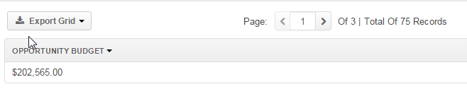
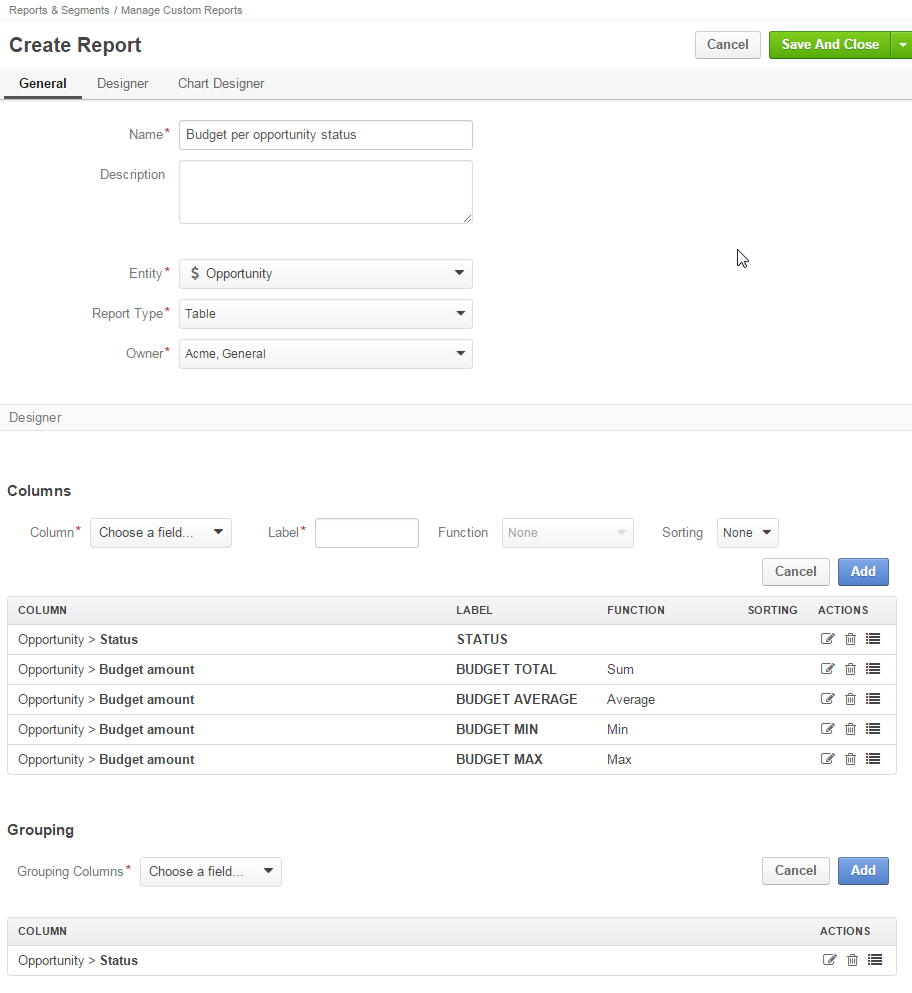
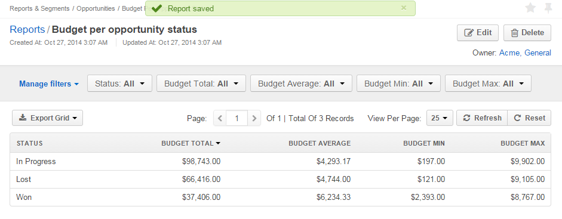
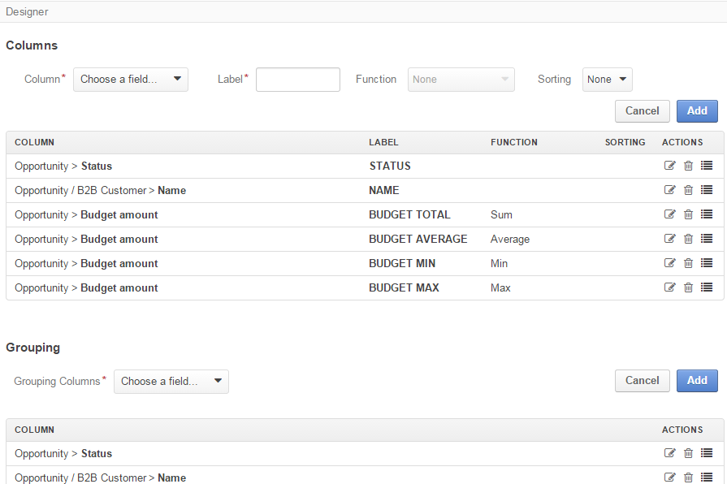
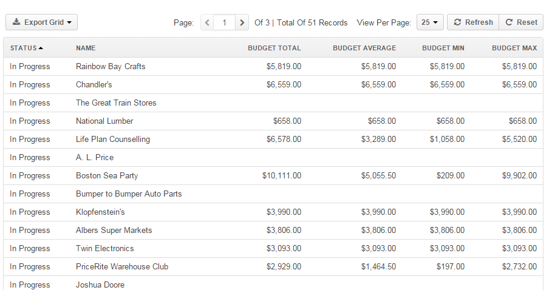
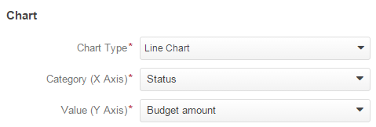
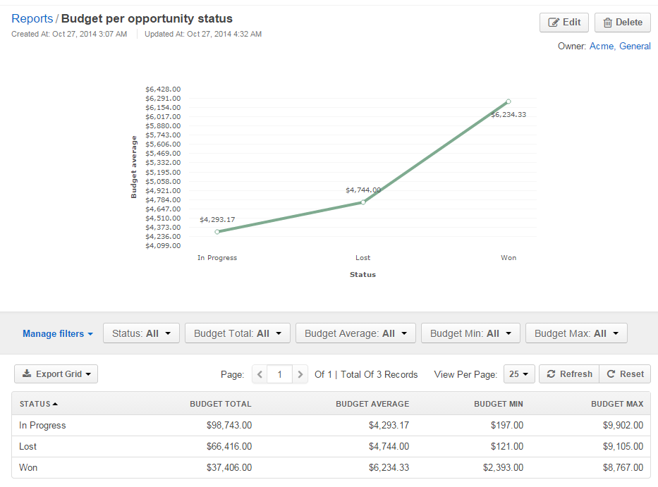

.. _doc-reports-examples:

Report Examples
===============

.. contents:: :local:
   :depth: 3

.. _doc-reports-examples-functions:

Example: Aggregate Functions
----------------------------

Below is an example of a simple report that displays budget per opportunity.

|

.. image:: ../../img/reports/RepEx1.png

|

After you set up the *Budget amount* column, click the :guilabel:`Add` button to add it into the **Columns** grid and click :guilabel:`Save`.

You are now redirected to the report view that shows opportunities with the known **Budget Amount**:

|

.. image:: ../../img/reports/RepEx1a.png

|

Click :guilabel:`Edit` to continue the report configuration.

Let us see what happens after we use an aggregate function for the **Opportunity Budget** column.

Click |IcEdit| **Edit**, change the function for the **Budget amount** to *Count*, and click **Save**. The report data changes:

|

**Report Preview (Function = Count)**

.. image:: ../../img/reports/RepEx1b.png

|

Similarly, you can use sum, max, average, and min functions.

|

**Report Preview (Function = Sum)**

The sum of **Budget Amount** values of all opportunities makes $202,565.00.

|

**Report Preview (Function = Max)**

.. image:: ../../img/reports/RepEx1e.png

The biggest budget amount value of the opportunity is $9,902.00.

.. _doc-reports-examples-grouping-simple:

Example: Simple Grouping
------------------------

You can group the information in the report by unique values in the column(s).

|

|

The report preview:

|

.. _doc-reports-examples-grouping-multi:

Example: Grouping at Multiple Levels
------------------------------------

You can group records based on several columns (e.g. per opportunity status and the B2B customer name).

|

|

Now you can see the calculated budget metrics (total, average, min, and max) for all the opportunities with the same status that belong to a specific customer.

The report preview:

|

.. hint::

    Once a report has been generated, you can click on the name of a column to sort all the data in the report by the specified field value (ascending or descending).

    Here is an example of the report ordered by the **Name** column:

    |

    .. image:: ../../img/reports/RepEx3b.png

As you can see in the circled area, there are opportunities for Albers Super Markets that are in progress and that were lost. You can view the budget details for the both groups.

.. note::

    If the customer's name is the most important part of the grouping, it might be reasonable to edit the report and move the column to make it first.

.. _doc-reports-examples-chart:

Chart Example
-------------

Let us make a chart for the budget per opportunity status report (not grouped by customers).

See Also
--------

:ref:`Reports Overview <user-guide-reports>`

:ref:`Manage Reports <doc-reports-manage>`

.. include:: ../../../img/buttons/include_images.rst
   :start-after: begin
