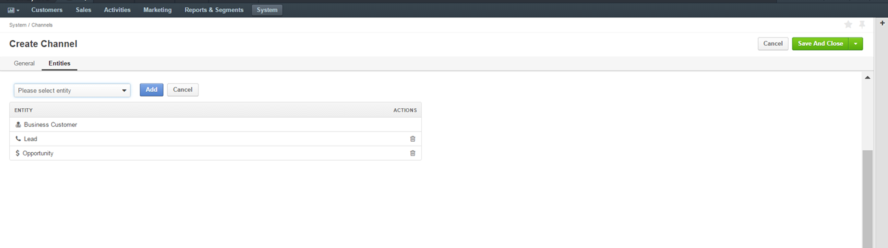
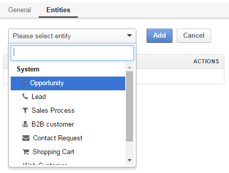
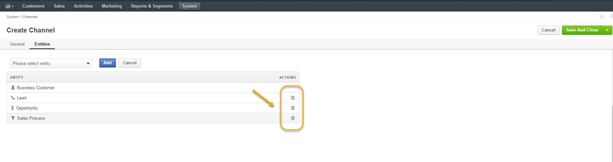
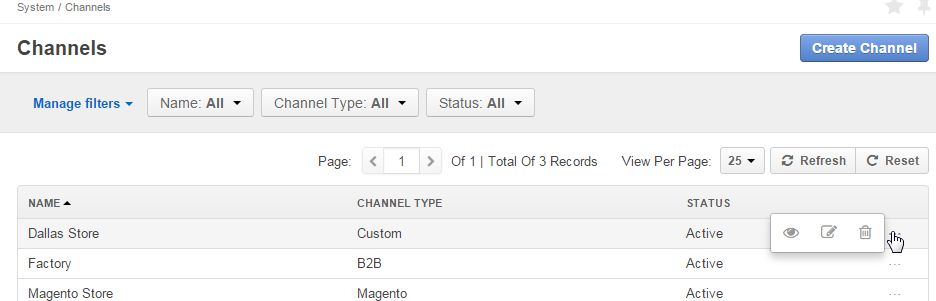
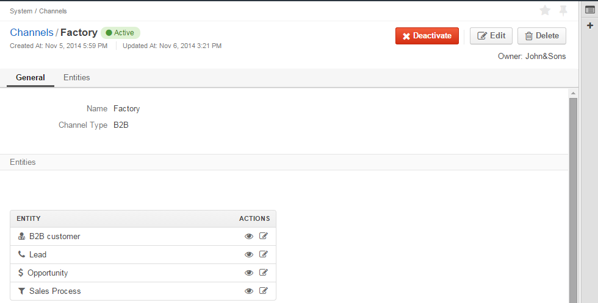
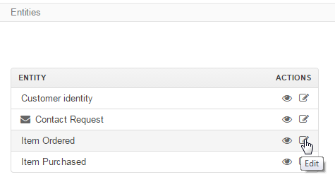
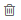

.. _user-guide-channels:

Channels
========

Today, successful businesses usually have more than one sales site. These may be different online stores, 
business-to-business enterprises, or business-to-customer outlets. Moreover, different customers and sales-related data 
can be received from various survey-campaigns or memberships in clubs, funds, charity events, etc. Gaining a full 
understanding of all the information you receive from each of these sources, along with all the individual customer 
information you collect from various other sources, becomes crucial. With OroCRM's Channels, you can do both with 
minimum effort.

In OroCRM, each Channel record represents one sources of customer-related data, as described in the Common 
Features guide.

OroCRM Community Edition has two types of channels: Web (built for online stores) and B2B 
(built for business-to-business activities). For enterprise clients, additional types of channels can be added during 
system integration.

There is no limit to the number of Channel records that may be defined for one OroCRM instance. Upon creation, you can 
choose what kind of customer-related information will be collected from each channel, as described below:

.. _user-guide-channel-guide-create:

Create a Channel Record
-----------------------

To create a channel:

- Go to the *System --> Channels* page.
 
- Click the :guilabel:`Create Channel` button in the top right corner.

- The *"Create Channel"* form will appear. 

- Specify the channel details as described in the sections below: 

.. _user-guide-channel-guide-general:

Define General Details of the Channel
^^^^^^^^^^^^^^^^^^^^^^^^^^^^^^^^^^^^^

Define basic channel information in the *General* section.

The following three fields are mandatory and **must** be defined:

.. csv-table::
  :header: "**Name**","**Description**"
  :widths: 10, 30

  "**Status**","Current status of the channel.

  *Inactive* or *Active*

  Be aware that when working with inactive channels, no new data is uploaded to the system. This option is useful
  if a channel is being configured for future or is out of date."
  "**Name**", "The name used to refer to the channel in the system. It is recommended to keep the name
  meaningful."
  "
  .. _user-guide-channel-guide-type:
  
  **Channel Type**", "Channel type defines a set of default rules and settings used for the channel.

  The following types are available out-of-the-box:
  
  - *B2B*: dedicated to B2B customer relations. Described in more detail in the 
    :ref:`B2B Channel guide <user-guide-b2b-channel>`.

  - *Magento*: designed for Magento-based stores. Described in more detail in the 
    :ref:`Magento Channel guide <user-guide-magento-channel>`.

  - *Custom*: any other channels."

.. caution::

    Once you have selected *Magento* as a channel type, a new mandatory **Integration*** field will appear.
    Please see the :ref:`Magento Channel Integration <user-guide-magento-channel-integration>` guide  for
    more information.

.. important::

    Extending OroCRM with new channel types for specific needs is a proven practice and this can be done in the course
    of customization, subject to your specific needs and goals.

.. _user-guide-channel-guide-entities:

Define What Details Are Collected From the Channel
^^^^^^^^^^^^^^^^^^^^^^^^^^^^^^^^^^^^^^^^^^^^^^^^^^

The information collecte from a channel is represented by the entitie assigned to the channel and their related 
entities. Please, read the :ref:`Data Management Basics guide <user-guide-data-management-basics>` to learn more about 
entities. In order to assign an entity to a channel and collect the data from the channel, go the *"Entities"* section. 

      |
  

|

One of the entities defined for any channel must be a :term:`customer identity <Customer Identity>`. It is added to
the entity list automatically, subject to the chosen channel type:

- B2B Channel - B2B Customer
- Magento Channel - Magento Customer
- Custom Channel - Customer Identity

Some other entities are by default added to channels of a specific type. 

For example, once you have selected the channel type, the :term:`Opportunity` and 
:term:`Lead` entities will be added to B2B channels, and the :term:`Cart` and :term:`Order <Order>` entities - to 
Magento channels. 

These entities will be added to the entity list by default, however, they are optional and may be removed.

**Custom Entities** are created for specific customer needs and may contain any relevant data, including additional 
customer details, information about the sales, etc. All the custom entities are available in the drop-down menu of the 
*"Entities"* section for a channel.

The ways to create and mange custom entities, are described in the 
:ref:`Entities guide <user-guide-entity-management-from-UI>`.

To add an entity to the channel, choose the entity and click the :guilabel:`Add` button.

      |
  

|

To delete an entity, click the |IcDelete| icon. This will remove the entity from the channel's list, but not from
from the system.

      |
  

.. note::

    Once you have finished adding the entities, click the button in the top right corner to save it.

.. _user-guide-channel-guide-actions:

Manage Channels
---------------

The following actions can be performed on channels:

From the :ref:`grid <user-guide-ui-components-grids>`

     |

- Delete the channel: |IcDelete|

  .. caution::

      Once a channel has been deleted, all of the data related to it will be deleted as well.

- Get to the :ref:`Edit from <user-guide-ui-components-create-pages>` of the channel: |IcEdit|

  .. caution::

      You cannot edit the channel type if data from the channel has been already been uploaded into the system.

- Get to the :ref:`View page <user-guide-ui-components-view-pages>` of the channel:  |IcView|

      |
  
From the :ref:`View page <user-guide-ui-components-view-pages>`:

      |
  

|

- Deactivate or activate channels.  No new data from the channel will be uploaded for
  an inactive channel.

- Get to the :ref:`Edit from <user-guide-ui-components-create-pages>` of the channel

- Delete the channel

- Edit entities: 

  - Go to the *"Entities"* section of the channel view page.
  
  - In the *"Actions"* column, click |IcView| to see the entity details or |IcEdit| to change the entity settings.

|
  
Please refer to the :ref:`Entities <user-guide-entity-management-from-UI>` guide for more details.

.. note::

   Note that you will receive an error message if you do not have the necessary permissions to edit entities.

.. |IcEdit| image:: ./img/buttons/IcEdit.png
   :align: middle

.. |IcView| image:: ./img/buttons/IcView.png
   :align: middle

