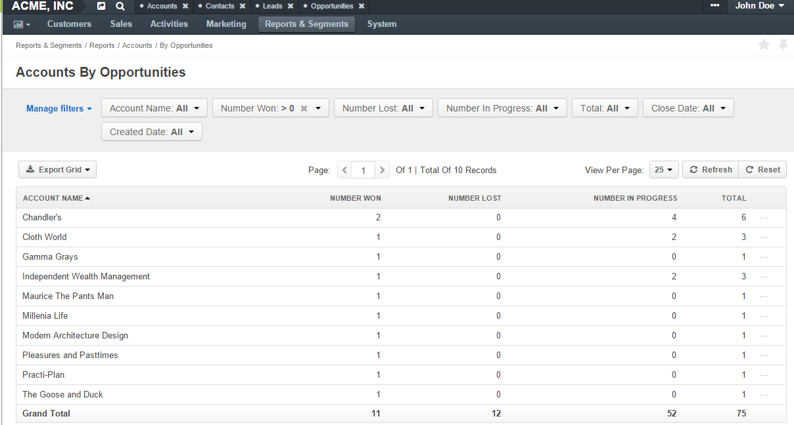

.. _user-guide-accounts:

Accounts
========

This section will cover the following topics:

.. contents:: :local:
   :depth: 2

To collect and process information on the customer activity of a person, group of people or business cooperating with 
you, you can create an account that will represent them in your Oro application.

An account can aggregate details of all the :term:`customer identities <Customer Identity>` assigned to it, providing
a 360-degree view of the customer. 

.. note:: See three short demos on:

          * `creating and editing <https://www.orocrm.com/media-library/22093>`_

             .. raw:: html

                <iframe width="560" height="315" src="https://www.youtube.com/embed/00Vz_mkbeTE" frameborder="0" allowfullscreen></iframe>

          * `managing <https://www.orocrm.com/media-library/22095>`_

             .. raw:: html

                <iframe width="560" height="315" src="https://www.youtube.com/embed/5FEyHWr-jQY" frameborder="0" allowfullscreen></iframe>

          * `merging account records <https://www.orocrm.com/media-library/merge-account-records-2>`_

             .. raw:: html

                <iframe width="560" height="315" src="https://www.youtube.com/embed/x-LwwCQfwGQ" frameborder="0" allowfullscreen></iframe>

          or

          keep reading the step-by-step guidance below.

.. _user-guide-accounts-create:

Create an Account
-----------------

To create a new account:

1. Navigate to **Customers > Accounts** in the main menu.

2. Click **Create Account** in the top right corner.

   The following :ref:`page <user-guide-ui-components-create-pages>` appears:

   .. image:: ../img/accounts/accounts_create.png

3. Define the following mandatory fields:

   .. csv-table::
      :header: "Field", "Description"
      :widths: 10, 30

      "**Owner**","Limits the list of users that can manage the account to users,  whose
      :ref:`roles <user-guide-user-management-permissions>` allow managing
      accounts assigned to the owner (e.g. the owner, members of the same business unit, system administrator, etc.).

      By default, the user creating the account is chosen."
      "**Account Name**","The name used to refer to the account in the system."
      "**Description**","Details or a short description of an account record."

4. In order to add a contact, click the **+Add** in the **Contacts** section.

.. note:: If you need to record and process any other details of accounts, :ref:`custom fields <doc-entity-fields-create>` can be created. Their values will be displayed in the **Additional** section. Please, refer to your administrator for assistance.
  
5. Once all the necessary information has been defined, Click **Save**.

Manage Account Records
----------------------

Accounts View Page
^^^^^^^^^^^^^^^^^^

The following sections are available for the account :ref:`page <user-guide-ui-components-view-pages>`:

1. The **Page Header** has the date of account creation and its latest update, as well as its :term:`lifetime sales value <Lifetime Sales Value>`.

2. The **General** section is for general details of the account, such as its name, tags, description and all the contacts assigned to the account.

   .. image:: ../img/accounts/accounts_view_general.png

3. The **Activity** section includes any :ref:`activities <user-guide-activities>` related to the account, such as attachments, calls, calendar events, notes, emails or tasks (if available).

   .. image:: ../img/accounts/accounts_view_activities.png

   .. note:: If an activity-related action was performed for a customer or a contact assigned to the account, they will not be displayed. Only the activities performed directly for the account are available in the section.

4.  The **Additional Information** section provides details of any :term:`custom fields <Custom Field>` defined for the account.
5.  The **Website Activity** section lists customer activities displayed in the *Summary* and *Events* subsections.

    .. image:: ../img/accounts/accounts_view_website_activity_1.png
    .. image:: ../img/accounts/accounts_view_website_activity_2.png

5.  The **Sections with channel names**. Each section contains details of all the customers that are assigned to this account and belong to the specified channel (e.g. Sales, Magento, OroCommerce).

    .. image:: ../img/accounts/accounts_view_channels.png
  
    .. note:: The number and names of such sections depend on the number and names of OroCRM channels and customer records assigned to the account. The type of channels can vary depending on your configurations and integrations (e.g. Sales, Magento, Commerce).

    Records of other entities assigned to this channel with regard to a specific customer are represented as subsections.

    For instance:

    * If an account relates to a Magento customer, its view page will have the **Magento** section displayed. Its subsections will be the following:

      1. The *General Info* subsection has the general information on the Magento customer related to the account (e.g. name, email, customer group, website, etc.)
      2. The *Magento Orders* subsection lists all the :ref:`orders <user-guide-magento-orders-create>` related to the account.
      3. The *Magento Shopping Carts* subsection shows the details of the :ref:`shopping carts <user-guide-magento-carts-create>` related to the account.
      4. The *Magento Credit Memos* subsection is for :ref:`credit memo <user-guide--sales--magento-credit-memos>` and order details, such as the store from which the order has been placed, order number, the amount refunded, etc.

     .. image:: ../img/accounts/account_subsections_new.png

    * Within the **Sales** Channel section you will be able to see:

      1. The Business Customer(s) related to the selected account.
      2. Once one of the customers is selected, you can see their general details and information on related Leads/Opportunities.

      .. note:: In new installations of OroCRM (2.0 and higher) the functions of a Sales channel are reduced to enabling Business Customers and controlling their grouping at the Account view. It is, therefore, no longer essential to create a Sales channel to enable leads and opportunities – these are enabled as features.

      .. image:: ../img/accounts/accounts_view_channels_2.png

    * Within a **Commerce** Channel, there are seven tabs with Commerce customer-related information:

      1. General
      2. Customer Users
      3. Shopping Lists
      4. Requests For Quote
      5. Quotes
      6. Orders
      7. Opportunities.

.. _user-guide-accounts-actions:

Account Actions from the View Page
""""""""""""""""""""""""""""""""""

The following actions can be performed for the accounts from the :ref:`view page <user-guide-ui-components-view-pages>`:

1. Share the account. Clicking **Share** will prompt a sharing settings pop up window to open.

   .. image:: ../img/accounts/accounts_view_actions_share.png

2. Get to the |IcEdit| **Edit** form of the account.

3. Delete the account from the system by clicking |IcDelete| **Delete**

4. Export and import accounts with **Export** and **Import** buttons as described in the :ref:`Export and Import Functionality <user-guide-import>` guide.

5. Perform a number of actions under **More Actions** menu:

   * :ref:`Add Attachment <user-guide-activities-attachments>`
   * :ref:`Add Note <user-guide-add-note>`
   * :ref:`Send Email <user-guide-using-emails>`
   * :ref:`Add Event <doc-activities-events>`
   * :ref:`Log Call <doc-activities-calls>`
   * :ref:`Add Task <doc-activities-tasks>`
   * :ref:`Add Contact <user-guide-contacts>`
   * :ref:`Create Opportunity <user-guide-system-channel-entities-opportunities>`

   .. image:: ../img/accounts/MoreActionsMenu.png

Account Actions from the Account List
^^^^^^^^^^^^^^^^^^^^^^^^^^^^^^^^^^^^^

By hovering over the |IcMore| more actions menu to the right of the necessary accountm you can perform the following actions:

.. image:: ../img/accounts/accounts_grid.png

1. View the account by clicking |IcView|

2. Delete the account from the system by clicking |IcDelete|
  
3. Edit the account by clicking |IcEdit|
  
4. Do inline editing for specific columns, such as account name, owner or tags, by clicking |IcPencil|

   .. image:: ../img/accounts/accounts_grid_inline_editing.gif

4. Merge Accounts by clicking |IcMerge|

.. _user-guide-accounts-merge:

Merging Accounts
""""""""""""""""

Once the accounts have been added to the system you can :ref:`merge <user-guide-accounts-merge>` them, to get a full
view of customer activities, regardless of the :term:`channels <Channel>`. This can be useful if, for example, it has 
appeared that several accounts have been created for the different representatives of the same client, or that your 
business-to-business partner is co-operating with you from a new channel (e.g. started buying from your Magento store).

In order to merge accounts:

1. Go to the list of all accounts.

2. Find the accounts that you want to merge.

3. Click the **Merge** icon. (See :ref:`Merge Records <doc-grids-actions-records-merge>`).

   As an example, we are merging three accounts: Acuserv, Big Bear Stores and Casa Bonita.

   .. image:: ../img/accounts/accounts_merge_01.png

4. Once you click **Merge Accounts**, a table with the merge-settings will appear.

   .. image:: ../img/accounts/accounts_merge_02.png

5. Choose the name of one of the accounts that is being merged to give to your new account (Master Record).

6. Choose if the contacts should replaced with the contacts of one account (and which), or if all the contacts should be appended.

7. Choose the default contact of the accounts being merged, that will be given to the Master Record.

8. Choose the description of the accounts being merged that will be given to the Master Record.

9. Choose the owner of the accounts being merged that will be given to the Master Record.

10. Choose if the tags should be replaced with the contacts of one account (and which), or if all the tags should be appended.

11. Click **Merge**.
  
    A Master Record with merged data of several accounts will be created. The rest of the account details, including details of the customer identities will be appended.

.. _user-guide-accounts-reports:

Reports with Account Records
----------------------------

OroCRM currently comes with two ready-to-use reports on accounts:

1. Accounts Life Time Value

2. Accounts by Opportunities

 
Accounts Life Time Value 
^^^^^^^^^^^^^^^^^^^^^^^^

This a report, with which you can see the total amount of money received from all the customers assigned to the account.

In order to see the report go to **Reports and Segments > Reports > Accounts > Life Time**.

It shows:

- The account name

- The total lifetime sales value registered in your Oro application.

.. image:: ../img/accounts/accounts_report_by_lifetime.png

Accounts by Opportunities
^^^^^^^^^^^^^^^^^^^^^^^^^

With this report you can see number of won, lost and pending opportunities for all the customers assigned to the account.

In order to see the report go to **Reports and Segments > Reports > Accounts > By Opportunities**.

It shows:

- The account name

- The number of won opportunities for all the customers assigned to the account

- The number of lost opportunities for all the customers assigned to the account

- The number of pending opportunities for all the customers assigned to the account

- The total number of opportunities for all the customers assigned to the account

- The total number of opportunities of a kind, regardless of their account.

.. hint::

    New custom reports can be added that can use details of the accounts, as well as of any records related to the
    accounts. For more details on the ways to create and customize the reports, refer to the :ref:`Reports topic <user-guide-reports>`.

.. include:: /img/buttons/include_images.rst
   :start-after: begin

