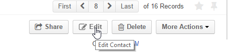
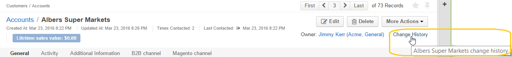
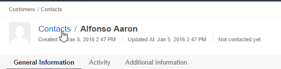

.. _user-guide-ui-components-view-pages:

View Pages
==========

To see more details of a specific record, and to work directly with the record (i.e., create a task related to a 
customer, appoint a calendar event for a user, turn a cart into an order, share a contact, and so on), you need to get 
to its View page. 

For example, this is a View page of a contact.

|

.. image:: ./img/data_management/view/view_01.png

|

On this View page, you can see all the details of the record and its location on the map. You can use the links and 
action buttons as described in this article.

Get To a View Page
------------------

There are several ways to get to a View page:

- Select the relevant record in a :ref:`grid <user-guide-ui-components-grids>` (click the |IcView| icon).

- Find the records in the :ref:`Search Panel <user-guide-getting-started-search>`.

- Click the :guilabel:`Save and Close` button on a :ref:`Create/Edit form <user-guide-ui-components-create-pages>`.

What You Can See on a View Page
-------------------------------

Details of the chosen record are displayed on a View page. (The list of properties shown is defined 
by the system administrator with the *"Show On View"* setting of the entity fields).

Information in a View page is allocated in sections that you can easily switch between. All the sections are placed one 
after another, so you can also scroll down to find information.

For example, this is a View page of an opportunity with *"General Information"*, *"Activities"* and 
*"Additional Information"* sections:

|

.. image:: ./img/data_management/view/view_page.png

|

 Click the section name in order to move it to the top of the page:

      |

  
.. image:: ./img/data_management/view/view_page_tabs.png

|

.. _user-guide-ui-components-view-page-actions:

What You Can Do From a View Page
--------------------------------

Manage a Record From a View Page
^^^^^^^^^^^^^^^^^^^^^^^^^^^^^^^^

Action buttons at the top right of each View page reflect the actions that you can do with the 
record. 

These include the ability to share a record with other users (if applicable), go to the 
:ref:`Create/Edit form <user-guide-ui-components-create-pages>`, delete a record, and perform different
:ref:`activities <user-guide-activities>` related to a record (such as make a task, create a calendar event, log a call, 
and write an email).

  
|

|

If there are four or less actions available for a record, a separate button is created for each of them.

|

.. image:: ./img/data_management/view/view_action_buttons_1.png

|

If there are more than four actions available for a record, they will be collected under the 
*"{Entity Name} Actions*" drop-down.

|

.. image:: ./img/data_management/view/view_action_buttons_2.png

|

Review the Record History
^^^^^^^^^^^^^^^^^^^^^^^^^

If the user is allowed to do this (i.e., the :ref :ref:`Data Audit capabilty <admin-capabilities-data-audit>` has been 
enabled for at least one of the user's :ref:`roles <user-guide-user-management-permissions-basic>`, , there will be a 
link to the history of operations performed with the record in the top right corner of the View page.

|

|

Use Contact Details on a View Page
^^^^^^^^^^^^^^^^^^^^^^^^^^^^^^^^^^

Contact details related to a record are displayed as links. 

You can click the phone number link to call it via Hangouts or log a call, start writing an email with a click on the 
address, initiate Skype session directly from the View page.

Add a Tag to the Record
^^^^^^^^^^^^^^^^^^^^^^^
Tags are non-hierarchical keywords assigned to a record to provide additional information, simplify search and filter 
records. Tags can be added to a record from its View page, as described in the :ref:`Tags <user-guide-tags-add>` guide.

Share the Details with Other Users
^^^^^^^^^^^^^^^^^^^^^^^^^^^^^^^^^^

Sharing records is very convenient when you need assistance from other system users who might have no access to the 
related record. 

For example, there is a task related to an opportunity that should be performed by a person from a 
marketing team. Marketing associates don't have access to opportunity records, but the sales manager can share the 
record with a specific user (or group of users), whose assistance is needed.

To share a record, click the :guilabel:`Share`, and enter the name of the user to share the record with in the 
*"Share with"* field or click the list icon to select such user(s). 

|

.. image:: ./img/data_management/view/view_share_01.png

|

The selected users will gain access to the record.

Sometimes, there also appears a need to exchange information between organizations. For example, a customer has moved 
countries, and sales reps of one office want to share the information to the second office.
Such sharing is possible, but only from a system organization.

(This means that a user with system-wide access should log-in to the 
:ref:`System organization <user-ee-multi-org-system>`), access this record and share it with users in other 
organizations.

Get to Other Pages
^^^^^^^^^^^^^^^^^^

- You can get to the View page of the previous, the next, the first and the last records of the grid with the paginator 
  in the top right corner of the page:  

 
|

|  

- If there is a related entity, its identifier will be a link to the View page of this entity. 

- You can get to the corresponding grid of records with the link in the top left corner of the page:

|

|

.. hint::

    If you have reached a View page or Create/Edit form from a grid, and now click  link to get back to the grid, this 
    grid will be look in the same as it did when you left it for the View page (the same filters and order applied). 

.. |IcView| image:: ./img/buttons/IcView.png
   :align: middle
   
