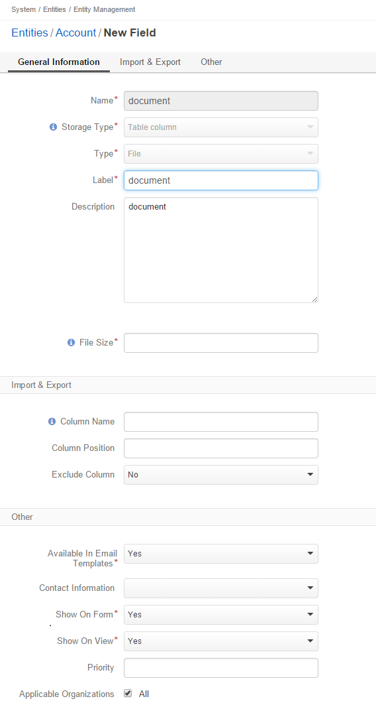

Field Types
============

.. contents:: :local:
    :depth: 3

Types
------

BigInt
^^^^^^
Select this type if the values of this field must be very big positive or negative whole numbers like 111222333444555. Save range is from -999,999,999,999,999 to 999,999,999,999,999.

.. TODO range needs to be checked. It doesn't work as intended now. // The allowed range is from -9,223,372,036,854,775,808 to 9,223,372,036,854,775,807 (8-bytes integer). 

|

.. image:: ./img/entity_management/new_entity_field_bigint.png

|

Boolean
^^^^^^^
Select this type if you need a simple list with two values: 'Yes' and 'No.'

|

.. image:: ./img/entity_management/new_entity_field_boolean.png

|

Currency
^^^^^^^^
Select this type if this field will be used to store monetary values. The symbol of the applicable currency will appear near this field in the entity records. The value in the field will have 2 decimal positions. 

.. TODO: Which currency is used? What affects the currency formatting?  

|

.. image:: ./img/entity_management/new_entity_field_currency.png

|

Date
^^^^^
Select this type if you need to save dates. The field will have an in-built calendar picker.

|

.. image:: ./img/entity_management/new_entity_field_date.png

|

DateTime
^^^^^^^^^
Select this type if you need fields to save date and time values. There will be two fields on the interface under common title: one is for storing date values with an in-built calendar picker, the other is a list of time values in half-hour increments.

|

.. image:: ./img/entity_management/new_entity_field_datetime.png

|

Decimal
^^^^^^^

Select this type if the values of your custom field represent decimal fractions like 1.25, 0.5, -8.4 and you need the high precision.

.. note:: The same fractions can be represented using the float type. The main difference between the decimal and float data types is that decimal values are represnted in the system exactly while for float values are represented using the special formula. This means that when you work wiht float numbers you may get approximate results instead of exact. Thus, use the decimal data type for the data which precision is of high importants and when it's important to avoid rounding errors, e.g. financial data. 

|

.. image:: ./img/entity_management/new_entity_field_decimal.png

|

Float
^^^^^

Select this type if the values of your custom field represent decimal fractions like 1.25, 0.5, -8.4 and their processing speed is of more importance than precision.

.. note:: The same fractions can be represented using the decimal type. The main difference between the decimal and float data types is that decimal values are represnted in the system exactly while for float values are represented using the special formula. This means that when you work wiht float numbers you may get approximate results instead of exact. However, the systen processes the float values much faster, which is important if you need to process big amounts of data.  

|

.. image:: ./img/entity_management/new_entity_field_float.png

|

Integer
^^^^^^^^
Select this type if the values of this field can be relatively big positive or negative whole numbers like 1, 250000, -20. The allowed range is from -2,147,483,648 to 2,147,483,647 (4-bytes integer).

|

.. image:: ./img/entity_management/new_entity_field_bigint.png

|

Percent
^^^^^^^^
Select this type if this field will be used to store monetary values. The percent symbol will appear near this field in the entity records.

|

.. image:: ./img/entity_management/new_entity_field_percent.png

|

SmallInt
^^^^^^^^^
Select this type if the values of this field must be positive or negative whole numbers like 1, 150, -20.. The allowed range is from -32,768 to 32,767 (2-bytes integer).

|

.. image:: ./img/entity_management/new_entity_field_smallint.png

|

String
^^^^^^^

Select this type if the values of your custom field represent sequence of characters like 'Gerry&Webb,' 'Freshtax,' 'John Doe.'

|

.. image:: ./img/entity_management/new_entity_field_string.png

|

Text
^^^^^

Select this type if you are going to use this field to store text of any length. 

|

.. image:: ./img/entity_management/new_entity_field_text.png

|

File
^^^^^

Select this type if you are going to use this field to store files. If you need to store image files with .gif, .jpeg or .png file extensions, consider the **Image** file type instead.   

|

|

Image
^^^^^^

Select this type if you are going to use this field to store images (e.g. photos). The thumbnail of the uploaded image will be be displayed in the entity record. You will be able to download the full image by clicking this thumbanail. 

|

.. image:: ./img/entity_management/new_entity_field_image.png

|

Select 
^^^^^^^

Use this type if you want your field to be a list that enables users select one value at a time. For example, the 'Grade Service' list that contains values from 1 to 5.

|

.. image:: ./img/entity_management/new_entity_field_select.png

|

Multi-Select
^^^^^^^^^^^^^

Use this type if you want your field to be a set of check boxes. Users will be able to select several values at a time. For example, the 'Working Days' list that contains days of week.

|

.. image:: ./img/entity_management/new_entity_field_multi-select.png

|

Relations
---------

Relation is a field that enables users to tie record(s) of one entity to record(s) of another entity.
For example each :term:`customer` has an :term:`account`, and each account can be assigned several contacts.

Many to many
^^^^^^^^^^^^^

Select this relation if any amount of the entity records can be assigned to any amount of the related entity records.  

For example any amount of customers may take part in an advertisement campaign and, moreover, the same customer may take part in several advertisement campaigns.

|

.. image:: ./img/entity_management/new_entity_field_many_to_many.png

|

One to many
^^^^^^^^^^^^^

|

.. image:: ./img/entity_management/new_entity_field_one_to_many.png

|

Select this relation if one and only one entity record can be assigned to many records of another entity. 

For example, one account may be assigned many customer.
Another example: we have created a field **Friends** that relates to contacts of potential clients recommended by a specific business customer. This is a 'one to many' relation, as one business customer may advise many friends.

Many to one
^^^^^^^^^^^^

Select this relation if any amount the entity records can be assigned to one and only one record of another entity. 
 
For example, any amount of customers may be assigned to an account in OroCRM, but a customer cannot be assigned to more than one account.

|

.. image:: ./img/entity_management/new_entity_field_many_to_one.png

