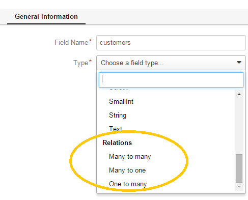
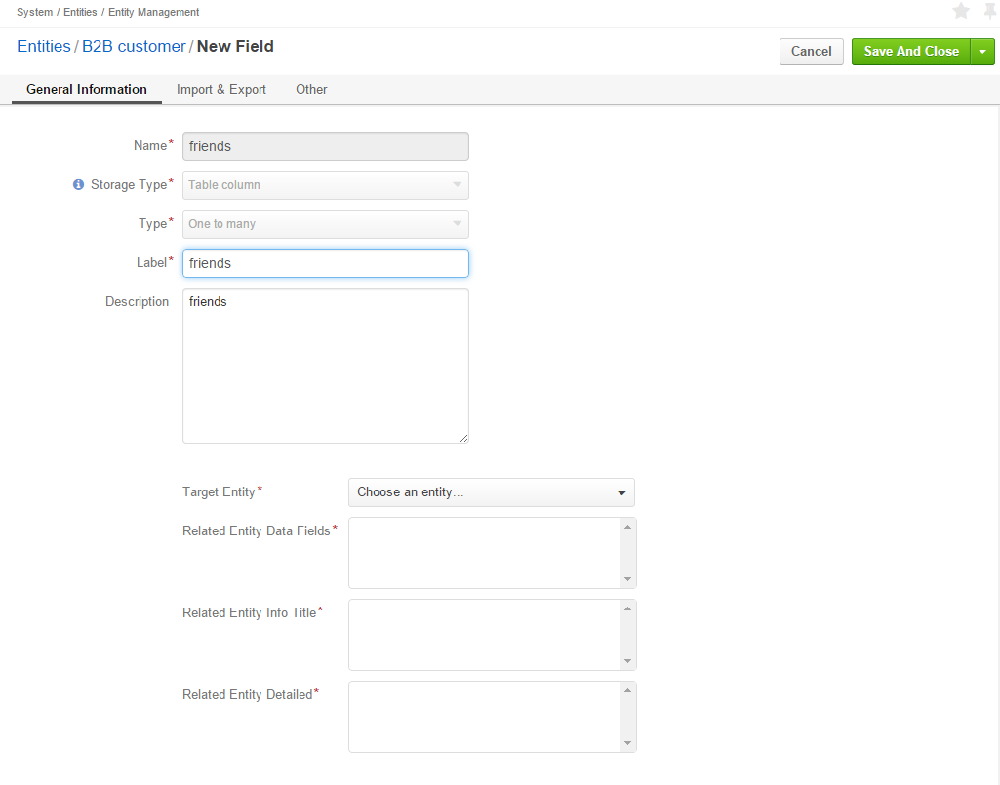
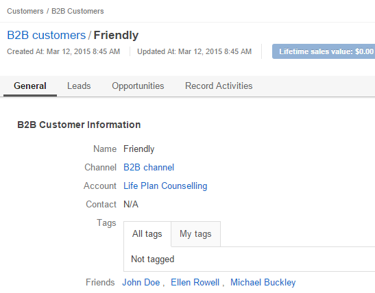

Entity Fields: Relations Type
==============================

Relation is a field that enables users to tie record(s) of one entity to record(s) of another entity.
For example each :term:`customer` has an :term:`account`, and each account can be assigned several contacts.

- Define the field type in the **Relations** section.

The following three options are available:

- **Many to many**: any amount of the entity records can be assigned to any amount of the related entity records 
  (for example any amount of customers may take part in an advertisement campaign and the same customer may take part in
  several advertisement campaigns).

- **One to many**: one and only one entity record can be assigned to many records of another entity 
  (so one account may be assigned many customer).

- **Many to one**: any amount the entity records can be assigned to one and only one record of another entity 
  (for example any amount of customers may be assigned to an account in OroCRM, but no customer may be assigned to more 
  than one account).

The following is true for all the relations fields:
  
- The relation fields can be only of the *column table* storage type.

- The relation fields cannot be defined as an identity field for 
  :ref:`export/import <user-guide-entity-management-export-import-common>`.

- The image fields aren't displayed on a grid, so *Show on Grid* and *Show Grid Filter* properties cannot be defined for 
  them.
  
  
*One to Many and Many to Many Relations*
****************************************

If the "One to many" or "Many to many" type has been chosen for a field, its *General Information* section will contain 
the **Target Entity** property. It specifies to records of which entity record(s) of the chosen entity can be tied.

(For example, we have created a field "Friends" that relates to users, who have become our clients following the 
recommendations of a specific B2B customer. This is a One to Many relation, as one B2B customer may advise many 
friends). 

Once the entity has been chosen, its properties can be used to define the following settings:

- **Related Entity Data Fields**: set of the related entity properties displayed in the grid that appears once a user 
  has clicked the :guilabel:`+Add` button on the Create/Edit form of the master record below the link.
 
- **Related Entity Info Title**: a set of the related entity properties displayed as a link on the *Edit* form and on 
  the *View* page of a master record.

- **Related Entity Detailed**: a set of the related entity properties displayed in the form that emerges once a
  user has clicked the link of a related entity record on the *Edit* form.
  
.. hint::

    Hold the **Ctrl** key to choose several properties.

For the sake of example, our "Friends" field has the following values:

- **Target Entity**: User.

- **Related Entity Data Fields**: First Name, Last Name and Primary Email.
 
- **Related Entity Info Title**: First Name and Last Name.

- **Related Entity Detailed**: all the fields available.

.. image:: ./img/entity_management/new_entity_field_to_many_def.png

Let's create a B2B Customer:

The following grid appears once you've clicked the :guilabel:`+Add` button against the "Friends" filed of the record on 
the Edit/Create form:

      |
  
.. image:: ./img/entity_management/new_entity_field_to_many_01.png

|

It contains all the fields defined for the *Related Entity Data Fields*.

We have added three users. They are now displayed on the Create/Edit form. The link-titles contain properties defined 
for the *Related Entity Info Title* and *Related Entity Data Fields* are displayed for each record below the link.

      |
  
.. image:: ./img/entity_management/new_entity_field_to_many_02.png

|
   
If you click the link name of one of the users, a form with all the details specified in the *Related Entity 
Detailed* appears.

      |

.. image:: ./img/entity_management/new_entity_field_to_many_03.png

|
   
The *Related Entity Info Title* properties are also used to represent the  related users on the View page ("Friends 
section").

   
Many to One Relations
**********************

If the "Many to one" type has been chosen for a field, its *General Information* section will contain the
**Target Entity** property. It specifies to a record of which entity records of the chosen entity can be tied.
(For example, many users can belong to the same business unit).

Once the entity has been chosen, you can choose any of its fields as a "Target Field". It will represent the entity 
records in the drop-down.

.. image:: ./img/entity_management/new_entity_field_to_one_01.png

As an example, we have created a relation "Business Unit" with:

- **Target Entity**: Business Unit.

- **Target Field**: Name.

Now, when creating/editing a User record, you can choose a related business unit from the list. Business Unit records in
the list are represented with their "Name" values.
