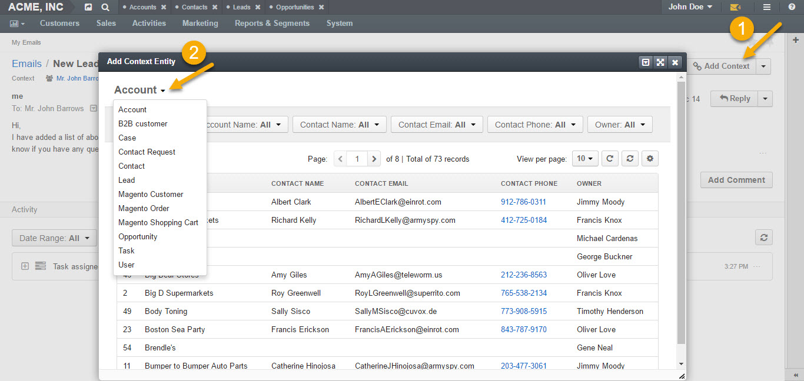

.. _doc-my-oro-emails:

My Emails
=========

.. note:: Before you start using the **My Emails**, please configure you personal mailbox connection to the mail server. See :ref:`Personal Email Configuration <my_email_configuration>` for more information.

Access My Emails
----------------

To reach the **My Emails** page:

1.  Navigate to the user menu in the upper-right corner of the application.

2.  Click **My Emails**.

.. image:: ../img/emails/user_my_emails.jpg

My Emails Page
--------------

On the upper-left of the page, you can see the name of the selected mailbox view. There are four mailbox views (email grid views) available by default:

-  **All Emails** -- Contains all available emails.

-  **Inbox** -- Contains newly delivered emails.

-  **Sent Mail** -- Contains sent emails.

-  **Mailbox: Local** -- Contains emails sent to the user’s personal
   email.

.. image:: ../img/emails/my_emails_page.jpg

.. note:: See the :ref:`Grids <doc-grids>` topic for more information on how to :ref:`filter <doc-grids-actions-filters>`, :ref:`sort <doc-grids-actions-sort-data>` listed emails, :ref:`save filtered views <doc-grids-grid-views>`, etc.

From the **My Emails** page, you can:

- :ref:`Compose emails <doc-activities-emails-actions-compose>`

- :ref:`Temporarly save email drafts <doc--activities--emails--actions--save-unfinished>`

- :ref:`Sync emails <doc--activities--emails--actions--sync>`

- :ref:`View emails <doc--activities--emails--actions--view>`

- :ref:`Mark emails as read/unread <doc--activities--emails--actions--mark-read-unread>`

.. _doc--activities--emails--actions:

Manage Emails
-------------

.. _doc--activities--emails--actions--sync:

Sync Emails
^^^^^^^^^^^

To manually synchronize emails, click **Sync Emails** in the upper-right corner of the page.

.. _doc-activities-emails-actions-compose:

Compose a New Email
^^^^^^^^^^^^^^^^^^^

To compose a new email:

1.  In the user menu, click **My Emails**. The list of emails opens.

2.  Click **Compose** in the upper-right corner of the page.

3.  In the **Send Email** dialog, define the following fields:

+--------------------+---------------------------------------------------------------------------------------------------------------------------------------------------------------------------------------------------------------------------------------+
| **Field**          | **Description**                                                                                                                                                                                                                       |
+====================+=======================================================================================================================================================================================================================================+
| **From**           | The **From** field should contain the email address of the sender. Note that the primary email address is used as a default value and additional addresses are available in the selector for the **From** field.                      |
+--------------------+---------------------------------------------------------------------------------------------------------------------------------------------------------------------------------------------------------------------------------------+
| **To**             | The **To** field should contain the email(s) of the recipient(s). You can add more than one email to the field.                                                                                                                       |
|                    | **Cc:** Clicking **Cc** (carbon copy) will prompt a new field to appear to include more recipients to the emails whom the sender wishes to *publicly* inform of the message. Such recipients will be visible to all other recipients. |
|                    | **Bcc:** Clicking **Bcc** (blind carbon copy) will prompt a new field to appear to include those recipients whom the sender wishes to inform of the email *discreetly*. Such recipients are not visible to anyone.                    |
+--------------------+---------------------------------------------------------------------------------------------------------------------------------------------------------------------------------------------------------------------------------------+
| **Subject**        | Short, descriptive outline of the email message displayed in the mailbox of the recipients.                                                                                                                                           |
+--------------------+---------------------------------------------------------------------------------------------------------------------------------------------------------------------------------------------------------------------------------------+
| **Apply Template** | You can apply a pre-configured template for your email. More information on email template configuration can be found In the :ref:`corresponding <user-guide-email-template>` section of this guide.                                  |
+--------------------+---------------------------------------------------------------------------------------------------------------------------------------------------------------------------------------------------------------------------------------+
| **Type**           | Select the type of the message to be sent:                                                                                                                                                                                            |
|                    | **HTML:** The email will be coded so that the text is formatted and images are added.                                                                                                                                                 |
|                    | **Plain:** The email will contain plain text with no formatting or special layout options.                                                                                                                                            |
+--------------------+---------------------------------------------------------------------------------------------------------------------------------------------------------------------------------------------------------------------------------------+
| **Body**           | Enter the text of your email.                                                                                                                                                                                                         |
|                    | You can customize you email text using the following features:                                                                                                                                                                        |
|                    | -  Bold, Italic, Underline styles                                                                                                                                                                                                     |
|                    | -  Text color                                                                                                                                                                                                                         |
|                    | -  Background color                                                                                                                                                                                                                   |
|                    | -  Bullet List                                                                                                                                                                                                                        |
|                    | -  Numbered List                                                                                                                                                                                                                      |
|                    | -  Insert/Edit link                                                                                                                                                                                                                   |
|                    | -  Source Code                                                                                                                                                                                                                        |
|                    | -  Image Embed Upload                                                                                                                                                                                                                 |
|                    | -  Fullscreen view                                                                                                                                                                                                                    |
+--------------------+---------------------------------------------------------------------------------------------------------------------------------------------------------------------------------------------------------------------------------------+
| **Add Signature**  | The signature may be added to any email you write in OroCRM. Your organization settings define whether the signature will be added automatically or manually.                                                                         |
|                    | If you have a signature configured, you can add it by clicking **Add Signature**. For example:                                                                                                                                        |
|                    | -                                                                                                                                                                                                                                     |
|                    | John Doe, VP                                                                                                                                                                                                                          |
|                    | OroCRM                                                                                                                                                                                                                                |
|                    | t.: 0786756465                                                                                                                                                                                                                        |
|                    | e.: john.doe@example.com                                                                                                                                                                                                              |
|                    | For more information, see **Add Signature To Your Email** section of this guide.                                                                                                                                                      |
+--------------------+---------------------------------------------------------------------------------------------------------------------------------------------------------------------------------------------------------------------------------------+
| **Attach a file**  | You can attach a file from your PC or a related record.                                                                                                                                                                               |
|                    | Click **From a Record** to re-use an attachment from another email in the thread or to choose an attachment assigned to the records.                                                                                                  |
|                    | Click **Upload** and select the necessary file to be uploaded from your computer as an attachment to your email.                                                                                                                      |
|                    | .                                                                                                                                                                                                                                     |
+--------------------+---------------------------------------------------------------------------------------------------------------------------------------------------------------------------------------------------------------------------------------+
| **Contexts**       | Context is any record or records that ha(s)ve meaningful relation to an email conversation. When you add context of a record to the email conversation, it will be displayed in the **Activity** section of that record’s page.       |
|                    | **Note**: If an email has been created from an entity record view page (e.g. from a lead’s page), this record will be added as a context automatically.                                                                               |
+--------------------+---------------------------------------------------------------------------------------------------------------------------------------------------------------------------------------------------------------------------------------+

.. image:: ../img/emails/compose_new_emails.jpg

4.  Once done, click **Send** to send your email.

.. _doc--activities--emails--actions--save-unfinished:

Save Unfinished Email
^^^^^^^^^^^^^^^^^^^^^

To save an unfinished email, minimize the email dialog by clicking on the corresponding button in the upper-right corner of the email dialog.

.. image:: ../img/emails/minimize.jpg

Your unfinished email will appear as a minimized throughout sessions, as illustrated in the following screenshot:

.. image:: ../img/emails/email_minimized2.jpg

You can save several of such emails as drafts:

.. image:: ../img/emails/several_minimized_emails2.jpg

.. _doc--activities--emails--actions--view:

View Emails
^^^^^^^^^^^

To open an email click it in the list or click the |IcView| **View** icon at the end of the email row.

.. image:: ../img/emails/view.jpg

.. image:: ../img/emails/example_email_sent.jpg

From the page of the opened email, you can:

-  **Add Comment** (add, edit or delete a comment to the email).

.. image:: ../img/emails/add_comment.jpg

-  **Add Task** (assign a task through an email).

.. image:: ../img/emails/add_task.jpg

-  **Mark Unread**

.. image:: ../img/emails/mark_unread.jpg

-  **Add Context** (define a record related to the email).

-  **Reply** (reply directly to the sender).

-  **Reply All** (reply to everyone in the email conversation).

-  **Forward** (forward an email to a different recipient).

 .. image:: ../img/emails/reply_reply_all_forward.jpg

 .. image:: ../img/emails/reply_all.jpg

 .. image:: ../img/emails/forward.jpg

-  **Download Attachment** (download the attached file, if available).

 .. image:: ../img/emails/download_attachment.jpg
 
 .. _doc--activities--emails--actions--mark-read-unread:

Mark an Email as Read/Unread
^^^^^^^^^^^^^^^^^^^^^^^^^^^^

To mark an email as read/unread, click the |IcCheckSquareO| **Mark As Read** / |IcMinus| **Mark As Unread** icon at the end of the email row.

See Also
--------

:ref:`Using Emails <user-guide-using-emails>`

.. include:: ../../img/buttons/include_images.rst
   :start-after: begin