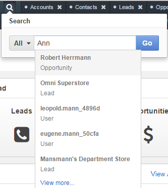
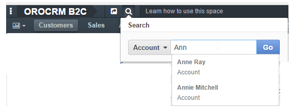
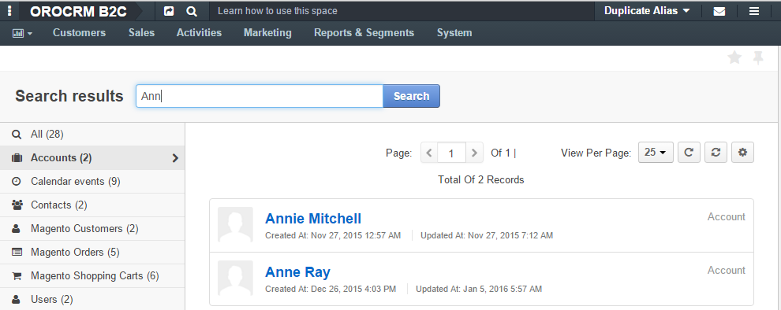
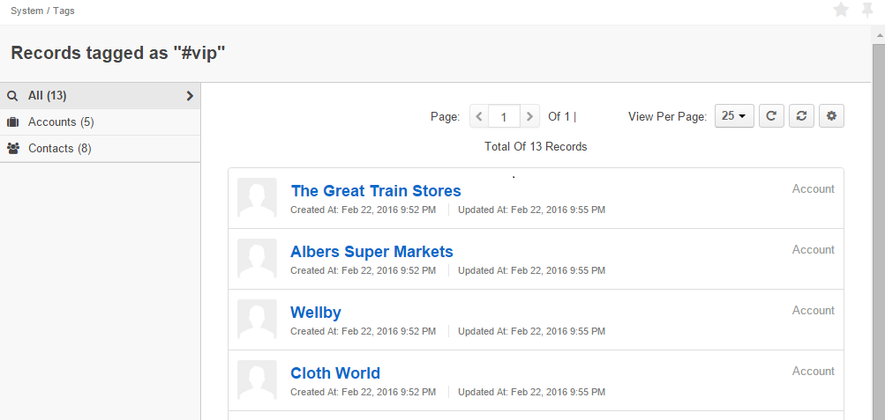

.. _user-guide-getting-started-search:

Search
======

Search is the fastest way to find a specific record you need. To find a record in OroCRM:

1. Click the search icon at the top of the screen – |IcSearch|.
2. Type the search key into the text field.
3. Click **Go** or hit *Enter* on the keyboard.

For example, we are searching for "Ann"  across the system:

.. image:: ../img/navigation/panel/search_ex_1.png

These are our search results:

.. image:: ../img/navigation/panel/search_ex_2.png

The search returned 28 records, two of which are Accounts, two are Contacts, six are Magento Shopping Carts, etc. You
can scroll through the entire list of results or select a specific entity in order to find the desired record faster.

If you wait a few seconds before clicking Go, you will see a drop-down list of the most relevant results. If the one you 
are looking for is in the list, you can immediately click it to open. Here are the most relevant results for the example 
above:

Modify the Search
-----------------

To save time, you can limit a search by a certain entity. For example, if you know you’re looking for a certain account, 
you can look for "Ann" in Accounts only.

.. _user-guide-getting-started-search-tag:

Search by Tag
-------------

In order to see all the records with a specific tag anywhere in the system, you can search by tag.

.. image:: ../img/navigation/panel/search_vip.png

.. image:: ../img/navigation/panel/search_vip_1.png

You will see a page that looks similar to the search results and that contains all the records with this tag.

.. |IcSearch| image:: ../../img/buttons/IcSearch.png

