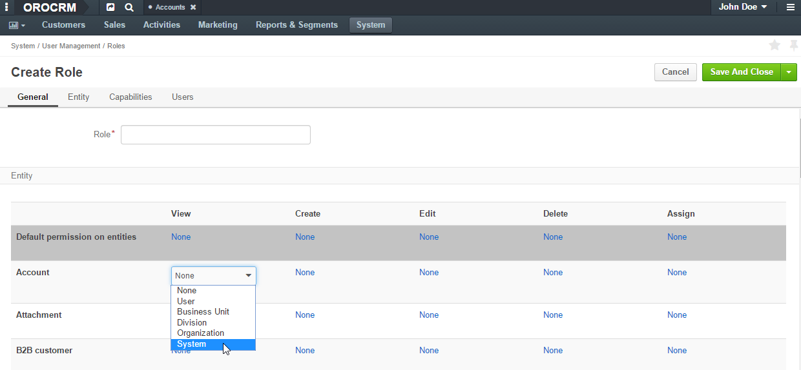
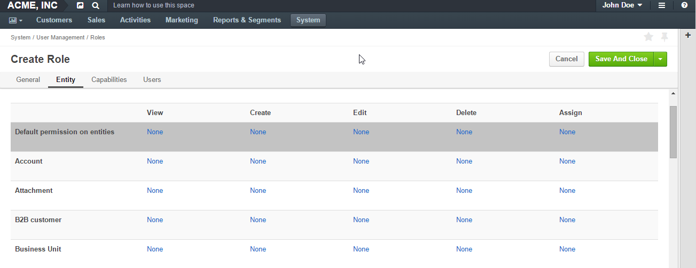

.. _user-guide-user-management-permissions:

Access and Permissions Management
=================================

.. _user-guide-user-management-permissions-ownership-type:

Ownership Types
---------------

Each entity in OroCRM has an :ref:`ownership type <user-guide-entity-management-create-other>` type, which defines the 
level at which permissions will be set for records of the entity.

If the ownership type is set to *"None"*, no authorization is required to see and process the entity and all the users
within the OroCRM instance will be able to view, create, edit, delete and assign records of the entity. Otherwise, they
depend on the specific Role settings, as described below. 

.. _user-guide-user-management-permissions-roles:

Roles
-----
Each OroCRM :term:`user <User>` must be assigned a role. The role defines a set of permissions and access rights that 
will be applied to all the users who have been assigned this role.
One user may have several roles. All the permissions granted to at least one of the roles assigned to a user, 
are granted to the user. 

If the ownership type of an entity is set to a *"User"*, *"Business Unit"* or *"Organization"*, the ability to see and 
process the entity records is defined by the role(s) assigned to the user.

Roles and Permissions
^^^^^^^^^^^^^^^^^^^^^
For each entity with an ownership type other than *"None"*, you can define permissions to perform the following actions: 

- View: If, for a specific entity, the action is not available to a user, the user won't see the records 
  :ref:`grid <user-guide-ui-components-grids>` nor the :ref:`View pages <user-guide-ui-components-view-pages>` 
  of this entity records.
  
- Create: If, for a specific entity, the action is not available to a user, the user won't be able to create new entity 
  records.

- Edit: If, for a specific entity, the action is not available to a user, the user won't be able to edit the entity 
  records.

- Delete: If, for a specific entity, the action is not available to a user, the user won't be able to delete the
  entity records.
  
- Assign: If, for a specific entity, the action is not available to a user, the user won't be able to change the owner 
  of the entity records.

.. image:: ./img/user_management/role_entity_dropdown.png

For each entity and action you can define one of the permission settings, depending on the entity ownership type and
whether it is a :ref:`system organization <user-ee-multi-org-system>`, as described below:

*Permissions for System Organizations*
^^^^^^^^^^^^^^^^^^^^^^^^^^^^^^^^^^^^^^

In a :ref:`system organization <user-ee-multi-org-system>`, the user will able to perform an action for the
entity records in any organization within the system, as long as the permission is set to *"System"*.

      |
  

|
  
Any other permission setting but *"System"*, in a system organization, will be treated as *"None"*.

*Permissions for Non-System Organizations*
^^^^^^^^^^^^^^^^^^^^^^^^^^^^^^^^^^^^^^^^^^
Permissions in non-system organizations depend on the ownership type of the entity.

      |

Ownership Type "Organization"
"""""""""""""""""""""""""""""
If the entity ownership type is set to *"Organization"*, when an entity record is created, an :term:`organization <Organization>`
is chosen as its :term:`owner <Owner>`. 

You can choose one of the following options for each action: 

- **None**: No users will be able to perform the action.
- **Organization**: All the users from the owner-organization will be able to perform the action.
- **System**: All the users will be able to perform the action.

  |

Ownership Type "Business Unit"
""""""""""""""""""""""""""""""

If the entity ownership type is set to "Business Unit", when an entity record is created, a :term:`business unit <Business Unit>`
is chosen as its Owner. 

You can choose one of the following options for each action: 

- **None**:  No users will be able to perform the action.
- **Business Unit**: All the users from the owner-business-unit will be able to perform the action.
- **Division**: All the users from the owner-business-unit and from its child business units will be able to perform 
  the action.
- **Organization**: All the users from the organization to which the owner-business-unit belongs, will be able to 
  perform the action.
- **System**: All the users will be able to perform the action.

  |

Ownership Type "User"
"""""""""""""""""""""

If the entity ownership type is set to "User", when an entity record is created, a :term:`user <User>` is chosen as its owner.
You can choose one of the following options for each action: 

- **None**: No users will be able to perform the action.
- **User**: Only the owner-user will be able to perform the action.
- **Business Unit**: All the users from the business unit to which the owner-user belongs will be able to perform the 
  action.
- **Division**: all the users from the business unit to which the owner-user belongs and from its child business units 
  will be able to perform the action.
- **Organization**: all the users from the organization, to which the owner-user belongs, will be able to perform the 
  action.
- **System**: all the users will be able to perform the action.

Roles and Access Rights
^^^^^^^^^^^^^^^^^^^^^^^
Access right assigned to a role, define if the users will be able to access a specific functionality.
There are only two options:

- **None**: users with the role won't be able to use the functionality.
- ***System***: users with the role will be able to use the functionality for all the records created within their
  OroCRM instance they've logged in into.

*Creating a Role*
-----------------

To create a new role:

- Go to *System → User Management → Roles*.
- Click the :guilabel:`Create Role` button.

  |
  
  |role_create|

  |
  
- In the form that has emerged, define the role name that will be used to assign it to a user.

  Define other settings in the sections described below:
  
  - **Entity**: Define what permissions the users assigned this role will have for the entity records that have 
    an ownership type other than "None".
  - **Capabilities**: Define if the user that has been assigned this role will have access to certain parts of the 
    system.
  - **Users**: Select users to be assigned this role.

The "Entity" Section
^^^^^^^^^^^^^^^^^^^^

If the ownership type of an entity is set to "None", it will appear in the *Entity* section of the *"Create Role"* form.
Choose the permissions for each section from the drop-down menu:

      |
  

.. hint::
    
    The *"Default"* field specifies the permission settings that are by default assigned to a new entity.

The "Capabilities" Section
^^^^^^^^^^^^^^^^^^^^^^^^^^

The "Capabilities" section contains a list of system functionalities that can be either enabled or disabled for all the 
users that have been assigned a specific role.

      |
  
.. image:: ./img/user_management/role_capabilities.png
  
The "Users" Section
^^^^^^^^^^^^^^^^^^^

In the "Users" section, you can choose users to be assigned the role created.

Check/uncheck the **HAS ROLE** box to assign/unassign a user to the role:

      |
	  
.. image:: ./img/user_management/role_users.png

.. note::

    Please note that the "HAS ROLE" check-box defines if the user is assigned the specific role that you are 
    editing/creating.

*Manage Roles*
--------------

Once a role has been created, it will be added to the "All Roles" 
:ref:`grid <user-guide-ui-components-grid-action-icons>` (*System → User Management → Roles*).

From the grid you can:

- Delete the role from the system: |IcDelete|. If there is at least one user that has this role, the role cannot be 
  deleted.

- Get to the :ref:`Edit form <user-guide-ui-components-create-pages>` of the role: |IcEdit|.

.. |IcDelete| image:: ./img/buttons/IcDelete.png
   :align: middle

.. |IcEdit| image:: ./img/buttons/IcEdit.png
   :align: middle

.. |role_create| image:: ./img/user_management/role_create.png
   :align: middle