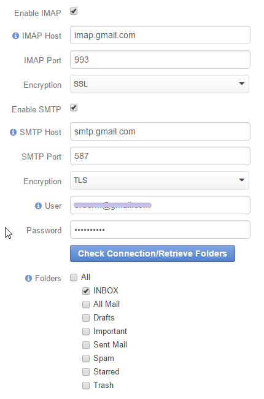

.. _user-management-users:

User Records Management
=======================

User :term:`records <Record>` represent a person, group of people or third-party system using OroCRM. 
User's credentials (login and password) identify a unique user an define what part of the system, which functionalities 
and actions will available for them in the system.

Create a User Record
--------------------

In order to create a :term:`User` record:

- Go to *System → User Management → Users*
- Click the :guilabel:`Create User` button
- Define the user settings in the sections described below.

General
^^^^^^^
The "General" section defines the basic settings of the user created. The following fields are mandatory and **must** be 
defined in the section.

.. csv-table::
  :header: "**Name**","**Description**"
  :widths: 10, 30

  "**Owner**","Define a :term:`business unit <Business Unit>`, users of which can manage the user, subject to the 
  :ref:`role settings <user-guide-user-management-permissions>`."
  "**Status**","Chose the record status. Possible values are *Inactive* or *Active*."
  "**Username**","The name used to log into the system (login)."
  "**Password**","The password used to log into the system."
  "**First Name** and **Last Name**","Name used to refer to the user in the UI."
  "Primary Email","Email associated with the user in the system."
  
Along with the mandatory fields, there are a number of optional fields provided by default, that can be used to define 
additional details of the customer, such as the name prefix and suffix, the middle name, birthday, additional emails,
and phone number. You can also add the avatar (upload a picture to be used for the user in the UI) and/or 
:term:`tags <Tag>` related to the user.

The "*Send An Email Invitation*" check-box defines whether an invitation email must be sent to the user. The email 
content is defined in the course of the system integration and cannot be edited from the UI.

      |
  
.. image:: ./img/user_management/user_general.png

Additional
^^^^^^^^^^
  
Any :ref:`custom fields added <user-guide-field-management-create>` to the "User" entity can be defined in the 
*"Additional"* section.

Groups and Roles
^^^^^^^^^^^^^^^^

The "Groups and Roles" section contains all the :ref:`user groups <user-management-groups>` and 
:ref:`roles <user-guide-user-management-permissions-roles>` available in the system. Check the boxes to assign the user
created to a group/role.

One user may have several roles. All the permissions granted to at least one of the roles, are granted to the user. 

      |
 
.. image:: ./img/user_management/user_groups.png

Access Settings
^^^^^^^^^^^^^^^

The "Access Settings" section contains all the :ref:`organizations <user-management-organizations>` and 
:ref:`business units <user-management-bu>` available in the system. Check the boxes to assign the user
to an organization/business unit.

.. image:: ./img/user_management/user_access.png

.. hint::

    In the community enterprise there can only be one organization, so organizations are not shown in the structure.

.. _user-management-users-email-sync:

Email synchronization settings
^^^^^^^^^^^^^^^^^^^^^^^^^^^^^^

Use the section to synchronize emails between mailbox of the user and OroCRM. 

- Let OroCRM know the details (such as host, port, and encryption) of IMAP to upload the incoming mail to OroCRM 
- Define the SMTP details (such as host, port, and encryption) to synchronize the outgoing mail from OroCRM to the 
  mailbox
- Specify the login (user) and password used to access the mailbox
- Click the :guilabel:`Check Connection/Retrieve Folders` 
- After successful connection, the list of available folders will be loaded. Check the Folders to be synchronized.

In the example below, synchronization has been done for a .gmail mailbox. The INBOX folder will be synchronized.

.. hint::

    Detailed instructions on the way to set-up IMAP and SMTP connection in gmail, are provided 
    `here <https://support.google.com/mail/troubleshooter/1668960?hl=en&rd=1#ts=1665018%2C1665144>`_

    To enable connection, check the box next to
    `Allow access for less secure apps box <https://support.google.com/accounts/answer/6010255?hl=en>`_

View and Manage a User Record
-----------------------------

All the users available are displayed in the Users :ref:`grid <user-guide-ui-components-grid-action-icons>` 
(*System → User Management → Users*).

From the grid you can:

- Delete a user from the system: |IcDelete|.

- Get to the :ref:`Edit form <user-guide-ui-components-create-pages>` of the user: |IcEdit|.

- Get to the :ref:`View page <user-guide-ui-components-view-pages>` of the user: |IcView|.

User View Page
^^^^^^^^^^^^^^

View page of a user record contains the following sections:

      |

Action Buttons
""""""""""""""

With the :ref:`action buttons <user-guide-ui-components-view-page-actions>` on the View page you can:
  
- Perform the actions available enable for the user entity in the 
  :ref:`Communication &  Collaboration settings <user-guide-entity-management-create-commun-collab>` (e.g. Assign Tasks,
  Send Emails etc.)
  
- Reset Password: The user will be prompted by email to reset their password and will be disabled from login until
  they do so.

- Change Password: Create new password (administrator will know this new password). The user will be notified on the 
  change by email.

.. image:: ./img/user_management/reset_password.png

General Information
"""""""""""""""""""
The section contains basic details of the user, namely:

- Username
- Birthday
- Emails
- Phone number
- Roles assigned to the user
- Groups the user belongs to
- Business unit the user belongs to
- Any custom fields :ref:`added <user-guide-field-management-create>` to the "User" entity will appear in the order 
  defined by their :ref:`priority <user-guide-entity-management-other-common>`.
  
Record Activities
"""""""""""""""""

The section contains all the :ref:`activities <user-guide-activities>` related to the user.

Additional Information
""""""""""""""""""""""

The section contains details of the :ref:`tasks <user-guide-activities-tasks-assign>` and 
:ref:`cases <user-guide-activities-cases>` assigned to the user.

.. |IcDelete| image:: ./img/buttons/IcDelete.png
   :align: middle

.. |IcEdit| image:: ./img/buttons/IcEdit.png
   :align: middle

.. |IcView| image:: ./img/buttons/IcView.png
   :align: middle

