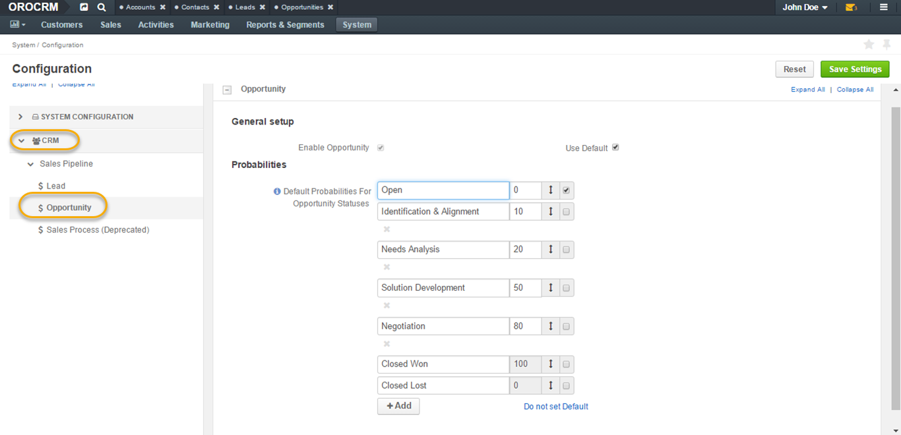
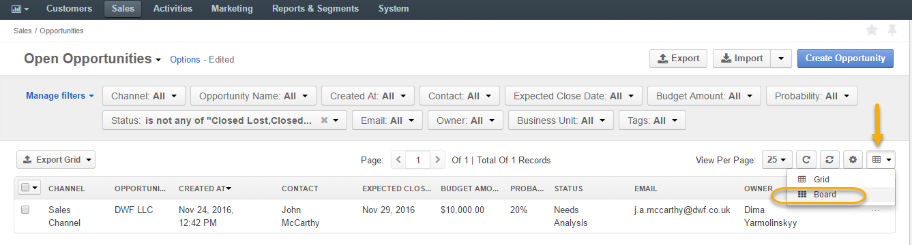
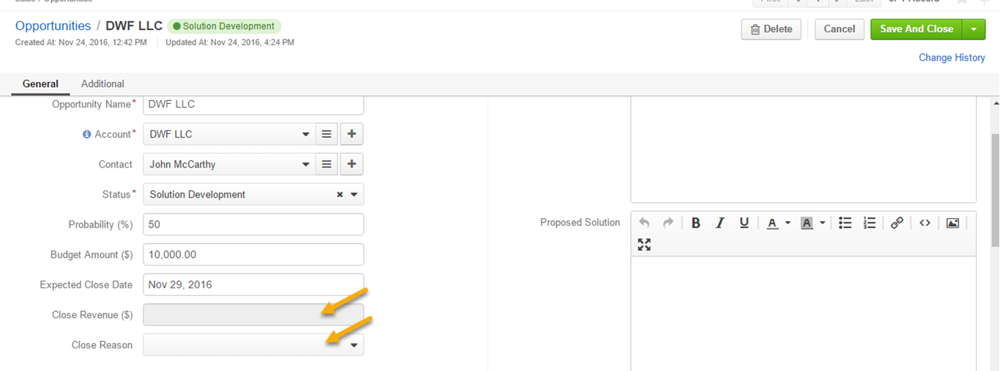
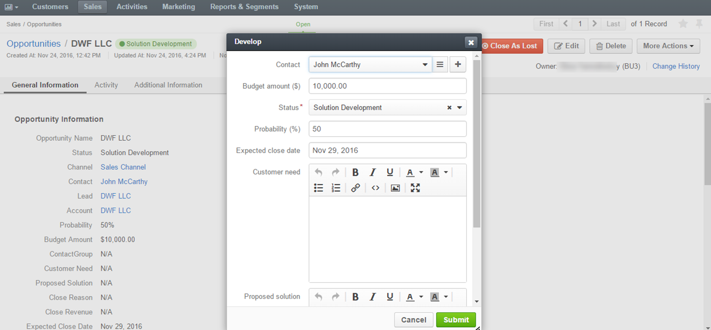

.. _user-guide-system-channel-entities-opportunities:

Opportunities
=============

Overview
--------

Opportunities are highly probable potential or actual sales to a new or established customer. Request for proposal, invitation for a bidding, agreement of intentions or order for a delivery can be saved as opportunities.

In order to add and process details of opportunities in OroCRM, you need to have at least one :term:`channel <Channel>` to which the opportunity entity :ref:`can be assigned <user-guide-channel-guide-entities>`.

Create Opportunities
--------------------

You can create opportunities in two ways, by converting a lead to an opportunity and by creating a lead manually.

Convert Lead To Opportunity
~~~~~~~~~~~~~~~~~~~~~~~~~~~

As soon as a lead is ready to be qualified, it can be converted into an opportunity.

This can be done by:

-  Navigating to **Sales>Leads** in the main menu.

-  Opening a lead from the grid.

|

.. image:: ../img/opportunities/convert_to_opportunity_button.png

|

-  Clicking **Convert Lead to Opportunity** on the lead page.

-  **Convert Lead To Opportunity** form will emerge.

|

.. image:: ../img/opportunities/convert_to_opportunity.png

|

More information on leads can be found in the :ref:`Leads <user-guide-system-channel-entities-leads>` guide.

Create Opportunity Manually
~~~~~~~~~~~~~~~~~~~~~~~~~~~

To create an opportunity manually:

-  Go to **Sales>Opportunities** in the main menu.

-  Click **Create Opportunity** in the top right corner.

-  The **Create Opportunity form** will appear.

|

.. image:: ../img/opportunities/create_opportunity_new.png

|

Fill in the form
~~~~~~~~~~~~~~~~

Convert To Opportunity Form
^^^^^^^^^^^^^^^^^^^^^^^^^^^

Convert To Opportunity Form contains **Opportunity Information** and
**New** **Contact Information** forms.

For Opportunity Information form, define the following fields:

+----------------------+-------------------------------------------------------------------------------------------------------------------------------------------------------------------------------------------------------------------------------------------------------------------+
| **Field**            | **Description**                                                                                                                                                                                                                                                   |
+======================+===================================================================================================================================================================================================================================================================+
| **Owner**            | Limits the list of users that can manage the opportunity to users whose :ref:`roles <user-guide-user-management-permissions>` allow managing opportunities assigned to the owner (e.g. the owner, members of the same business unit, system administrator, etc.). |
|                      | By default, the user creating the record is chosen.                                                                                                                                                                                                               |
+----------------------+-------------------------------------------------------------------------------------------------------------------------------------------------------------------------------------------------------------------------------------------------------------------+
| **Opportunity Name** | The name used to refer to an opportunity in the system.                                                                                                                                                                                                           |
+----------------------+-------------------------------------------------------------------------------------------------------------------------------------------------------------------------------------------------------------------------------------------------------------------+
| **Account**          | Allows to select or create a customer account the opportunity will be related to.                                                                                                                                                                                 |
|                      |                                                                                                                                                                                                                                                                   |
|                      | -  Account field will be filled in with the company name if such name was entered when creating a lead.                                                                                                                                                           |
|                      |                                                                                                                                                                                                                                                                   |
|                      | -  To create a new account, click **+** at the end of the Account field.                                                                                                                                                                                          |
|                      |                                                                                                                                                                                                                                                                   |
|                      | -  Alternatively, use **write-in functionality** to enter a new account name. Type the name in the field and click **Add New**.                                                                                                                                   |
|                      |                                                                                                                                                                                                                                                                   |
|                      | -  Creating an account will automatically create a business customer with the same name.                                                                                                                                                                          |
+----------------------+-------------------------------------------------------------------------------------------------------------------------------------------------------------------------------------------------------------------------------------------------------------------+

|

.. image:: ../img/opportunities/new_acc.png

|

+-------------+---------------------------------------------------------------------------------------------------------------------------------------------------------------------------------+
| **Contact** | The person on the customer side who is directly related to the opportunity.                                                                                                     |
+-------------+---------------------------------------------------------------------------------------------------------------------------------------------------------------------------------+
| **Status**  | A stage in the process of a sale. **Open, Closed Won and Closed Lost** are system statuses and cannot be deleted. Other statuses can be customized in the system configuration. |
+-------------+---------------------------------------------------------------------------------------------------------------------------------------------------------------------------------+

|

.. image:: ../img/opportunities/status.png

|

.. csv-table::
  :header: "Field", "Description"
  :widths: 10, 30

  "**Probability**", "The perceived probability of an opportunity being successfully closed. 

  Probability is related to **Status**. For each status, there is a certain percentage of probability which is pre-configured automatically. 

  To configure percentage for each status (see the first screenshot below):

  -	Go to **Systems>Configuration**.
  -	Open **CRM** tab.
  -	Click :guilabel:`Opportunities`.
  -	Configure statuses in the **Probabilities** section.
  	
  Here, you can add new statuses by clicking **+Add**, changes status names, their position and probability percentage.

  **Note** that you cannot change probability percentage for **Open**, **Closed Won** and **Closed Lost** system statuses.

  Probability percentage can be edited manually when filling in the **Convert To Opportunity form** (as illustrated in the second screenshot below)."

|

|

.. image:: ../img/opportunities/probability_edited.png

|

+---------------------------+---------------------------------------------------------------------------------------------------------------------------------------------------------+
| **Budget Amount**         | Budget amount is potential deal value being discussed.                                                                                                  |
+---------------------------+---------------------------------------------------------------------------------------------------------------------------------------------------------+
| **Expected Close Date**   | Expected close date of the deal.                                                                                                                        |
+---------------------------+---------------------------------------------------------------------------------------------------------------------------------------------------------+
| **Close Revenue**         | The amount actually received as the result of the deal.                                                                                                 |
|                           |                                                                                                                                                         |
|                           | E.g. If the predicted budget was $10 000 but the result of the deal was $500 lower than the budget amount, the close revenue would constitute $9 500.   |
+---------------------------+---------------------------------------------------------------------------------------------------------------------------------------------------------+
| **Close Reason**          | The reason for closing the deal, e.g. won, outsold, cancelled, etc.                                                                                     |
+---------------------------+---------------------------------------------------------------------------------------------------------------------------------------------------------+
| **Customer Need**         | Enter customer needs if known.                                                                                                                          |
+---------------------------+---------------------------------------------------------------------------------------------------------------------------------------------------------+
| **Proposed Solution**     | Enter your offers and/or solutions for the customer if any were proposed.                                                                               |
+---------------------------+---------------------------------------------------------------------------------------------------------------------------------------------------------+
| **Additional Comments**   | Enter additional comments if necessary.                                                                                                                 |
+---------------------------+---------------------------------------------------------------------------------------------------------------------------------------------------------+

**New Contact Information Form** contains **General**, **Contact Details**, and **Addresses** sections with a number of fields to fill in.

Since the lead has fulfilled its purpose and is no longer needed, a new contact will be created based on lead data entered in this form.

It is possible to enter multiple phones, emails and addresses for an
opportunity. You can choose which phone, email or address is to be
primary. You can also delete the entered phone, email or address by
clicking X on the right of the corresponding fields (as shown in the
screenshot below).

|

.. image:: ../img/opportunities/contact_info_form_1.png

|

.. image:: ../img/opportunities/contact_info_form_2.png

|

.. note::  Within the opportunity grid, however, only one phone, email and address will be displayed, even if multiple phones, emails and addresses were entered.
 
 
Once you have completed filling in the forms, click **Save and Close**
to save the opportunity in the system.

Create an Opportunity Form
^^^^^^^^^^^^^^^^^^^^^^^^^^

Instead of converting a lead to an opportunity, you can manually create
a new opportunity:

-  Navigate to **Sales>Opportunities**.

-  Click **Create Opportunity** in the top right corner of the page.

-  A **Create Opportunity form** will open with fields to define.

.. note:: Note that the **Create an Opportunity** page is essentially the same as **Convert To Opportunity** page but it does not contain **New Contact Information** section.

|

.. image:: ../img/opportunities/create_opportunity_form.png

|

The **General** fields in Create and Opportunity form are the same as
**Opportunity Information** fields in Convert To Opportunity form. More
information on filling in the form can be found in the Convert To
Opportunity Form section of this guide.

Manage Opportunities 
---------------------

The following actions can be performed for opportunities from the grid:

-  Export and import opportunity record details with Export and Import buttons as described in the :ref:`Export and Import Functionality <user-guide-import>` guide.

-  Delete an opportunity from the system : |IcDelete|

-  Edit the opportunity : |IcEdit|

-  View the opportunity : |IcView|

|

.. image:: ../img/opportunities/edit_opp_from_grid.png

|

Multiple Grid Views
~~~~~~~~~~~~~~~~~~~

Multiple grid views are available for opportunities:

-  All opportunities.

-  Open Opportunities.

-  Overdue Opportunities.

-  Recently Closed Opportunities.

**Open Opportunities** grid is the default view.

To change the grid view, click on the arrow icon on the right of Open
Opportunities header and select the preferred grid view from the
dropdown, as shown in the screenshot below.

|

.. image:: ../img/opportunities/multiple_grid_views.png

|

Inline Editing
~~~~~~~~~~~~~~

Inline editing within the grid can help you amend opportunity details without opening the edit opportunity form. To edit opportunities from the grid, double-click on the field or the edit
icon in the field you wish to edit.

|

.. image:: ../img/opportunities/change_percentage_inline.png

|

|

.. image:: ../img/opportunities/change_status_inline.png

|

|

.. image:: ../img/opportunities/change_percentage_inline.png

|

Kanban Board
~~~~~~~~~~~~

As an alternative to grid view, it is possible to view Opportunities in
Kanban board. To change grid view to board view, open **Grid/Board
menu** and click **Board**.

|

|

|

.. image:: ../img/opportunities/kanban_view.png

|

.. note:: Kanban board functionality is available only if **Opportunities Management Flow** is **disabled** in **System>Workflows**.
 
   

Within the board, you can:

-  Change opportunities status by dragging them between columns.
 
|

.. image:: ../img/opportunities/draggin_opportunity_kanban.png

|

-  Delete an opportunity from the system : |IcDelete|

-  Edit an opportunity : |IcEdit|

-  View an opportunity : |IcView|

|

.. image:: ../img/opportunities/edit_opp_kanban.png

|

.. note:: Inline editing feature is not available for board view, it is only possible within the grid view.
 
  
Manage Opportunity Workflow
---------------------------

You can use OroCRM’s :term:`workflows <Workflow>` to define rules and guidelines on possible actions/updates of opportunities in the system. You can read more on :ref:`workflows <user-guide-workflow-management>`.

Activate Opportunity Management Flow
~~~~~~~~~~~~~~~~~~~~~~~~~~~~~~~~~~~~

To ensure data consistency and reasoned opportunity management by a
sales manager, you can activate Opportunity Management Flow in
**System>Workflows**. This can be done in two ways:

-  From the grid: click **V** in the ellipsis menu

-  From the view page: open Opportunity Management Flow view page and
   click **Activate** in the top right corner.

|

.. image:: ../img/opportunities/opp_managenent_flow_grid.png

|

|

.. image:: ../img/opportunities/activate_workflow.png

|

Active Opportunity Management Flow limits what a sales manager can do
with opportunities, thus eliminating situations when, for instance, an
opportunity is not yet closed but its close reason is specified, or an
opportunity is closed but its close reason is unspecified.

Start Opportunity Management Flow
~~~~~~~~~~~~~~~~~~~~~~~~~~~~~~~~~

Activating Opportunity Management Flow does not happen automatically for
all opportunities. Once the flow has been activated in
**System>Workflows**, you need to start it manually for the required
opportunities.

|

.. image:: ../img/opportunities/start_workflow_manually.png

|

You can set Opportunity Status and Probability manually before starting
Opportunity Management Flow.

|

.. image:: ../img/opportunities/start_workflow_manually_popup.png

|

Transitions
~~~~~~~~~~~

Three transitions will become available as the result of flow
activation:

-  Develop

-  Close As Won

-  Close As Lost

Close As Won/Close As Lost
^^^^^^^^^^^^^^^^^^^^^^^^^^

**Close Revenue** and **Close Reason** fields and statuses have become
unavailable in the edit opportunity form as the result of flow
activation.

|

|

To close an opportunity as Won or Lost, use **Close As Won/Close As
Lost** transition buttons instead. They are located at the top of
Opportunities view page.

|

.. image:: ../img/opportunities/opp_flow_activated.png

|

Note that it is not possible to close an opportunity from the grid,
although inline editing as a feature is available after flow activation.

To close an opportunity as Won:

-  Click **Close As Won** button.

-  Enter Close Revenue.

-  Enter Expected Close Date.

-  Click **Submit.**

To close an opportunity as Lost:

-  Click **Close As Lost** button.

-  Select Close Reason from the dropdown.

-  Select the Expected Close Date.

-  Click **Submit**.

Develop
^^^^^^^

**Develop** transition is a simplified form for editing an opportunity.

|

|

.. _user-guide-opportunities-reports:

Reports with Opportunities
--------------------------

OroCRM provides three out-of-the-box reports on opportunities:

-  Opportunities By Status.

-  Won Opportunities By Period.

-  Total Forecast.

|

.. image:: ../img/opportunities/reports_opps.png

|

Opportunities by Status
~~~~~~~~~~~~~~~~~~~~~~~

**Opportunities by Status** is a report that allows you to see how many
opportunities with a specific status are available in the system, what
their total close revenue and budget amount are.

In order to see the report, go to **Reports and Segments>Reports>Opportunities>Opportunities By Status.**

Opportunities by Status report shows:

-  Status of the opportunities

-  The number of the opportunities with the statuses set for the opportunities in the system.

-  Total close revenue of all the opportunities

-  Total budget amount of all the opportunities.

-  Total number of opportunities regardless of their status (grand total), their close revenue and budget amount.

|

.. image:: ../img/opportunities/opportunities_by_status.png

|

Won Opportunities by Period
~~~~~~~~~~~~~~~~~~~~~~~~~~~

This report helps analyze a process of opportunities won per period.

To see the report, go to **Reports and Segments >Reports>Opportunities >Won Opportunities by Period.**

Won Opportunities by Period report shows:

-  The period, for which data is shown.

-  The number of the opportunities won within this period.

-  Total close revenue of all the opportunities won within the period.

-  Total number of opportunities won, regardless of the period when they were won (grand total) and their close revenue.

|

.. image:: ../img/opportunities/won_opp_by_period.png

|

Forecast
~~~~~~~~

Forecast report helps estimate the future of sales.

The report shows:

-  Opportunity name.

-  Opportunities in progress.

-  Budget forecast.

-  Weighted forecast.

-  Total forecasted budget for the opportunities per page (page total).

-  Total forecasted budget for all opportunities (grand total).

|

.. image:: ../img/opportunities/forecast.png

|

.. note:: New custom reports can be added. For more details on the ways to create and customize reports, see :ref:`the Reports guide <user-guide-reports>`.
 
  

.. |BCrLOwnerClear| image:: ../../img/buttons/BCrLOwnerClear.png
   :align: middle

.. |Bdropdown| image:: ../../img/buttons/Bdropdown.png
   :align: middle

.. |BGotoPage| image:: ../../img/buttons/BGotoPage.png
   :align: middle

.. |Bplus| image:: ../../img/buttons/Bplus.png
   :align: middle

.. |IcDelete| image:: ../../img/buttons/IcDelete.png
   :align: middle

.. |IcEdit| image:: ../../img/buttons/IcEdit.png
   :align: middle

.. |IcView| image:: ../../img/buttons/IcView.png
   :align: middle
