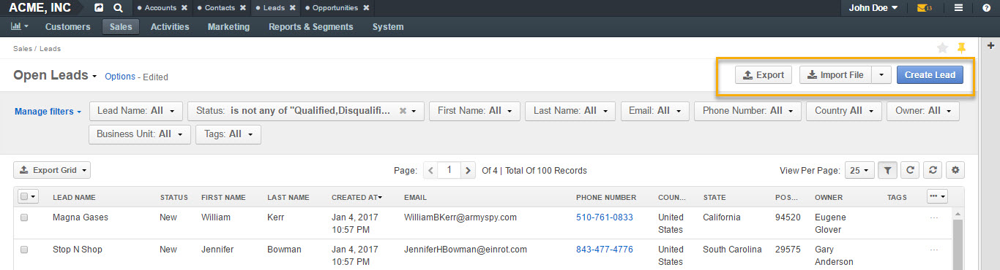
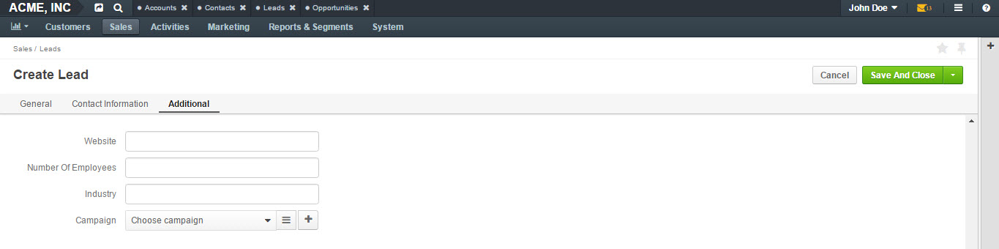
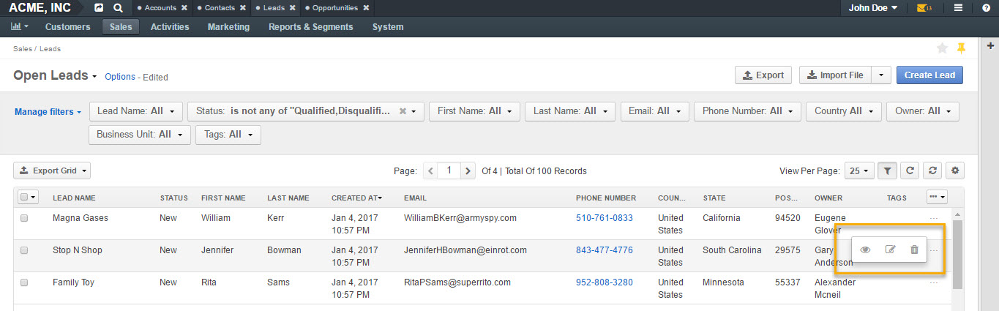

.. _user-guide-system-channel-entities-leads:

Leads
=====

.. contents:: :local:
    :depth: 1

Overview
--------

In order to save and process the details of commercial activity with people or businesses that have authority, budget and interest to purchase goods and/or services from you, for whom the probability of actual sales is not yet high or is impossible to define, use **Lead** records in OroCRM (“leads”). Essentially, leads are prospects or potential sales in a form of contact data. Initial agreement discussions, preliminary price requests or invitations for a bid may be examples of a lead.

.. note:: See a short demo on `how to create and work with a lead <https://oroinc.com/orocrm/media-library/create-work-lead>`_, or keep reading the step-by-step guidance below.

   .. raw:: html

      <iframe width="560" height="315" src="https://www.youtube.com/embed/5yZDC68sRTk" frameborder="0" allowfullscreen></iframe>

Enable Lead Record
------------------
You can enable (or disable) a lead manually the following way:

- Navigate to **Settings>Configuration** in the main menu.
- Open **CRM>Sales Pipeline** in the left menu and click :guilabel:`Lead`.
- In the **General Setup** section, check the **Enable Lead** box.

.. note:: Please refer to your administrator if you have insufficient permissions to enable/disable leads in your application.

Once enabled, leads menu will become available under **Sales** in the main menu.

.. image:: ../../img/leads_2.0/lead_enabled_new.jpg

Create Lead Record
------------------

Leads can be added to the system in a number of ways. The two most common ways are:

-  Importing leads in a form of a .csv file.

-  Creating leads manually.

Import Leads
^^^^^^^^^^^^

You can import the bulk details of updated or processed leads information in the .csv format following the steps described in the :ref:`Importing Leads <import-leads>` guide.

Export
~~~~~~

You can export the customer details in the .csv format following the :ref:`Exporting Bulk Items <export-bulk-items>` guide.

Create Lead
^^^^^^^^^^^

To create a lead manually, click :guilabel:`Create Lead` in the top right corner.

The **Create Lead** :ref:`form <user-guide-ui-components-create-pages>` will appear with the following 3 sections:

-  General

-  Contact Information

-  Additional
   

.. image:: ../../img/leads_2.0/leads_create_general.png

The **General** section contains the following mandatory fields to be defined:

.. csv-table::
  :header: "Field", "Description"
  :widths: 10, 30

  "**Owner**", "Limits the list of users who can manage the opportunity to users, whose :ref:`roles <user-guide-user-management-permissions-roles>` allow managing opportunities assigned to the owner (e.g. the owner, members of the same business unit, system administrator, etc.). By default, the user creating the record is chosen."
  "**Lead Name**", "The name used to refer to a lead in the system."
  "**Status**", "Three statuses are available for a lead:                                                                                                                                                                                                                                                                                              
    - **New** (newly created lead).                                                                                                                                          
    - **Qualified** (lead is recognized as valid as a result of initial analysis, e.g. there is an interested person or organization behind the lead).                        
    - **Disqualified** (lead is recognized as invalid as a result of initial analysis, e.g. no person or organization was found behind the lead)."
  "**Channel**","Choose one of active :term:`channels <Channel>`, from which OroCRM will get information on this lead."

The rest of the fields are optional.

The **Contact Information** section contains contact details to be entered for a lead.

Multiple emails, phones and addresses can be added for a lead.

.. image:: ../../img/leads_2.0/leads_create_contact_info.png

In the **Additional** section, you can give additional information on the lead (if available).

Once all the necessary fields have been defined, click :guilabel:`Save and Close` in the right top corner of the page to save the lead in the system.

Manage Lead From the Lead Page
------------------------------

The lead page contains all available information on the lead in the
**General Information** section.

.. image:: ../../img/leads_2.0/lead_saved.png

**Activity** section shows all activity for a lead that has taken place, such as phone calls placed or emails sent to the lead.

The following actions are available for a lead record on the lead record page:

-  **Share**: Share a lead with contacts of your choice.

.. image:: ../../img/leads_2.0/share_lead.png

-  **Disqualify action:** Disqualify a lead.

   .. note:: You can disqualify a lead in three ways:  
      

              1. By clicking on red :guilabel:`Disqualify` button on the lead record page.

              2. By changing its status to Disqualified in the edit lead form.

              3. By changing its status to Disqualified from the grid.

-  **Convert To Opportunity:** Converting a lead to opportunity (i.e.    and potential deal) qualifies the lead. More information on opportunities can be found :ref:`here <user-guide-system-channel-entities-opportunities>`.

   .. note:: Once the lead is converted to an opportunity, it is marked Qualified and will no longer be visible in Open Leads grid.
     
      
-  **Edit:** Open the edit form for a lead and amend lead details.

-  **Delete:** Delete a lead from the system.

-  **More Actions:** Add Note, Send Email, Add Event, Log Call or Add Task.

.. image:: ../../img/leads_2.0/more_actions_lead.png

You can also edit address details of a lead, as illustrated in the screenshot below:

.. image:: ../../img/leads_2.0/address_edit.png

Manage Lead From the Grid
-------------------------

The following actions can be performed for leads from the grid:

-  Delete a lead from the system: \ |IcDelete|

-  Get to the :ref:`edit form <user-guide-ui-components-create-pages>` of the lead: \ |IcEdit|

-  Get to the :ref:`view page <user-guide-ui-components-create-pages>` of the lead: \ |IcView|

Grid Views
^^^^^^^^^^

Two grid views are available for leads: **Open Leads** and **All Leads**.

Open leads grid view displays the list of all open leads.

All leads grid view displays all existing leads, including the ones that have been disqualified or converted to an opportunity and marked qualified.

.. image:: ../../img/leads_2.0/leads_grid.jpg

Inline Editing
^^^^^^^^^^^^^^

Inline editing within the grid can help you amend lead details without opening the edit lead form. To edit leads from the grid, double-click on the field or the edit icon in the field you wish to edit.

.. image:: ../../img/leads_2.0/leads_inline_editing_1.jpg

.. image:: ../../img/leads_2.0/leads_inline_editing_2.jpg

.. note:: Although multiple emails, phones and addresses can be added for leads, only one email, phone and address will be displayed in the grid.
 
  
.. _doc-leads-reports: 

View Reports
------------

Lead By Date Report
^^^^^^^^^^^^^^^^^^^

OroCRM provides a ready-to-use **Leads by Date** report. This is a useful report that shows how many leads were created on a specific date for all of the channels.

To see the report, go to **Reports and Segments>Reports>Leads>Leads By Date.**

Leads by Date report shows:

-  The date leads were created on.

-  The number of the leads created on a specific date.

-  Total amount of the leads created.

.. image:: ../../img/leads_2.0/leads_by_date.png

New custom reports can be added. For more details on the ways to create and customize the reports, see the :ref:`Reports guide <user-guide-reports>`.

Using Leads in Workflows
------------------------

You can use
OroCRM’s :term:`workflows <Workflow>` to define rules and guidelines on possible actions/updates of leads in the system. New customer-specific workflows can also be created, as described in the :ref:`Workflows guide <doc--system--workflow-management>`.

.. BCrLOwnerClear| image:: /img/buttons/BCrLOwnerClear.png
   :align: middle

.. include:: /img/buttons/include_images.rst
   :start-after: begin
