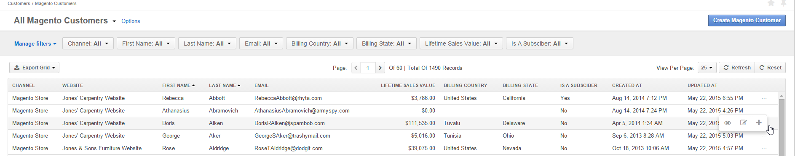

.. _user-guide-magento-entities-customers:

Magento Customers
=================

Records of Magento customers represent clients of a Magento-based store, for which data is collected within a Magento
channel. After the successful :ref:`synchronization with Magento <user-guide-magento-channel-integration>`, the list of
customers and their details will be loaded into the Oro application and processed (provided the
:ref:`two-way synchronization has been enabled <user-guide-magento-channel-integration-synchronization>`).

This section will cover the following key topics:

.. contents:: :local:
   :depth: 2

Create a Magento Customer Record
--------------------------------

If the two-way synchronization has been enabled, you can create a new Magento customer from OroCRM.

In order to create a new Magento customer in the system:

1. Go to the **Customers > Magento Customers**.

2. Click **Create Magento Customer** on the top right.

   The following :ref:`page <user-guide-ui-components-create-pages>` opens:

   .. image:: ../../img/magento_entities/magento-customer_create.png

3. Define the following mandatory fields:

   .. csv-table::
     :header: "Field", "Description"
     :widths: 10, 30

     "**Channel**","Choose the channel for which the customer is being created. All the active channels of the Magento type are available."
     "**Store**","Choose a Magento store for which the customer is being created. All the stores available within the channel specified will be available."
     "**Customer Group**","Choose a customer group to which the created customer will be assigned in Magento. All the customer groups available within the store specified will be available."
     "**First Name** and **Last Name**","Define the name used to refer to the customer in Magento."
     "**Owner**","Limits the list of users that can manage the customer to users whose :ref:`roles <user-guide-user-management-permissions>` allow managing Magento customers assigned to the owner (e.g. the owner, members of the same business unit, system administrator, etc.). By default, the user creating the record is chosen."
     "**Password**","Define the password for the Magento Customer. You cannot leave the field empty."

   .. note:: The rest of the fields are optional. They have been added to the system based on the best Magento practices and keep additional details of the customer (such as the customer's middle name, birthday, gender, related :ref:`contact <user-guide-contacts>` and :ref:`account <user-guide-accounts>`). Optional fields may be left empty.

4. Once all the necessary fields have been defined, click **Save**.

.. _user-guide-magento-customers-actions:

Manage Magento Customer Records 
-------------------------------

Actions that can be performed for Magento customers are described below.

From the :ref:`grid <doc-grids>`, you can:

1. Subscribe or unsubscribe the customers to/from the :ref:`Magento Newsletter <user-guide-magento-entities-newsletters>`: **+** or **--**.
2. Get to the :ref:`edit form <user-guide-ui-components-create-pages>` of the customer: |IcEdit|
3. Get to the :ref:`view page <user-guide-ui-components-view-pages>` of the customer:  |IcView|

   .. image:: ../../img/magento_entities/magento_customers_view.png
  
From the view page, you can:

1. Create an order for the customer in Magento: click **Create Order** to get to the admin panel and place and order in the Magento store.
2. Subscribe or unsubscribe the customers to/from the :ref:`Magento Newsletter <user-guide-magento-entities-newsletters>`: click **Subscribe** or **Unsubscribe**.
3. The rest of the actions available from the view page depend on the system settings defined in the **Communication and Collaboration** section of the **Magento Customer** entity configuration topic. See step 4 of the :ref:`Create an Entity <doc-entity-actions-create>` action description.

.. _user-guide-magento-orders:

View Magento Orders
-------------------

You can view orders placed by a specific Magento customer on their view page in the Oro application by clicking **Sales > Magento Orders**, as illustrated below:

.. image:: /img/magento_entities/MagentoCustomerOrdersTabNew.png

The following information will be displayed:

- Order #
- Items Qty
- Create At
- Updated At
- Subtotal Amount
- Total Amount
- Total Paid
- Status
- Step
- Tags

You can perform the following actions with the orders on the view page of a Magento customer:

- To open the view page of a specific order, click |IcView|
- To select which information to display, click |IcSettings|.
- To open filters, click |IcFilter|
- To refresh the list of orders, click |IcRedo|
- To reset the list of orders, click |IcRefresh|

.. _user-guide-magento-recent-purchases:

View Recent Magento Purchases
-----------------------------

You can get a quick overview of the products that a Magento customer recently purchased by clicking **Sales > Recently Purchased** on their view page. Newly purchased products appear on the list when a new order is created. By default, the most recently purchased products are displayed first. Products disappear from the list if an order is cancelled or deleted on the Magento side. 

.. image:: /img/magento_entities/MagentoCustomerPurchases.png

The following information will be displayed:

- Order #
- Created at
- SKU
- Name
- Quantity
- Price
- Original Price
- Discount Percent
- Discount Amount
- Tax Percent
- Tax Amount
- Row Total

You can perform the following actions with the purchases on the view page of a Magento customer:

- To open the view page of a specific purchase, click |IcView|
- To select which information to display, click |IcSettings|.
- To open filters, click |IcFilter|
- To refresh the list of purchases, click |IcRedo|
- To reset the list of purchases, click |IcRefresh|

.. _user-guide-magento-carts:

View Magento Carts
------------------

In the Oro application, you can view carts related to a specific Magento customer on the their view page by clicking **Sales > Magento Shopping Carts**, as illustrated below:

.. image:: /img/magento_entities/MagentoCreditMemoCartTabNew.png

The following information will be displayed:

- Cart ID
- Items Qty
- Create At
- Updated At
- Grand Total
- Status
- Step
- Tags

You can perform the following actions with the carts on the view page of a Magento customer:

- To open the view page of a specific cart, click |IcView|
- To select which information to display, click |IcSettings|.
- To open filters, click |IcFilter|
- To refresh the list of carts, click |IcRedo|
- To reset the list of carts, click |IcRefresh|

.. _user-guide-magento-credit-memos:

View Magento Credit Memos
-------------------------

You can view :ref:`credit memos <user-guide--sales--magento-credit-memos>` related to a specific Magento customer on their view page. These memos, however, cannot be altered in the Oro application, as they are generated on the Magento side.

To view memos on the view page of a selected Magento customer, click **Sales > Magento Credit Memos**, as illustrated below:

.. image:: /img/magento_entities/MagentoCreditMemoCustomerPage3.png

The following information will be displayed:

- Status
- Credit Memo #
- Created At
- Updated At
- Order #
- Order Date
- Refunded

You can perform the following actions with the credit memos on the view page of a Magento customer:

- To open the view page of a specific memo, click |IcView|
- To select which information to display, click |IcSettings|.
- To open filters, click |IcFilter|
- To refresh the list of memos, click |IcRedo|
- To reset the list of memos, click |IcRefresh|

View Magento Customer Website Activity
--------------------------------------

You can view activities of a specific Magento customer in the **Website Activity** section of their view page in *Summary* and *Events*, if :ref:`website tracking <user-guide-magento-web-tracking>` has been configured in your Oro application:

.. image:: ../../img/web_tracking_magento/customer_activity_1.jpg

.. image:: ../../img/web_tracking_magento/customer_activity_2.jpg

Five events are tracked by default:

1. Page views: Every time a user gets to the page, a *visit* event is logged.
2. Registration of new users: As soon as a user registers, a *registration* event is logged.
3. Items added to carts: a *cart item added* event is logged when a user adds an item to the cart.
4. Start of order checkout: a *user entered checkout* event is logged when a user starts their checkout process.
5. Order placement: an *order successfully placed* event is logged when a user places their order.

.. include:: /img/buttons/include_images.rst
   :start-after: begin
