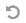

.. _user-guide-acc:

Magento Abandoned Cart Campaign
===============================

Once your OroCRM account has been integrated with :ref:`Magento <user-guide-magento-channel-integration>` and 
:ref:`MailChimp <user-guide-mc-integration>`, you can use OroCRM Abandoned Cart functionality to increase conversion and 
sales. 

With this functionality, you can use multiple criteria such as the date created, cart value, item type, customer actions
and more to create dynamically updated lists of contact details related to customers that abandoned your Magento store 
cart during the checkout process.

Once a list has been created, it can be uploaded to MailChimp and used to launch a usual or automated email campaign. 
The contact list and campaign details can be then synchronized in the MailChimp and OroCRM accounts. MailChimp's 
campaign tracking and OroCRM's  Website tracking and reporting tools can be used to analyze the campaign efficiency. 

.. _user-guide-acc-ext:

Set up Abandoned Cart Extension
-------------------------------

To use this functionality, you need to set up the Abandoned Cart extension:

- Go to System --> Package Manager.

.. image:: ./img/mailchimp/ext_01.png
 
- Enter your login credentials (same as for your OroCRM account). The *Oro Installer* page will emerge.

- Enter the package name ***oro/crm-abandoned-cart*** and click :guilabel:`Install`

.. image:: ./img/mailchimp/ext_02.png

- The extension does not require any demo data, so disable the *Load demo data* check-box.

.. image:: ./img/mailchimp/ext_03.png

- Click :guilabel:`Continue`. Once the installation is over, a success message will be displayed. 

Now you can use the functionality.

.. _user-guide-acc-create:
 
Create an Abandoned Cart Campaign
------------------------------------

Go to the *Marketing --> Abandoned Cart Campaigns* and click the :guilabel:`Create Abandoned Cart Campaign` button 
in the top right corner of the grid.
   
The Create Abandoned Cart Campaign :ref:`form <user-guide-ui-components-create-pages>` will emerge.

.. hint::

    Creating an abandoned cart campaign is somewhat similar to creating a marketing list, where the entity is 
    a Magento Shopping Cart with status Open and the type is dynamic.

Define the list settings, as described in the sections below:

.. _user-guide-acc-create-general:
  
General Details  
^^^^^^^^^^^^^^^

The following fields are mandatory and **must** be specified:

.. csv-table::
  :header: "Field", "Description"
  :widths: 10, 30

  "**Name**","Name used to refer to the list of abandoned cart contacts in the system"
  "**Owner**","Limits the list of users that can manage the marketing list to only those, whose roles allow 
  managing marketing lists of the owner (e.g., the owner, members of the same business unit, system administrator, 
  etc.)."

Optional field **Description** can be filled with free text to help you and other users understand the purpose or 
peculiarities of the list in the future.

Custom fields may be added according to specific business needs. 

.. _user-guide-acc-create-filters:
  
Filters
^^^^^^^

Filters are necessary to choose only those abandoned cart records that you need for marketing purposes.
For example, this could be only carts the belong to customers from a specific state and/or with a birthday 
within a specific month, carts created after a specific date, or specified with other combinations of filter conditions. 

More information about the ways to define filters is provided in the 
:ref:`Filters Management <user-guide-filters-management>` guide.

.. _user-guide-acc-columns:

Columns
^^^^^^^

In the "*Columns*" section, define the set of fields.
The only goal of this set of fields is to visualize records that meet the filter requirements. (Values of the chosen 
fields will be displayed at the :ref:`View page <user-guide-ui-components-view-pages>` of the campaign)

.. note::

    Marketing activities require some contact information, so at least one column that contains it must be 
    selected.
  
- Choose the fields from the drop-down menu in the *"Column*" section.

- Label is the way the field will be referred to in the grid. The value defined for the field will be added by default, 
  but can be changed. 
  
- Define the sorting order if you want the grid to be sorted by the field value.

- Click :guilabel:`Add` button

Use action icons in the last column to edit the grid:

- Delete a column from the list with |IcDelete|

- Edit the column settings with |IcEdit|

- Change the column position (drag the column by the |IcMove| icon)

.. hint::

    Save the campaign in the system with the button in the top right corner of the page.

	
For example, we have created a *Demo ACC* abandoned cart campaign, within which a list will be created in the MailChimp
account. The List will contain abandoned Magento Shopping Carts available in the OroCRM account that were created 
after April 1st, 2015. The cart id, customer's last name, and email will be transferred to the MailChimp account for 
every such cart and can be used as variables for email campaigns.

.. image:: ./img/mailchimp/acc_create_ex.png

.. _user-guide-acc-actions:

Manage Abandoned Cart Campaigns
-------------------------------

The following actions are available for an abandoned cart campaign from the 
:ref:`grid <user-guide-ui-components-grids>`:

.. image:: ./img/mailchimp/acc_edit.png

- Delete the campaign from the system : |IcDelete| 

- Get to the :ref:`Edit form <user-guide-ui-components-create-pages>` of the campaign : |IcEdit| 

- Get to the :ref:`View page <user-guide-ui-components-view-pages>` of the campaign :  |IcView| 

.. _user-guide-acc-view-page:

Abandoned Cart Campaign View Page
^^^^^^^^^^^^^^^^^^^^^^^^^^^^^^^^^

.. image:: ./img/mailchimp/acc_view.png

The :ref:`View page <user-guide-ui-components-view-pages>` of an abandoned cart campaign contains the following 
sections:

- :ref:`Action buttons <user-guide-ui-components-grid-action-buttons>` 

- ***General Information***: general details of the campaign

- ***Magento Shopping Carts*** grid: the grid of Magento shopping carts included in the campaign.
  
  - "SUBSCRIBED" column of the grid : Initially all the users in the list are subscribed (the column value is "Yes"). 
    If during one of the mailing campaigns a user has unsubscribed, the value is changed to "No" and 
    the user is excluded from the next campaigns.

- ***Removed Items****: the grid contains carts that have been removed from the list (a cart may be removed from OroCRM 
  and\or from MailChimp (requires synchronization).

.. hint::

    Action icons in the last column of the grid enable the following actions:

    - Get to the *"View"* page of the grid item: |IcView|

    - Unsubscribe the item from the list manually: |IcUns|
  
    For unsubscribed items, there is a |IcSub| icon to get the record back on the list
  
    - Remove the item from the list: |IcRemove|

    Action icons in the last column of the *"Removed Items"* grid enable the following actions:

   - Get to the *"View"* page of the grid item: |IcView|

   - Restore the item in the marketing list: |UndoRem|  
   
- ***Conversion***: Items that were initially added to the campaign and then were turned into orders.

.. _user-guide-acc-connect:

2. Connecting to MailChimp
--------------------------

- Go to the View Page of an abandoned cart campaign

- Click the :guilabel:`Connect To MailChimp` button to use the list of contacts for the abandoned shopping 
  carts (defined at step 1) in the MailChimp account. The *Connect to MailChimp* form will appear. 
  
- The following fields must be specified:

.. csv-table::
  :header: "Field", "Description"
  :widths: 10, 30

  "**MailChimp Segment Name***","Name used to refer to the segment in MailChimp that will contain the list of contacts 
  defined by this specific abandoned cart campaign."
  "**MailChimp Integration***","The :ref:`integration with MailChimp <user-guide-mc-integration>` to be used for the 
  connection. Defines which MailChimp account the data will be transferred to and provides the connection details."
  "**MailChimp Subscribers List***","The Subscribers List in MailChimp, the segment will be created within. All of the
  MailChimp Subscriber's Lists of the account specified for the integration will be loaded and any of them can be chosen 
  from the drop-down menu."
  
For example, we have created a *DemoACC* integration.
We have also created a separate *DemoACCList* in our MailChimp account, however, you can also define the segment within 
any available Subscribers List.
We are now creating a *Demo Abandoned Cart Campaign* segment within the list.

.. image:: ./img/mailchimp/acc_con_form.png

Once all the fields are filled in, click the :guilabel:`Connect` button.

Now the :guilabel:`MailChimp` action button  will appear. You can use the drop-down menu to synchronize the Subscribers 
List and the Abandoned Cart Campaign data, to edit the connection settings or to disconnect the campaign from the list.

.. image:: ./img/mailchimp/acc_com_form_manage.png

Synchronization will be performed once in a predefined time period specified in the course of integration, but you can
also click the :guilabel:`Synchronize` button to make sure the latest data has been considered by the synchronization.
*"This list is linked to "{Name of the Segment in MailChimp}" segment of "{Name of the Subscribers List in MailChimp}" 
Mailchimp List. Last synchronization date: {date}. Synchronization status: {status}* message will appear. For example:

.. image:: ./img/mailchimp/status_mes.png

When we open the *DemoACC* list in our MailChimp account, there is the Demo Abandoned Cart Campaign segment that 
contains data for the abandoned Magento shopping carts from the campaign:

.. image:: ./img/mailchimp/acc_mc_ex.png

Now you can use this segment to create a campaign or an automated campaign in MailChimp. 

.. |IcDelete| image:: ./img/buttons/IcDelete.png
   :align: middle

.. |IcEdit| image:: ./img/buttons/IcEdit.png
   :align: middle

.. |IcMove| image:: ./img/buttons/IcMove.png
   :align: middle

.. |IcView| image:: ./img/buttons/IcView.png
   :align: middle

.. |IcSub| image:: ./img/buttons/IcSub.png
   :align: middle

.. |IcUns| image:: ./img/buttons/IcUns.png
   :align: middle

.. |IcRemove| image:: ./img/buttons/IcRemove.png
   :align: middle

      
.. |BGotoPage| image:: ./img/buttons/BGotoPage.png
   :align: middle
   
.. |Bdropdown| image:: ./img/buttons/Bdropdown.png
   :align: middle

.. |BCrLOwnerClear| image:: ./img/buttons/BCrLOwnerClear.png
   :align: middle
